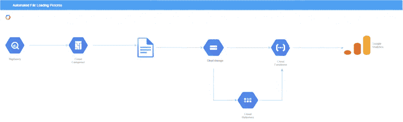

# GCP |你如何丰富你的谷歌分析数据？

> 原文：<https://blog.devgenius.io/gcp-how-can-you-enrich-your-google-analytics-data-4c761453a3e?source=collection_archive---------11----------------------->

谷歌分析本身就很棒，但如果有第一方的数据，它会变得更加强大。

营销人员使用谷歌分析，因为它提供了对网站流量，转换率和许多其他指标的综合分析。然而，提供更多基于预测模型的用户级第一方数据使事情变得更有洞察力。


米利安·耶西耶在 [Unsplash](https://unsplash.com/collections/SfbsdAzEzLw/google-ads%2Fanalytics%2F-ppc?utm_source=unsplash&utm_medium=referral&utm_content=creditCopyText) 上拍摄的照片

# 该过程



本文描述了提取 BigQuery 中的数据并将其存储在云存储桶中的日常过程。该数据是 ML 模型预测或上游应用的结果。

每次将文件放入存储桶时，都会触发云功能。然后，在对 GA 进行 API 调用之前，它从数据存储中收集文件的属性。API 调用创建一个与 GA 的认证会话来上传文件。

# 技术性

让我们深入技术细节。

## BigQuery

由于您要将数据上传到 GA 中的定制维度，因此数据需要包含定制维度的名称作为列中的标题。这里的问题是自定义维度名称包含一个冒号，这是 BigQuery 中不允许的列名(例如“ga:dimension99”)。

有一种方法可以解决这个问题:

更新特定表中的数据，将列名作为表中的第一条记录，或者创建一个包含该记录的单独视图。实现这一点的查询包括添加一个附加列，该列为具有列标题的记录分配一个比其他所有记录都小的序列号，并相应地进行排序。

```
SELECT column1, column2 # do not include seq_no in final output
FROM (
 # add a record with column names
 SELECT 'ga:dimension999' as column1, 'ga:dimension998' as column2, 1 as seq_no
 UNION ALL
 SELECT column1, column2, 2 as seq_no
 FROM `{projectid},{datasetid}.{tableid}`
)
# this will place the column names as the first record
ORDER BY seq_no ASC
```

此外，将 DAG 代码中的 print_header 参数(使用提供的数据创建文件)设置为 **false** 将确保 BigQuery 中的实际列名不会打印出来，将输出结果中的第一条记录作为列标题。

## 阿帕奇气流

谷歌的 Cloud Composer 运行在 Apache Airflow 上。这允许您使用直接非循环图(DAG)来构建和监控管道。这里描述的 DAG 很简单，每个节点从不同的 BigQuery 表中提取不同的模型预测结果，然后一个接一个地运行。

创建 DAG 非常简单，只需将 python 脚本放入 DAGs 文件夹中，然后检查 Airflow UI 以查看其构造是否正确。

所描述的 DAG 结构:

```
with models.DAG(
  #Name of DAG
  "<name_of_your_dag>",
  schedule_interval="<frequency>",
  default_args=default_dag_args,
) as dag:
  start = DummyOperator(task_id="start_node", dag=dag)
  name_of_node1 = python_operator.PythonOperator(
     task_id="<name_of_node>",
     python_callable=<function_to_call>,
 )
 name_of_node2 = python_operator.PythonOperator(
     task_id="<name_of_node>",
     python_callable=<function_to_call>,
 )
 end = DummyOperator(task_id="end_node", dag=dag)
 (
    >> start
    >> name_of_node_1
    >> name_of_node_2
    >> end
 )
```

Frequency 被格式化为一个 cron 调度表达式(这个[链接](https://crontab.guru/)可能会对您有所帮助), default_dag_args 包含以下详细信息:

```
default_dag_args = {
   "owner": "<organisation_maybe>",
   "start_date": <>,
   "email": ["<your_email>"],
   "email_on_failure": True,
   "retries": <integer>,
   "retry_delay": <integer>,
   "catchup": False,
}
```

每个“function_to_call”都包含用于从 BigQuery 中提取数据的查询以及需要放入存储中的文件的名称。然后将这些作为参数传递给一个助手函数，该函数获取数据，将其写入一个 CSV 文件，并将该文件放入存储中。这是通过 BigQuery API 完成的。

```
extract_job = client.extract_table(
  query_job.destination,
  destination_url,
  location=LOCATION,
  job_config=ExtractJobConfig(
     destination_format="CSV",
     field_felimiter=",",
     print_header=False,
  ),
)
print(f"Started extract job: {extract_job.job_id}")res = extract_job.result()
```

上面的代码片段使用了 BigQuery 客户端(例如，client = bigquery。Client()来自 google.cloud 库)。query_job.destination 是使用 client.query( <your_query>)提取数据并将结果分配给名为 query_job 的变量的结果，destination uri 是存储桶的位置，格式为“GS://{ BUCKET _ NAME }/{ GA _ ARTICLE _ FOLDER }/{ FILE _ NAME }”，location 是存储桶或项目所在的区域。</your_query>

## 数据存储

在这里，文件的属性可以存储在相同的“种类”下，并适当地命名。其中一个主要属性包括 file_name_regex，云函数将查询该属性，并查看它是否与存储中丢弃的文件相匹配。如果匹配，它将检索 GA 上传所需的附加属性，包括 account_id、custom_data_source_id 和 webpropertyid。

这部分是完全可选的。您可以将这些属性存储在其他地方。

## 云函数

一旦文件丢失，就会触发事件驱动的云功能。您可以通过在部署脚本中指定以下标志来设置这种类型的事件触发器:

> —trigger-event = " Google . storage . object . finalize "
> 
> — trigger-resource=" <name_of_storage_bucket>"</name_of_storage_bucket>

谷歌分析应用编程接口:

在进行任何上传之前，您需要启用 API 并生成一个 client_secrets.json 文件。该文件包含身份验证所需的私钥/公钥对。此处更详细地描述了[的过程。将此文件保存在云存储桶中，您可以使用云存储 URI 找到它。一旦保存了这个文件，就按照下面的步骤(在前面的链接中也有描述)来创建一个服务对象，这是进一步使用 API 所需要的。](https://developers.google.com/analytics/devguides/reporting/core/v4/quickstart/service-py)

```
credentials = ServiceAccountCredentials.from_json_keyfile_name(
      <client_secrets.json file location>, <[SCOPES]>)

  # Build the service object.
  analytics = build('analyticsreporting', 'v4', credentials=credentials)

  return analytics
```

这里的范围是指作业所需的访问级别，即只读、只写、编辑等。对于这项工作，需要的是简单的访问和编辑:

```
SCOPES = ["https://www.googleapis.com/auth/analytics",    "https://www.googleapis.com/auth/analytics.edit"]
```

现在你可以上传了。这可以如下所示完成，其中“文件名”是包含需要上传到 GA360 的数据的 GCS 文件的路径。进一步的细节可以在谷歌分析文档[这里](https://developers.google.com/analytics/devguides/config/mgmt/v3/mgmtReference/management/uploads/uploadData)找到。

```
media = MediaFileUpload(filename, mimetype="application/octet-stream", resumable=False)daily_upload = (
    analytics.management().uploads()
    .uploadData(
       accountId=account_id,
       webPropertyId=webpropertyid,
       customDataSourceId=custom_datasource_id,
       media_body=media,
  )
.execute()
)
```