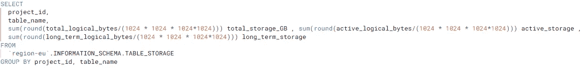
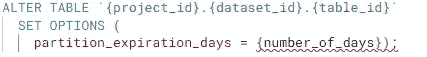
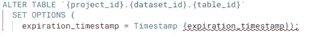
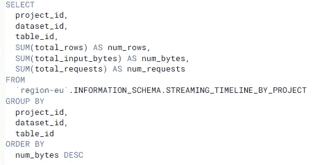

# GCP |节省数千美元的 BigQuery 成本(第 1 部分)

> 原文：<https://blog.devgenius.io/gcp-saving-thousands-in-bigquery-costs-part-1-c38c97f24ecb?source=collection_archive---------1----------------------->

遵循这些步骤来降低这些大查询成本，并找出是什么占用了您的云账单。

安德烈·泰森在 [Unsplash](https://unsplash.com/s/photos/piggy-bank?utm_source=unsplash&utm_medium=referral&utm_content=creditCopyText) 上拍摄的照片

# 正确识别昂贵的查询

遵循这些指导方针为您的数据仓库构建监控仪表板(如这里的[所述](https://towardsdatascience.com/monitoring-your-bigquery-costs-and-reports-usage-with-data-studio-b77819ffd9fa))。

通过在查询中重新设置日期，您可以进一步通过查询聚合成本。

这使您可以更好地对查询进行分组，否则这些查询会被单独分组，因为它们在查询中引用不同的日期部分，即使它们实际上是同一个查询。使用 REGEX_REPLACE 函数删除 SQL 中的日期部分，用一个空字符串替换日期——在我的例子中。

下面一行代码查找所有用“/”或“-”格式化的日期，并用一个空字符串替换:

> REGEXP _ REPLACE(proto payload _ audit log . service data _ v1 _ big query . jobcompletedevent . job . job configuration . query . query，'[0–9]{ 4 }(-|/*)(0[1–9]| 1[0–2](-|/*)(0[1–9]|[1–2][0–9]| 3[0–1])'，"")查询

“proto payload _ audit log . service data _ v1 _ big query . jobcompletedevent . job . job configuration . query . query”是查询在日志中的引用方式。这将来自接收作业，该作业将日志接收到 BigQuery 进行成本分析，如上面引用的文章中所述。有了这个工具，您就可以更清楚地了解哪个查询的开销最大。

此外，向表中添加一个额外的列来查看在指定的日期范围内运行后查询的开销，这样可以更好地了解如何降低开销。举个例子，

这是为期一周的。我将总成本(USD)显示为该查询在过去一周内运行七次的所有查询成本的总和。然后，最大查询成本(USD)简单地显示了在过去一周内该查询最昂贵的运行成本。

通常，您只需要最大查询成本(USD)来确定哪个成本最高，并尝试优化查询。然而，该查询可以简单地一周或一月运行一次，并且可能不会像另一个查询那样对账单产生很大的影响，该查询的成本可能略低，但是一天(或一周)运行几次，并且对您的云账单产生更大的影响。通过查看频率和总成本，而不是优化最昂贵的查询，您可以减少运行查询的频率，从而减轻云账单的压力。

# 节省长期存储空间

识别那些产生长期存储成本的表就像查询下面的元数据表一样简单:

活动存储是在最近 90 天内修改过的表或表分区，而长期存储包括在最近 90 天内没有修改过的表或表分区。根据您所在的地区，活动存储的成本约为每 GB 0.02 美元，长期存储的成本约为每 GB 0.01 美元。尽管长期存储的成本下降了大约 50%,但您可以通过制定政策和条件来删除达到一定年限的数据，从而节省更多成本。只有在您确定长期数据不会被使用时才这样做。

这些政策和条件包括:

*   使分区过期(假设您正在处理已分区表)。通过这样做，您可以设置数据需要多长时间才会过期。例如，如果您将其设置为 120，则超过 120 天的数据将会过期。如果您只需要最新的数据，这尤其有用，这样可以在保留分区的同时节省存储成本。

如何使 BigQuery 中的分区过期的一个片段(查看文档[这里](https://cloud.google.com/bigquery/docs/managing-partitioned-tables#sql)

*   过期表。这可以在数据集或表级别完成，并且在非分区表上特别有用。在数据集级别，一旦创建了数据集(或者您可以在 Java 或 Python 脚本中对其进行配置)，您就可以将数据集过期设置为使该数据集中早于指定时间的表及其数据过期。在表级别，这可以在创建表时或使用下面的 SQL 片段来完成。将删除该表及其早于指定时间戳的数据。

如何使 BigQuery 中的表过期的一个片段(查看文档[这里](https://cloud.google.com/bigquery/docs/managing-tables#sql_1)

# 尝试流式插入的替代方法

如果你发现没有实时或流数据你也能活下去，那就尝试批处理方法。

要识别那些正在流入的表，您必须重新访问元数据表:

查找流入表中最多的代码段

此外，此表还提供了当表中出现问题流时返回的错误代码。

## 采取分批方法的方式:

尝试使用云数据流的批处理。这里可能会有一些费用，所以权衡一下你已经为流插件支付的费用是最理想的。

如果你使用事件驱动的云函数从发布/订阅主题中实时获取数据，那么尝试使用云数据流传输数据。然而，利用云数据流的窗口功能，在设定的窗口中收集数据，并将数据写入文件以存储在存储器中。然后在一段时间后使用免费的 BigQuery 传输服务从存储器传输到 BigQuery。

将数据以原始格式转储到一个非受限的表中(基本上是一个临时表),可以为您以后的工作省去一些麻烦。然后从那里，你可以做你的转换和清理。如果出现任何问题，数据仍然会在发布/订阅、您的存储桶或暂存表中。请确保遵循上述临时表的长期数据保存指南。此外，在存储中保存文件不会产生太多或任何成本，因为在标准存储桶(用于热数据)中，数据不会在那里停留很长时间。

你会产生一些数据流费用，但是为你的工作设置一个工人数量的上限可以为你节省一些成本(例如 maxNumWorkers =)。数据流只会在工作负载很重的情况下增加工作人员的数量——这使得它非常可靠。你只支付每个工人。

(与 [B Mpando](https://medium.com/u/1586d191cbd8?source=post_page-----c38c97f24ecb--------------------------------) 合作)