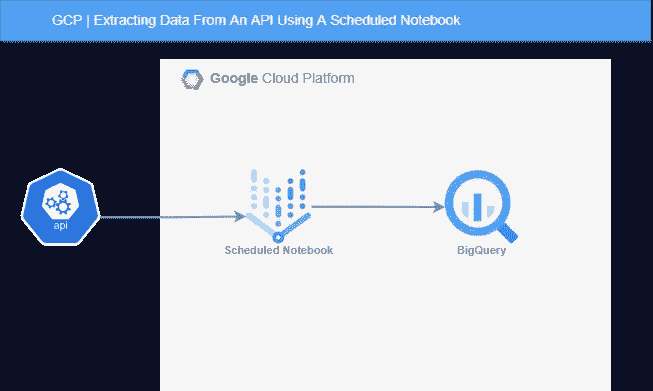
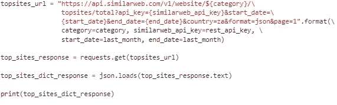
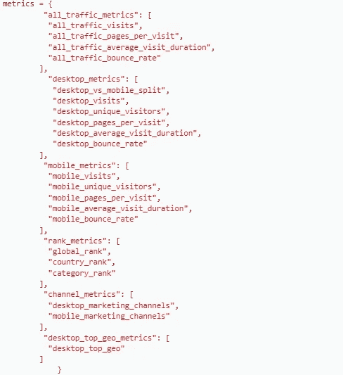
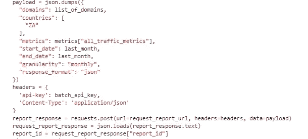
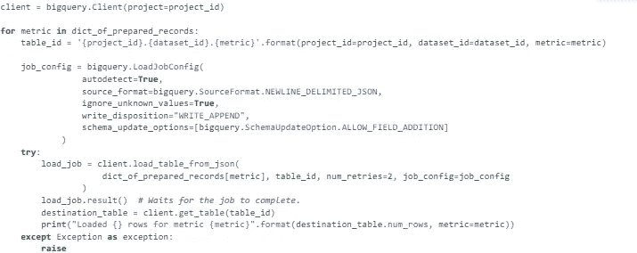

# GCP |使用预定的笔记本从 SimilarWeb API 提取数据

> 原文：<https://blog.devgenius.io/gcp-using-a-scheduled-notebook-to-extract-data-from-the-similarweb-api-c9d901346bbe?source=collection_archive---------15----------------------->

使用预定的管理笔记本(在 GCP)从 SimilarWeb API 提取数据，并使用下面的过程将数据插入 BigQuery。

# 概观

计划笔记本中的 python 脚本每月执行一次。它从 SimilarWeb API 中检索前几个月的数据，并将它们插入到 BigQuery 表中。

# API

SimilarWeb 为用户提供关于他们的业务和竞争对手的网络流量和执行信息。他们有各种各样的[REST API](https://docs.api.similarweb.com/)和[BATCH API](https://documenter.getpostman.com/view/8688131/SWLe78Fo#intro)，人们可以用它们来帮助构建公司相对于竞争对手表现如何的信息报告。

在下面的解释中，我使用了两套 API。每个都需要不同的生成密钥。一个用于批处理 API 调用，一个用于 REST APIs。创建 SimilarWeb 帐户后，您可以导航至设置—帐户—数据管理来生成密钥。这里你会看到标准(REST)和批处理 API。如果任何一个没有出现在这里，那么你可能没有包括在您的软件包。

使用生成的密钥，现在可以提取数据。

在我的例子中，我想提取我国排名前五十的域名的性能数据。要做到这一点，我必须有一个在我的国家排名前五十的域名列表，并在批处理 API 调用中将其作为参数传递。手动编译这个列表很痛苦，这正是 REST API 派上用场的地方。在 REST API 文档的“行业分析”一节中，有一个 URL，用于检索给定国家中给定类别的顶级站点。

该请求类似于以下内容:

在这种情况下，我正在查看“za”(南非)中的域名和类别列表，您可以在这里找到。该请求返回一个 JSON 对象，其中包含域列表以及它们在该类别中其他域中的排名。在这里，我只提取域并将它们插入到一个列表中，然后我将在一个批处理 API 请求中传递这个列表。

在 BATCH API 文档中，您可以找到所有的“流量和参与度指标”。不幸的是，您不能在一个列表中传递所有的指标来进行一个批处理 API 调用，但是您可以将某些指标分组并进行不同的分组请求。以下分组适用于流量和参与度指标:

对于这个 API，在您可以进行批处理调用来检索指标组的数据之前，您必须使用 post 请求请求一个 reportid(到下面的端点“[https://api.similarweb.com/v3/batch/request-report](https://api.similarweb.com/v3/batch/request-report)”)。这个 reportid 将在最终的 get 请求中传递，以检索实际的度量信息。获取各个域的“all_traffic_metrics”数据的 reportid 类似于以下内容:

其中，list_of_domains 是之前获取的域列表，国家/地区是南非(“za”)，batch_api_key 是通过 UI 生成的密钥，last_month(之前显示的 start_date 和 end_date)的格式为“2022–08”，request_report_url 是上一节中指定的格式。

生成 reportid 后，获取数据非常简单，只需将 batch_api_key 作为“api_key”包含在头 JSON 对象中，并将其作为 GET 请求中的参数传递到以下 URL:

> 【https://api.similarweb.com/v3/batch/request-status/{id】}”[。格式(id =报告 id)](https://api.similarweb.com/v3/batch/request-status/{id)

来自 GET 请求的响应包括可以是“已完成”、“待定”、“正在处理”或“错误”等状态。告诉程序每两分钟做一次请求，做 x 次，直到数据准备好(即状态为“完成”)是值得的。

# 预定笔记本

导航到 Vertex AI 下的工作台您可以通过旋转托管笔记本并对其进行计划来创建计划笔记本。一旦在 Workbench 中创建了笔记本，在配置了所有设置和硬件之后，您就可以启动笔记本，然后在 JuypterLab 中打开它。

我选择了 Python3 环境，并在笔记本中编写了我的 API 数据提取脚本(如上所述)。一旦脚本完成、测试并按预期工作。我提前安排了行刑。这可以通过点击此按钮将笔记本提交给执行者来完成:

在这里，您可以设置硬件、环境、时间表和所有有趣的东西。

但是，在我把东西发送给执行程序之前，我确保准备好了插入数据仓库(BigQuery)的数据。

# BigQuery

这里 BigQuery API 就派上了用场，特别是在我的场景中，我使用了函数 load_table_from_json。这个函数采用字典列表作为将数据插入 BigQuery 表的数据格式。

上面的脚本描述了如何根据标记的指标将数据追加到 BigQuery 表中(其中 dict_of_prepared_records 是我们运行批处理 API 所得到的指标结果的字典)。如果该表已经存在，它只是追加(如 write_deposition 所述),否则它只是创建该表。它允许出现额外的列。

维奥拉。从 SimilarWeb API 提取数据的过程，使用预定的记事本和 BigQuery 存储结果。