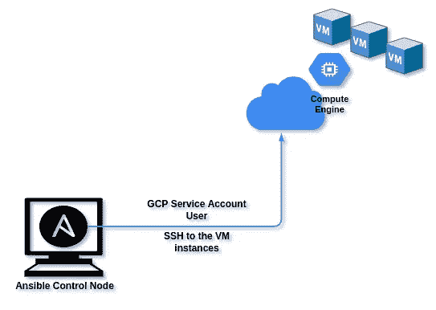
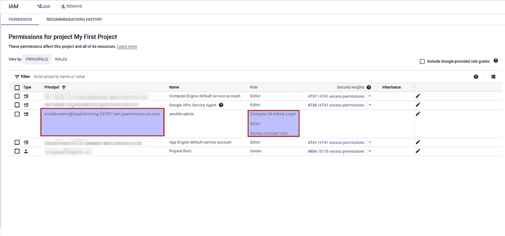
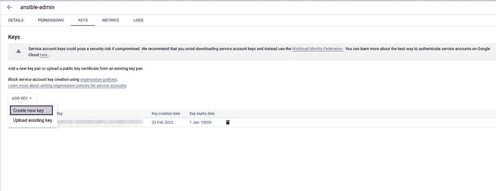
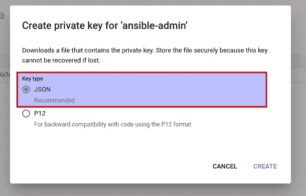
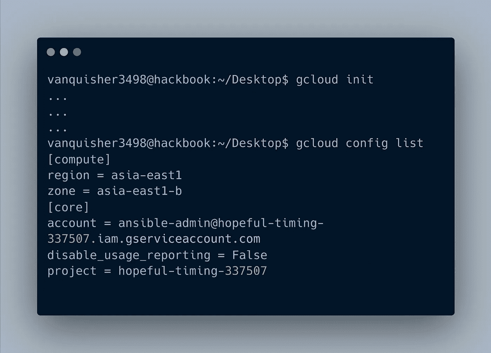
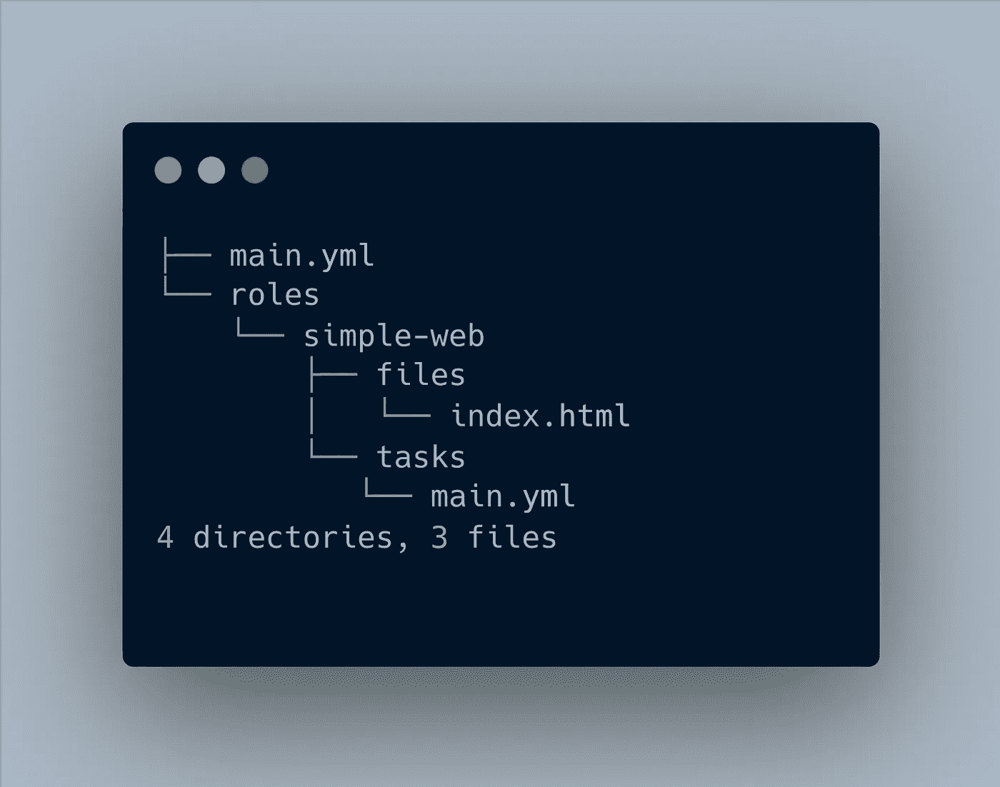
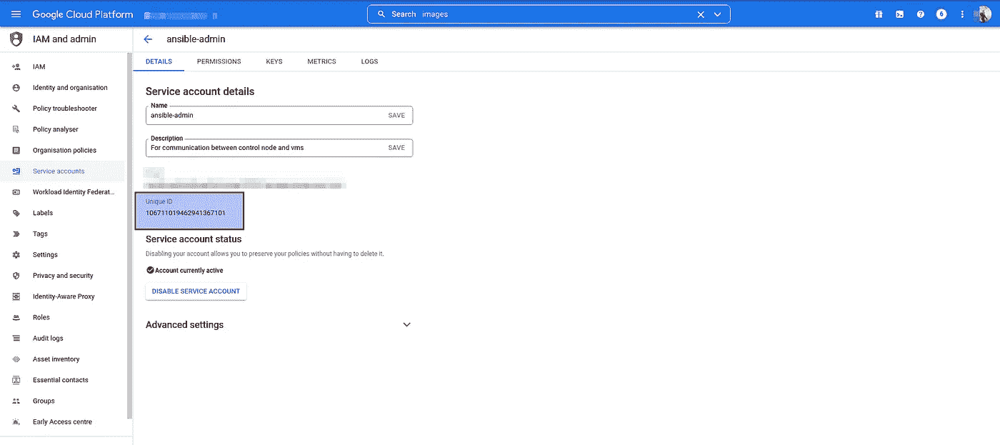
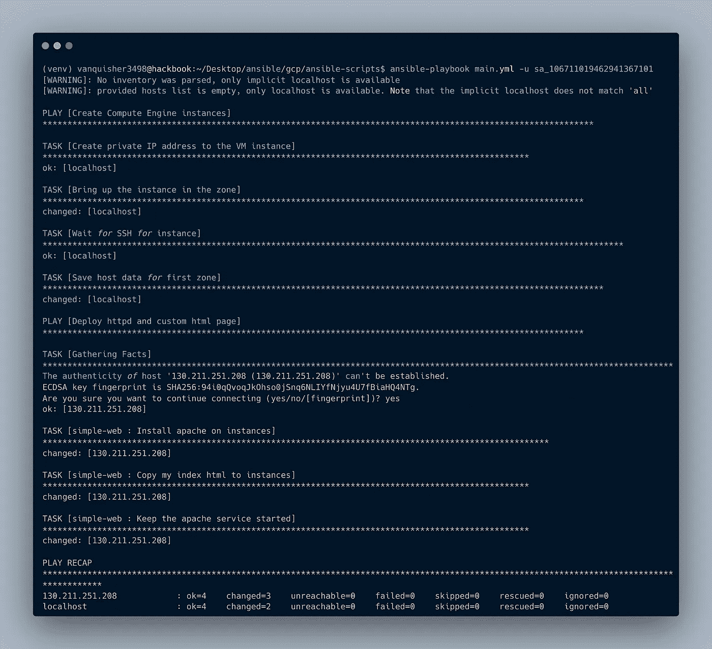
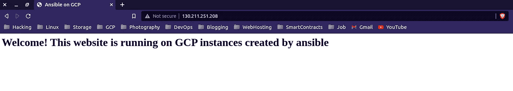
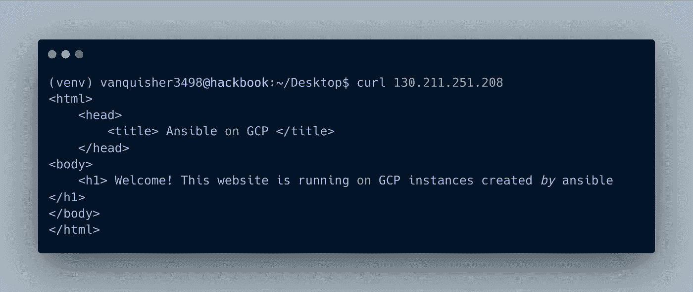

# 使用 Ansible 提供和配置 GCP 虚拟机实例。

> 原文：<https://blog.devgenius.io/gcp-vm-instances-provisioning-and-configuring-using-ansible-bb58e40f01cd?source=collection_archive---------1----------------------->

安西布尔和 GCP

# 介绍

Ansible 是一个主要用于供应、配置管理的工具。借助 Ansible 中的 GCP 模块，我们可以使用 Ansible 在 GCP 上执行各种任务。如果你不熟悉 Ansible，可以看看我之前在 Ansible 上的博客。

 [## Ansible 101

### Ansible 概述

awstip.com](https://awstip.com/ansible-101-1344d80c71c9) 

# 方案

在 GCP 上提供 Google VM 计算实例，并在创建的实例上托管网站。对于这些任务，我们将使用 Ansible。

# 设计

设计

# 设置

# 在 GCP 尽头

## 1.创建服务帐户用户并下载密钥(。json)

***1.1)服务账号创建***
服务账号用户是软件—软件(app — app)之间认证的那类用户。在我们的例子中(GCP — Ansible)

按照本指南创建服务帐户用户。

 [## 将 OAuth 2.0 用于服务器对服务器应用| Google 身份| Google 开发者

### 重要提示:如果您正在使用 Google 云平台，除非您计划构建自己的客户端库，否则请使用服务…

developers.google.com](https://developers.google.com/identity/protocols/oauth2/service-account#creatinganaccount) 

我创建的服务帐户

在上图中，我已经创建了一个服务帐户用户。请向用户正确提供下面提到的这些角色。

> **name = ansible-admin**
> 
> **角色=计算机操作系统管理员登录、编辑、服务帐户用户**

***1.2)下载密钥(。*JSON 文件)**

创建上述用户后，将密钥下载到您的本地系统，因为我们稍后将使用这个密钥。

创建新密钥->下载 JSON 文件

如果下载密钥时有任何问题，请检查此链接

 [## 设置 OAuth 2.0

### 要在您的应用程序中使用 OAuth 2.0，您需要一个 OAuth 2.0 客户端 ID，您的应用程序在请求…

support.google.com](https://support.google.com/cloud/answer/6158849?hl=en&ref_topic=6262490#serviceaccounts&zippy=%2Cservice-accounts) 

# 2.在控制节点端(将安装 Ansible 的笔记本电脑)

## 2.1)安装 Ansible。请求和谷歌认证是与 GCP 的沟通所必需的。

可行的安装步骤

## 2.2)安装 gcloud CLI

需要使用 gcloud CLI 登录 GCP 并执行各种任务。这需要安装在本地系统上。这是简单的一步。只需点击以下链接，

 [## 安装 gcloud CLI | Google Cloud

### 本页包含选择和维护 Google Cloud CLI 安装的说明。谷歌云客户端…

cloud.google.com](https://cloud.google.com/sdk/docs/install) 

## 2.3)使用上一步中创建的服务帐户用户登录 GCP。

g 云初始化

# 项目目录结构

项目目录结构

# 可翻译剧本的代码

**main.yml** :这个文件是主剧本，我们在运行剧本时使用。大多数事情都是不言自明的

直到第 12 行，Play-1:我们正在为密钥赋值，这些密钥将在接下来的块中使用，
项目 ID，gcp_cred_file:是我们之前为服务帐户用户下载的文件，我们将使用该文件进行身份验证。图片:我们将使用的操作系统。对于其他操作系统，请在 GCP 控制台中搜索“图像”，导航至计算引擎- >“图像”。

第 15–22 行，任务 1:使用“GCP _ compute _ address”ansi ble 模块为虚拟机创建私有 IP，第 22 行“register: gce_ip”这意味着，我们为整个块命名一个变量“gce_ip ”,即。对于 Task-1，稍后我们可以使用来寻址整个块。

第 23–36 行，任务 2:我们正在创建虚拟机实例，添加磁盘，并获取虚拟机的公共 IP 地址

第 37–45 行:我们正在添加标签，主要是为了让 GCP 防火墙允许 HTTP 和 HTTPS 流量，因为我们需要使用 HTTP 访问网站。

第 47–51 行:该块是任务后部分，我们添加了一些延迟，直到 ssh 服务在虚拟机上初始化。

第 53–58 行，演示 2:我们正在虚拟机上安装 httpd，并将我们的 HTML 文件复制到虚拟机上。为了实现这一点，我们在 Ansible 中引入了“角色”的概念，每个角色都可以被赋予一些特定的任务来执行。这里的角色是“简单网络”。为另一个剧本创建一个名为“roles/simple-web/tasks”的目录，为所有 HTML、CSS、JS 文件等创建“roles/simple-web/files”目录。

**roles/simple-web/tasks/main . yml:**这是另一个在虚拟机上安装 httpd 并在虚拟机上托管我们的网站的剧本。

第 4 行:“yum”是基于 RHEL/CentOS 系统的 Ansible 模块，请查看其他操作系统的 Ansible 文档。我用了“yum ”,因为我创建了 RHEL 的“rocky linux”。在这一行，我们正在安装“httpd”包。如果“状态=存在”以安装软件包

第 8 行:将我们的网站文件复制到虚拟机

第 10–13 行:在虚拟机上启动 httpd 服务

**roles/simple-web/files/index . html**:网站文件

# 运行 Ansible

包装整个代码的最后一步是运行 ansible 剧本。

**# ansi ble-playbook main . yml-u sa _<服务账号用户的 UID>**

对于服务帐户用户的 UID-> GCP 控制台-> IAM 和管理->服务帐户->单击您创建的服务帐户。

服务帐户用户的 UID

运行行动手册

# 结果

在从 GCP 控制台打开虚拟机的公共 IP 时，我们看到我们的网站被部署到虚拟机上。

运行 GCP 虚拟机实例的网站，使用 Ansible 部署

卷曲输出

# Ansible Vs Terraform

Ansible 在供应和管理基础设施方面做得非常好。但是有像 Terraform 这样的工具，它在基础设施供应方面做得很好，因为它与“状态”一起工作，所以很容易回滚。所以推荐的方式是既 Terraform 又 Ansible。Terraform 用于基础设施供应，可用于配置管理(例如，修补系统、升级软件等。).最后，这不是“可行与不可行”，而是“可行与不可行”

# 结论

在这篇博客的帮助下，我试图解释我们如何使用 Ansible 在 GCP 上提供虚拟机并在云上部署我们的网站。

# 要添加书签的资源

[1] GCP Ansible 模块:

 [## 谷歌云平台指南-翻译文档

### 您可能会看到一组不符合此命名约定的其他 GCP 模块。这些是原件…

docs.ansible.com](https://docs.ansible.com/ansible/latest/scenario_guides/guide_gce.html) 

[2]“yum”ansi ble 模块:

 [## 用 yum 包管理器- Ansible 文档管理包

### 注意这个模块是 ansible-core 的一部分，包含在所有 ansible 安装中。在大多数情况下，您可以使用…

docs.ansible.com](https://docs.ansible.com/ansible/latest/collections/ansible/builtin/yum_module.html) 

[3]“apt”ansi ble 模块:

 [## apt -管理 apt 包- Ansible 文档

### 该模块是 ansible-core 的一部分，包含在所有 ansible 安装中。在大多数情况下，您可以使用短…

docs.ansible.com](https://docs.ansible.com/ansible/latest/collections/ansible/builtin/apt_module.html) 

[4] gcloud 命令:

 [## gcloud | Google Cloud CLI 文档

### 无论您的企业正处于数字化转型的早期阶段，谷歌云都可以帮助您…

cloud.google.com](https://cloud.google.com/sdk/gcloud/reference) 

[5]我的回购备查:

 [## GitHub - Prajwalmithun/Ansible:这个回购协议由 Ansible 剧本组成

### 此时您不能执行该操作。您已使用另一个标签页或窗口登录。您已在另一个选项卡中注销，或者…

github.com](https://github.com/Prajwalmithun/Ansible)