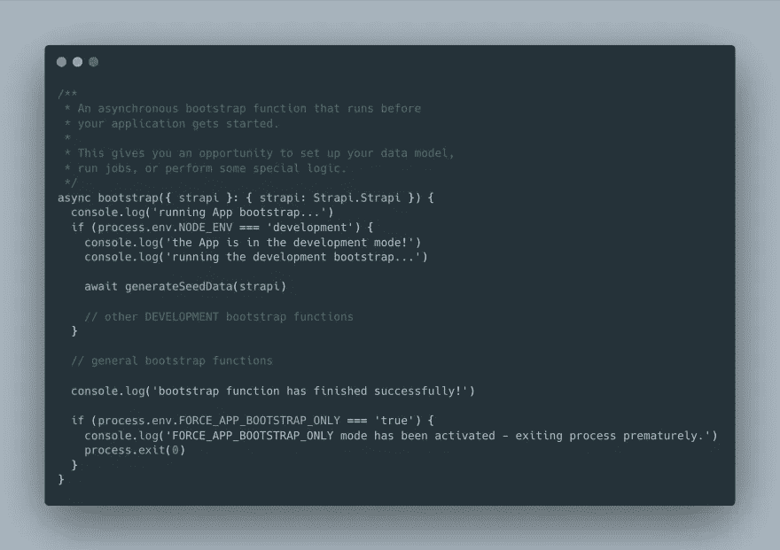
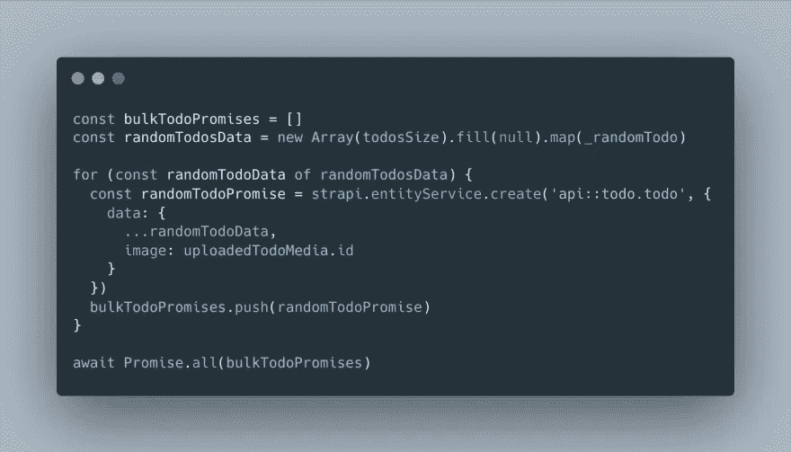
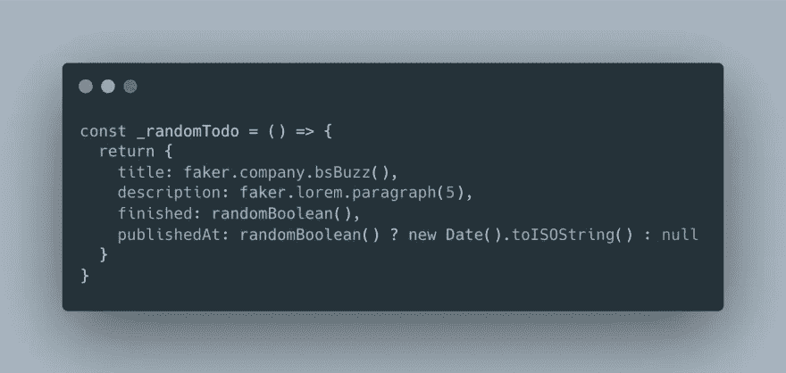
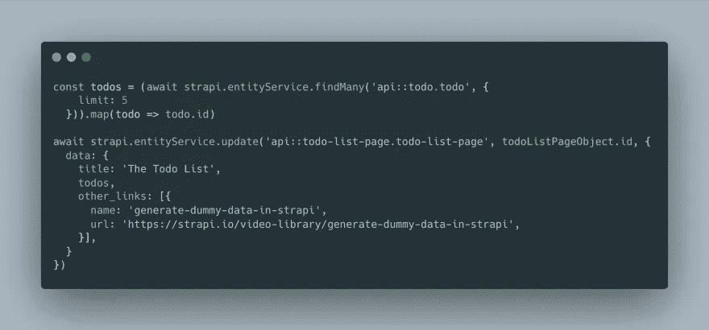
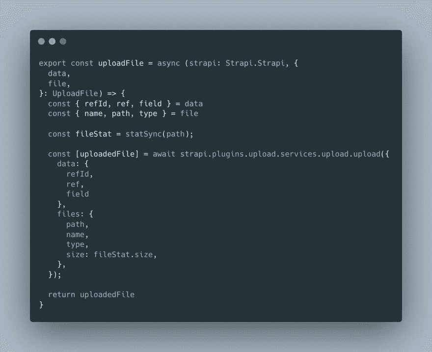
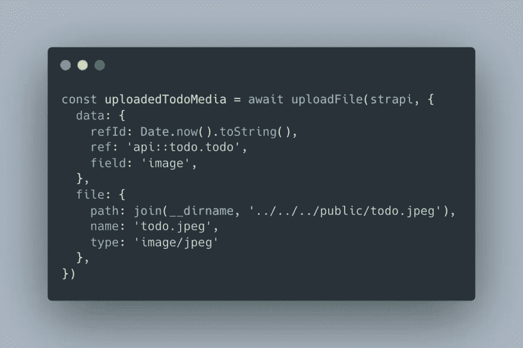
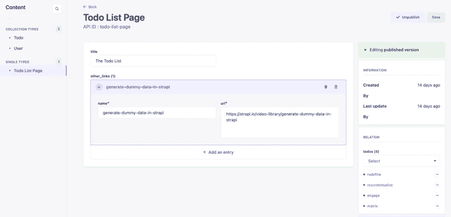

# 在 Strapi 中生成虚拟数据

> 原文：<https://blog.devgenius.io/generate-dummy-data-in-strapi-74dcd239485?source=collection_archive---------9----------------------->

[https://strapi.io/](https://strapi.io/)

如何使用 faker.js 在 Strapi 中播种数据

# 🔗链接

*   github:[andriishupta/strapi-generate-seed-data](https://github.com/andriishupta/strapi-generate-seed-data)
*   Strapi 的视频大致介绍了如何[“生成虚拟数据”](https://strapi.io/video-library/generate-dummy-data-in-strapi)

# 📰也发表于

*   [个人博客](https://blog.andriishupta.dev)
*   [开发社区👩‍💻👨‍💻](https://dev.to/andriishupta)

# 🤓动机

[Strapi](https://strapi.io/) 是一个强大的开源无头 CMS，帮助项目控制代码定制的可扩展性，同时，不用担心自己实现一个成熟的内容管理系统。

因此，在设置好 Strapi 之后，您需要在它的基础上构建前端。你雇佣那些被卡住的前端开发人员:“是的，我可以通过 REST 和 GraphQL 查询数据，但是我应该看到哪些数据呢？我能举个例子吗？”

😬

为了避免这种情况，我们将预先生成示例数据。

# 🌱如何播种数据？

# "生成虚拟数据"

Strapi 的视频库中有一个[视频](https://strapi.io/video-library/generate-dummy-data-in-strapi)，它给了我一个如何做的方向。

这个想法很简单:

*   使用`bootstrap` [功能](https://docs.strapi.io/developer-docs/latest/setup-deployment-guides/configurations/optional/functions.html#bootstrap)
*   使用[实体服务 API](https://docs.strapi.io/developer-docs/latest/developer-resources/database-apis-reference/entity-service-api.html) 进行交互
*   用 [@faker-js/faker](https://fakerjs.dev/) 生成虚拟数据

# 小费

你的案子💯会更复杂，所以不要忘记你可以从 Strapi 的[源代码](https://github.com/strapi/strapi)中获取几乎所有东西。

流程:

*   在 Strapi Admin 上找到您想要复制的位置
*   检查 URL 和网络(在开发者的检查中)以了解什么是所谓的
*   找到与该调用相对应的代码(从控制器开始)
*   享受

# 🧑‍💻密码

我们有一个简单的 Todo 应用程序(duh ),其中有一个 Todo 集合和一个 Todo 列表，作为我们要发送到前端的页面(单一类型)。此外，我们的 Todos 有媒体功能，所以我们上传一些。

在 bootstrap 函数中，我们检查开发环境并决定是否应该运行播种。播种将在第一次应用程序运行时自动运行(当开发人员克隆现有存储库时有效)，并且可以使用`yarn seed`重新运行以强制播种，这会清除旧数据并创建新数据- `FORCE_APP_BOOTSTRAP_ONLY`。

🔗[源代码](https://github.com/andriishupta/strapi-generate-seed-data/blob/main/src/index.ts#L19)

# 集合类型

为了使用实体服务 API 创建一个 todo，我们需要用匹配我们实体的数据调用`create`方法。在当前的例子中，在播种期间，我使用了“批量承诺”来并行运行请求，因为它们不相互依赖。

🔗[源代码](https://github.com/andriishupta/strapi-generate-seed-data/blob/main/src/_seed/todo.ts#L24)

使用 faker，我们填写这样一个 todo:

# 单一类型

完成“Todo 列表页面”与收集是一样的，但是请记住，它可能始终只有一个条目。此外，它包含一个 Todo 关系，所以我们有五个 Todo 来填充它。

🔗[源代码](https://github.com/andriishupta/strapi-generate-seed-data/blob/main/src/_seed/todo-list-page.ts#L14)

# 媒体上传

要在 todo 上附加媒体，我们首先需要上传该媒体，然后将其 id 链接到实体。代码已经从 [Strapi 的源代码](https://github.com/strapi/strapi/blob/master/packages/core/upload/server/controllers/admin-upload.js#L57)中复制，修改，我刚刚创建了一个 helper 函数。

🔗[源代码](https://github.com/andriishupta/strapi-generate-seed-data/blob/main/src/_seed/helpers.ts#L52)

Todo 中的示例:

# ✅结果

打开管理面板后，您将看到生成的数据。

# ✨

最初，我为[开发者道](https://twitter.com/developer_dao)的网站[developerdao.com](https://developerdao.com/)实现了这个。原始代码位于[此处](https://github.com/Developer-DAO/cms)(已存档并移至 monorepo)。

感谢阅读！