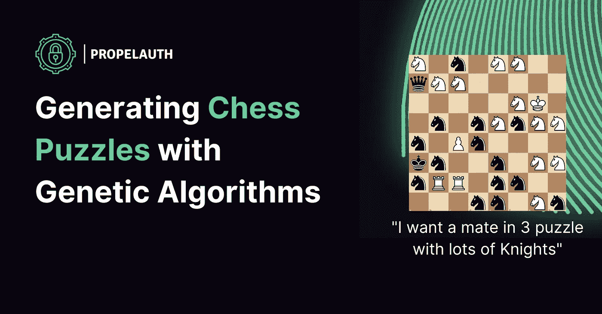
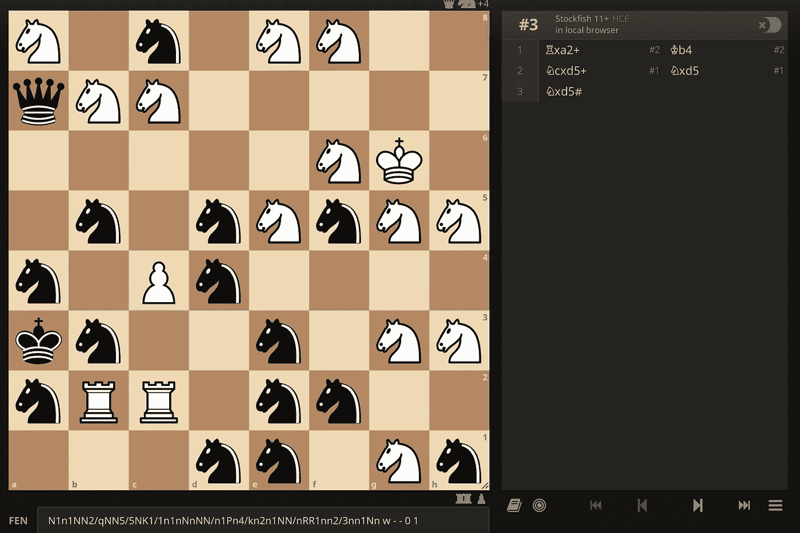
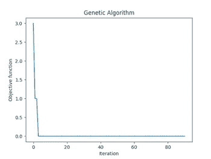
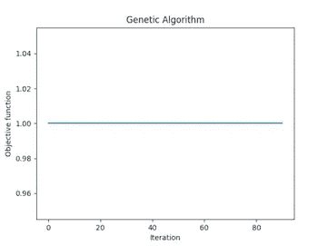
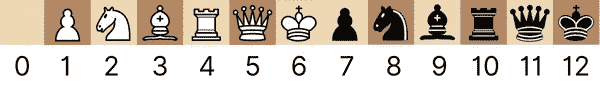
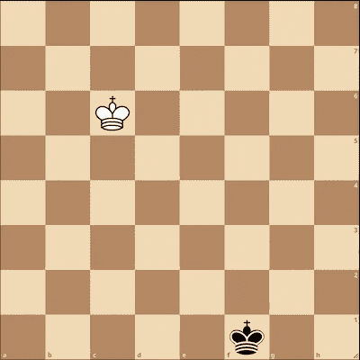

# 用遗传算法生成国际象棋谜题

> 原文：<https://blog.devgenius.io/generating-chess-puzzles-with-genetic-algorithms-1147e81a4e22?source=collection_archive---------10----------------------->



我最喜欢做的事情之一是找到有趣的库，并用它们测试不寻常的用例。python 库 [geneticalgorithm](https://pypi.org/project/geneticalgorithm/) 是漂亮的开放式——公开了一个简单但强大的接口，我们可以用它来处理各种奇怪的事情。

在本帖中，我们将使用它来生成类似这样的国际象棋谜题:



或者像这样更温顺的:


如果你不熟悉国际象棋，这两个都被称为“三人配对”谜题。这意味着白方可以用 3 步赢得游戏，但前提是他们必须找到一个特定的走法。

第一个谜题是在“包含尽可能多的骑士”的约束下产生的，这解释了为什么双方都有太多的骑士。

但是在我们进入所有这些之前，我们将从理解库开始。

## 遗传算法

有很多很好的文章解释了什么是遗传算法(比如[这篇](https://towardsdatascience.com/introduction-to-optimization-with-genetic-algorithm-2f5001d9964b))。从那篇文章中，需要注意的主要问题是

> 为了找到一个解决方案使用遗传算法，随机变化适用于目前的解决方案，以产生新的

因此，在高层次上，我们对一个问题采取一些解决方案，并随机修改它以获得新的可能的解决方案。我们不会在这里深入讨论细节，而是将重点放在这个库公开了什么接口。让我们从文档中的一个例子开始:

哪些输出:

```
The best solution found:
 [0\. 0\. 0.]

 Objective function:
 0.0
```

如果我们把它分解，我们会看到:

*   我们有一个函数 f(X ),它接受一个由 3 个整数组成的数组
*   那些整数都在 0 到 10 之间，包括 0 和 10
*   我们的目标是最小化函数 f(X)
*   因为 f(X)只是对 3 个整数求和，所以最好的解是如果它们都是 0

## 我们的函数可以有多复杂？

把三个数字加在一起很酷，但是让我们试试稍微复杂一点的。

这很容易做到。同样值得将这个函数与这个函数进行对比:

这两个函数有相同的最佳解决方案，但是第二个偶尔会失败(使用默认参数)，而第一个不会。如果你想一想我们的黑盒`model.run()`可能是如何工作的，你可能会明白为什么会发生这种情况。

在我们的第一个函数中，接近[3，1，10]的解比远离[3，1，10]的解具有更低的值。在我们的第二个函数中，我们的算法基本上没有得到反馈，直到我们碰巧得到[3，1，10]。您可以在生成的图表中看到这一点:



随着时间的推移，我们的目标函数 f(X)减小



随着时间的推移，我们的目标函数 f(X)保持不变

在第一张图中，我们看到算法很快收敛到正确的答案，得到了它在正确的路径上的反馈。在第二张图中，我们一直得到相同的值，直到我们放弃。

## 国际象棋模型

不过，我们的函数是相当随意的——谁说它需要表示某种数学函数。

如果我们生成 64 个整数——每个国际象棋位置一个。而整数会在 0 到 12 之间，代表一个空的正方形或者一个棋子。



我们可以使用 python 库 [python-chess](https://python-chess.readthedocs.io/en/latest/core.html) 来构造一个棋盘对象。这将允许我们检查棋盘的更多属性——比如它是否是一个有效的位置，它当前是否是一个僵局，等等。

现在我们只需要一个函数来最小化。让我们从简单开始，让它用尽可能少的棋子生成一个**有效棋位**。

我们还需要修改我们的约束来包含 64 个整数:

文档说我们应该试验我们自己的配置，我用了这个，但是这些都是可以调整的值:

最后，让我们运行代码，打印出我们最好的电路板的字符串表示:

你可以在 [Lichess](https://lichess.org/analysis/standard/) 上可视化 FEN 字符串，你会看到:



这应该符合你的预期。要使一个位置“有效”，它必须包括一个黑白国王。它不需要任何其他的棋子，所以这实际上是我们函数的最优解——一个具有最少可能棋子的有效棋盘！

## 使用 Stockfish 生成国际象棋谜题

一个国际象棋难题是一个位置，在那里有且只有一个好的移动。拼图通常用于训练，因为在一个位置上找到唯一的好动作可能是一个挑战。

通常，谜题的生成方式是通过查看真实游戏中的位置，并确定每个位置是否是谜题(意味着主棋是好的，而每个后续棋不是)。

我们怎么知道只有一步是好的呢？我们可以使用开源的象棋引擎 [Stockfish](https://stockfishchess.org/) 。我们的 python-chess 库实际上支持与 Stockfish 这样的引擎进行通信。这意味着获得头寸的详细分析非常简单:

`info`包含了很多字段，但最重要的两个是:

`score`告诉我们 Stockfish 对位置的看法，这是一个配偶。

`pv`([主变](https://www.chessprogramming.org/Principal_Variation)的简称)告诉我们引擎期望进行的移动顺序。在这种情况下，它说，它希望白移动他们的皇后 f8 到 g7，这是将死。

让我们在一个函数中使用这两者，在三个谜题中生成 **mate，这意味着在这些谜题中，白棋可以在正好三步中获胜。**

与上面类似，我们希望靠近目标的棋位比远离目标的棋位具有更低的值。这就是我们添加以下案例的原因:

*   四分之一拼图比七分之一拼图更好
*   一个无效的位置会受到很重的处罚，就像比赛已经结束的情况一样

每次运行它都会得到不同的结果，但这里有一个例子:

`6kr/7b/8/r6Q/8/B7/5K2/3R2b1 w - - 0 1`


我在右边列出了四个最强的引擎走法，但是正如你所看到的，只有一个走法可以让白棋赢得比赛。每隔一步棋就让黑棋扳平甚至取得一点优势。

但是，我们到底有多少控制权呢？我们当前的功能试图包含尽可能少的部分。如果相反，我们决定要尽可能多的骑士，最好是敌人的骑士？我们将改变我们的函数来添加这个作为惩罚:

当我们运行时，我们得到:


这么多的骑士，然而，它仍然是一个伴侣。

## 一个简短的题外话:我们能生成现实的谜题吗？

我们生成的所有拼图都有点问题。骑士一号在现实游戏中显然是不可及的。这保证了一个完整的单独的帖子，但是一个有趣的方法是将“现实主义分数”合并到函数中。

如果你有一个分类器，它接受国际象棋的位置，并输出一个分数，表示它有多“真实”,你可以把它加到你的惩罚中，来惩罚不真实的棋盘。这需要许多“现实”位置的例子——但幸运的是，Lichess 令人惊叹，它有一个比你需要建立一个好的分类器多得多的游戏数据集。

## 为什么要这么做？

你从真实游戏中得到的谜题绝对比我们生成的质量高，然而，我认为这是一个有趣的概念证明。

我们使用一个用于函数最小化的库，将 Stockfish 附加到它上面，并使用它在 3 个国际象棋谜题中生成令人惊讶的复杂配对，而无需太多代码。像这样的库让我兴奋，因为它感觉像是你的想象力和你将想法转化为代码的能力的极限。