# 使用 ggplot2 在 R 中生成不同的空间模式及其可视化

> 原文：<https://blog.devgenius.io/generating-different-spatial-patterns-in-r-and-their-visualization-using-ggplot2-596868f4066e?source=collection_archive---------7----------------------->

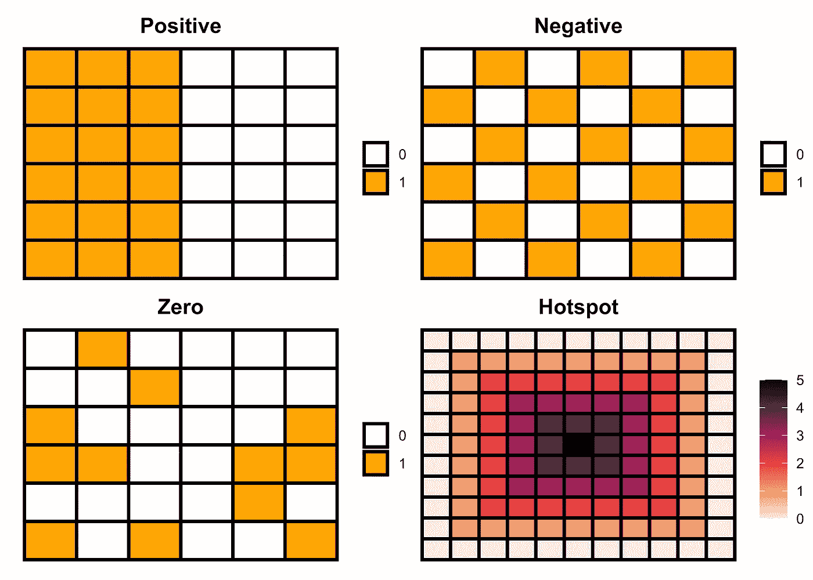

空间格局是个体实体在空间中的排列以及它们之间的地理关系。识别空间模式是理解现象分布背后的复杂空间过程的先决条件。没有视觉化，这种理解是模糊的。

空间模式可以帮助理解在空间和时间中发生的现象的行为。例如，空间模式可以帮助我们查明疾病爆发的源头(热点)，跟踪流行病的传播，有效地分配资源，风险监控和城市规划，等等。

空间模式可能因情况而异。我们现在有大量的资源和分析工具来分析和可视化空间数据，以获得可靠和有效决策的洞察力。然而，我们没有太多的资源来生成假设用于采样和教学目的的模式。

在这篇博文中，我将使用 R 中的 matrix 等基本特性来生成不同的模式，然后使用`ggplot2`包来可视化这些模式。这些示例有助于设计采样方案，并对学生进行空间数据及其分析方面的教育。

# 加载库

```
**library**(tidyverse)
**library**(reshape2)
```

首先，我将使用`matrix`函数创建一个空矩阵，并将其可视化。

# 空矩阵

```
*# 4x4 matrix*
m <- matrix(nrow = 4, ncol = 4, byrow=TRUE)*# matrix visualization*
melt(m) |> 
  ggplot(aes(x = Var2, y = Var1, label = "NA")) +
  geom_tile(color = "black", fill = NA, size = 1) + 
  geom_text() +
  theme_void() +
  theme(legend.position = "none")
```

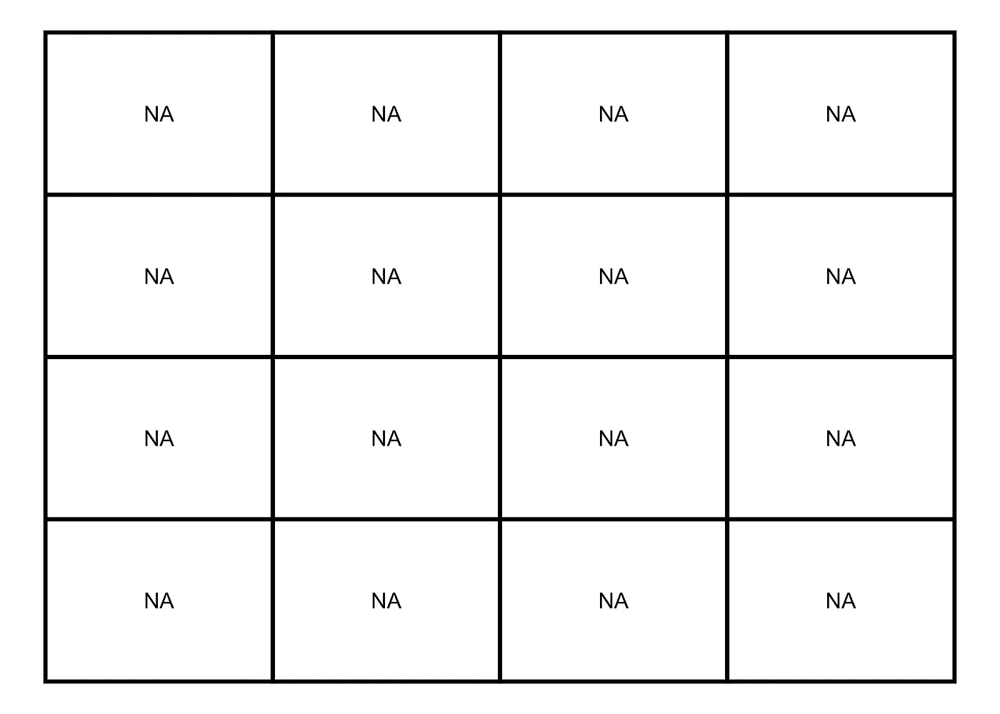

# 用值填充矩阵

现在，我将用零填充这个矩阵。

# 零

```
*# 4x4 matrix with zeros*
m <- matrix(0, nrow = 4, ncol = 4, byrow=TRUE)*# matrix visualization*
melt(m) |> 
  ggplot(aes(x = Var2, y = Var1, label = value)) +
  geom_tile(color = "black", fill = NA, size = 1) + 
  geom_text() +
  labs(fill = NULL) +
  theme_void()
```

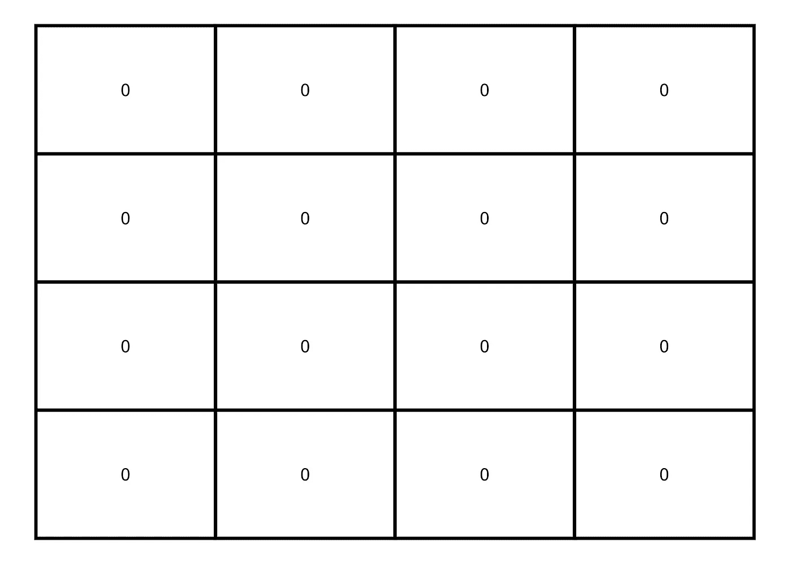

然后，我将添加这些来生成一些模式。

# 零和一

```
*# 4x4 matrix with zeros and ones*
m <- matrix(0:1, nrow = 4, ncol = 4, byrow=TRUE)*# matrix visualization*
melt(m) |> 
  ggplot(aes(x = Var2, y = Var1, fill = factor(value), label = value)) +
  geom_tile(color = "black", size = 1) +
  scale_fill_manual(values = c("white", "orange")) +
  geom_text() +
  labs(fill = NULL) +
  theme_void()
```

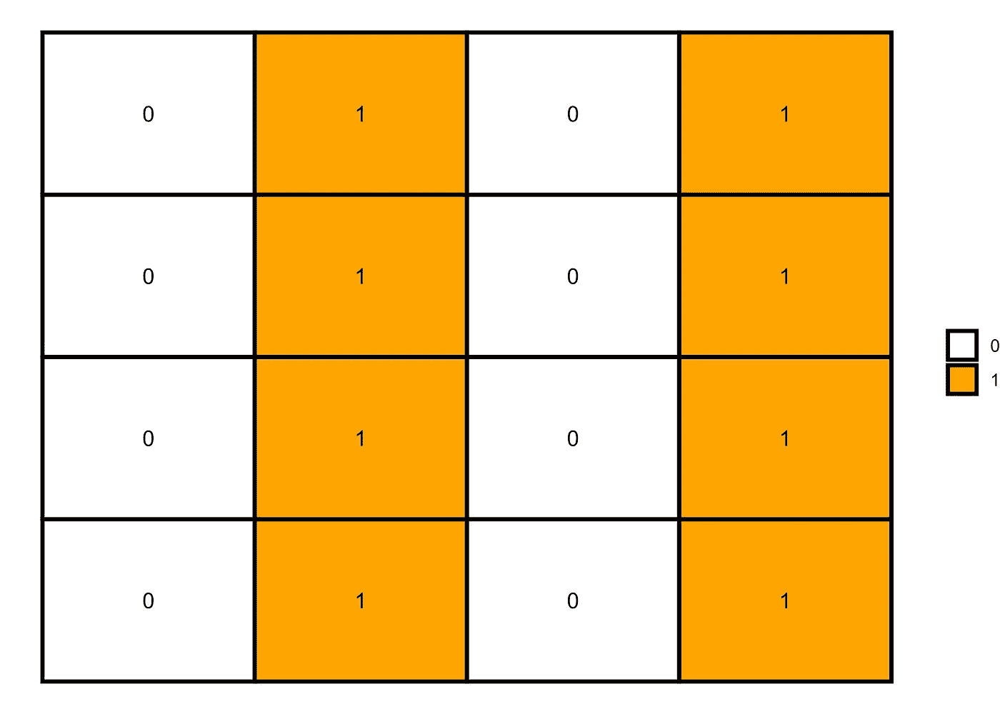

然后，我将添加这些来生成一些模式。

# 每一列都有不同的数字

```
*# 4x4 matrix with distinct columns*
m <- matrix(0:3, nrow = 4, ncol = 4, byrow=TRUE)*# matrix visualization*
melt(m) |> 
  ggplot(aes(x = Var2, y = Var1, fill = factor(value), label = value)) +
  geom_tile(color = "black", size = 1) + 
  scale_fill_brewer(palette = "Accent") +
  geom_text() +
  labs(fill = NULL) +
  theme_void()
```

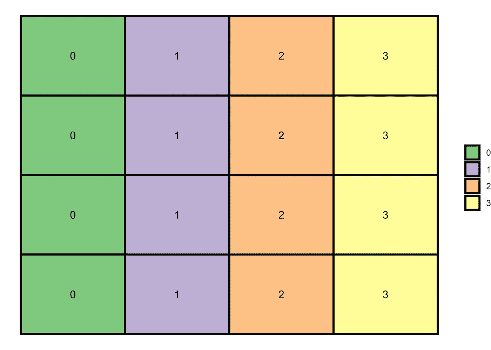

通过使用相同的方法，我现在将生成一个随机模式。**提示:**如果我们将填充值的范围(这里是 0:5)增加到矩阵的维数，`matrix`函数将随机排列数字来填充矩阵。你可以扩大范围，看看格局如何变化。

# 无规图样

```
*# 4x4 matrix with randomly generated number (0:5)*
m <- matrix(0:5, nrow = 4, ncol = 4, byrow=TRUE)*# matrix visualization*
melt(m) |> 
  ggplot(aes(x = Var2, y = Var1, fill = factor(value), label = value)) +
  geom_tile(color = "black", size = 1) +
  scale_fill_brewer(palette = "Set3") +
  geom_text() +
  labs(fill = NULL) +
  theme_void()
```

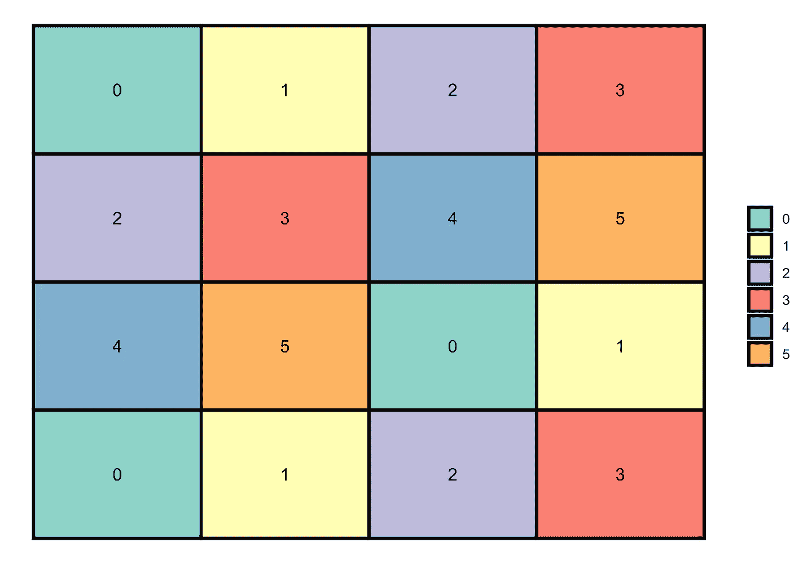

# 二项式模式

像前面的矩阵一样，我们也可以在 R 中生成一个二项式矩阵来表示二项式模式，即是或否和 0 或 1。为此，我们可以使用`rbinom`函数以随机模式生成 0 和 1 值。

# 无规图样

```
set.seed(1)*# 6x6 matrix with randomly generated numbers (0 and 1)*
m <- matrix(rbinom(36, 1, 0.3), nrow = 6)*# matrix visualization*
melt(m) |> 
  ggplot(aes(x = Var2, y = Var1)) +
  geom_tile(aes(fill = factor(value)), color = "black", size = 1) + 
  scale_fill_manual(values = c("white", "orange")) +
  labs(fill = NULL) +
  theme_void()
```

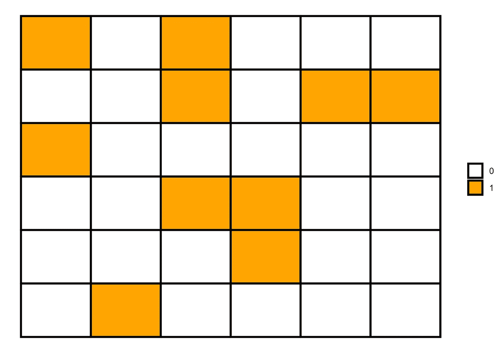

在最后一个矩阵中，我用概率( *p* = 0.3)生成一个 0 和 1 的随机序列。然而，我们也可以编写一个函数来使用不同的概率生成随机模式，然后可视化它们，以查看随机模式如何随着不同的概率而变化。

```
pp <- list()**for** (i **in** 2:7) {
m <- matrix(rbinom(36, 1, i/10), nrow = 6)data = melt(m)pp[[i]]  <- data |> 
  ggplot(aes(x = Var2, y = Var1)) +
  geom_tile(aes(fill = factor(value)), color = "black", size = 1) + 
  scale_fill_manual(values = c("white", "orange")) +
  labs(fill = NULL, subtitle = paste("p = ", i/10)) +
  theme_void() +
  theme(plot.subtitle = element_text(hjust = 0.5, face = "bold"))
}*# grid of plots*
**library**(patchwork)pp[[2]] + pp[[3]] + pp[[4]] + pp[[5]] + pp[[6]] + pp[[7]] + plot_layout(ncol = 3, guides = "collect")
```

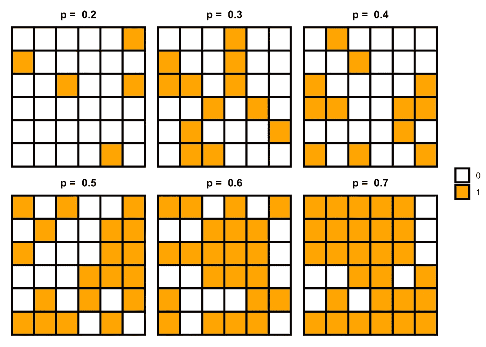

# 正空间自相关

正空间自相关意味着变量的地理邻近值趋于相似，即高值趋于位于高值附近，低值趋于位于低值附近。我们可以使用下面的代码生成这个模式。

## 代码 1

```
*# 6x6 matrix* 
m <- matrix(nrow=6, ncol = 6, byrow=TRUE)*# filling values in the matrix*
m[1:6, 1L:3L] = 1 *# rows 1 to 6 in columns 1 to 3 with 1*
m[1:6, 4L:6L] = 0 *# rows 1 to 6 in columns 4 to 6 with 0**# matrix visualization*
melt(m) |> 
  ggplot(aes(x = Var2, y = Var1)) +
  geom_tile(aes(fill = factor(value)), color = "black", size = 1) + 
  scale_fill_manual(values = c("white", "orange")) +
  labs(fill = NULL) +
  theme_void()
```

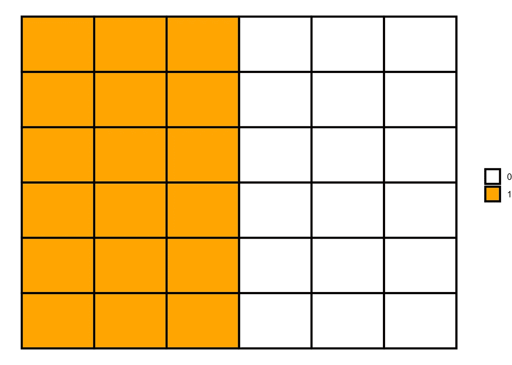

## 代码 2

```
*# 6x6 matrix* 
m <- matrix(c(1, 1, 1, 0, 0, 0), nrow=6, ncol = 6, byrow=TRUE)*# matrix visualization*
melt(m) |> 
  ggplot(aes(x = Var2, y = Var1)) +
  geom_tile(aes(fill = factor(value)), color = "black", size = 1) + 
  scale_fill_manual(values = c("white", "orange")) +
  labs(fill = NULL) +
  theme_void()
```


# 负空间自相关

负空间自相关与正空间自相关相反，即不同的值在地图上聚集在一起。我们可以使用下面的代码生成这个模式。

```
*# 6x6 matrix* 
m <- matrix(nrow=6, ncol = 6, byrow=TRUE)*# filling values in the matrix*
m[c(1, 3, 5), c(1L, 3L, 5L)] = 1
m[c(2, 4, 6), c(2L, 4L, 6L)] = 1
m[c(1, 3, 5), c(2L, 4L, 6L)] = 0
m[c(2, 4, 6), c(1L, 3L, 5L)] = 0*# matrix visualization*
melt(m) |> 
  ggplot(aes(x = Var2, y = Var1)) +
  geom_tile(aes(fill = factor(value)), color = "black", size = 1) + 
  scale_fill_manual(values = c("white", "orange")) +
  labs(fill = NULL) +
  theme_void()
```

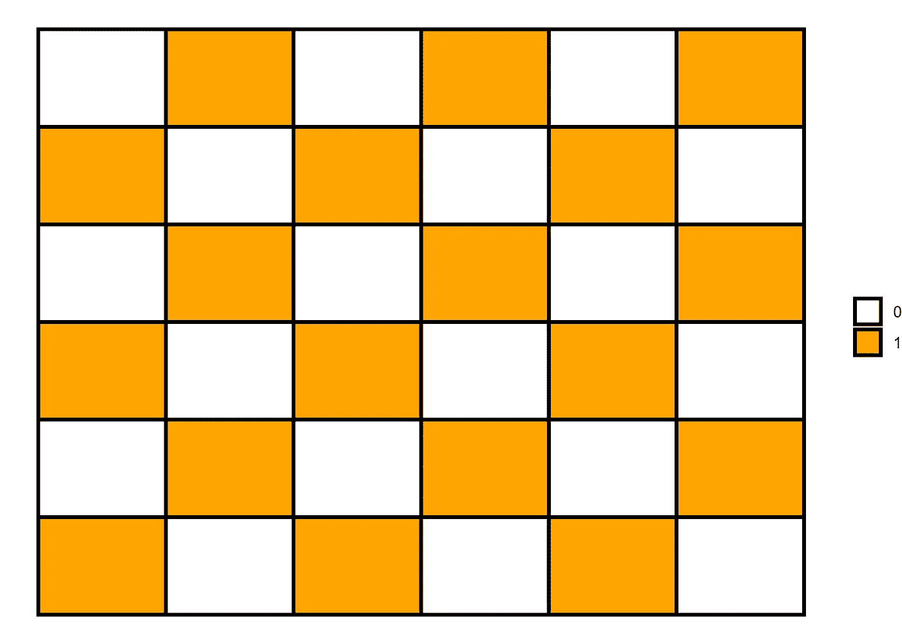

# 热点模式

热点模式是另一种表示聚类的正空间自相关模式。我们可以使用下面的代码生成一个热点模式。

```
*# 6x6 matrix* 
m <- matrix(nrow=11, ncol = 11, byrow=TRUE)*# filling values in the matrix*
m[c(1:11), c(1L:11L)] = 0
m[c(2:10), c(2L:10L)] = 1
m[c(3:9), c(3L:9L)] = 2
m[c(4:8), c(4L:8L)] = 3
m[c(5:7), c(5L:7L)] = 4
m[c(6), c(6L)] = 5*# matrix visualization*
melt(m) |> 
  ggplot(aes(x = Var2, y = Var1)) +
  geom_tile(aes(fill = value), color = "black", size = 1) + 
  scale_fill_viridis_c(option = "F", direction = -1) +
  labs(fill = NULL) +
  theme_void()
```

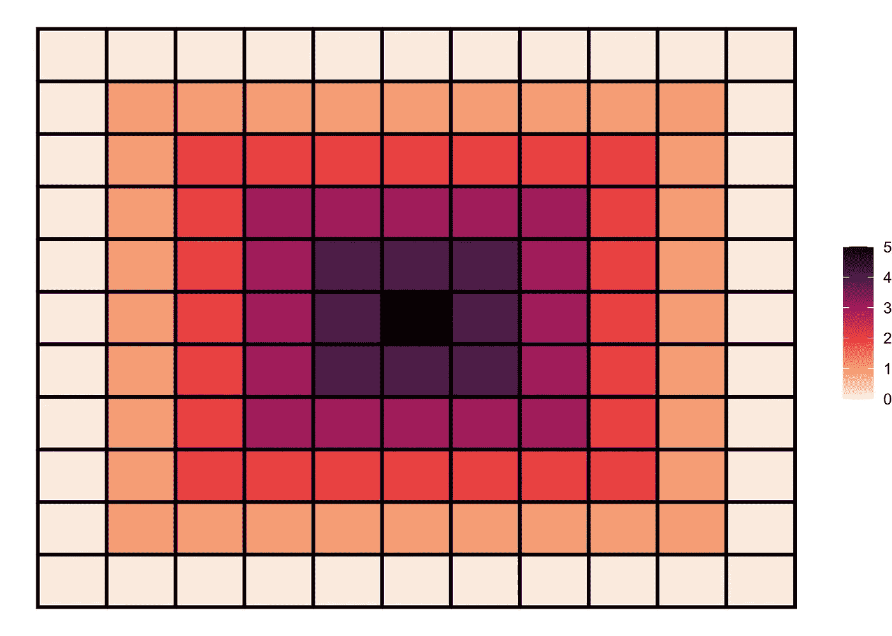

**就是这样！**

**如果你有任何问题，请随时联系我。**