# 在本地电脑上生成具有稳定扩散人工智能的图像

> 原文：<https://blog.devgenius.io/generating-images-with-stable-diffusion-ai-on-your-local-pc-187bd79703a?source=collection_archive---------0----------------------->

基于深度学习的生成艺术是当今研究的一个热点。和往常一样，学东西的最好方法是自己尝试。一些型号，如 OpenAI 的 [DALL-E 2](https://openai.com/dall-e-2/) ，需要注册，只能在线使用，但其他一些型号可以在本地使用，总的来说，对于那些想知道它如何工作的人来说，这要有趣得多。我将展示如何在普通 PC 上运行稳定扩散模型，我们将看到它是如何工作的。


稳定扩散生成的图像 2.1

让我们开始吧。

# 它是如何工作的

稳定扩散的实现基于几个组件:

*   一个**扩散模型**——这是一个生成模型，被训练生成图像。初始数据只是随机噪声，模型在一步步迭代“改进”它。在训练过程中，使用的是“反向”过程，模型有一个图像，它正在给它添加噪声。真正的“魔力”隐藏在逆转这一过程并从噪声中生成图像*的能力中(更多细节和示例可在论文中找到[)。](https://arxiv.org/abs/2006.11239)*
*   一个**潜在扩散模型**正在使用一个内部“压缩”表示，它可以被调整以生成我们想要得到的图像(更多细节可以在论文中找到[)。制作随机图片(例如，我们可以在生成对抗网络中看到的)并不那么有趣，因此“微调”生成过程的能力至关重要。](https://arxiv.org/pdf/2112.10752.pdf)
*   **CLIP** (对比语言-图像预训练)是一种神经网络模型，用于将自然语言提示转换为矢量表示。该模型在 400，000，000 个“图像-文本”对上训练，并且在稳定扩散的情况下，它允许将文本提示转换成扩散模型的潜在空间(更多细节[在该论文](https://arxiv.org/pdf/2103.00020.pdf)中)。

完整的数据流如下图所示:

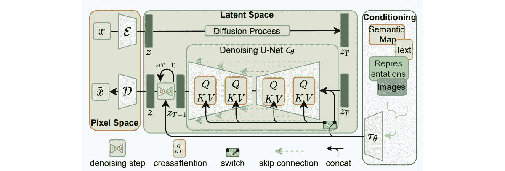

模型架构，来源[https://arxiv.org/pdf/2112.10752.pdf](https://arxiv.org/pdf/2112.10752.pdf)

从实际角度来看，该模型相当大，对于稳定扩散模型 v1，权重文件大小约为 4 GB，对于 v2，权重文件大小约为 5 GB。v1 模型在来自 [LAION-5B](https://huggingface.co/datasets/laion/laion-high-resolution) 数据集的 256x256 和 512x512 图像上进行训练，训练是在[4000 GPU 集群](https://stability.ai/blog/stable-diffusion-announcement)上进行的，需要超过 150.000 英伟达 A100 GPU 小时。而对我们来说好的事情——预训练的模型是[开源](https://github.com/CompVis/stable-diffusion)，每个人都可以使用。这正是我们将要做的。

# 安装

稳定扩散 v1 的 Python 源代码可以在 GitHub 上获得[，在使用它们之前，我们需要安装 Miniconda(我假设已经安装了 Git 和 Python):](https://github.com/CompVis/stable-diffusion)

```
wget https://repo.anaconda.com/miniconda/Miniconda3-py39_4.12.0-Linux-x86_64.sh
chmod +x Miniconda3-py39_4.12.0-Linux-x86_64.sh
./Miniconda3-py39_4.12.0-Linux-x86_64.sh
conda update -n base -c defaults conda
```

然后，我们准备安装源代码并准备环境:

```
git clone https://github.com/CompVis/stable-diffusion
cd stable-diffusion
conda env create -f environment.yaml
conda activate ldm
pip3 install transformers --upgrade
```

下一步是下载预先训练好的模型权重。最新的检查点“SD-v1–4 . ckpt”是在 HiggingFace 网站上提供的[(下载是免费的，但需要注册)。文件应该放在项目文件夹中，现在我们可以开始玩了:](https://huggingface.co/CompVis/stable-diffusion-v1-4)

```
python3 scripts/txt2img.py --prompt "hello world" --plms --ckpt sd-v1-4.ckpt --skip_grid --n_samples 1
```

嗯，差不多准备好了。如果你是一个拥有 12 GB 或更多 VRAM 的现代 GPU 的快乐用户，安装就完成了。否则，您可能会得到一个“RuntimeError: CUDA out of memory”错误。这里我们有两个选择来解决它。

**运行优化版本**

第一种选择是尝试[优化版本](https://github.com/basujindal/stable-diffusion)。在克隆存储库并激活环境(与前面描述的方式相同)之后，我们可以运行命令:

```
python3 optimizedSD/optimized_txt2img.py --prompt "hello world" --ckpt sd-v1-4.ckpt --skip_grid --n_samples 1
```

它真的很有效，我能够在我的 8 GB RAM 的显卡上运行稳定的扩散(唉，我的表现不够好，没有在圣诞节得到 NVIDIA A100，所以 8 GB GPU 是我的最大值；).

**无 GPU 运行稳定扩散**

如果 GPU 仍然没有足够的 RAM 或者根本不兼容 CUDA，另一个选择是在 CPU 上运行代码——这将慢 20 倍左右，但无论如何总比没有好。最简单的方法是从 GitHub 下载非官方的“CPU 专用”fork，比如[这个](https://github.com/darkhemic/stable-diffusion-cpuonly)。但是如果我们想使用最新的版本，我们可以很容易地修改原始源代码。大约 6 个月前,[为此提出了一个](https://github.com/CompVis/latent-diffusion/pull/123/files)请求，奇怪的是，在写这篇文章的时候，它仍然没有被接受，修改是简单明了的。不管怎样，读者可以在 5 分钟内完成:

*   在 ldm/models/diffusion/ddim.py 第 20 行:如果 attr.device，则更换*！= torch.device("cuda")* 到 *if attr.device！= torch.device("cuda ")和 torch.cuda.is_available()。*
*   在 ldm/models/diffusion/plms.py 第 20 行:如果 attr.device，则更换*！= torch.device("cuda")* 到 *if attr.device！= torch.device("cuda ")和 torch.cuda.is_available()。*
*   在 LDM/modules/encoder/modules . py 第 38、55、83、142 行:如果 torch . cuda . is _ available()else " CPU "则替换 *device="cuda"* 为 *device="cuda"。*
*   在 scripts/txt2img.py 第 28 行和 scripts/img2img.py 第 43 行:如果 torch . cuda . is _ available():model . cuda()替换 *model.cuda()* 为*。*

之后，我们可以再次运行脚本。

# 测试

最后，我们可以测试模型。第一个选项是从文本提示生成图像。让我们测试前面提到的同一个命令行示例:

```
python3 scripts/txt2img.py --prompt "hello world" --plms --ckpt sd-v1-4.ckpt --skip_grid --n_samples 1
```

这个过程在 GPU 上大约需要 10 秒，在 CPU 上最多需要 10 分钟——生成速度并不快。最后，生成了这个图像:


SD V1.4 第一个例子，图片由作者提供

嗯，“Hello world”的文字很抽象，很枯燥。让我们试试更疯狂的东西，比如“一只仓鼠用画笔作画”。为什么？只是因为我们可以，而且它并不真的像一只著名的[拿破伦猫](https://www.google.com/search?q=Napoleon+cat+DALL-E)那样疯狂，比如。这是第二张图片:

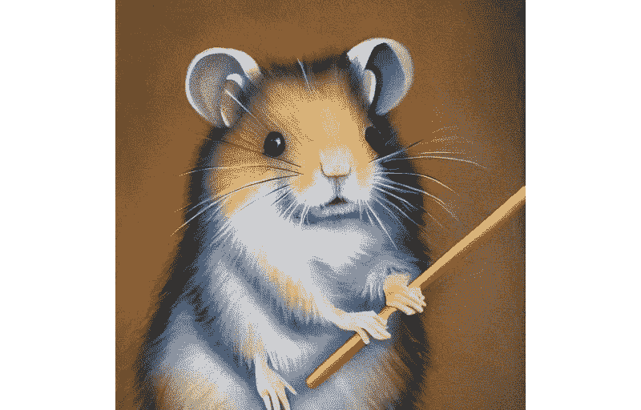

SD V1.4 第二个例子，图片由作者提供

另一种有趣的方式是基于文本提示和另一幅图像生成一幅图像。我用图像编辑器在 2 分钟内完成了这张照片(很抱歉，画画从来都不是我的强项):

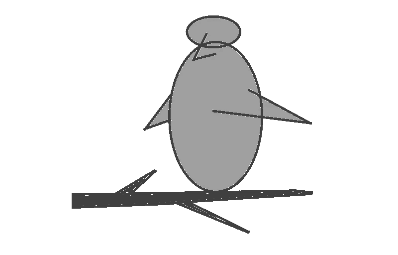

一个形象的素描，作者的形象

这张图将被用作“起点”,我可以在此基础上生成一幅图像:

```
python3 scripts/img2img.py --prompt "A bird is sitting on a tree branch" --ckpt sd-v1-4.ckpt --init-img bird.png --strength 0.8
```

结果出奇的好，至少比我原来画的好很多:

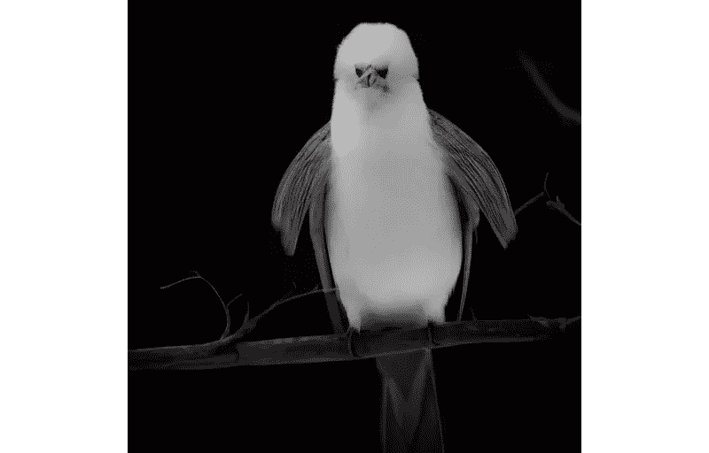

SD V1.4 第三个例子，图片由作者提供

我希望，读者能明白这个想法，并能继续自己的实验。

# 稳定扩散 UI

使用命令行对于开发过程来说很好，但是对于普通用户来说可能有些棘手。一个[稳定的扩散 UI](https://github.com/cmdr2/stable-diffusion-ui) 项目使得安装和图像生成更加容易。用法很简单:

*   从 https://github.com/cmdr2/stable-diffusion-ui/releases[下载档案并解压。稳定扩散 UI 在 Linux 和 Windows 上工作(对不起 Mac 用户，那些机器不太好——反正不适合繁重的机器学习任务；).](https://github.com/cmdr2/stable-diffusion-ui/releases)
*   运行“启动”脚本。

就是这样。作者做得非常好，许多稳定的扩散选项(升级、过滤器等)可以使用易于使用的 web 浏览器 UI 进行配置:

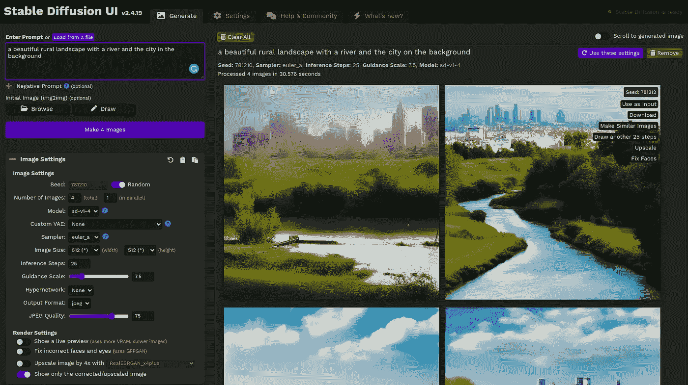

作者的稳定扩散用户界面图像

# 稳定扩散 V2.1

在这篇文章的准备过程中，我看到了关于发布新版本 2.1 的通知，测试它也很有趣。但是首先，让我们看看第 2 版相对于第 1 版有什么新的变化:

*   不同的文本编码器。稳定扩散 1 使用的是[剪辑](https://openai.com/blog/clip/)(对比语言-图像预训练)，这是一种特殊的深度学习模型，它在大量的文本-图像对上进行训练。稳定扩散 2 用的是 [OpenCLIP](https://github.com/mlfoundations/open_clip) ，CLIP 的开源实现。很难说是否有任何技术上的改进，或者是否主要是在法律问题上。无论如何，两个文本编码器都是在不同的数据集上训练的，对于相同的文本提示，来自 V1 和 V2 的输出结果将是不同的。
*   新的[深度模型](https://huggingface.co/stabilityai/stable-diffusion-2-depth)，可用于图像间生成结果。
*   新的[升级型号](https://huggingface.co/stabilityai/stable-diffusion-x4-upscaler)，可以将图像分辨率提高 4 倍。
*   总体分辨率更高—稳定扩散 2 不仅可以生成 512x512 的图像，还可以生成 768x768 的图像。

稳定扩散 2.1 的在线演示在[抱脸网站](https://huggingface.co/spaces/stabilityai/stable-diffusion)上免费提供，对于想自己测试代码的人，流程和 1.4 版本一样。我们需要下载一个新版本(注意 GitHub URL 与 V1 不同)并激活环境:

```
conda deactivate  
conda env remove -n ldm  # Use this if version 1 was previously installed
git clone https://github.com/Stability-AI/stablediffusion
cd stablediffusion
conda env create -f environment.yaml
conda activate ldm
```

还可以从[拥抱脸](https://huggingface.co/stabilityai/stable-diffusion-2-1/tree/main)下载一个新的重量“ckpt”文件。

唉，我无法在我的 8 GB GPU 上运行这个版本，只得到“内存不足错误”。而 2.1 版本在 cpu 上根本不起作用，出现*‘slow _ conv2d _ CPU 未实现一半’*错误(据[本次 GitHub 问题](https://github.com/pytorch/pytorch/issues/74625)，将不增加 CPU 对该算法和数据类型的支持)。可能模型可以从半精度改为全精度(区别在于使用 float16 而不是 float32)，但实际上这几乎没有意义——即使 v1 在 CPU 上运行长达 10 分钟，v2.1 在这种情况下应该会慢得多。无论如何，我们可以看到在线演示的结果。对于同一个“仓鼠使用画笔绘画”提示，我得到了以下结果:

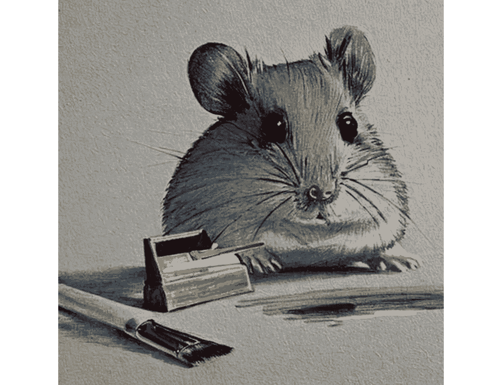

稳定扩散 2.1 示例

与 v1 相比，它显然有不同的风格，很难说结果是否更好，但它很有效，分辨率也更好。

在撰写本文时，4x 稳定扩散升级器还不能在线使用，但可以通过运行“superresolution.py”脚本在本地执行(“x4-upscaler-ema.ckpt”权重文件应保存在同一文件夹中):

```
python3 scripts/gradio/superresolution.py configs/stable-diffusion/x4-upscaling.yaml x4-upscaler-ema.ckpt 
```

运行此代码后，可以使用 web 浏览器 UI 来选择要升级的图像:

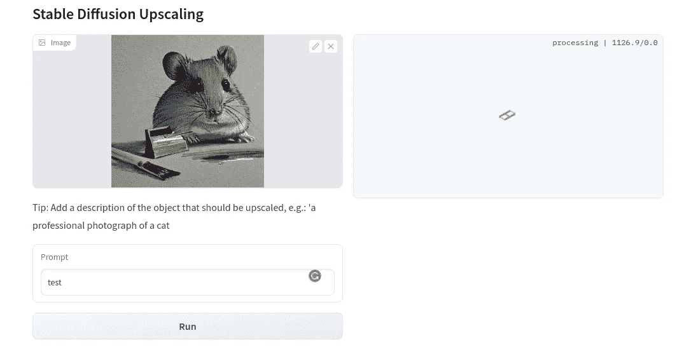

我真的不明白为什么升级器需要文本提示，可能这只是复制粘贴方法的一个产物(并且[拥抱脸代码片段](https://huggingface.co/stabilityai/stable-diffusion-x4-upscaler)也没有任何文本输入)。同样，我得到了一个 GPU“内存不足”的错误，但在这种情况下，CUDA 可以用同样的方式禁用，就像 v1 一样。但是，实际上这几乎没有什么意义——单幅图像的处理时间超过 2 小时:

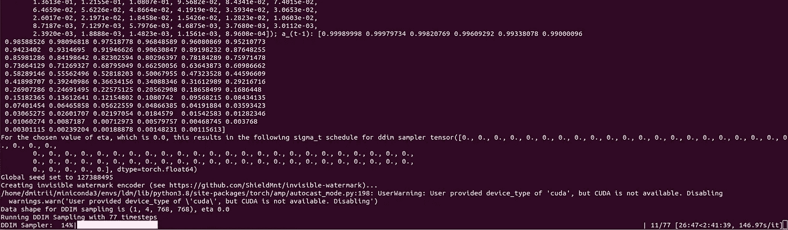

作者在 CPU 映像上运行的稳定扩散 4X 升级器

# 稳定扩散限制

现在，当我们可以使用该模型时，有趣的是看看它能做什么，以及它不能做好什么。生成模型擅长生成抽象图片，但一般来说，它们不擅长制作照片级的图像。这实际上是一个基本的限制——作为人类，我们有很多关于我们周围世界的“背景”知识，但生成神经网络只在文本和图像对上接受了*训练。神经网络模型实际上没有任何其他知识。例如，如果有人要我用中文画一段文字，我可以画出*看起来有点像中文的东西*，但实际上，这只会是胡言乱语，因为我从未学过那种语言。而生成式 AI 其实也是这么做的！我们作为人类，可以学习一种新的语言，但 AI 模型(至少在稳定扩散的情况下)，在物理上除了语言和图像解码器，没有其他“大脑部分”。举个例子，如果我让稳定扩散模型画“举着不战旗帜的人”，我会得到这样的东西:*

**V1** :

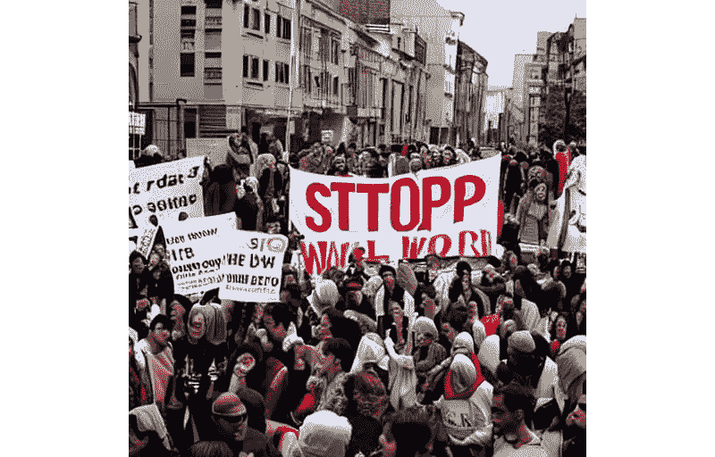

**V2.1** :

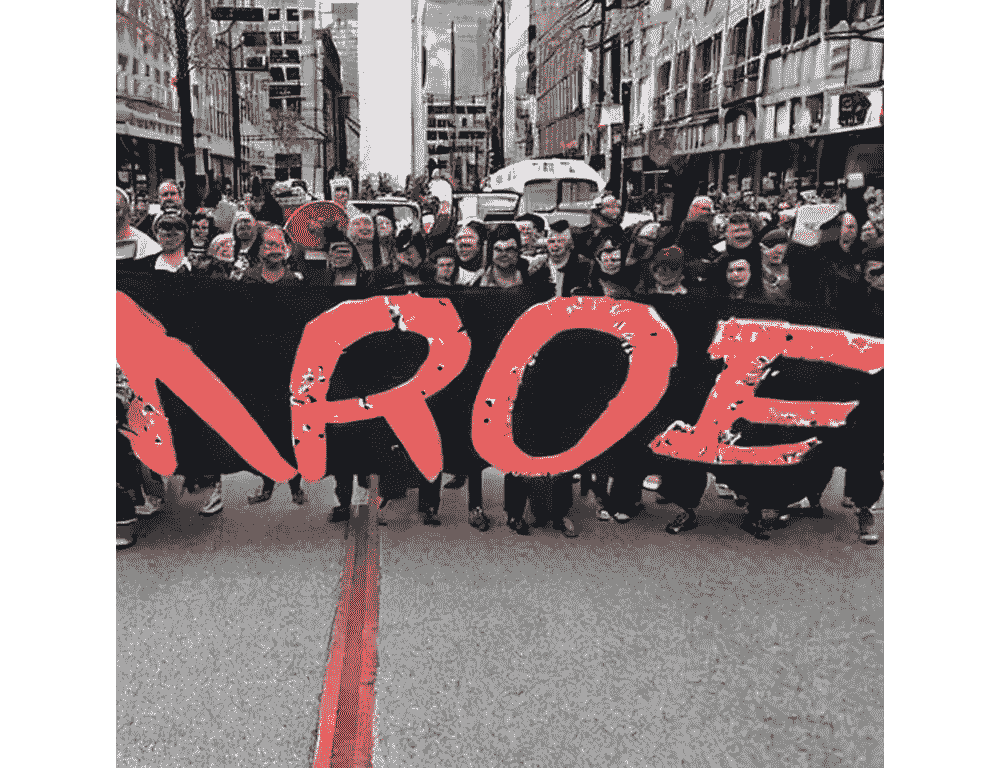

很明显，照片上有一些看起来像文字的东西，但这些文字并不真实——模特从没“学会”读写。另外，模型中使用的字符串标记器在生成图像之前总是将字母转换为小写，因此键入“无战争标语”或“无战争标语”没有区别。

再比如，如果我让模特画一个“美女”，我可以得到这样的东西:

**V1** :

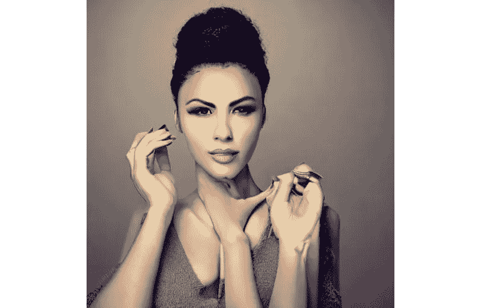

**V2.1:**

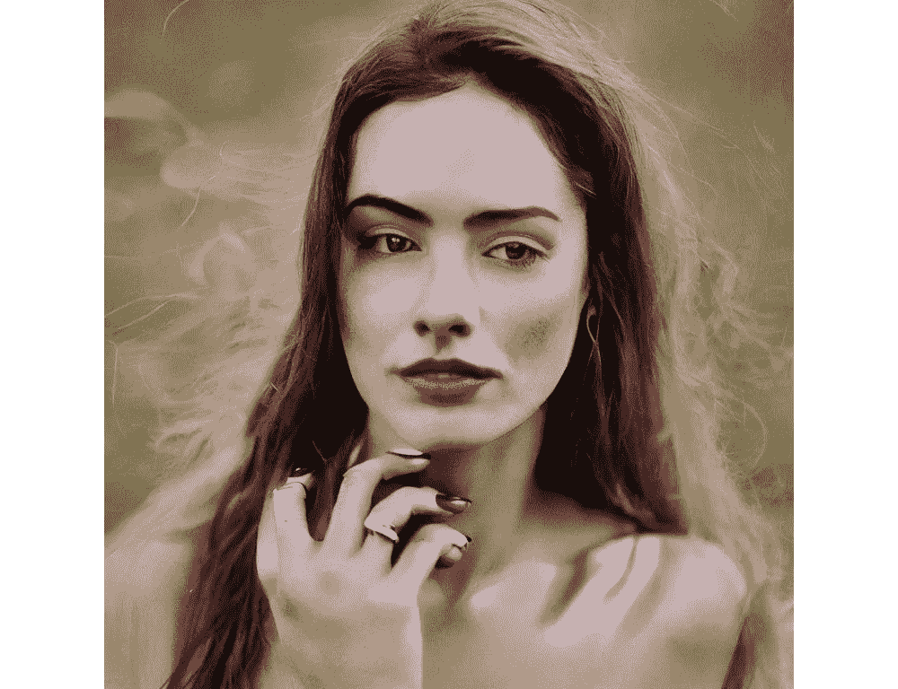

它可能确实很美，但第一张照片在解剖学上并不正确。第二个更好，但它仍然有问题，就像一个经典的[恐怖谷](https://en.wikipedia.org/wiki/Uncanny_valley)效应的例子。顺便说一下，对于 v2，有一个 lifehack 可用——可以添加“负面提示”,在那里我们可以指定我们不想在图像上看到的内容。在“美女”请求中加入“糟糕的解剖”作为否定提示后，效果更好，读者可以自行尝试。

但是，如果我们要求“一个卡通美女”，结果是不错的——在这种情况下，我们只是不关心准确性:

**V1:**

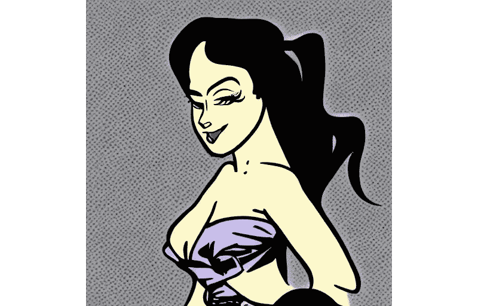

**V2.1:**


另一个例子，我让一个模特画一只老鼠，它看起来不错，但是我怀疑，这只老鼠有太多的腿、耳朵和手指:

V1:

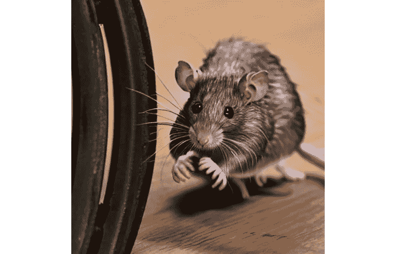

**V2.1:** 结果更好但不完美

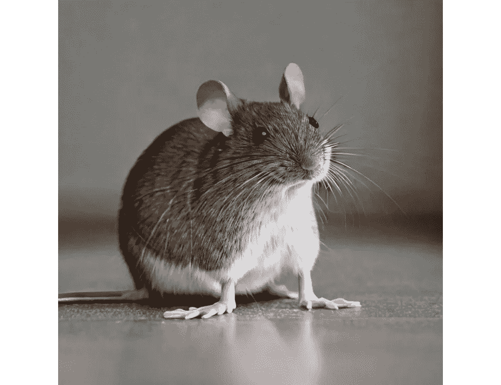

另一方面，如果我要求一些更抽象的东西，比如“一只卡通飞鼠”，来自 V1 的结果相当有趣:

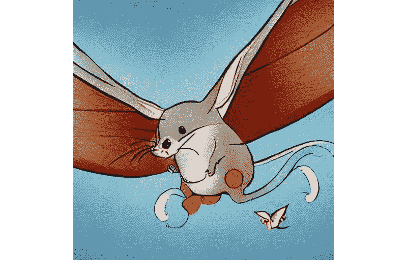

有趣的是，通过使用 V2.1，它无法为该请求生成良好的图像，我尝试了几次，但只得到类似这样的结果:

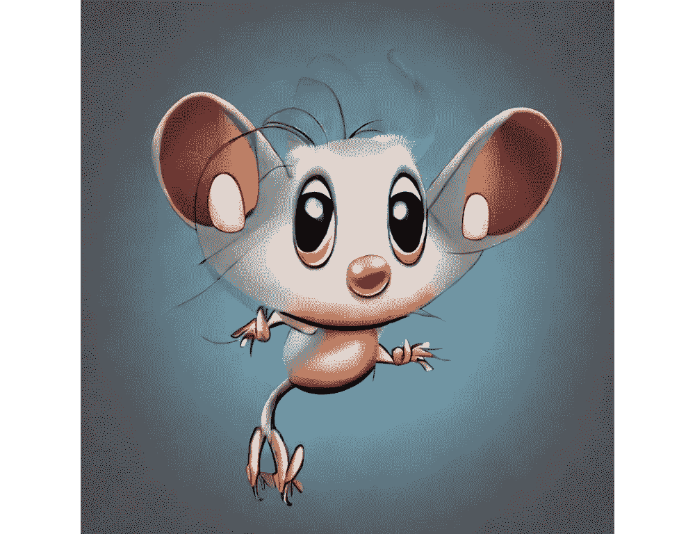

图像本身可能还不错，但第一个版本看起来更接近所要求的。

总的来说，我们可以看到稳定扩散不擅长绘制像字母、手指等小细节。但是对于更抽象的图像，结果可能会很有趣。对“以现代城市为背景的乡村景观”的请求产生了一个不错的结果:

**V1:**

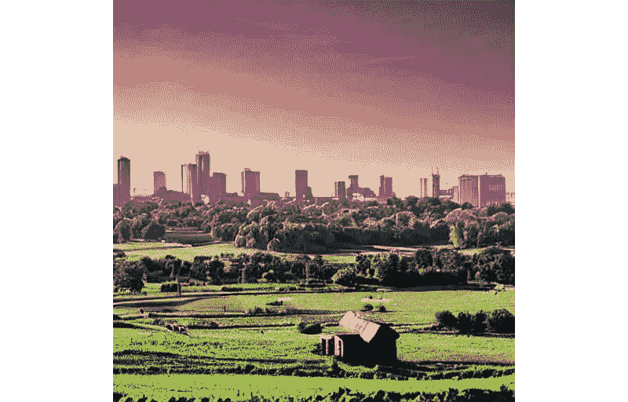

**V2.1:**

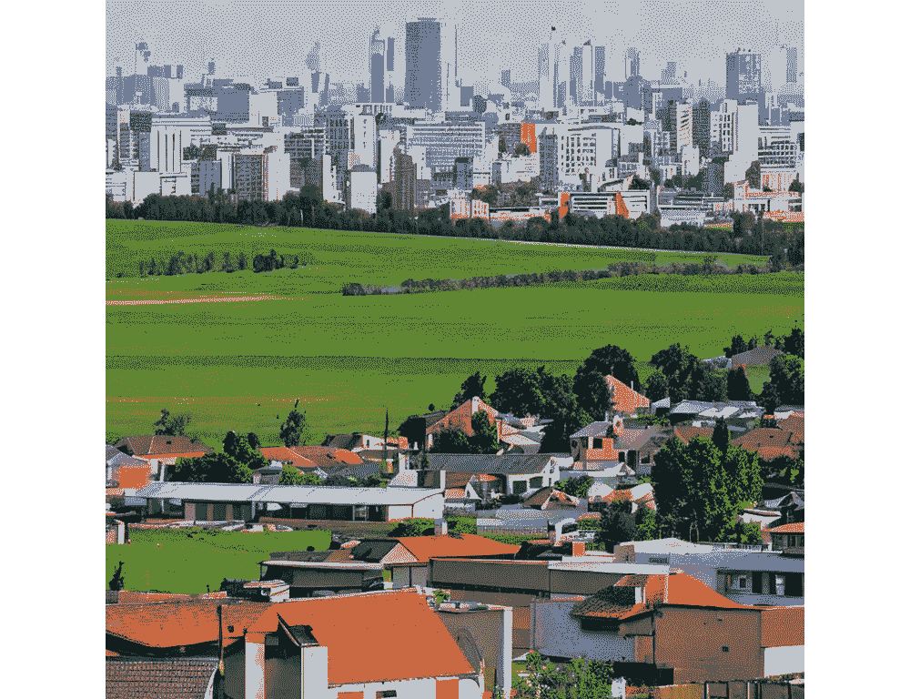

生成模型也有利于“制作”绘画(至少是抽象的)。我在谷歌的“图片搜索”中搜索“现代艺术绘画”，希望看到来自真正艺术家的图片，这是我得到的第一张图片:

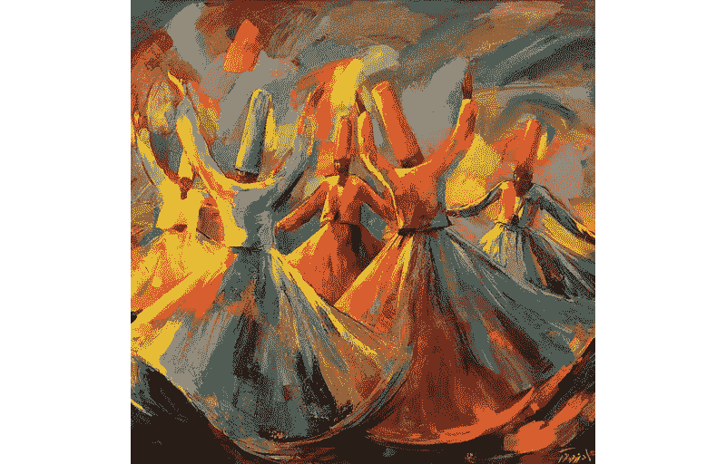

“现代艺术绘画”谷歌的图像搜索结果

然后我输入文字提示“人跳舞的抽象油画”，得到了这个:

**V1:**


**V2.1:**

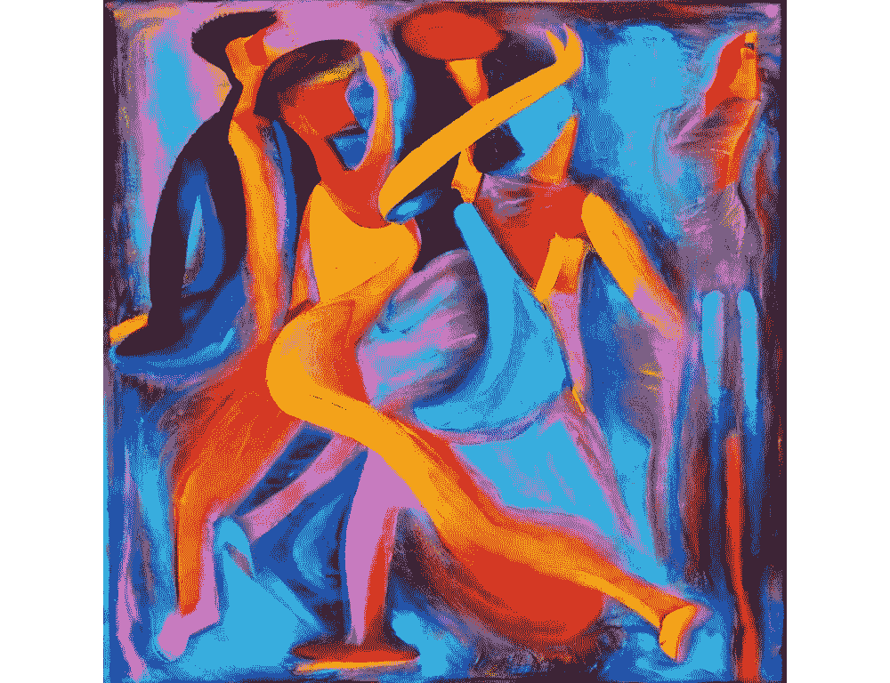

这是一种不同的绘画风格，但实际上，我不能说人工智能生成的图片与人类艺术家制作的第一张相比真的更差。

最后但同样重要的是，人工智能模型不是人类，它不能像我们一样“思考”。从字面上看，它根本不会思考。这是一个很大的过度简化，但稳定的扩散模型只是一个具有数十亿参数的巨大矩阵，它是使用数百万个文本-图像对训练的。作为一个例子，我试图为这篇文章创建一个图像，并输入提示“机器人正在用笔画画”。作为人类，我们可以立即理解所要求的。但是我用稳定扩散试了几次，只得到这个:

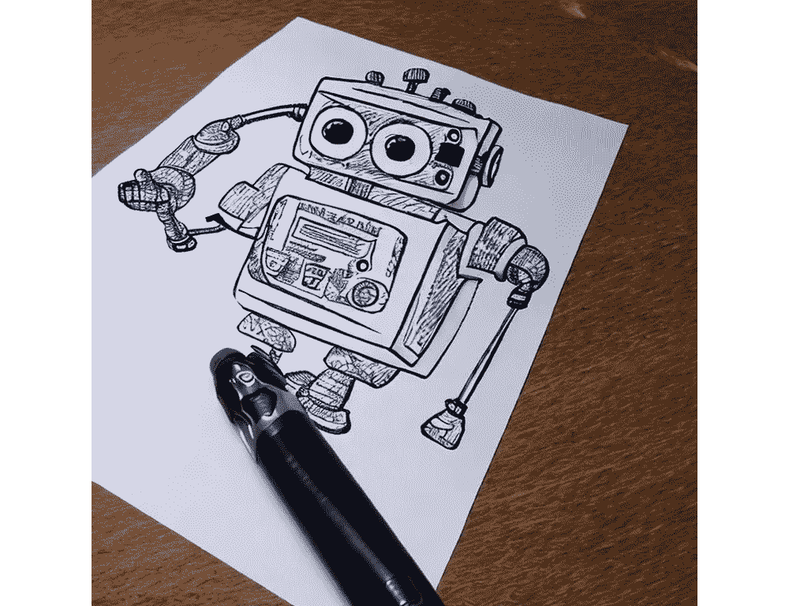

这是一个很好的图像，一个“笔”，“机器人”和“绘图”出现在这张图片中，但这肯定不是所要求的。也许这只是因为分词器从一个句子中删除了“是”和“a”两个词，但我尝试了其他请求，如“机器人自己用笔画画”，没有任何运气。试图给一个模型一个合适的提示可能是棘手的，这实际上更像是使用一种编程语言，而不是给一个人一个任务。

我希望，关于稳定扩散能产生什么的一般概念，多少是清楚的。它有足够的局限性，但在某些情况下仍能产生良好的图像。顺便说一下，作为对读者的一个小警告，他们希望在他们的工作中使用稳定的扩散结果。对源代码的分析表明，由稳定扩散生成的图像具有隐藏的水印(分别为文本“StableDiffusionV1”和“SDV2”)，使用[不可见水印](https://pypi.org/project/invisible-watermark/) Python 库进行编码。嗯，其实也不是什么秘密，在官方稳定扩散库中的 [test_watermark.py](https://github.com/CompVis/stable-diffusion/blob/main/scripts/tests/test_watermark.py) 文件中可以找到解码这个水印的测试片段。那些真的不想在生成的图像中出现它的人可以从 txt2img.py 源代码中删除一个“put_watermark”行。顺便说一句，也许我做错了什么，但我无法在图片上找到这个水印，这些图片是由在线的[拥抱脸](https://huggingface.co/spaces/stabilityai/stable-diffusion)演示生成的(但也许他们根本没有在后端使用“txt2img”脚本)。

# 结论

看到稳定扩散模型是如何工作的很有趣。正如我之前写的，自己尝试总是有用得多，所以我鼓励读者也这样做，不要只依赖任何人的意见(包括这篇文章；).

现在有很多关于生成式人工智能的讨论，它真的是游戏规则的改变者吗？根据我卑微的个人经历，我可以说:

*   我真的看到了这方面的巨大潜力。对于艺术家和设计师来说，生成式人工智能是一个非常有用的创造性工具。唉，这对他们中的一些人也是一种威胁——如果人们能够输入文本提示，只需点击几下就能获得网站的图片或标志，他们为什么要为另一个人支付更多的费用呢？这会马上发生吗？肯定还没有。图像在小细节上仍然不准确，并且分辨率非常低。在看到上面的“美女”照片后，模特和时尚摄影师也可以放松了——人工智能很可能不会在最近几年取代他们。
*   生殖人工智能现在还处于幼年时期。神经网络在计算上非常昂贵，即使是 768x768 的图像也被视为“高分辨率”。至少在我写这篇文章的时候，还没有一个人工智能模型，能够在没有升级或其他技巧的情况下“天然地”生成高分辨率图像，但显然，这是一个时间问题。
*   神经网络中知识的精确表示(如“一只猫有几条腿？”或者“拿破仑出生的时候”)是一个研究的课题，这个问题还没有解决。因此，AI 模型不擅长生成照片级的逼真图像，至少在小细节很重要的时候(另一方面，当我在谷歌上搜索“现代艺术绘画”时，结果往往更糟；).
*   稳定的扩散生成过程是高度随机的，与官方网页或 YouTube 评论者精心选择的图片相比，平均输出质量在现实中没有那么有吸引力。实际上，这些图片可能是结果的 1%,当用户自己尝试相同的算法时可能会看到。

不管怎么说，看到这方面的进展是很有趣的，尤其是当项目是开源的，每个人都可以看到什么是“引擎盖下”。其他模型，如谷歌的 Imagen T1 或 T2 的 DALL-E2 T3，也能产生令人着迷的结果，看看它未来的发展会很有趣。

感谢阅读。如果你喜欢这个故事，请随意在 Medium.com 的[订阅](https://medium.com/@dmitryelj/membership?source=publishing_settings-------------------------------------)，我的新文章发表时，你会收到通知，同时你还可以阅读其他作者的数千篇故事。

欢迎对使用人工智能进行图像处理感兴趣的人阅读其他文章:

*   [5 款用于成像超分辨率的开源深度学习工具](/5-open-source-deep-learning-tools-for-imaging-super-resolution-f42ddb396678)
*   [5 个用于复古图像着色的开源 Python 工具](/5-open-source-python-tools-for-retro-images-colorization-c558e1d9cc08)