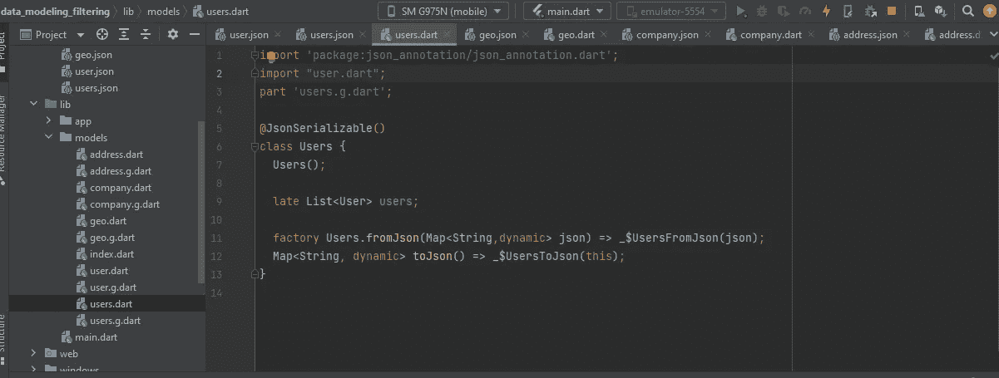

# 在 Flutter 中生成 JSON 模型，在 Flutter GetX 中过滤一个列表，延迟搜索。

> 原文：<https://blog.devgenius.io/generating-json-models-in-flutter-filter-a-list-and-delay-search-in-flutter-getx-1990cf0c771c?source=collection_archive---------3----------------------->


在本文中，我们将看到如何自动生成 **JSON** 模型、**过滤器列表**，以及在 **Flutter & GetX** 中执行延迟的**搜索。**

**注意:**状态是由 GetX 管理的，如果你正在使用一个简单的项目模式，那么使用 setState()或者任何你想管理状态的东西。

# 1-创建一个颤振项目

在你的 android 工作室上创建一个新的 flutter 项目。

**注意:**如果您想将项目转移到 GetX 模式，请参见此处的[使用 GetCli 转移项目](https://medium.com/@inzimamb5/how-i-create-flutter-projects-100-faster-with-getx-cli-rather-than-simple-flutter-87b46d3dd941)。你也可以做你的简单项目。

# 2-添加依赖关系

将这些依赖项添加到您的 **pubspec.yaml** 文件中，并运行 **pub get** 。

```
dependencies: 
  cupertino_icons: ^1.0.2
  flutter: 
    sdk: flutter
  json_model: ^1.0.0                 //add this package
  json_serializable: ^6.3.1         // add this package
  json_annotation: ^4.6.0            //add thispackage
  http: ^0.13.5                     //add this package

dev_dependencies: 
  build_runner: ^2.2.0             //add this package
  flutter_lints: ^2.0.0
  flutter_test:
```

# 3-主 URL

下面是我们将为其解析和创建模型的 URL。

[https://jsonplaceholder.typicode.com/users](https://jsonplaceholder.typicode.com/users)

这里您可以看到 10 个用户记录。

让我们开始…

# 4-从 JSON 自动生成所有模型

我们要做的第一件事是在项目的根目录下创建一个名为' **jsons** 的文件夹。这是默认文件夹，但是您可以有自己的名称。在这种情况下，您需要在终端中运行自动生成命令时指定命名的文件夹。

现在在' **jsons** '文件夹中创建一个名为 **"user.json"** 的新文件，并将用户记录复制到其中。

```
{
  "id": 1,
  "name": "Leanne Graham",
  "username": "Bret",
  "email": "Sincere@april.biz",
  "address": {
    "street": "Kulas Light",
    "suite": "Apt. 556",
    "city": "Gwenborough",
    "zipcode": "92998-3874",
    "geo": {
      "lat": "-37.3159",
      "lng": "81.1496"
    }
  },
  "phone": "1-770-736-8031 x56442",
  "website": "hildegard.org",
  "company": {
    "name": "Romaguera-Crona",
    "catchPhrase": "Multi-layered client-server neural-net",
    "bs": "harness real-time e-markets"
  }
}
```

然后转到终端并运行以下命令。

```
flutter packages pub run json_model
```

现在你应该会在**“lib”**文件夹中看到一个名为**“models”**的新文件夹。


在那里你可以看到自动生成的**用户**模型文件。


```
import 'package:json_annotation/json_annotation.dart';
import "company.dart";
part 'user.g.dart';

@JsonSerializable()
class User {
  User();

  late num id;
  late String name;
  late String username;
  late String email;
  late Map<String,dynamic> address;
  late String phone;
  late String website;
  late Company company;

  factory User.fromJson(Map<String,dynamic> json) => _$UserFromJson(json);
  Map<String, dynamic> toJson() => _$UserToJson(this);
}
```

到目前为止一切都好…但是还没有结束。

我们在**用户**对象中嵌套了对象。

**“地址”**属性是嵌套对象。

在 **'jsons'** 文件夹中创建一个新的 **'address.json'** 文件，并将 users.json 中的 json 更改为以下内容。

再次运行该命令，您应该看到新生成的文件，并且**用户**模型被更新，如下所示。

```
flutter packages pub run json_model
```


**Addres** s 模型将生成如下


```
import 'package:json_annotation/json_annotation.dart';

part 'address.g.dart';

@JsonSerializable()
class Address {
  Address();

  late num id;
  late String name;
  late String username;
  late String email;
  late Address address;
  late String phone;
  late String website;
  late Map<String,dynamic> company;

  factory Address.fromJson(Map<String,dynamic> json) => _$AddressFromJson(json);
  Map<String, dynamic> toJson() => _$AddressToJson(this);
}
```

对**‘geo’**和**‘company’**嵌套对象做与下面相同的事情。


创建一个新文件 **'users.json'** ，并像这样更新它

```
{
  "users": "$[]user"
}
```

再次运行该命令应该会生成**用户。飞镖。**



# 5- **解析 Url**

创建一个名为**的服务文件。镖**并复制以下内容。

这将解析响应并获得**用户的列表**。

```
import 'dart:convert';
import 'package:http/http.dart' as http;
import '../../models/user.dart';
import '../../models/users.dart';

class Services {
  static const String *url* = 'https://jsonplaceholder.typicode.com/users';

  static Future<Users> *getUsers*() async {
    try {
      final response = await http.get(Uri.*parse*(*url*));
      if (200 == response.statusCode) {
        return *parseUsers*(response.body);
      } else {
        return Users();
      }
    } catch (e) {
      print('Error ${e.toString()}');
      return Users();
    }
  }

  static Users *parseUsers*(String responseBody) {
    final parsed = json.decode(responseBody).cast<Map<String, dynamic>>();
    List<User> users = parsed.map<User>((json) => User.fromJson(json)).toList();
    Users u = Users();
    u.users = users;
    return u;
  }
}
```

# 6- **添加搜索延迟**

我们希望当用户在文本字段中键入时搜索列表，但我们不想在每次击键时都这样做，而是等待用户停止键入并搜索。

为此，我们将编写一个单独的类。

在这节课中，我们将使用一个计时器来取消搜索并开始搜索。

创建类**去抖。镖**

```
import 'dart:async';

import 'package:flutter/material.dart';

class Debouncer {
  final int milliseconds;

  VoidCallback ?action;
  Timer ?_timer;
  Debouncer({required this.milliseconds});

  run(VoidCallback action) {
    if (null != _timer) {
      _timer?.cancel();
    }
    _timer = Timer(Duration(milliseconds: milliseconds), action);
  }
}
```

下面是我们用来搜索列表的函数。您可以在 TextField 的 onChange 事件中调用该函数。

**在用户内部创建。飞镖型号**

```
static Users *filterList*(Users users, String filterString) {
  Users tempUsers = users;
  List<User> _users = tempUsers.users
      .where((u) =>
  (u.name.toLowerCase().contains(filterString.toLowerCase())) ||
      (u.email.toLowerCase().contains(filterString.toLowerCase())))
      .toList();
  users.users = _users;
  return users;
}
```

# 7-完整的用户界面

转到 lib/app/module/home/views/home view . dart(仅当您的项目是 GetX pattern 时)

**HomeView.dart**

```
import 'package:flutter/material.dart';

import 'package:get/get.dart';

import '../controllers/home_controller.dart';

class HomeView extends GetView<HomeController> {
  const HomeView({Key? key}) : super(key: key);
  @override
  Widget build(BuildContext context) {
    return  GetBuilder<HomeController>(
      builder: (context) {
        return Scaffold(
          appBar: AppBar(
            title: Text(controller.title!),
          ),
          body: Container(
            padding: EdgeInsets.all(10.0),
            child: Column(
              children: <Widget>[
                controller.searchTF(),
                SizedBox(
                  height: 10.0,
                ),
               controller. list(),
              ],
            ),
          ),
        );
      }
    );
  }
}
```

转到 lib/app/module/home/controllers/home controller . dart(仅当您的项目是 GetX 模式时)

**HomeController.dart**

```
import 'package:data_modeling_filtering/models/users.dart';
import 'package:flutter/material.dart';
import 'package:get/get.dart';

import '../../../../services/debouncer.dart';
import '../../../../services/services.dart';

class HomeController extends GetxController {
  //*TODO: Implement HomeController* final count = 0.obs;
  final debouncer = Debouncer(milliseconds: 1000);
  Users? users;
  String? title;
  @override
*///list* Widget list() {
    return Expanded(
      child: GetBuilder<HomeController>(
        builder: (context) {
          return ListView.builder(
            itemCount: users!.users == null ? 0 : users!.users.length,
            itemBuilder: (BuildContext context, int index) {
              return row(index);

            },
          );
        }
      ),
    );

  }
  *///
  /// list row* Widget row(int index) {
    return Card(
      child: Padding(
        padding: const EdgeInsets.all(10.0),
        child: Column(
          mainAxisAlignment: MainAxisAlignment.start,
          crossAxisAlignment: CrossAxisAlignment.start,
          children: <Widget>[
            Text(
              users!.users[index].name,
              style: const TextStyle(
                fontSize: 16.0,
                color: Colors.*black*,
              ),
            ),
            const SizedBox(
              height: 5.0,
            ),
            Text(
              users!.users[index].email.toLowerCase(),
              style: const TextStyle(
                fontSize: 14.0,
                color: Colors.*grey*,
              ),
            ),
          ],
        ),
      ),
    );
  }
  *///search tf* Widget searchTF() {
    return TextField(
      decoration: const InputDecoration(
        border: OutlineInputBorder(
          borderRadius: BorderRadius.all(
            Radius.circular(
              5.0,
            ),
          ),
        ),
        filled: true,
        fillColor: Colors.*white60*,
        contentPadding: EdgeInsets.all(15.0),
        hintText: 'Filter by name or email',
      ),
      onChanged: (string) {
        debouncer.run(() {

            title = 'Searching...';
            update();
          Services.*getUsers*().then((usersFromServer) {

              users = Users.*filterList*(usersFromServer, string);
              title = title;
              update();
          });
        });
      },
    );

  }
  void onInit() {

    super.onInit();
    title = 'Loading users...';
    users = Users();
    Services.*getUsers*().then((usersFromServer) {

        users = usersFromServer;
        title = title;

    });
  }

  @override
  void onReady() {
    super.onReady();
  }

  @override
  void onClose() {
    super.onClose();
  }

  void increment() => count.value++;
}
```

# 输出:


# 搜索时输出:


# 恭喜你！

你们都完了。你太棒了。今天你已经学习了长笛非常重要的概念。数据建模和过滤在 flutter 和现实世界的应用程序开发中非常重要。拍拍文章，关注我更多有趣的 flutter & GetX 文章。

呆在家里，保持健康

# 源代码

项目完整代码[这里](https://github.com/inzimambhatti/data_modeling_filtering)，去练吧。