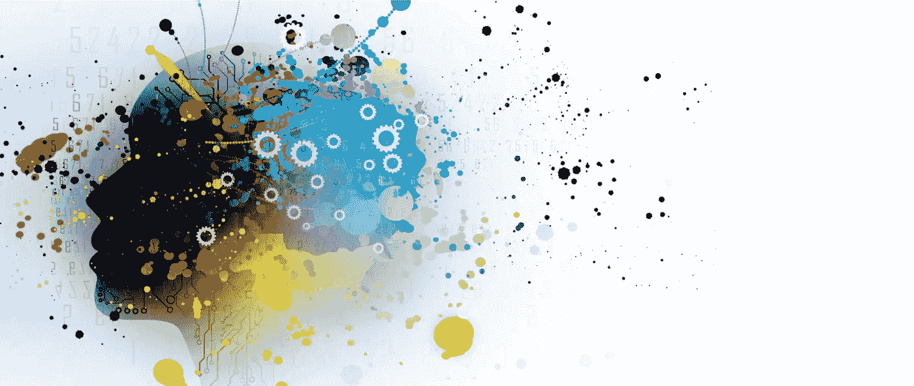
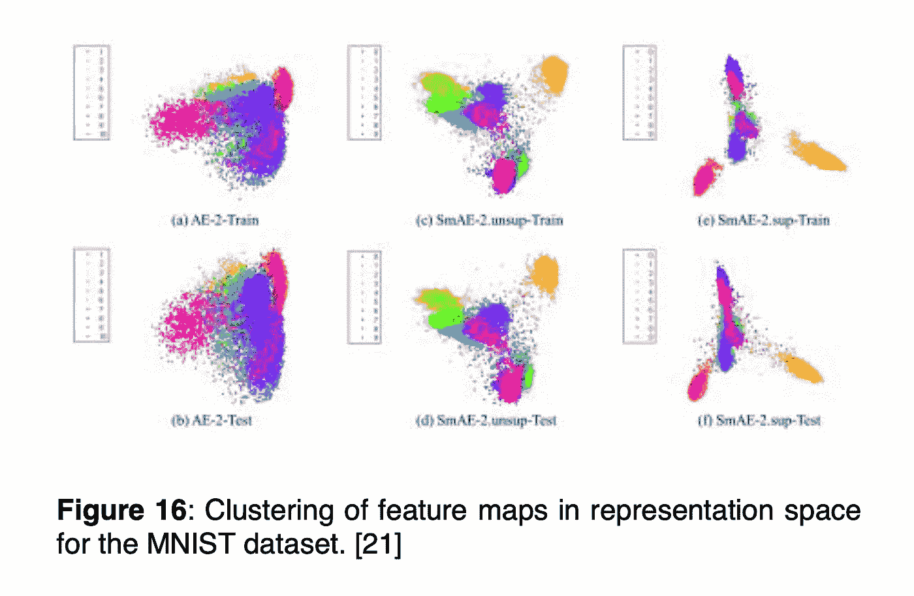
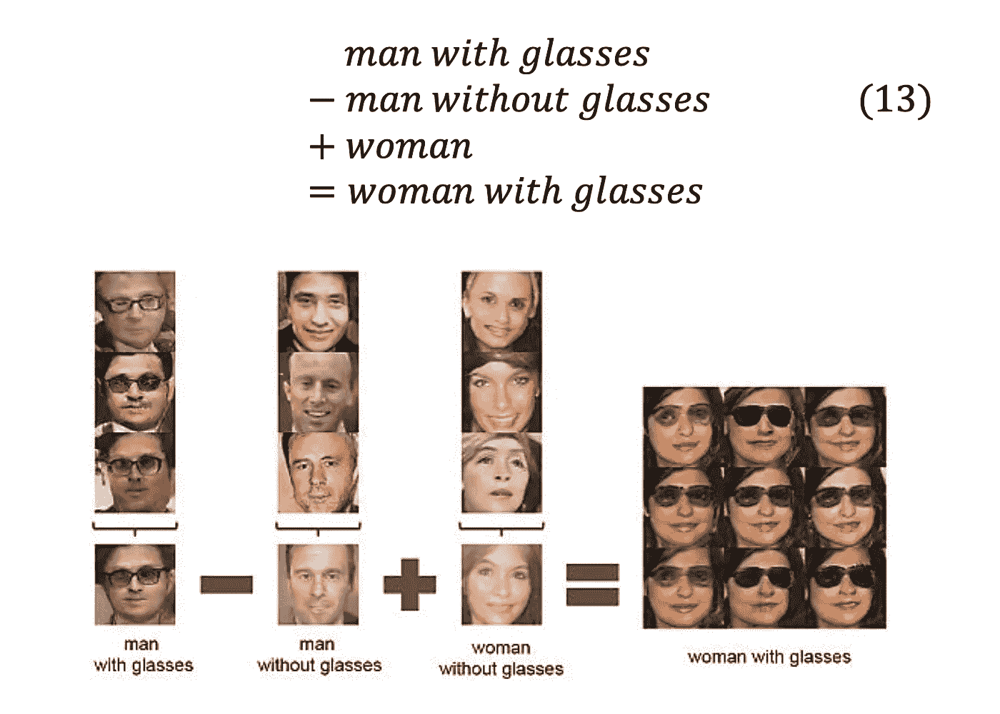

# 生成对抗网络

> 原文：<https://blog.devgenius.io/generative-adversarial-networks-eb1f951c3702?source=collection_archive---------15----------------------->

**用于表示学习的自动编码器**

一种表示学习的方法是使用所谓的自动编码器[29]。大多数自动编码器的实际实现可以被认为是两个独立神经网络的组合。第一个被称为“编码器”，它的工作是构建输入 h = *fₒ* (x)的高度不变的特征映射。第二个被命名为“解码器”，它将特征空间映射回输入空间，产生重构 r = *gₒ* (h)。这个解码器-编码器对被命名为自动编码器。自动编码器已被证明是研究内部特征表示的优秀工具。使用它们，我们可以构建表示空间的可视化。这种方法可以被认为是将输入空间映射到表示空间(图 15)，然后再映射回来。

我们注意到，这一发展是最近的事，关于如何最好地实现自动编码器和去噪的许多问题还没有答案[29]。从研究自动编码器中出现的一个有用的见解是，经验结果表明，在追求高度不变和有区别的表示时，我们在表示空间中得到一簇特征图。考虑数据集(图 16)的这些聚类的可视化，来自梁等人[21]的题为“用平滑自动编码器学习表征”的论文，这种聚类允许研究这些内部表征的新方法。

例如，聚类的使用已经扩展到了生成性对抗网络中，这使得我们可以随意打开和关闭单个聚类——这已经实现了一些非凡的应用。例如，在面部识别中，这可以用于将所需的特征映射到一个人的重建图像上，允许我们在映射回输入空间时对抽象概念(如“男人/女人”和“戴眼镜/不戴眼镜”)执行矢量运算。考虑拉德福德等人[26]在 2016 年发表的一篇论文中的一个例子，其中他们考虑了以下场景:

令人惊讶的是，将这些新技术应用于物理数据集的例子很少，尤其是考虑到这些技术在未来可能提供的洞察力。经过物理数据集训练的 DNN 将构建有助于对该数据集进行分类的要素地图。这个项目的一个可能的扩展是调查特征图簇和物理概念之间的对应关系，例如质量不变、能量守恒和对称性。一旦建立了这些对应关系，人们就可以将大量的研究概念化，这些研究可能会导致对支撑这些数据集的数学框架的新见解。我们把这些留给读者去想象。

**参考文献**

关于本文的参考资料，请参见[这篇文章](https://sebastian-mineev.com/article/2022/1/2/7.html)。

转自[我的个人博客](https://sebastian-mineev.com/)。