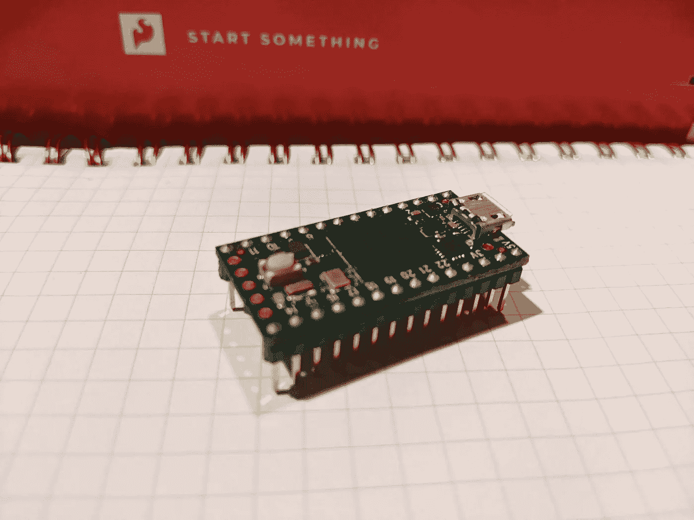

# Rust 中裸机任务管理的通用接口

> 原文：<https://blog.devgenius.io/generic-interface-for-baremetal-task-management-in-rust-f3c1f1ca92a2?source=collection_archive---------8----------------------->



teensy 4.0 微控制器对抗绘图纸

在本文中，我们将探索我的解决方案，在实时环境中推广任务管理。这里的代码与 Rust 编程语言紧密耦合，尽管概念可以在任何地方实现。

这种需求源于一个裸机内核项目。我正在开发的硬件是单核 ARMv7 Cortex-M 芯片: [Teensy4.0](https://www.pjrc.com/store/teensy40.html) 。你可以在 GitHub 上找到所有的源代码[。](https://github.com/SharpCoder/hexagon2/)

任何裸机程序都需要执行多个任务。问题是，你希望它们有多并发？我的内核可以归类为*实时操作系统* (RTOS)，这意味着我不使用线程调度程序来管理任务。我只是有一个进程集合，每个进程都执行得非常快，看起来像是并行的。

下面是我的任务管理通用方法的一个例子。我把这些叫做`gates`。在这篇文章中，我们将探索门是如何发展的，以及实现它们的一种方法。

```
// System entrypoint
loop {
   blink_task();
}fn blink_task() {
    gate_open!()
       .once(|| { pin_mode(13, OUTPUT); })
       .when_ms(500, || { pin_out(13, HIGH); })
       .when_ms(500, || { pin_out(13, LOW); })
       .build();
}
```

下面是另一个大门实际运行的例子:

```
// When data is available over serial, read the bytes into a buffer.loop {gate_open!().when(
|| { return serial_available() > 0 }, 
|| { serial_buffer.append(serial_read()); }
).build();}
```

这里的关键是*门*存在于`loop { }`段中，但是自动处理何时将计算能力交还给内核。您不必自己实现任何状态管理，gate 将它全部抽象化了。

# 旧世界

总的来说，我注意到了一些关于嵌入式任务的模式:

*   任务通常至少有两种谨慎的状态:初始化和工作。
*   任务可以有复杂的嵌套条件。
*   任务经常被放在一个无限循环中，并且需要能够从每次迭代停止的地方重新开始。

举个我们最喜欢的例子，闪个灯。在一个要求接近实时性能的系统中，我们不能只使用`delay()`和 hog 资源。这里有一些 rust 代码来演示我们如何在闪烁状态之间产生处理能力:

```
static mut INITIALIZED: bool = false;
static mut NEXT_ITERATION: u64 = 0;
static mut HIGH: bool = false;// System entrypoint
loop {
    blink_task();
}fn blink_task() {
    if unsafe { INITIALIZED } == false {
        pin_mode(13, Output);
        unsafe { INITIALIZED = true };
    } else {
        if system::millis() > unsafe { NEXT_ITERATION } {
            pin_out(13, unsafe { !HIGH });
            unsafe { 
                HIGH = !HIGH;
                NEXT_ITERATION = system::millis() + 500; 
            };
        }
    }
}
```

这肯定是可行的，但不是通用的。我们系统中的每个任务都将需要多个静态变量来帮助控制我们的流程。它很快就变得笨拙了。

# 门的解剖

如果我们能就表示工作的有状态部分的接口达成一致，那就成功了一半。另一半是抽象所有那些讨厌的静态变量…

介绍`Gate`！

一个门描述了一系列由一个条件控制的相关任务。门的界面看起来像这样:

```
pub trait Gated {
    fn new() -> Self;
    fn when(&mut self, cond: CondFn, then: ExecFn) -> &mut Self;
    fn when_ms(&mut self, then: ExecFn) -> &mut Self;
    fn once(&mut self, then: ExecFn) -> &mut Self;
    fn build(&mut self) -> Gate;
    fn process(&mut self);
}pub struct Gate {
    pub conditions: Vector::<CondFn>,
    pub functions: Vector::<ExecFn>,
    pub durations: Vector::<u64>,
    pub target_times: Vector::<u64>,
    pub current_index: usize,
    pub tail: usize,
    pub built: bool,
}
```

如果您熟悉设计模式，您可能会认为这是构建器模式。该特性允许我们将多个逻辑块链接在一起。如果用下面的设计原则来实现这个接口，你将会有一个更清晰的机制来表示连接的工作单元。

**浇口设计原则**

*   当条件不满足时，一个门必须让步。
*   当条件满足时，闸门将只运行一次伴随的工作功能*。*
*   *门的后续调用将不会重新运行任何已经处理过的代码块。*
*   *大门可以用链子拴在一起，类似于[承诺](https://developer.mozilla.org/en-US/docs/Web/JavaScript/Reference/Global_Objects/Promise)。*
*   *一旦按顺序调用了每个门，整个流程将被重置。*

# *履行*

*我决定使用 Rust 宏来实现 gates，这给了我们一个独特的机会来围绕给定的语句注入代码。使用这个语言特性，我们面临的挑战是编写一些在`loop { }`中稳定的东西，并且可以为任何创建的离散门执行。*

*如果您能够以某种方式获得一个表示门的惟一散列，那么下面的伪代码将是任何门提供机制都可以遵循的合理模板:*

```
*static mut SYSTEM_GATES: BTreeMap<u32, Gate> = BTreeMap::new();loop {
   // Given a unique identifier that describes a block of code...
   let id: u32 = code_hash();
   let gate: Gate = unsafe { SYSTEM_GATES.get(id) }; match gate {
       None => {
           // Create gate and add it to the SYSTEM_GATES static
       },
       Some(gate) => {
           // Process gate
       }
   }
}*
```

*这里有一个灾难性的警告:Rust 不支持反射。暂且把它放在一边，让我们来探索一下宏可能是什么样子的。*

*在这个宏中，我们只需查找 gate 是否存在，然后返回一个闪亮的新 gate——或者存储的实例。这个宏的酷之处在于它在门之前注入代码*。这是一个重要的特性，我稍后会谈到。**

```
*#[macro_export]
macro_rules! gate_open {
    ( $( $x:expr ),* ) => {
        {
            // Get the hash of the gate in question
            let id = code_hash();
            let current_node = unsafe { GATES.get(id) };
            let result: &mut Gate;

            // Determine if the gate already exists, or if we need to make it
            match current_node {
                None => {
                    // Let's create a new gate.
                    let new_gate = crate::mem::alloc::<Gate>();
                    unsafe { *new_gate = Gate::new(); } // This new gate is what we'll return
                    result = unsafe { &mut (*new_gate) }; // Insert the gate in the global gate register
                    unsafe { GATES.insert(id, new_gate as u32) };
                },
                Some(gate) => {
                    result = unsafe { (gate as *mut Gate).as_mut().unwrap() };
                }
            } result
        }
    };
}*
```

*我不会详细介绍构建器实现内部的内容，但从较高的层面来看，它是这样工作的:*

*每次你添加一个组件到 gate 中，*条件*被存储在*条件*向量中，*工作函数*被存储在*函数*向量中，就这样。下面是一些演示代码:*

```
*pub fn when(&mut self, cond: CondFn, then: ExecFn) -> &mut Self {
    if self.built {
        return self;
    } self.conditions.add(cond);
    self.functions.add(then);
    self.tail += 1;
    return self;
}pub fn build(&mut self) -> Gate {
    if self.built {
        self.process();
    } else {
        self.compiled = true;
    }
    return *self;
}*
```

*秘制酱在`build()`法里。如果大门已经建好，那么`build()`将只是代理`process()`。这样，任何后续的构建 gate 的尝试都会导致运行它。*

# *代码散列()*

*所有这些代码看起来都很棒，但是它基于一个根本不存在的语言特性。你如何得到一个函数的唯一散列，它在`loop { }`中是稳定的？没有这一块，整个事情就崩溃了。*

*好吧，永远不要让语言限制成为美丽代码的绊脚石！*

```
*/// This function returns a u32 containing the
/// program counter of the line of code which
/// invokes this function.
pub fn code_hash() -> u32 {
    let result = 0;
    unsafe {
        asm!("mov r0, lr");
    }
    return result;
}*
```

*这是我的抵抗计划。*

*因为 rust 宏允许我们在函数调用周围注入代码*，这意味着在调用`Gate()`构造函数之前[程序计数器](https://en.wikipedia.org/wiki/Program_counter)将是唯一的。但是因为我们在一个循环中运行所有这些——它将在迭代中保持一致。**

*换句话说，调用 gate 构造函数的代码行对于每个 gate 都是不同的。但是它永远不会在应用程序循环的迭代之间改变。使用这个绝对值，我们可以得到令人垂涎的唯一散列值，这是将整个解决方案整合在一起所必需的。*

# *包扎*

*我的目标是让编写高效的裸机代码变得极其简单，让代码自动产生处理能力，而无需再考虑它。这个*门*的概念已经在我的内核项目中看到了价值。然而，也有一些限制:*

*   *两个匿名函数相邻的语法让我很困扰。*
*   *该门引入了一些感觉不必要的额外周期。*
*   *对于极其复杂的时序(比如为 WS2812b LEDs 编写驱动程序)，我发现 gates 不够强大。*

*也就是说，我可以看到这个概念从根本上提供价值的世界。我希望很快发布一个板条箱版本。*

*如果你想看我完整的`gate_open!()`原型，请随意[探索代码](https://github.com/SharpCoder/teensycore/blob/main/src/gate.rs)。发表这篇文章后，情况可能会有所改变，但情绪会是一样的。*