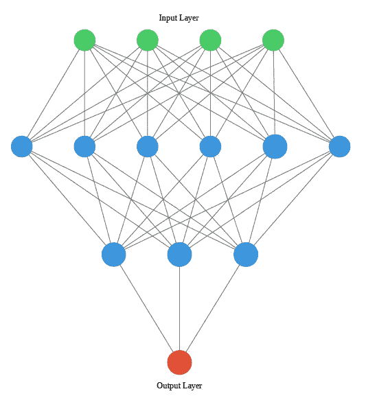
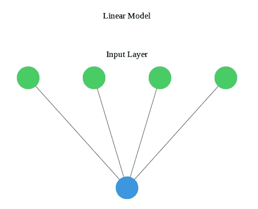
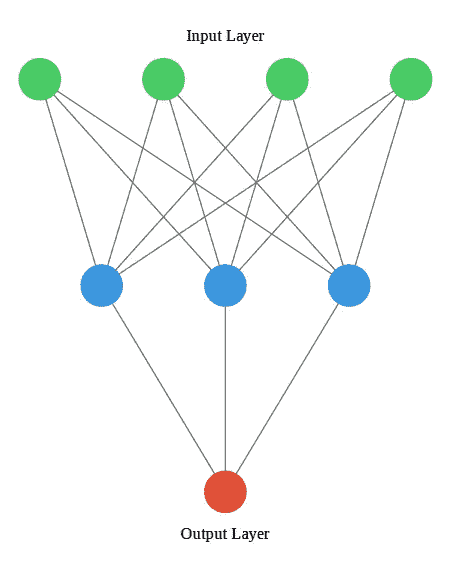
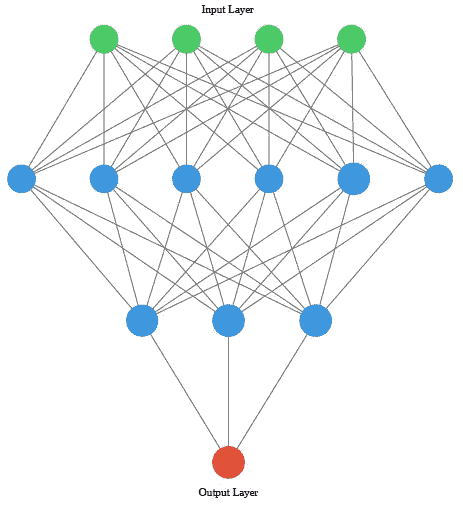
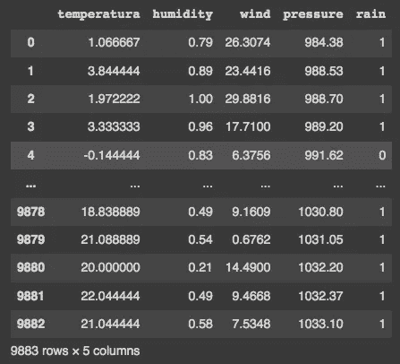
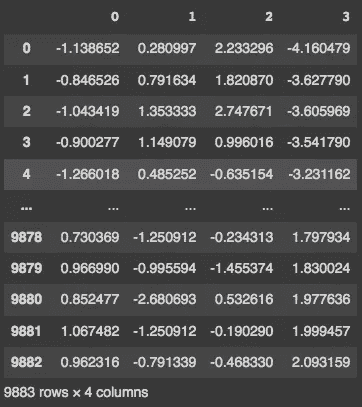
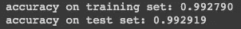
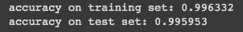
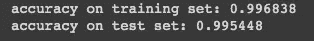

# 神经网络简介——了解深度学习

> 原文：<https://blog.devgenius.io/gentle-introduction-to-neural-networks-understanding-deep-learning-7cbfeed995b?source=collection_archive---------8----------------------->

## Python 中的代码示例



***神经网络*** 最准确的名称是 ***多层感知器*** (MLPs)。我们可以把 MLPs 看作是几个线性模型的总和，这些线性模型在模型做出决定之前执行许多中间阶段。深度学习模型可以用于回归和分类任务。

我们可以用一个例子来帮助我们理解一个深度学习模型。如果我们想根据温度、压力、风和湿度(要素)等信息预测明天是否会下雨，我们可以使用线性模型，其中:

```
**Features:**
x[0] → temperature
x[1] → pressure
x[2] → wind
x[3] → humidity**Outcome:** 
y = 1 → rain
y = 0 → not rain
```

当考虑线性模型时，我们可以用图形表示它:



线性模型的图形表示

其中绿点表示输入要素，蓝点表示输出。黑线是要素的权重，表示其对输出的影响。我们可以看到，该模型有 4 个系数要学习，用黑线表示。可视化的数学公式是:

> x[0]w[0]+x[1]w[1]+x[2]w[2]+x[3]w[3]= y

通过深度学习，我们将这个过程进行得更“深入”，我们多次重复这个过程，试图改进我们的决策模型。中间步骤被称为“ ***隐藏层*** ”，由我们的机器执行(我们不知道它，也不会访问它，所以命名为隐藏层)。使用上面的例子，我们可以添加一个带有三个节点的隐藏层:



具有 1 个隐藏层和 3 个节点的深度学习模型

现在，绿点是估算的要素，蓝点是隐藏图层中的节点，红点是输出。模型需要学习的系数数量是 15。

研究人员可以设置隐藏层中的节点数量，以及隐藏层的数量。再次使用相同的示例，可以将模型设置为使用 2 个隐藏层，第一个具有 6 个节点，第二个具有 3 个节点。这是一个更复杂的模型，有 45 个系数需要学习。



具有两个隐藏层的深度学习模型

> 术语 ***深度学习*** 出现在模型架构中，它深入数据，有几个隐藏层。

与机器学习中的任何其他模型一样，MLP 有优点也有缺点:

> **优势:** - 适用于大型复杂数据
> -能够捕获其他模型无法捕获的数据
> -通常胜过任何其他 ML 模型
> -适用于图像、声音和文本数据
> 
> **缺点:**
> -要求计算量大
> -训练时间长(部分模型/数据需要 GPU)
> -要求仔细的数据预处理
> -难以/不可能理解

# 天气数据集的应用示例:

在这个例子中，我将使用包含在 [weather.csv](https://www.kaggle.com/datasets/zaraavagyan/weathercsv) 数据集中的部分数据。您可以通过从数据集中选择任意四个数字要素来遵循此示例。

```
import numpy as np
import pandas as pddf = pd.read_csv("/content/weather_2.csv")
df
```



这是我将用来建立模型的数据。如你所见，数据没有被标准化，这对于建立深度学习模型是必不可少的。为了标准化数据，我们将使用预处理中的 StandardScaler:

```
from sklearn import preprocessing**#Normalize data using StandardScaler:****#Define X and y:** y = df['rain']
X = df.drop('rain', axis=1)**#Create array:** X = np.array(X)**#Define preprocessing method:** scaler = preprocessing.StandardScaler().fit(X)**#Transform X:** X_scaled = scaler.transform(X**#Convert np.array to pd.DataFrame:** X = pd.DataFrame(X_scaled)**#Inspect X:**
X
```



我们还需要将数据分成训练样本和测试样本:

```
from sklearn.model_selection import train_test_split**#Split data into train an test, with test size of 20%:**X_train, X_test, y_train, y_test = train_test_split(X, y, test_size=0.2, stratify=y, random_state=42)
```

现在构建模型:

```
from sklearn.neural_network import MLPClassifier**#Build and fit the model:** clf = MLPClassifier(random_state=1, max_iter=1000).fit(X_train, y_train)**#Evaluate the model:** print("accuracy on training set: %f" % clf.score(X_train, y_train))
print("accuracy on test set: %f" % clf.score(X_test, y_test))
```



使用 Sci-Kit Learn，默认的隐藏层数是 1，有 100 个节点。我们可以改变这个值并建立用户特定的神经网络:

```
**#Build and fit a model with 1 hidden layer with 3 nodes:**clf_2 = MLPClassifier(random_state=1, max_iter=1000, hidden_layer_sizes=[3]).fit(X_train, y_train)**#Evaluate the model:** print("accuracy on training set: %f" % clf_2.score(X_train, y_train))
print("accuracy on test set: %f" % clf_2.score(X_test, y_test))
```



```
**#Build and fit a model with 2 hidden layer with 6 and 3 nodes:** clf_3 = MLPClassifier(random_state=1, max_iter=1000, hidden_layer_sizes=[6, 3]).fit(X_train, y_train)**#Evaluate the model:** print("accuracy on training set: %f" % clf_3.score(X_train, y_train))
print("accuracy on test set: %f" % clf_3.score(X_test, y_test))
```



感谢您的阅读。

**如果:**你喜欢这篇文章，别忘了关注我，这样你就能收到关于新出版物的所有更新。

**其他如果:**你想了解更多，你可以通过[我的推荐链接](https://cdanielaam.medium.com/membership)订阅媒体会员。它不会花你更多的钱，但会支付我一杯咖啡。

**其他:**谢谢！