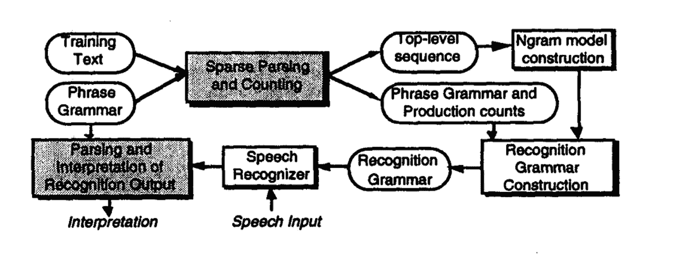

# 自然语言处理术语的温和跳转

> 原文：<https://blog.devgenius.io/gentle-jump-to-the-terminologies-of-natural-language-processing-b7718b73bc09?source=collection_archive---------12----------------------->

简单而温和的自然语言处理术语介绍。

## 🤔什么是 NLP？

简而言之:它是一种由自然语言组成的软件辅助的语音和文本自动处理。
多亏了科技，机器可以理解、分析、操纵和解释人类语言。

## 💿组件:

*   自然语言理解(NLU):一个词是做什么用的。
*   自然语言生成(NLG):把你想说的话放在正式的语境中，用自然的表达方式表达出来。

## 🎩NLP 阶段(级别)

*   **记号化**
    它只是把一个文本块分成记号，记号是更小的文本块。根据上下文，标记可以是单词、字符或子单词。
*   **词法分析** 识别和分析单词的结构(将文本划分为段落、句子和单词)。
    *# Stemming(Root)=>visibls = visibl****ie。根/基。*** *#词汇化(意义，语境)= >可视性=可视性* ***ie。字典形式。***
*   **句法分析**检查语法，单词的排列，以及单词之间的相互关系(**依存语法和词性** )
    *#安曼市是食物= >拒绝*
*   **语义分析**从文本中检索有意义的见解。
    *# ASU CS 硕士费用= >大学计算机硕士费用*
*   **话语整合**语境中的话语，依存
    *#阿里做到了*
*   **语用分析**从文本中提取见解的过程。它包括单词的重复。
    *#谁做了什么*
*   **文本生成** 自动生成符合某些交流标准的自然语言消息
    文本生成主要有两种方法:
    1 .**随机文本生成**:语言模型不受任何规则或期望的限制和指引，允许它生成任何文本。我们只是要求提供真实、清晰、易懂的信息。
    2。**可控文本生成**:可控文本生成产生具有可控属性的自然短语。例如，我们可以提供创建的文本的一些属性。

## 👨🏻‍💻自然语言处理方法

*   **符号方法**
    对语言现象进行深层分析的过程即。这个词的意思和它所描述的。
    *#文本分类。
    #规则一个歧义词(动词/非动词)前面是否有匹配的人称代词- >单词是动词。*
*   **统计方法**
    基于文本集合(文本语料库)开发语言现象通用模型的过程。
    *#语音识别。
    #对于每一个可能的语境 X，按照 P(W|X)对所有能想到的句子 W 进行排序。*
*   **连接主义方法**
    使用统计学习、若干代表性理论和文本语料库(文本语料库)创建语言现象的通用模型，并将信息存储在连接权重中。
*   每个单元代表一个概念，但是单元之间的联系通常不被标注。
*   **分布à**
    表示为多个单元同时激活的功能

# 🤖语言建模

被称为 NLP 语言模型的概率统计模型基于出现在某个单词序列之前的单词来确定该单词序列出现在句子中的可能性。知道句子中接下来最有可能出现哪个单词会很有帮助。因此，它通常用于拼写纠正、机器翻译、预测文本输入和语音识别等应用中。语言模型通常从例句的训练集合中接收其输入。结果是单词序列的概率分布。我们可以使用前面的一个单词(unigram)、最后两个单词(bigram)、最后三个单词(trigram)或最后 n 个单词来预测下一个单词，这取决于我们需要什么(n-gram)。

## 为什么是语言模型？

语言模型是自然语言处理的基石。它们是一种将定性文本信息转换成计算机可以理解的定量数据的技术。他们受雇于各行各业，包括银行、医疗保健、技术和军事。我们每天都在与语言模型互动，无论是通过智能手机上的预测文本功能还是简单的谷歌搜索。因此，语言模型是任何使用自然语言处理的应用程序的基本部分。

## 使用哪种语言模型？

*   **变形金刚**是独一无二的模型，但是他们需要更多的训练数据。
*   **递归神经网络** ( **RNNs)** 不能产生组织良好的冗长序列
*   **用注意力机制增强的编码器-解码器**模型可以比 RNNs 执行得更好，但是不如 Transformers
*   **生成对抗网络** ( **)甘斯)**不易训练或收敛。

可以在这里了解更多:[https://www . analyticsvidhya . com/blog/2022/01/building-language-models-in-NLP/#:~:text = A % 20 language % 20 model % 20 in % 20 NLP，appear % 20 next % 20 in % 20 the % 20 sentence](https://www.analyticsvidhya.com/blog/2022/01/building-language-models-in-nlp/#:~:text=A%20language%20model%20in%20NLP,appear%20next%20in%20the%20sentence)。

# 🫥有限状态

有限状态实体可以被认为是由“弧”和“状态”组成的有向网络或图形。有限状态机有一个初始状态和多个最终状态。状态用圆圈表示，弧线用箭头表示。图 1 显示了一个相当简单的有限状态机图，图中的节点代表状态，弧线代表转换，标签代表机器发出的符号。指向一个状态的箭头表示它是一个开始状态，而双圈总是用来表示结束状态。

## 你可以在这里阅读更多关于有限状态的内容:

[https://www . tutorialspoint . com/natural _ language _ processing/natural _ language _ processing _ word _ level _ analysis . htm #:~:text = An % 20 automaton % 20 having % 20a % 20 Finite，limited % 20 state % 20 automaton % 20(FSA)。text = Q % 20is 是% 20a % 20 有限% 20 集合，是% 20 字母表% 20 of % 20 自动机。&text = Q0 %20 is % 20 初始% 20 状态，已处理%20(q0%20%E2%88%88%20Q)。](https://www.tutorialspoint.com/natural_language_processing/natural_language_processing_word_level_analysis.htm#:~:text=An%20automaton%20having%20a%20finite,Finite%20State%20automata%20(FSA).&text=Q%20is%20a%20finite%20set,the%20alphabet%20of%20the%20automaton.&text=q0%20is%20the%20initial%20state,processed%20(q0%20%E2%88%88%20Q).)

## 📱自然语言处理的一些应用

*   信息检索
*   信息抽取
*   问题回答
*   摘要
*   机器翻译
*   对话系统

## 🪲代码片段

 [## GitHub-jeevankande/自然语言处理:这里我们将使用…

### 在这里，我们将应用自然语言处理使用各种软件包，如 keras，textblob，genism 等自然语言处理应用…

github.com](https://github.com/jeevankande/Natural-Language-Processing) 

## 🏳结论

虽然与其他信息技术方法相比，NLP 是一个相对较新的研究和应用领域，但迄今为止已有足够的成功表明，基于 NLP 的信息访问技术在现在和未来很长一段时间内仍将是信息系统研究和发展的一个重要领域。

> 我希望你对这篇文章感兴趣，❤️