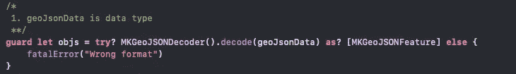
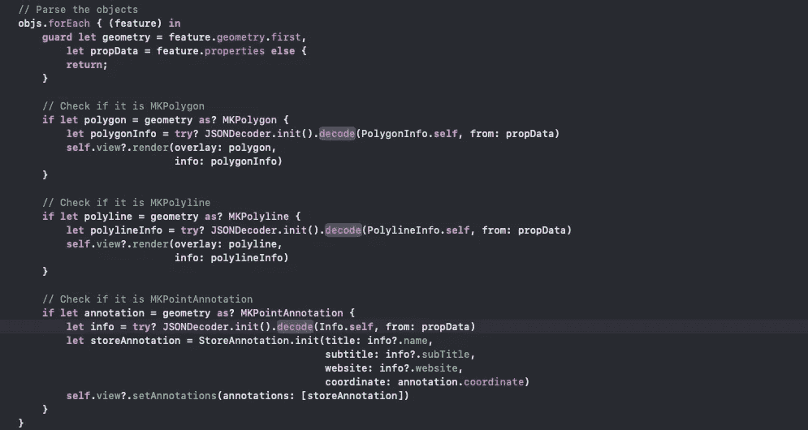
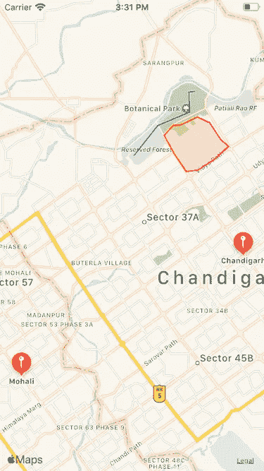
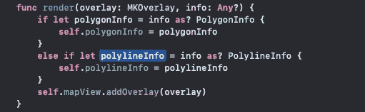
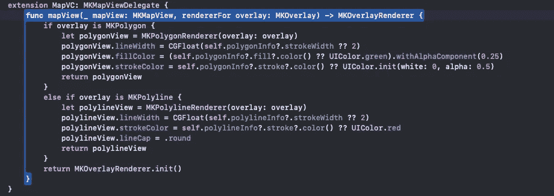

# GeoJson 解码器集成

> 原文：<https://blog.devgenius.io/geojson-decoder-integration-e31228fdeb0?source=collection_archive---------5----------------------->


由 [NASA](https://unsplash.com/@nasa?utm_source=medium&utm_medium=referral) 在 [Unsplash](https://unsplash.com?utm_source=medium&utm_medium=referral) 上拍摄的照片

嘿！是的，这篇文章更多的是关于 2019 年推出的 GeoJson，由 iOS 13 支持。了解趋势和帮助行为室内地图 apple 在 WWDC_2019 中引入了 IMDF(室内制图数据格式)，并使用 GeoJson 将其解析到 MKMapKit 中。

**MapKit** 是 iOS 设备上可用的强大 API，可以轻松显示地图、标记位置、增强自定义数据，甚至在顶部绘制路线或其他形状。

IDMF 在设计室内地图功能方面发挥了很大的作用。更多信息可以参考[链接](https://developer.apple.com/videos/play/wwdc2019/245/)。在这里，苹果也介绍了另一个会员注册和一些产生 IDMF 的先决条件。由于我不打算在这里详细讨论这一点，所以你可以通过上面的链接了解更多关于室内地图的注册和生成。

在这篇文章中，我们将解析 GeoJson，显示点，多边形和折线。每种类型都符合从`MKGeoJSONFeature`让我们对 GeoJsonDecoder 有个大概的了解。当然，不要忘记导入地图工具包。

> **试试**？MKGeoJSONDecoder()。解码(地理数据)

GeoJsonDecoder 使开发人员从其他来源导入地图变得更加容易。在地图中导入叠加更有用。如今，在 MKMapKit 中很容易导入 GeoJson 文件。GeoJsonDecoder 将帮助从 JSON 中读取覆盖图，并将它们解码为`MKGeoJSONFeature`对象的集合。MKGeoJsonFeature 符合所有叠加类型，例如:

1.  MK 多点
2.  MK 多重多边形
3.  MK 多重多边形
4.  MK 多重注释
5.  MKPolygon
6.  MKPolyline

因此 decoder 帮助将 JSON 解码为上述任何对象，并且可以很容易地添加到地图中。

GeoJson 必须有效。这是 GeoJson 的基本格式—

> {
> " type ":" feature collection "，
> "features": []
> }

如果 Json 不像上面的例子，它将永远不会通过 GeoJsonDecoder 解析。GeoJsonDecoder 返回 3 个属性-

**a. Geometry :** 这是[MKShape & MKGeoJsonObject]类型，用于从 Json 获取覆盖对象。那些覆盖实例可以直接在地图中使用。

**b .标识符:**(可选字符串)

**c. Properties:** 这是 Json 返回的可选数据。它将给出更多关于地图，覆盖，大头针等信息。这是用户控制的，可以自己解析。属性提供了除坐标以外的更多信息，如名称、颜色、图像等，它是用户可定制的。

我相信这是太多的理论，让我们做一个小代码并理解它。并解析具有 2 个点和多边形的 GeoJson。[这里的](https://raw.githubusercontent.com/neophyteKB/GeoJson/master/GeoJsonSample/location.geojson)是 geojson 文件的例子。

这里 GeoJsonDecoder 将返回[MKGeoJsonObject],如下所示:

```
func decode(_ data: [Data](https://developer.apple.com/documentation/foundation/data)) throws -> [[MKGeoJSONObject](https://developer.apple.com/documentation/mapkit/mkgeojsonobject)] 
```

每个要素必须定义其类型，如点、多边形、折线等。下面是上述解码函数返回的一段代码:



现在我们必须检查每种类型，并将每种类型的组件解析为—



在上面的例子中，我正在检查多边形，折线和 MKAnnotationPoint。您可以根据需要添加更多。我在 Presenter 中编写了上面的代码，让逻辑在那里进行计算。如你所见，我在每个渲染调用中都返回了一个对象信息。这是实例，将有助于设置每个单独的覆盖属性。请参见以下输出:



地图包含 1 条折线、1 个多边形和 2 个注记点，因为 geoJson 的所有组件都已成功渲染。

现在，如果你仔细观察，你会发现折线和多边形的颜色不同。因为我们只有一个委托方法来渲染所有的覆盖。

```
optional func mapView(_ mapView: [MKMapView](https://developer.apple.com/documentation/mapkit/mkmapview), 
          rendererFor overlay: [MKOverlay](https://developer.apple.com/documentation/mapkit/mkoverlay)) -> [MKOverlayRenderer](https://developer.apple.com/documentation/mapkit/mkoverlayrenderer)
```

现在，我们已经完全相同地使用了每个组件的属性。让我们看看如何:

我首先将属性保存在 MapVC 中:

**私人****var**polygonInfo:polygonInfo？

**私有****var**polyline info:polyline info？



所以现在在渲染叠加时，我使用保存的属性来设置它的颜色，笔画宽度等。



由于两个覆盖图使用不同的渲染器方法渲染，所以我们可以分别设置属性。

因此，这里我们几乎已经完成了在地图视图中渲染 geojson 所需的所有工作。

您也可以从公共存储库中访问代码。[地质样品](https://github.com/neophyteKB/GeoJson)

非常感谢您的评论和反馈！

干杯！快乐编码:)