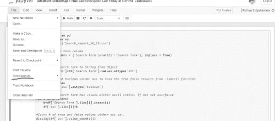
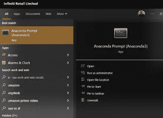
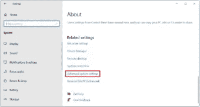
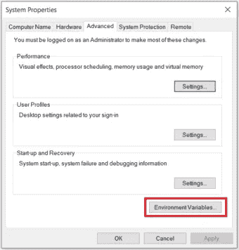
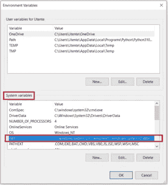
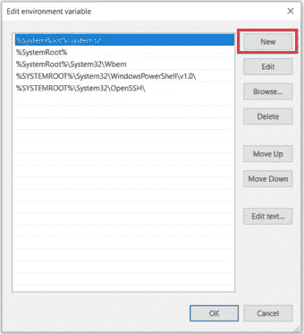
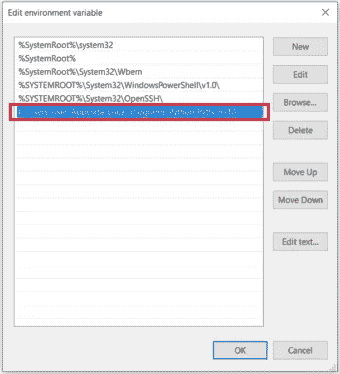
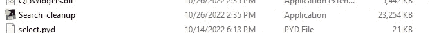
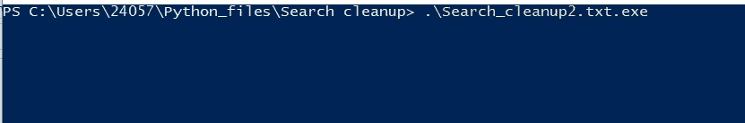
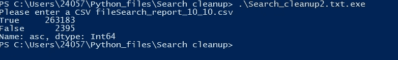

# 获取一个 Python 脚本(。py)在任何机器上运行(作为。exe 文件)

> 原文：<https://blog.devgenius.io/get-a-python-script-py-to-run-on-any-machine-as-an-exe-file-61c527df2bf?source=collection_archive---------7----------------------->

这篇文章讲述了我如何将 Python 自动化脚本转换成. exe 文件，以便我的一个同事可以像一个独立的应用程序一样在他/她的机器上运行

# 索引:

1.  剧本简介
2.  转换为。复制并安装必要的软件包
3.  包装和电子邮件
4.  在目标机器上运行

# 1.剧本简介

我编写的脚本接受一个包含一堆搜索关键字(记录在我的网站上)的 csv 文件作为输入，并清除文件中的任何垃圾搜索词。你可以在这里找到详细的案例研究和实际 Python 脚本[的代码。](https://abhranilpaul.medium.com/cleanup-a-search-result-file-using-python-and-adobe-analytics-dc27153fa8c3)

# 2.转换为。复制并安装必要的软件包

后续步骤:

1.  我已经把。ipynd 文件到 a .py。这在 Jupyter 笔记本中非常简单。



点击下载为，你会得到一个选项下载为 Python。py 文件)

2.打开机器上的 Ananconda 终端



3.去你的小径。py 脚本位于，对我来说这是在我的本地
(base)C:\ Users \ 24057>CD C:\ Users \ 24057 \ Python _ files \ Search clean up 中的以下路径

4.键入以下命令

```
pyinstaller --onefile Search_cleanup.py
```

这将需要一些时间，根据代码结构的不同，您可能会收到一些警告。此外，请确保使用 onefile。

5.如果您在此阶段收到一条错误消息，说明: [Pyinstaller 未被识别为内部或外部命令](https://stackoverflow.com/questions/45951964/pyinstaller-is-not-recognized-as-internal-or-external-command)，则执行以下操作

a.检查您是否安装了 pip。您可以键入以下内容:

```
pip --version
```

b.从现在开始，如果您得到一个输出，您需要将 pyinstaller 的保存路径添加到您的“环境变量”中。遵循以下步骤:

-打开`Control Panel`(在 Windows 搜索中输入)，选择`System and Security`，然后选择`System`。

*   转到打开窗口的末尾，选择`Advanced system settings`:



*   点击`Environment Variables`:



*   在`System variables`部分，找到并双击变量`Path`:



*   点击`New`并将路径添加到存储 PIP 安装程序的文件夹中:



*   点击`OK`确认修改。

如果你在上面的 b 点没有得到输出，那么你需要安装 pip。按照这些步骤进行同样的操作。

```
python -m pip install --upgrade pip
pip install pyinstaller
```

然后，您必须在环境变量中设置路径，如上所示。

5.运行 pyinstaller 代码后，您应该会看到在同一路径中创建了两个新文件夹。名为 Dist and Build。

转到您的 Dist 文件夹，您会发现一个 exe 文件，看起来像这样:



6.复制这个文件，并把它放在原始数据文件所在的路径下。(在我的例子中，我正在清理存储在不同位置的搜索原始文件)

7.如果您现在双击。exe 文件中，cmd 提示符将会打开，但在您尝试输入任何值时将会关闭。

要避免这种情况，请按住 shift 键并右键单击文件夹，然后选择“在此打开 Powershell 窗口”。

8.键入 exe 文件的前几个字符，然后按 tab 键。应该会显示 exe 文件



9.在我的例子中是这样的——这意味着我的脚本运行成功



10.现在，您可以与机器上没有 Python 的人共享这个文件。这里唯一要考虑的是，用户应该有这个程序将要处理的数据文件，并且必须将它存储在与。exe 文件。

就我而言，我发现这很难像 gmail 检测到的那样在 gmail 中分享。exe 附件视为恶意软件。因此，我在 onedrive/pendrive 的基础上分享了这一点。

希望这对某人有所帮助。如果你觉得这有帮助，请鼓掌。

参考链接:

[https://www . data quest . io/blog/install-pip-windows/#:~:text = To % 20 check % 20 if % 20 pip % 20 is，the % 20 available % 20 commands % 20 and % 20 options](https://www.dataquest.io/blog/install-pip-windows/#:~:text=To%20check%20if%20PIP%20is,the%20available%20commands%20and%20options)。

【https://www.youtube.com/watch?v=oNq9QKX3lMs 号