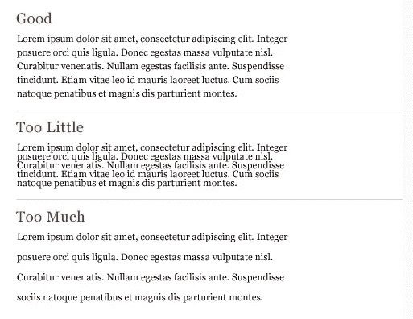
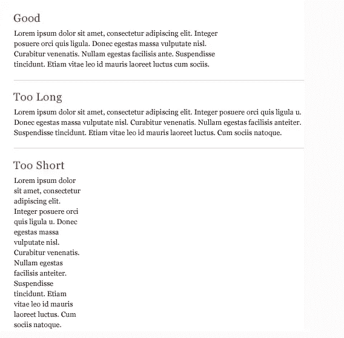

# 更好地掌握排版。

> 原文：<https://blog.devgenius.io/get-better-at-typography-ab5469cee39b?source=collection_archive---------4----------------------->

## 提高排版技巧的 8 个技巧

许多人认为字体设计只包括选择一种字体，选择一种字体大小，以及它应该是常规的还是粗体的。对大多数人来说，这就结束了。但是要实现好的字体设计，还有很多东西，这是设计师经常忽略的细节。

这些细节给了设计师完全的控制权，让他们在设计中创造出漂亮一致的字体。

# 1.使用一种字体

组合两种或两种以上的字体并不容易。对于初学者，坚持使用一种字体。在一个版面中成功地使用两种或两种以上的字体需要理解所选择的字体，以便确信它们是互补的。

使用不同粗细的字体

# 2.向左对齐更好

将你的字体设置为左对齐，因为人们从上到下，从左到右阅读。通过左对齐，人眼能够找到边缘并更好地阅读副本。

从左边开始

# 3.正确使用字体粗细

伟大设计的关键是对比。重量的微小变化使用户很难注意到差异。从浅色到中色或从普通到粗体。有时候，跳过重量是好的。

跳过重量很好

# 4.标题的双点大小

将标题的点大小加倍会产生更大的对比度。将磅值放大或缩小一倍。例如，如果你使用 **18 点**的身体，然后使用 **36 点**的标题。

标题用 36pt 加粗，正文用 18pt 常规。

# 5.让字母呼吸

在正文中，对可读性有很大影响的字行间距。正确的行距使读者更容易理解文字，并改善文字的整体外观。

空白很重要

# 6.寡妇和孤儿

寡妇是一个段落末尾的一个短行或单个单词。孤立字是一列开头或结尾的一个单词或一个短行，它与段落的其余部分分开。寡妇和孤儿创造了尴尬的破布，打断读者的眼睛，影响可读性。可以通过调整字体大小、行距、尺寸、单词间距、字母间距或手动换行来避免这些错误。

寡妇和孤儿

# 7.强调

在不打断读者的情况下强调一个单词是很重要的。斜体被广泛认为是强调的理想形式。其他一些常见的强调形式有:粗体、大写、小写、字号、颜色、下划线或不同的字体。无论你选择哪一个，试着限制自己只用一个。

以正确的方式强调

# 8.措施

度量是一行文字的长度。对读者来说，长或短的台词既累又让人分心。长小节会打乱节奏，因为读者很难找到下一行文字。唯一可以接受的狭义度量是少量文本。为了获得最佳的可读性，您希望度量在 40–80 个字符之间，包括空格。

适当的长度很重要