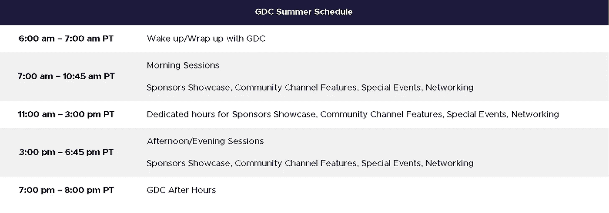

# 从 GDC 的游戏开发专家那里获得见解和实际指导

> 原文：<https://blog.devgenius.io/get-insights-and-hands-on-guidance-from-game-dev-experts-in-gdc-95c0e1a1d0c?source=collection_archive---------33----------------------->

## 面向全球游戏开发者的夏季新技能培养系列

照片由 [Hello 灯泡](https://unsplash.com/@hellolightbulb?utm_source=medium&utm_medium=referral)拍摄

[GDC 夏季](https://gdconf.com/)即将到来，当这个全数字游戏行业活动首次亮相时，将有一系列新的[互动会议](https://schedule.gdconf.com/format/interactive-session)，承诺引导与会者完成理想游戏开发工作的步骤。

## 为什么要参加 GDC

GDC Summer 将是一个为期三天的游戏开发艺术、工艺和商业庆典，它为全世界的开发者提供了一个了解该领域最新进展的独特机会。

*   与游戏开发者朋友联系
*   了解其他游戏开发商是如何制作游戏的
*   获得关于如何成功运营游戏开发业务的见解
*   建立自己的事业
*   与新朋友联系和工作
*   获得灵感！

## 活动概述

该活动将于 2020 年 8 月 4 日至 6 日举行，会议计划将包括多学科、教育性和启发性的演讲、高质量的技术内容以及一系列新的职业发展会议。

从清晨开始，GDC Summer 就安排了发人深省的会议、娱乐和交流，将为世界各地的与会者带来学习和商业机会。

照片由[https://gdconf.com/event-details](https://gdconf.com/event-details)拍摄

GDC Summer 的新技能建设系列的每一节都旨在为您提供 45 分钟的实践指导，由游戏行业专家带领您完成一个著名的项目，并回顾用于创作该作品的工具、技巧和技术。例如:

*   游戏艺术家“Tyr IQ Plummer”(*Catacomb Kids*)将介绍一些技巧、技术和最佳实践，为当代游戏提供像素艺术和动画。
*   游戏作家“Susan O'Connor”也同意提供一个关于“[让设计师和作家合作工作](https://schedule.gdconf.com/session/skill-building-series-making-the-designer-writer-collaboration-work/875755?_mc=blog_x_gama_le_x_gdcsf_x_x-20-gdcs20)的技能培养课程，这是任何对游戏项目写作感兴趣的人的必看课程。
*   GFR 基金管理合伙人 Teppei Tsutsui 将提供详细的建议，说明筹款过程是如何进行的，以及你需要知道什么才能让它为你服务。还有很多。

## 通行证和价格

GDC Summer 提供不同的通过级别，以确保您能够从活动中获得所需的一切。请在下面查找关于通票和价格的详细信息。

照片由[https://gdconf.com/passes-prices](https://gdconf.com/passes-prices)拍摄

***欲了解更多关于 GDC 夏季的详情，请访问该展会的*** [***官方网站***](http://gdconf.com/?_mc=blog_x_gama_le_x_gdcsf_x_x-20-gdcs20) ***，或通过*** [***【脸书】***](http://www.facebook.com/GameDevelopersConference)*[***Twitter***](https://twitter.com/Official_GDC)订阅定期更新 *

*曼文德拉
2020 年 7 月*