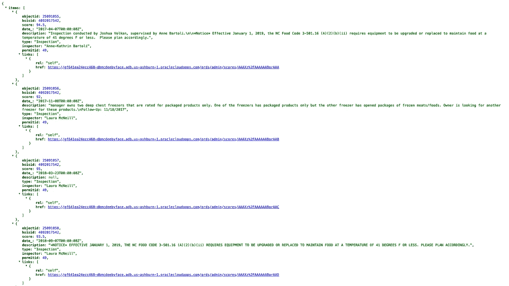

# 使用 Python、ORDS 和 Oracle 自治数据库获取请求

> 原文：<https://blog.devgenius.io/get-requests-with-python-ords-and-the-oracle-autonomous-database-f0c070a2990?source=collection_archive---------19----------------------->

# 问题

我想拿走这些物品，


并将它们复制到一个新创建的 *Python 开发者*数据库用户/模式中。我已经打算这么做一段时间了，因为我会像一个典型的[开发人员]用户那样处理所有未来的开发工作。

我之前创建了一个“开发者”用户，但是建议创建一个专门用于 python 开发的用户*。这个建议很有意义，因为我想探索其他开发人员框架——JavaScript/React、Derelicte、Golang、好把戏、Swift、Smashmouth。*

```
**DISCLAIMER:** Some of the aforementioned languages/frameworks are entirely fictional.
```

因此，在创建这个用户并填充模式时，我可以在几秒钟内复制这些对象。我敢肯定，一些已经存在的将使我能够这样做。一个不太好的选择是进行本地上传。我相信我可以导出我的管理模式的表，然后作为开发人员在数据库操作中上传它们。在此执行以下操作:


但是这些选择太直接、太容易、太迅速了。我需要一种能让我质疑自己人生决策的方法。一些迫使我重新思考作为人类意味着什么的事情。

最主要的是，我想找个借口多修理一下 ORDS。虽然我没有从一个定义良好的用例开始，但我能够 retcon(单词*追溯*和*连续性*的组合)一个。

# 方案

场景是我们有支持 REST 的模式对象(在本例中是各种表)，可能我们想在那个表上执行 GET 请求。也许我们需要该表中的所有数据(已经在 JSON 中返回)。不管出于什么原因，我们希望将这些信息保存在一个 JSON 文件中。似是而非？不太可能。可能吗？如果我能做到，那么是的，100%可能。

# 解决办法

```
**NOTE:** I've since disabled REST for these tables. So none of these URLs currently work. Also for security reasons you probably want to a require authentication to access these. The below screenshots and code snippets are for demonstration purposes.  In this case, probably acceptable, but please (PLEASE) exercise caution if you are recreating at your workplace.
```

# 支持休息

当您启用 REST 表时，会提供一个 URL(也称为 REST 端点)供您查看。它看起来会像这样:

```
[https://gf641ea24ecc468-dbmcdeebyface.adb.us-ashburn-1.oraclecloudapps.com/ords/admin/scores/](https://gf641ea24ecc468-dbmcdeebyface.adb.us-ashburn-1.oraclecloudapps.com/ords/admin/scores/)
```

响应如下所示:



您看到的是我的“分数”表中的前 25 个结果。我还为该表创建了一个别名作为额外的保护。该表的实际名称不是“分数”，而是其他名称。

如果您折叠“项目”，则更容易看到其余的“名称:值”对:


我可以尽力解释我们在这里看到的情况:

*   **条目:[…]"** 是我的表格中的单个条目(列是您以黑色粗体显示的条目)。ORDS 只包含调用那个单个条目*的链接*
*   **‘has more’:true，“**本质上是指有更多的页面有信息跟随
*   **“limit:25”**指的是 ORDS 一次只返回 25 个结果。这不是我设置的；这是默认的。
*   **"offset: 0"** 这个比较棘手。据我所知，只有在第一页之后，偏移量才会成为一个考虑因素。您开始时没有偏移(我知道这没有意义，但是我将很快解释这一点)
*   **“计数:25”**—我们在这一页上有条目 1-25
*   **"链接:[……]"**这些都是不言自明的。特别是两个链接，非常有趣。它们是:
*   “描述者”和
*   "下一个"

如果我单击“describedby”链接，您会看到类似这样的内容:


在此页面上，您可以查看有价值的信息，而无需登录数据库操作。我发现这非常有帮助；从这里，我可以看到表名、主键(如果存在)以及表的列名和类型。

我想强调的另一个链接是“下一个”如果仔细观察，您会发现“下一个”URL 包含一个零偏移量:


但是，如果我单击那个 URL(我也已经折叠了这个页面上的所有项目)，我可以看到“offset”已经增加到 25，并且*new*“next”URL 显示“offset=50”。下一部分将更好地解释正在发生的事情。


因为我们在结果的第*第二*页，ORDS 知道我们从零偏移(表格的开始)和 25 的限制开始。每个“下一个”URL 将增加 25(偏移量)，并且一次返回 25 个结果。它将继续生成“下一个”URL，直到“hasMore: false”条件最终得到满足。我们可以修改很多，但这是 ORDS 自动/默认为你做的。对我来说是个好消息，因为以我目前的经验水平，我能自动化的步骤越多越好！

# 计算机编程语言

准备好迎接一次飞跃吧。在这一点上，我非常自信我可以通过一些 python 代码复制/粘贴这些数据，然后将其保存为*某种*格式。

最后，大约一周后，我能用胶带把一些东西粘在一起。感谢谷歌，StackOverflow，这么多 YouTube 视频教程(这么多，这么多)，以下是我得出的结论:

```
**import requests
import json** # requests is a python library that allows you to send GET, 
# PUT, DELETE, HEAD, and OPTIONS requests. I'm just doing 
# GET requests though. The json library comes with python, 
# but I need it here to be able to work with the json that # is returned. I'll also need it to create the json file 
# (at the end).**offset = 0**# I'm basically telling this little script that we should 
# expect to start with an offset of zero. If you recall, 
# this just means we are beginning on the first page. 
# Hence, there is no offset. **url = 'https://gf641ea24ecc468-dbmcdeebyface.adb.us-ashburn-1.oraclecloudapps.com/ords/admin/places/?offset={}'**# I've added in this modifier {}, which, as you'll see in a # bit, allows me to increment by 25 with each subsequent 
# GET request.**hasMore = True**# Read this as "hasMore is equal to True". In other words, 
# if there is more STUFF, then we should see "true" (go 
# back and look at the screenshots if you don't know what 
# this means.)**while hasMore:**# We are saying, "While 'hasMore is equal to true, then..." **   response = requests.get(url.format(offset))**

#...recognize that "response" is a GET request that 
# consists of the URL (from above) plus whatever the offset # is (we'll indicate the offset below). **   data = response.json()**#data is just whatever the results are from the above 
# response. **filename = 'places.json'**# "filename" is the json file we are going to create to 
# put all these results into. **if data.get('hasMore'):
        offset += 25
        with open(filename, 'a') as json_file:
            json.dump(data, json_file)
    else:
        break** # I'm going to switch to narrating here, this one is just 
# too verbose. In lay terms, we are saying: if the GET 
# request "data" (which is essentially a composite variable # at this point) has "hasMore: true" on the page, then keep # doing this next thing. # With the next "thing" being: take the results from that 
# URL and save it into a file called "places.json". Once 
# you've done that, keep doing it, but add 25 to the offset # for that URL for subsequent GET requests. And whenever 
# you have results, append it (that's what that "a" is on 
# line 44) to the file you created, and just keep going 
# until "hasMore" doesn't satisfy that condition on line 
# 20\. # If it doesn't satisfy that condition then that means 
# "hasMore" is equal to false. In other words, there is 
# nothing more to request, so stop (that is what the "else: # break" means).
```

我将包含一个图像，以便更好地查看嵌套。


一旦我运行了这个，我就会得到一个 JSON 文件(“places.json”)，其中保存了我所有的条目。


# 现在怎么办？

此时，我有几个选择。我可以:

*   包括将这个 JSON 文件转换成. CSV 文件的代码
*   包含缩进 JSON 文件的代码，使其更具可读性，*或*
*   将它拖放到我的自治数据库中(通过数据库操作中的数据加载),稍作调整(我刚刚尝试过，所以我已经知道我需要做更多的调整)

# 结束了

那么我们在这里学到了什么？即使是拥有非常基本技能的人也可以通过 ORDS 与自主数据库进行交互。

如果你有网络连接并且足够渴望，天空就是极限。总的来说，在一周半以前，我是做不到这些的。

老实说，你并没有落后太多！我鼓励你尝试一下。

# 找到我

*   [推特](https://twitter.com/chrishoina%29)
*   [YouTube](https://www.youtube.com/user/chrishoina/)
*   [GitHub](https://github.com/chrishoina)
*   [不和](https://discord.gg/seYeAPgq9E)
*   [领英](https://www.linkedin.com/in/chrishoina/)
*   [堆栈溢出](https://stackoverflow.com/users/9552864/chris-hoina)
*   [博客](https://followthecoffee.com/)