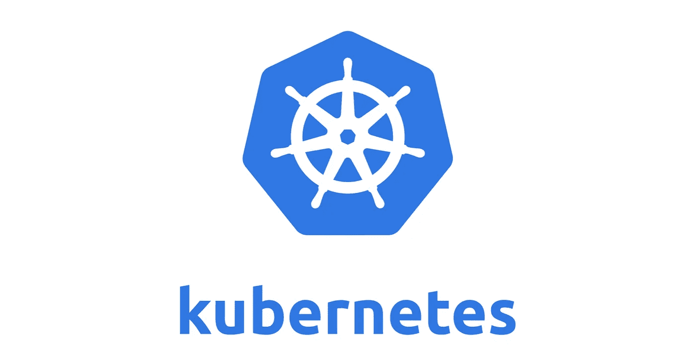

# 准备好 Kubernetes！！

> 原文：<https://blog.devgenius.io/get-set-kubernetes-4e86f94ff0ab?source=collection_archive---------15----------------------->

Kubernetes 是一个用于管理容器化应用程序的开源平台。它允许您以一致和高效的方式部署、扩展和管理容器化的应用程序。

Kubernetes 的入门一开始看起来有些吓人，但是一旦你理解了基本的概念和工作流程，它就变得容易使用了。在本文中，我们将介绍 Kubernetes 的入门步骤，包括设置本地开发环境、部署您的第一个应用程序，以及扩展它。



在我们开始之前，对容器及其工作原理有一个基本的了解是很重要的。容器是一个轻量级和可移植的包，包含运行应用程序所需的所有依赖项和代码。容器允许您打包应用程序及其所有依赖项，并在任何环境中运行它，从而使部署和管理应用程序变得容易。

要开始使用 Kubernetes，您需要在系统上安装 Docker。Docker 是一个允许你构建、运行和管理容器的工具。你可以从官方网站下载 Docker，按照你的操作系统的安装说明进行操作。

一旦安装了 Docker，就可以使用 Minikube 启动一个本地 Kubernetes 集群。Minikube 是一个允许您在本地机器上运行单节点 Kubernetes 集群的工具。要安装 Minikube，可以按照官网上的说明操作。

安装 Minikube 后，可以通过运行以下命令启动本地 Kubernetes 集群:

```
minikube start
```

这将启动一个本地 Kubernetes 集群，并设置所有必要的组件，包括 Kubernetes API 服务器、etcd 和 kubelet。

本地 Kubernetes 集群启动并运行后，您现在可以部署您的第一个应用程序了。在 Kubernetes 中，应用程序被部署为一组副本，它们是运行在集群中不同节点上的应用程序的相同副本。

要在 Kubernetes 中部署应用程序，您需要创建一个部署配置文件。该文件定义了部署的属性，例如副本的数量、要使用的容器映像以及运行应用程序所需的资源。

下面是一个简单 Node.js 应用程序的示例部署配置文件:

```
apiVersion: apps/v1
kind: Deployment
metadata:
  name: node-app
spec:
  replicas: 3
  selector:
    matchLabels:
      app: node-app
  template:
    metadata:
      labels:
        app: node-app
    spec:
      containers:
      - name: node-app
        image: node:10
        ports:
        - containerPort: 8080
```

这个部署配置文件创建了一个名为“node-app”的部署，其中包含一个容器的三个副本，该容器在端口 8080 上运行 Node.js 10 映像。

要部署这个应用程序，您可以使用`kubectl`命令行工具。`kubectl`是与 Kubernetes 集群交互的命令行界面。要部署应用程序，您可以运行以下命令:

```
kubectl apply -f deployment.yaml
```

这将创建部署并启动复制副本。您可以通过运行以下命令来验证部署是否正在运行:

```
kubectl get deployments
```

这将列出集群中的所有部署，您应该看到您的“node-app”部署以“Running”状态列出。

要访问该应用程序，您需要创建一个服务。Kubernetes 中的服务是一组副本的逻辑抽象，使外部流量能够访问应用程序。

要为您的应用程序创建服务，您需要创建一个服务配置文件。该文件定义了服务的属性，例如服务的类型、要公开的端口以及用于标识要包含在服务中的副本的选择器。

以下是 Node.js 应用程序的服务配置文件示例:

```
apiVersion: v1
kind: Service
metadata:
  name: node-app-service
spec:
  type: NodePort
  selector:
    app: node-app
  ports:
  - protocol: TCP
    port: 8080
    targetPort: 8080
    nodePort: 30001
```

此服务配置文件创建一个名为“node-app-service”的“NodePort”类型的服务，该服务公开集群中节点上的端口 8080，并将其映射到副本上的目标端口 8080。它还将节点端口 30001 分配给服务，这允许您在集群中的任何节点上访问该端口上的应用程序。

要创建服务，您可以像部署一样使用`kubectl`命令行工具。运行以下命令:

```
kubectl apply -f service.yaml
```

这将创建服务，并在集群中节点的指定端口上公开它。您可以通过运行以下命令来验证服务是否正在运行:

```
kubectl get services
```

这将列出集群中的所有服务，您应该看到您的“节点-应用程序-服务”服务以“正在运行”的状态列出。

要访问应用程序，您可以使用`minikube`命令行工具来获取服务的 URL。运行以下命令:

```
minikube service node-app-service --url
```

这将输出服务的 URL，您可以使用它在 web 浏览器中访问应用程序。

恭喜你！您已经成功地在 Kubernetes 上部署并访问了您的第一个应用程序。这只是你能用 Kubernetes 做的事情的开始。您可以增加或减少副本的数量，向您的应用程序推出更新，等等。

希望这篇教程对你入门 Kubernetes 有所帮助。如果你有任何问题或意见，请在下面的评论中留下。集装箱化快乐！