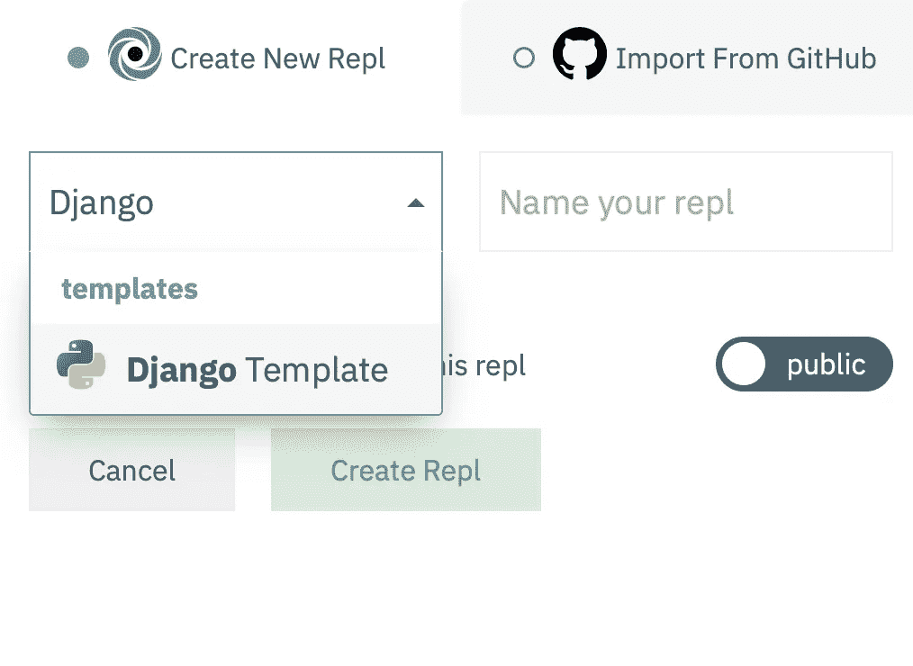
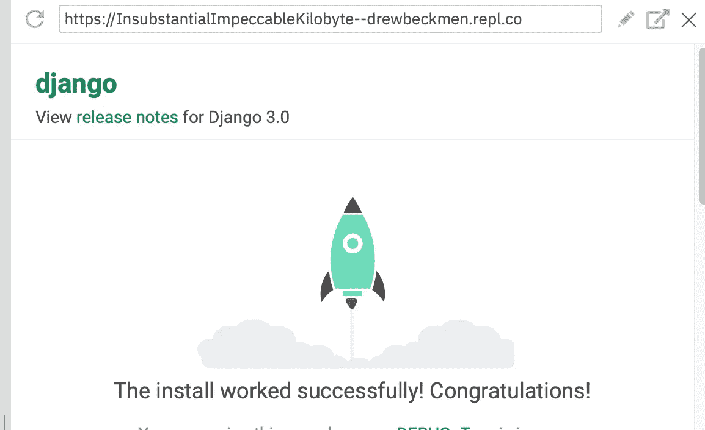

# Django 零环境设置入门

> 原文：<https://blog.devgenius.io/get-started-with-django-with-zero-environment-setup-6971fc5cf3f9?source=collection_archive---------11----------------------->

# 在几分钟内，在你的浏览器中构建你的第一个 Django 项目

照片由[埃米尔·佩伦](https://unsplash.com/@emilep?utm_source=medium&utm_medium=referral)在 [Unsplash](https://unsplash.com?utm_source=medium&utm_medium=referral) 拍摄

基于云的 ide 越来越受欢迎。微软最近宣布，随着即将推出的 [Codespaces](https://github.com/features/codespaces/) ，它将直接从 GitHub 提供完整的 Visual Studio 代码体验，它将跳上浏览器内 IDE 的潮流。鉴于微软与开发人员社区的关系以及 VS 代码的广泛流行，Codespaces 已经准备好颠覆开发人员的工作方式。尽管代码空间可能是将基于云的 ide 推向主流的服务，但是已经存在许多很好的选择。对于开发人员和代码新手来说，最受欢迎的选项之一是 [Repl.it](https://repl.it) 。

作为一家硅谷初创公司，Repl.it 得到了 Y Combinator 和 Andreessen Horowitz 等知名投资者的支持。IDE 支持 50 多种不同的编程语言，并包括内置的协作功能，允许编码人员同时处理同一个项目(想想谷歌文档中的编码)。

要开始在 Repl.it 上构建您的第一个 Django 应用程序，您首先需要创建一个帐户。创建你的帐户后，点击右上角的`+new repl`按钮，当它询问语言时输入 Django。有了免费账户，你的 repl 就可以公开了。和 GitHub 一样，你需要升级到公司的订阅计划来创建私人项目。

创建 repl 后，按绿色的`run`按钮安装必要的依赖项并启动服务器！你应该看到一个带火箭的空白页。发射！

服务器启动成功

告别寻找和安装本地开发所需的所有依赖项的繁琐工作。在云端编码消除了所有不必要的痛苦。顺便说一下，开发服务器将自动重新加载，以反映代码中的最新变化。每次修改或编写新代码时，无需重启整个服务器！

# 了解文件结构

通过选择 Django 模板，您的 repl 将自动包含许多文件和目录。让我们浏览一下其中的一些:

*   `mysite/`是你项目的 Python 包吗
*   `manage.py`是一个文件，它提供了以各种方式作用于 Django 项目的管理任务。如果你想看到你可以访问的命令，首先使用`control+c`关闭你的服务器，然后在命令行中输入`django-admin help --commands`。
*   `mysite/__init__.py`告诉 Python,`mysite/`目录应该被认为是一个 Python 包。
*   `mysite/settings.py`包含 Django 项目的配置
*   包含项目的所有 URL 声明
*   我们暂时忽略`asgi.py`和`wsgi.py`。你可以在 Django 文档中找到更多信息。

# 创建视图

在`mysite/`中，创建一个名为`views.py`的文件。在这个文件中，我们将编写接收请求并返回响应的函数。请求-响应周期是 web 开发中的一个基本概念。更多信息可以在[这里](https://www.geeksforgeeks.org/django-request-and-response-cycle-httprequest-and-httpresponse-objects/)找到。由于本文主要是关于在云中而不是在本地机器上创建 Django 项目，为了简单起见，我们将只创建一个显示`"Web Development on Django!"`的视图方法。

将此代码添加到`views.py`(注意以`#`开头的行是注释，不被解释):

我们如何让文本呈现在我们的网页上？转到`mysite/urls.py`。您首先需要从`view.py`导入视图:

在`urls.py` : `from . import views`中已经存在的两个导入语句下面添加这一行

然后，在`urlpatterns`数组中添加以下代码行:

在重新加载右侧的 web 视图面板后(Repl.it 也可能自动重新加载)，您应该会看到文本“Django 上的 Web 开发！”出现。

虽然我们还没有一个项目，但我们有一个配置好的环境和一个运行在云中的 IDE，这将允许您在 web 开发之旅中进行简单的实验。这是一个很棒的工具，尤其是对于那些很容易被环境设置和命令行弄得不知所措的新程序员来说。感谢阅读！现在出去做点什么吧！

Django 后续步骤的资源:

*   [MDN 教程](https://developer.mozilla.org/en-US/docs/Learn/Server-side/Django/Introduction)
*   [MVT 结构介绍](https://www.geeksforgeeks.org/django-project-mvt-structure/?ref=lbp)

参考资料:

*   [姜戈文件](https://docs.djangoproject.com/en/3.0/intro/tutorial01/)

*原载于*[*http://github.com*](https://gist.github.com/8c487a80e3f552add591c0be2bf4bd9f)*。*