# 开始使用 Docker 和 Docker Compose

> 原文：<https://blog.devgenius.io/get-started-with-docker-and-docker-compose-cddcb5a3f3b9?source=collection_archive---------2----------------------->

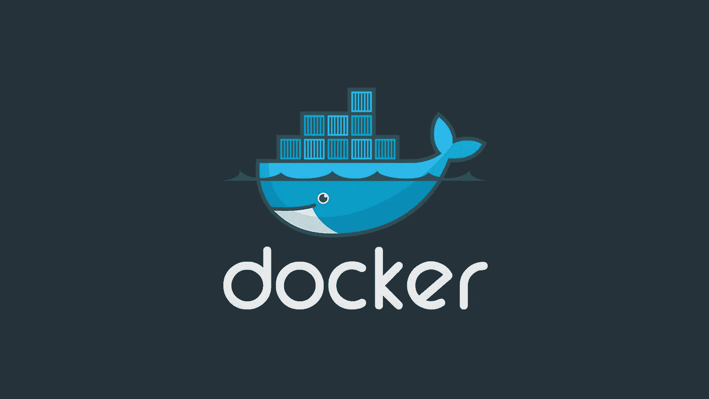

除了 embedded，很难找到一家软件公司不利用 Docker 作为他们的容器解决方案。如果是一家专注于网络的公司，那就更难了。出现这种情况有一个很好的原因，它让开发者/SRE/DevOps 工程师的生活变得更加容易。

早期可能面临的问题是“它在我的机器上工作”这样的事情。简而言之，当部署到生产环境或另一个开发人员的机器上时，它的行为可能与预期的不同，因此会遇到问题。现在，当使用 Docker 时，我们可以很容易地说“它在每台机器上都以相同的方式工作”。这真的很好，我们现在可以确定我们以前没有的交付成果，这样我们就可以交付一个好的产品，特别是在生产中。

来自维基百科:

> **Docker** 是一套平台即服务(PaaS)产品，使用操作系统级虚拟化来交付名为*容器*的软件包中的软件。这项服务有免费和高级两个等级。托管这些容器的软件被称为 **Docker 引擎**。它于 2013 年首次启动，由 Docker，Inc .开发。

这是 Docker 架构及其工作原理:

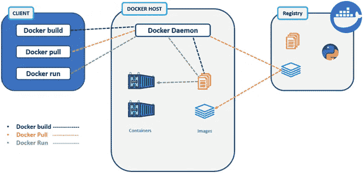

在本教程中，你需要了解 Spring Boot 和格雷德尔是如何工作的，以便理解一些构建过程。

# 提取 Docker 图像并运行容器

所以从客户端(你的操作系统)，你运行命令到你的计算机上运行的 **Docker 守护进程**。您可以从**映像**中设置**容器**，创建映像，创建**卷**，创建**网络**等等。当我们运行如下命令时:

```
docker run -e POSTGRES_PASSWORD=password -d postgres
```

这是尝试运行一个包含名为 **postgres** 的图像的容器。我们添加了一个环境变量 **POSTGRES_PASSWORD** 及其值，因此 PostgreSQL 将使用它作为默认用户 **postgres** 。Docker 然后尝试在本地找到它，如果没有，它将尝试从配置的注册表(默认 Docker Hub)中提取映像。然后它试图启动它，我们得到它被分配的容器 ID 的完整散列值。因此，当我们运行 **docker ps** 时，我们会在这里获得以下相关信息:

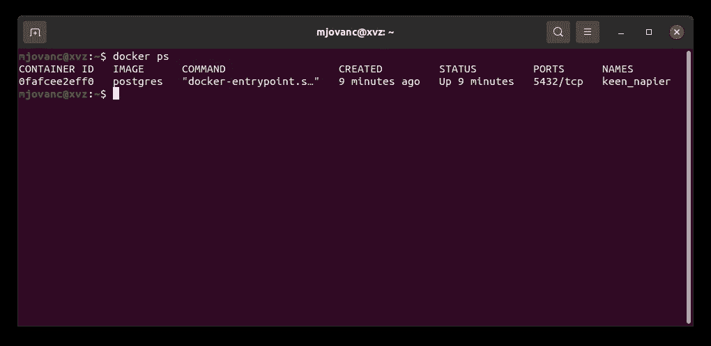

docker ps

在这里，我们获得了唯一的容器 ID、我们正在使用的映像、传递给容器的命令、容器的创建时间、当前状态(是启动还是退出)、它正在侦听的端口以及协议和分配的名称。如果我们愿意，我们可以更改名称，这就是我们使用 Docker 的方式，我们只需要稍微更改我们之前的命令:

```
docker run --name mydb -e POSTGRES_PASSWORD=password -d postgres
```

但是在再次运行该命令之前，我们需要删除现有的容器，因为它将在同一个端口上侦听两次。我们首先必须停止所有正在运行的容器:

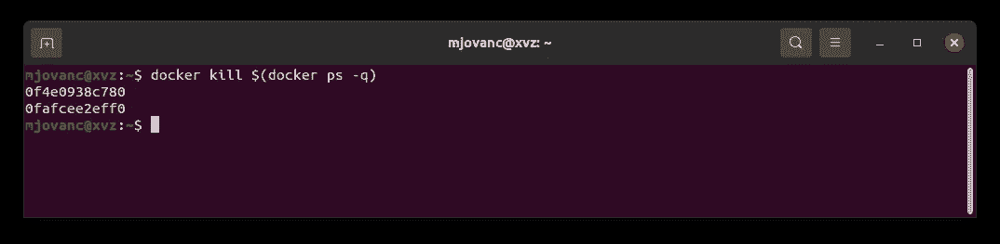

docker kill $(docker ps -q)

然后，我们用两种不同的方式进行清理(也许还有更多我不知道的方式)。我们可以像这样做一次彻底的清理:

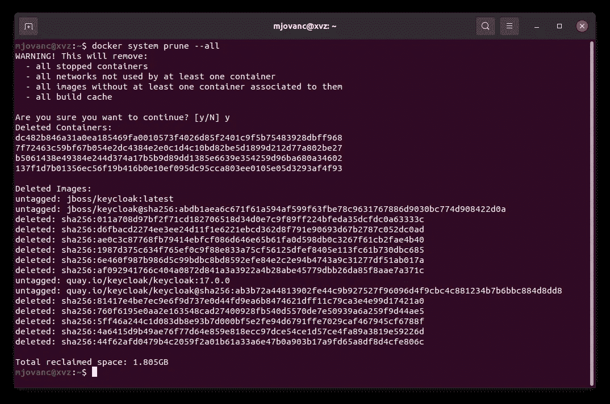

docker 系统清理-全部

你必须意识到这移除了所有的东西。所以大部分时候用这个*不是个好办法。但如果你觉得自己一直在做很多事情，只想从头开始，这个不错。*

*在大多数情况下，还有另一个更好的选择。我们运行这些命令:*

*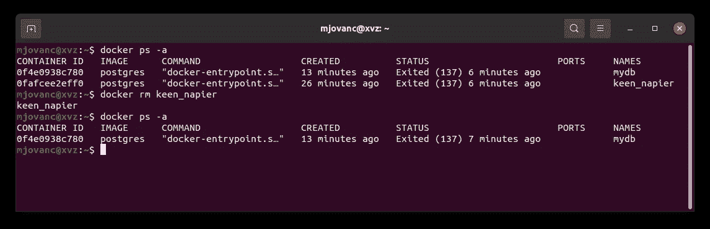*

*码头工人 rm<container name=""></container>*

*因此，我们只需使用命令 **docker rm** 及其容器**名称**，或者您也可以将**容器 ID** 用于该命令。因此，您可以看到，我们在这里删除了 **keen_napier** ，我们只有新的容器。由于我们停止了所有集装箱，我们必须开始新的集装箱，我们可以通过以下方式做到这一点:*

*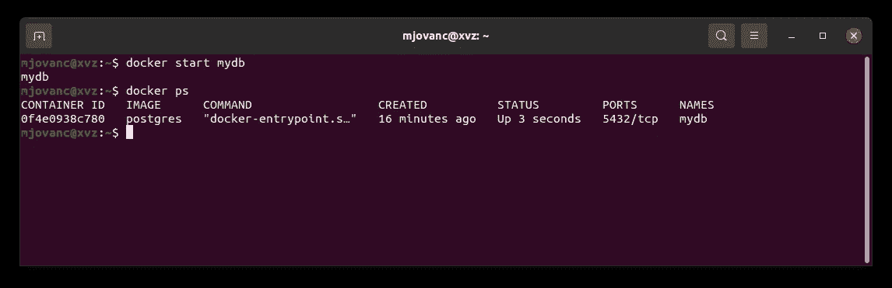*

*docker 启动 mydb*

*所以在这里用 **docker start** 命令再次启动它是非常容易的。*

*现在我们有一个 Docker 容器启动并运行。关于 Docker，我们可以在这里讨论很多东西，但是我们将坚持基本的东西。当我们运行该命令在 Docker 容器中设置 PostgreSQL 时，它会自动为我们添加一个**卷**。当我们需要写一些东西时，卷是必不可少的，这对于数据库来说是至关重要的。Docker 不允许在容器中写入，所以我们总是需要给它附加一个卷。我们将很快介绍如何创建我们自己的 docker 映像，但让我们探索如何在我们的计算机上查看 Docker 卷:*

*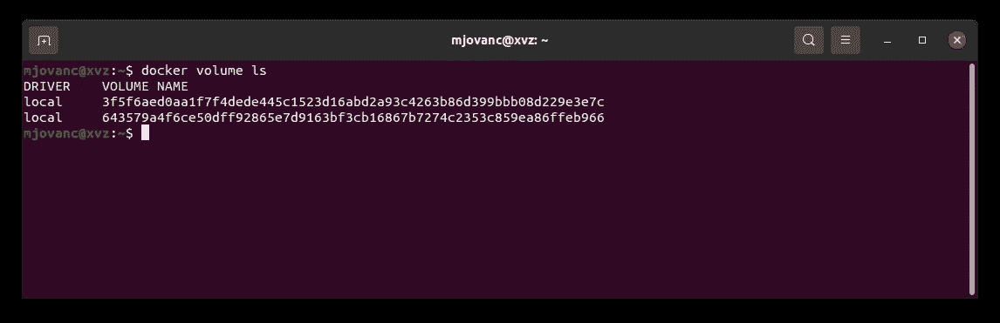*

*docker 卷 ls*

*我们列出了目前拥有的所有卷。我们有两个，因为我们没有删除最后一个。那么，我们如何知道哪一个连接到当前正在运行的那个呢？我们可以通过检查当前的 Docker 容器来做到这一点:*

*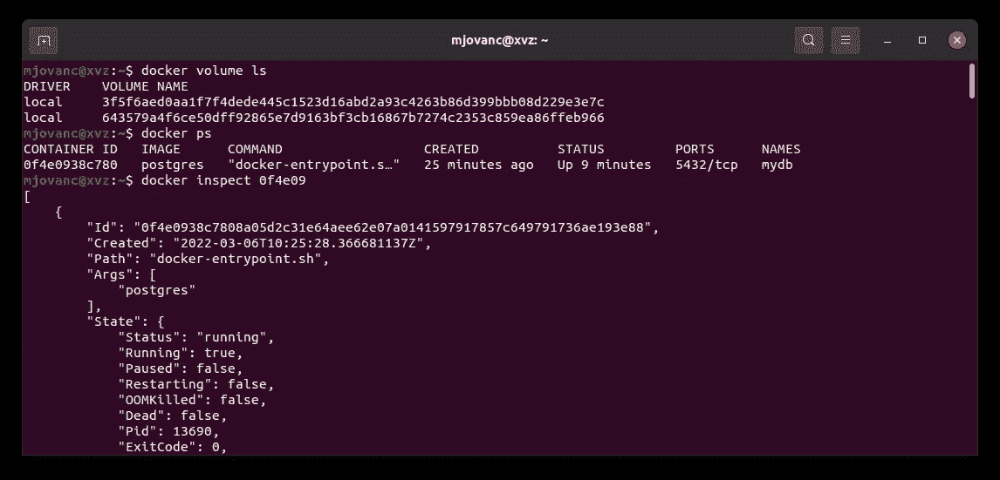*

*码头工人检查<container id=""></container>*

*在这里我们看到了很多关于它的信息，这对故障排除非常有用。*

*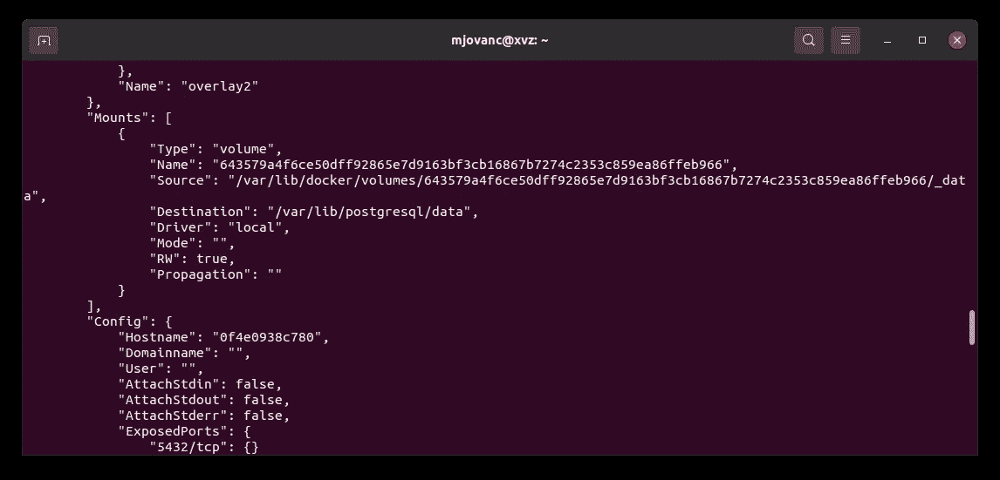*

*我们向下滚动一点，我们可以找到 **Mounts** 数组，我们可以看到卷哈希值，并将其与我们在之前的映像 643579 a4 F6 ce 50 dff 92865 e7d 9163 BF 3c b 16867 b 7274 c 2353 c 859 ea 86 ffeb 96 中看到的值进行比较。这是我们需要保留的卷，让我们删除另一个卷，因为我们不再需要它:*

*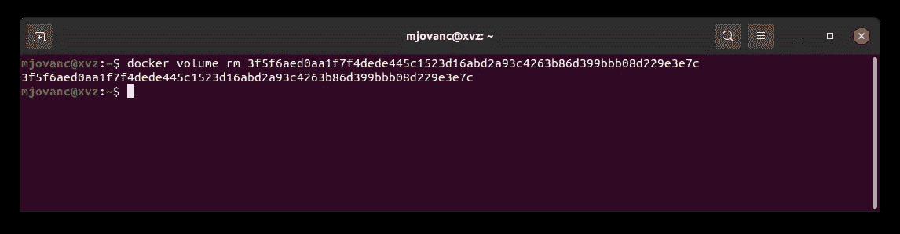*

*docker 卷 rm*

*我们在这里得到一个确认，返回的哈希值表明它已经被删除。太好了！*

# *使用 Docker 文件创建 Docker 映像*

*现在让我们看看如何通过创建 Docker 文件来创建我们自己的自定义 Docker 映像。因为我们已经通过 Spring Boot 之前，我们可以尝试使我们的 Spring Boot 申请到一个码头形象。克隆下储存库:[https://github.com/mjovanc/medium-docker-spring](https://github.com/mjovanc/medium-docker-spring)*

*现在让我们下载所有的依赖项并构建应用程序，我建议使用 IntelliJ。打开项目，然后 IntelliJ 会通过查看 **build.gradle** 文件直接自动下载所有东西。然后我们需要通过运行**来构建它。/Gradle build**或在 IntelliJ 中按下右侧边栏上的 grad le 并双击 build:*

*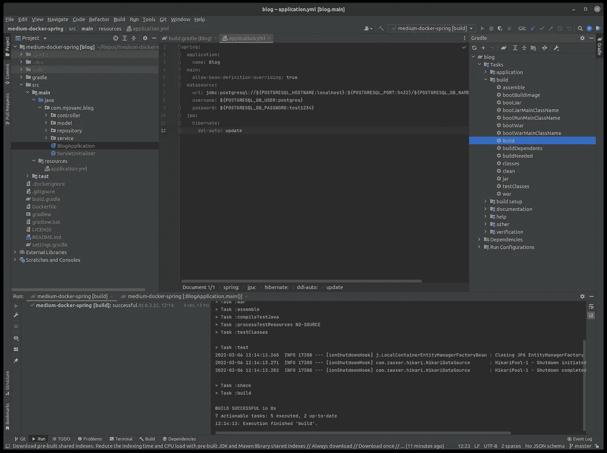*

*因此，当我们完成这些后，我们将获得一个**。war** 文件在**里面。/build/libs/blog-0.0.1.war** 。这是必需的，这样我们就可以用 Dockerfile 获取这个文件，并将其添加到图像中。因此，让我们在项目的根目录下创建 Dockerfile 文件:*

```
**# Using Tomcat 9.0 since the latest doesn't work with Spring Boot* FROM tomcat:9.0-jdk16-openjdk
ARG WAR_FILE=build/libs/blog-*.war
RUN rm -rf /usr/local/tomcat/webapps/*
COPY ${WAR_FILE} /usr/local/tomcat/webapps/ROOT.war
EXPOSE 8080
CMD ["catalina.sh", "run"]*
```

*这是 docker 文件的必要代码。我们首先使用一个现有的图像**Tomcat:9.0-JDK 16-open JDK**，然后我们根据需要修改它。我们设定了一个论点。war 文件存在，那么我们删除所有**。警告存在的**/usr/local/Tomcat/web apps**中的**文件，然后我们复制那个**。我们已经创建了 war** 文件，并将它放在删除所有**文件相同目录中。war** 文件，这样 Tomcat 就可以使用那个文件，然后我们将容器暴露给端口 **8080** ，这样就可以在我们的主机操作系统上的 Docker 容器之外访问它，然后运行 shell 脚本 **catalina.sh** ，并带有参数 **run** 。*

*现在代码已经就绪，我们需要构建图像:*

*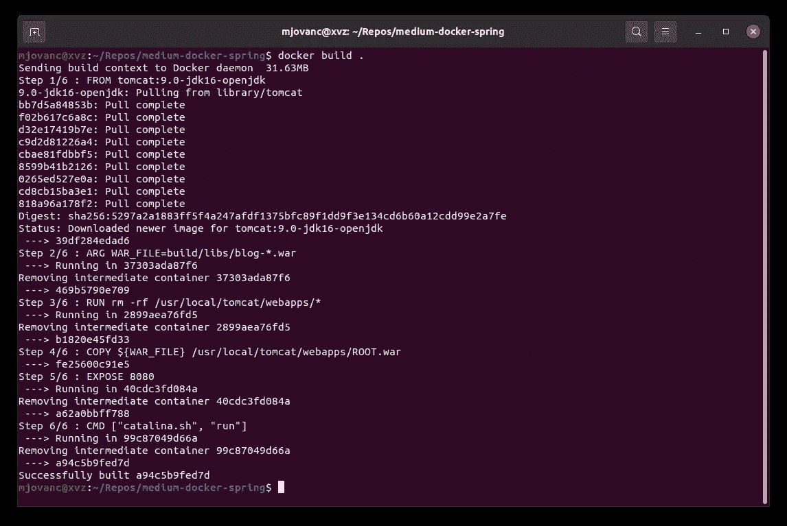*

*码头工人建造。*

*我们还可以构建映像并对其进行标记，这样我们就可以通过运行以下命令来获得它的名称和版本:*

*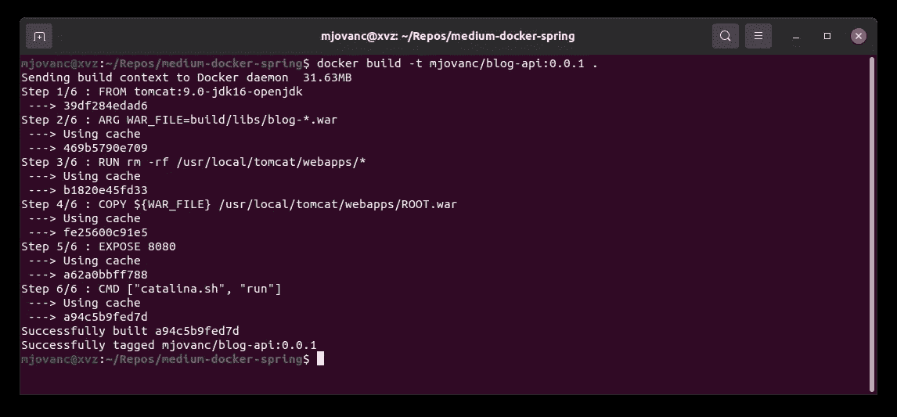*

*docker build-t mjovanc/blog-API:0 . 0 . 1。*

*我们已经成功地建立了我们的第一个码头工人形象。现在我们只需要启动它。由于我们已经在 **application.yml** 中为我们的环境变量设置了回退值，我们不需要在本地启动容器时传递它们:*

```
*docker run --name blog-api mjovanc/blog-api:0.0.1*
```

*现在容器已经启动并运行了！这是一个如何创建和运行 Docker 容器的非常基本的例子。*

# *使用 Docker Compose 进行编排*

*现在我们将研究如何使用 Docker Compose 来设置 PostgreSQL 和 Spring Boot。*

> *Compose 是一个定义和运行多容器 Docker 应用程序的工具。使用 Compose，您可以使用 YAML 文件来配置应用程序的服务。然后，只需一个命令，您就可以从您的配置中创建并启动所有服务。*

*在这里阅读更多关于 Docker Compose 的内容:[https://docs.docker.com/compose/](https://docs.docker.com/compose/)*

*这将使事情变得简单一点，因为我们可以用 **YAML** 文件格式配置一切。让我们看看这个 Docker 合成文件:*

```
*version: '3.7'

services:
  spring:
    build: .
    container_name: blog-api
    environment:
      POSTGRESQL_HOSTNAME: postgres
      POSTGRESQL_PORT: 5432
      POSTGRESQL_DB_NAME: qryptic_dev
      POSTGRESQL_DB_USER: postgres
      POSTGRESQL_DB_PASSWORD: test1234
      KEYCLOAK_HOSTNAME: keycloak
      KEYCLOAK_PORT: 11111
      *# This below is optional if you need to specify a specific Spring Boot profile to use
      # JAVA_OPTS: '-Dspring.profiles.active=dev'* ports:
      - "8080:8080"
    links:
      - postgres
      - keycloak
    depends_on:
      - postgres
    networks:
      - blog-net

  postgres:
    image: postgres
    container_name: postgres
    restart: always
    environment:
      POSTGRES_DB: qryptic_dev
      POSTGRES_USER: postgres
      POSTGRES_PASSWORD: test1234
    volumes:
      - postgres:/data/postgres
    ports:
      - "5432:5432"
    networks:
      - blog-net

  keycloak:
    image: jboss/keycloak
    container_name: keycloak
    restart: always
    environment:
      DB_VENDOR: h2
      KEYCLOAK_USER: admin
      KEYCLOAK_PASSWORD: password
      PROXY_ADDRESS_FORWARDING: "true"
    volumes:
      - keycloak:/var/lib/keycloak/data
      - ./keycloak/realm-export.json:/opt/jboss/keycloak/realm-export.json
    expose:
      - 11111
    ports:
      - "11111:11111"
    command:
      - "-b 0.0.0.0"
      - "-Djboss.http.port=11111"
      - "-Dkeycloak.import=/opt/jboss/keycloak/realm-export.json"
    networks:
      - blog-net

volumes:
  postgres:
  keycloak:

networks:
  blog-net:
    driver: bridge*
```

*这些东西有很多东西我们需要打开和经历。很明显我们这里有一种叫做钥匙槽的东西。这只是为了演示我们如何在这里添加更多的东西。但是对于本教程，我将注释掉*键盘锁*，因为我们不会在这里使用它。但是如果你需要设置 Keycloak，这里有一个我个人用过的很好的例子。*

*因此，让我们深入研究一下 **docker-compose.yml** 文件中的第一行:*

```
*version: '3.7'*
```

*这指定了我们将使用的 Docker Compose 的版本，不同版本之间的语法可能会有所不同。在这里查看它的文档:[https://docs . docker . com/compose/compose-file/compose-versioning/](https://docs.docker.com/compose/compose-file/compose-versioning/)*

```
*services:
  spring:
    build: .
    container_name: blog-api
    environment:
      POSTGRESQL_HOSTNAME: postgres
      POSTGRESQL_PORT: 5432
      POSTGRESQL_DB_NAME: blogdb_dev
      POSTGRESQL_DB_USER: postgres
      POSTGRESQL_DB_PASSWORD: test1234
      KEYCLOAK_HOSTNAME: keycloak
      KEYCLOAK_PORT: 11111
      *# This below is optional if you need to specify a specific Spring Boot profile to use
      # JAVA_OPTS: '-Dspring.profiles.active=dev'* ports:
      - "8080:8080"
    links:
      - postgres
      - keycloak
    depends_on:
      - postgres
    networks:
      - blog-net*
```

*在这里，我们定义应该编排哪种服务。我们将 spring 定义为一个服务，并将路径添加到 Dockerfile，我们将其设置为**。**(**docker-compose . yml**文件所在的当前目录)。然后我们设置容器的名称，如果我们不设置，它会将名称设置为服务名(spring)，然后我们定义我们需要的所有环境变量。我们还设置内部和外部应该使用什么端口来公开。我们在这里设置了到 postgres 和 keycloak 服务的链接，并且我们还为 postgres 服务设置了一个 depends_on，这意味着在我们启动 Spring Boot 之前，我们首先需要编排 PostgreSQL 数据库，以便它在启动应用程序时不会失败，并且我们定义了它应该连接到的网络。我们将所有服务都设置为具有此网络，以便它们可以相互通信。*

```
*postgres:
  image: postgres
  container_name: postgres
  restart: always
  environment:
    POSTGRES_DB: blogdb_dev
    POSTGRES_USER: postgres
    POSTGRES_PASSWORD: test1234
  volumes:
    - postgres:/data/postgres
  ports:
    - "5432:5432"
  networks:
    - blog-net*
```

*这里我们做同样的事情，但是定义 PostgreSQL 配置。我们指定将从 Docker Hub 注册表中下载(如果尚未下载)的映像。我们将重启设置为 always，设置一些环境变量来定义应该创建什么数据库以及我们将使用什么用户，并设置密码。我们还为容器定义了卷，这样我们就可以存储保存到数据库中的数据，像以前一样使用 PostgreSQL 的默认端口号存储端口，并将其设置为与 spring 服务相同的网络。*

```
*keycloak:
  image: jboss/keycloak
  container_name: keycloak
  restart: always
  environment:
    DB_VENDOR: h2
    KEYCLOAK_USER: admin
    KEYCLOAK_PASSWORD: password
    PROXY_ADDRESS_FORWARDING: "true"
  volumes:
    - keycloak:/var/lib/keycloak/data
    - ./keycloak/realm-export.json:/opt/jboss/keycloak/realm-export.json
  expose:
    - 11111
  ports:
    - "11111:11111"
  command:
    - "-b 0.0.0.0"
    - "-Djboss.http.port=11111"
    - "-Dkeycloak.import=/opt/jboss/keycloak/realm-export.json"
  networks:
    - blog-net*
```

*这里我们定义了要使用的 keycloak 服务。请注意，我们为 realm-export.json 添加了一个卷，我们附加了该文件，这样我们就可以将该文件导入到 Keycloak 中，而不必手动将配置添加到 Keycloak 服务中。我们有一个添加文件来进行导入的命令。此外，我们还将发送给 Keycloak，我们将使用另一个端口，而不是标准的 8080，因为 Spring Boot 运行在端口 8080 上。*

```
*volumes:
  postgres:
  keycloak:

networks:
  blog-net:
    driver: bridge*
```

*在这里，我们定义应该存在的卷和具有网桥类型的驱动程序类型的网络。*

*这是一个如何用 Docker Compose 设置 Spring Boot、PostgreSQL 和 Keycloak 的例子。但是我们暂时不考虑 Keycloak，所以我会注释掉关于 Keycloak 的所有内容，这样我们现在就可以测试运行了。但是首先让我们通过运行以下命令删除之前添加到 Docker 中的所有内容:*

```
*docker kill $(docker ps -q)
docker system prune --all*
```

*我们现在有了这个更新的 **docker-compose.yml** 文件:*

```
*version: '3.7'

services:
  spring:
    build: .
    container_name: blog-api
    environment:
      POSTGRESQL_HOSTNAME: postgres
      POSTGRESQL_PORT: 5432
      POSTGRESQL_DB_NAME: qryptic_dev
      POSTGRESQL_DB_USER: postgres
      POSTGRESQL_DB_PASSWORD: test1234
      *# KEYCLOAK_HOSTNAME: keycloak
      # KEYCLOAK_PORT: 11111
      # This below is optional if you need to specify a specific Spring Boot profile to use
      # JAVA_OPTS: '-Dspring.profiles.active=dev'* ports:
      - "8080:8080"
    links:
      - postgres
      *# - keycloak* depends_on:
      - postgres
    networks:
      - blog-net

  postgres:
    image: postgres
    container_name: postgres
    restart: always
    environment:
      POSTGRES_DB: qryptic_dev
      POSTGRES_USER: postgres
      POSTGRES_PASSWORD: test1234
    volumes:
      - postgres:/data/postgres
    ports:
      - "5432:5432"
    networks:
      - blog-net

*#  keycloak:
#    image: jboss/keycloak
#    container_name: keycloak
#    restart: always
#    environment:
#      DB_VENDOR: h2
#      KEYCLOAK_USER: admin
#      KEYCLOAK_PASSWORD: password
#      PROXY_ADDRESS_FORWARDING: "true"
#    volumes:
#      - keycloak:/var/lib/keycloak/data
#      - ./keycloak/realm-export.json:/opt/jboss/keycloak/realm-export.json
#    expose:
#      - 11111
#    ports:
#      - "11111:11111"
#    command:
#      - "-b 0.0.0.0"
#      - "-Djboss.http.port=11111"
#      - "-Dkeycloak.import=/opt/jboss/keycloak/realm-export.json"
#    networks:
#      - blog-net* volumes:
  postgres:
  *# keycloak:* networks:
  blog-net:
    driver: bridge*
```

*现在让我们运行 Docker Compose:*

```
*docker-compose up*
```

*我们还可以设置标志 **-d** ，这样我们就不会在运行应用程序时得到所有的实时控制台输出:*

```
*docker-compose up -d*
```

*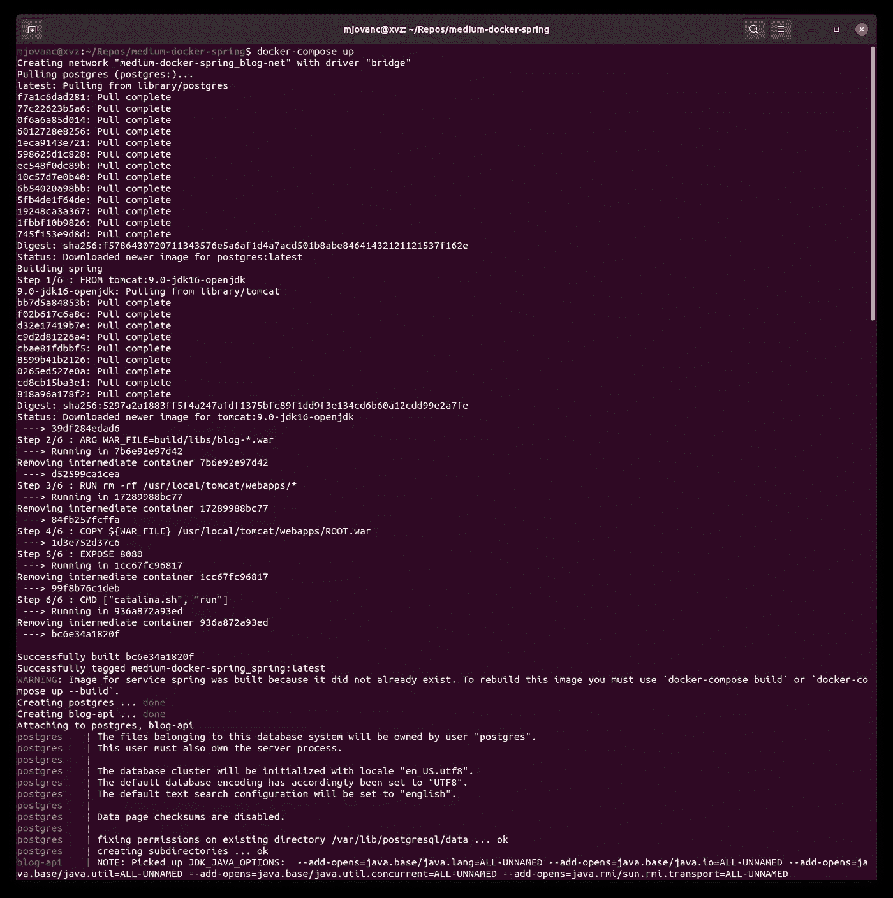*

*docker-排版*

*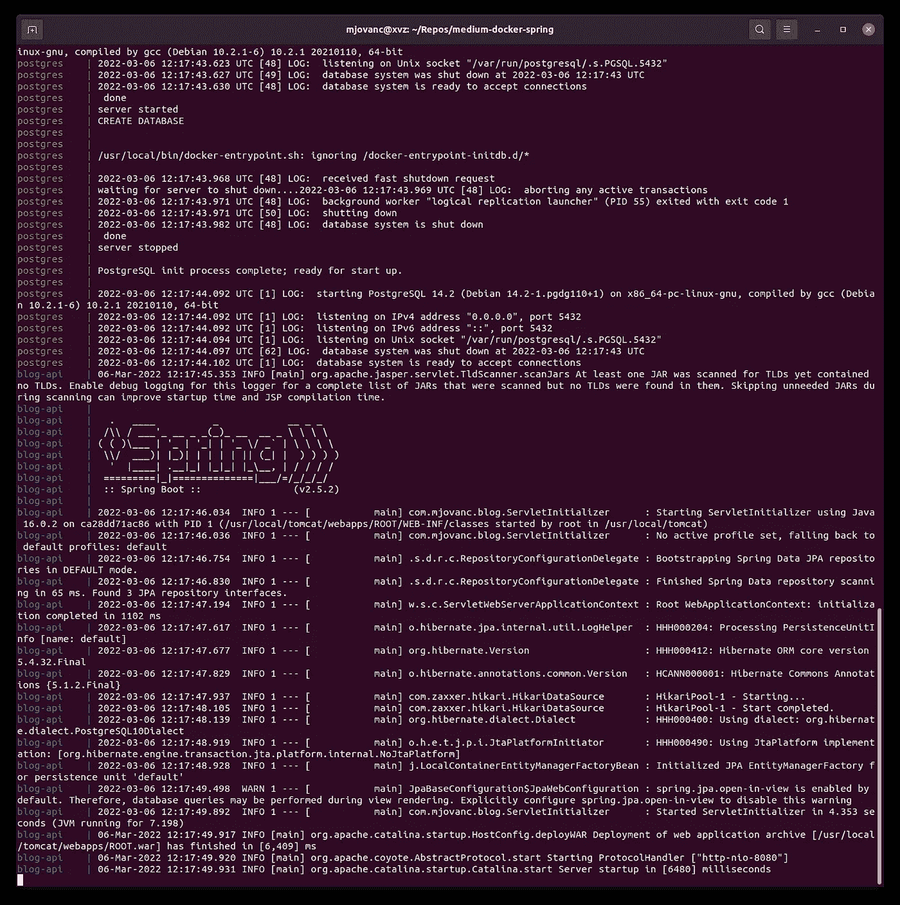*

*我们现在可以看到 Spring 已经启动，PostgreSQL*

*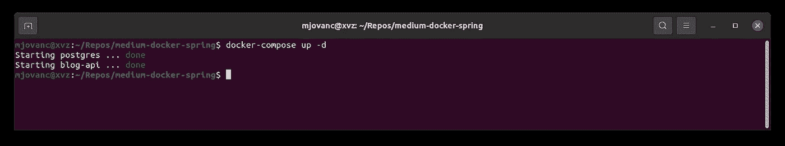*

*使用 docker-compose up -d 时*

*要停止 Docker 编写，我们可以按 CTRL+C。然后我们还可以删除由以下用户创建的网络:*

```
*docker-compose down*
```

*如果使用 **-d** 标志，我们也可以通过运行上面的命令来停止编排。*

*如果我们要重建所有映像，如果我们做了一些更改，我们可以运行以下命令:*

```
*docker-compose up --build*
```

*这将强制重建所有映像。*

*就我个人而言，当我开发一个 Spring Boot 应用程序时，使用 Docker Compose 来设置 Spring Boot 周围的一切非常好，比如 PostgreSQL 和 Keycloak，甚至可能是一个带有 Angular 或 React 的前端框架。但有时我想省去 Spring Boot，因为重新构建项目以生成一个. war 文件，然后再次运行 docker compose 等会花费很多时间。*

*因此，如果您和我一样，想在开发时省去 Spring Boot，您可以运行这个命令来跳过编排 Spring Boot:*

```
*docker-compose up --scale blog-api=0*
```

*这用起来非常方便。将 spring 作为 Docker Compose 中的一项服务仍然很好，因为我可以克隆存储库，然后运行 docker-compose up，一切都为我编排好了，这样我就可以最大限度地减少在本地设置项目以进行测试等工作的时间。*

*我觉得了解 Docker 让我在开发中更有效率，因为我不必浪费时间手动设置系统和开发环境。*

*我们可以用 Docker 和 Docker Compose 做很多其他的事情，但是我现在就说到这里，也许在接下来的教程中，我可以更深入地研究一些可能发生的问题以及如何解决它们。*

*我希望你觉得这个教程很有用，如果有任何问题，请在这里留言，或者关注我的下一个教程。干杯！*