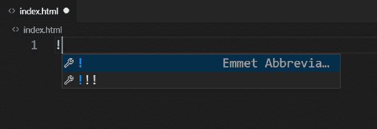
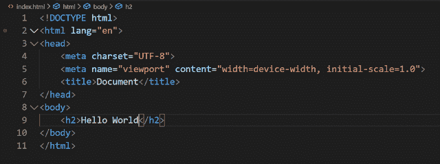
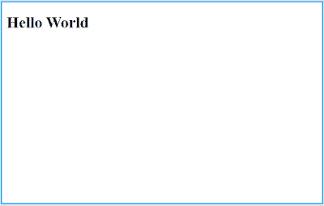
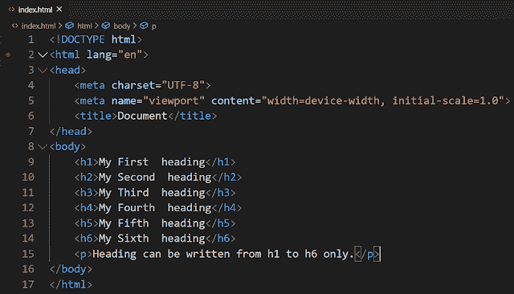
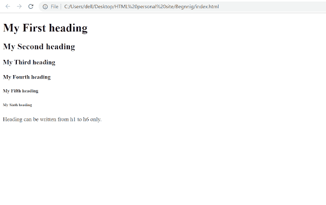

# 3 分钟学会基本 HTML！

> 原文：<https://blog.devgenius.io/get-started-with-html-13dc1a0472a4?source=collection_archive---------13----------------------->

## 每个人都应该知道的基本语言之一。它是 Web 开发的根本。


[Icons8 团队](https://unsplash.com/@icons8?utm_source=medium&utm_medium=referral)在 [Unsplash](https://unsplash.com?utm_source=medium&utm_medium=referral) 上的照片

HTML 代表超文本标记语言。它用于向网站添加内容。你在特定网站上看到的信息仅仅是因为 HTML。您可以在 Visual Studio、Sublime Text、Atom 等 IDE 中运行 HTML 代码。

IDE(集成开发环境)是一种软件，你可以在其中运行你所有的代码。集成开发环境有助于运行 HTML、CSS、JavaScript、Python 等。

要编写 HTML 代码，你必须在你的设备上(在电脑或笔记本电脑上)用你想要的名字创建一个文件夹。现在在其中创建一个扩展名为`.html`的文件，比如`index.html`。

您也可以在 IDE 中创建这些文件。在您喜欢的任何 IDE 中打开此文件夹。在其中打开文件“index.html”。

现在到了关键的部分，你必须写 HTML 样板文件。

**那么什么是 HTML 样板文件:**

只有在 HTML 的格式之后，IDE 才能理解 HTML。这是一个预先编写的代码，称为 HTML 样板。它主要由头部和身体部分组成。在 head 中，您可以添加元标签、标题和链接。正文是您可以向网页添加内容的部分。它描述了网页的结构。

IDE 中有 HTML 样板文件的快捷方式，通过这些快捷方式可以获得 HTML 样板文件格式，如可视化代码类型

```
! 
```

然后会出现这样一个对话框



你会看到 Emmet 缩写。输入它，样板代码将被添加到您的 index.html 中。

现在我们将在其中运行 Hello World。

因此，在主体部分的样板文件之后，应该这样写



就是这样。保存它，然后您可以通过转到设备上文件夹所在的路径来查看它。点击它= >双击 index.html，就这样。您可以在默认设置的任何浏览器中查看 Hello World。



这里

标签用于标题。基本上在 HTML 中有 h1 到 h6 元素用于标题。h1 比 h2 大，这种情况一直持续到 h6，即 h1>h2>h3>h4>h5>h6。

现在来看看简单的 HTML 示例:



**本程序说明:**

元素是一个 HTML 页面的根元素。然后是头和身体。在头部，首先有一个用于响应式网站和 SEO 的 meta 标签。从电脑、笔记本电脑到各种类型的手机，所有设备都能正确浏览响应式网站。SEO 代表搜索引擎优化，主要用于在互联网上对他们的网站进行排名。

在主体中，您可以编写必须在网页上显示的代码。下面的代码显示了标题从 h1 到 h6 的高度，

用于在网页中添加段落。

HTML 处理预定义的元素，这些元素有开始和结束标签，例如<opening tag="">T3，如</opening>

标题只能从 h1 写到 h6

这里

是开始标签

是结束标签。

这只是一个介绍。学习 HTML 有各种各样的课程。可以访问 w3school 或者 mdn 了解更多。

# **结论:**

即使你对 HTML 一无所知，也很容易在一天内学会 HTML 基础知识。