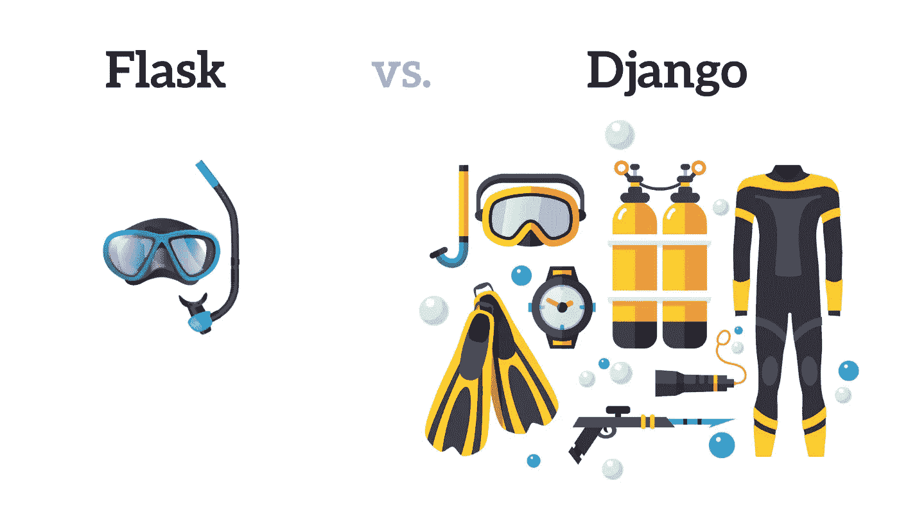
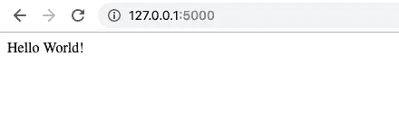
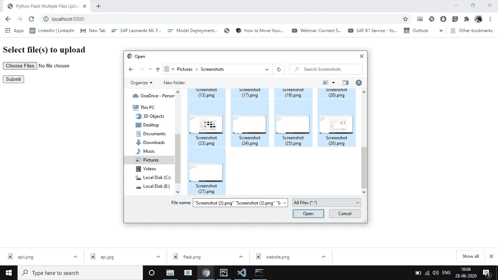
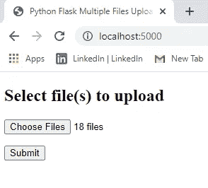
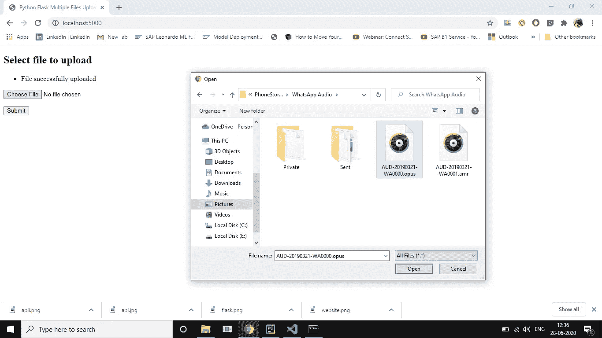
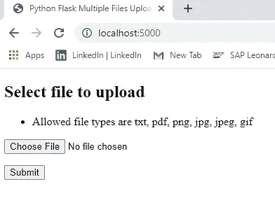

# 使用烧瓶开始上传多个文件

> 原文：<https://blog.devgenius.io/get-started-with-multiple-files-upload-using-flask-e8a2f5402e20?source=collection_archive---------1----------------------->

烧瓶多个文件上传

使用 Flask API 和 Python 上传多个文件的简单指南。。。,


[尼克·费斯](https://unsplash.com/@jannerboy62?utm_source=medium&utm_medium=referral)在[号航天飞机](https://unsplash.com?utm_source=medium&utm_medium=referral)上拍摄的照片

# 为什么选择本教程？

在看到许多人写关于“初学者的瓶子”教程的博客后。我注意到，只有少数博客提到了“烧瓶文件上传”。所以，我对写“烧瓶文件上传”产生了兴趣。我相信这个博客会引导你建立文件上传，让你变得简单。。。,

在我之前的博客中，提到了“使用 python 上传单个文件”

[](https://medium.com/@ngbala6/a-simple-way-to-build-flask-file-upload-1ccb9462bc2c) [## 构建烧瓶文件上传的简单方法！！！

### 烧瓶文件上传

medium.com](https://medium.com/@ngbala6/a-simple-way-to-build-flask-file-upload-1ccb9462bc2c) 

现在我们将学习“如何使用烧瓶发送多个数据文件”。。。,

# 为什么是烧瓶？

Django 诉 Flask 是另一场由来已久的辩论。让我们深入探讨一下这个问题，虽然人们说 Flask 很简单，很容易上手，而 Django 对于构建 web 应用程序来说很繁重，但还有另一个重要的原因说明为什么您应该选择 Flask 而不是 Django。



向量通过@ [pch-vector](https://www.freepik.com/pch-vector) @ [象似性估计](https://www.freepik.com/iconicbestiary)

烧瓶就像浮潜，而姜戈是水肺潜水。烧瓶轻而易举，而 Django 能够让您进入更深的水域。

> Flask 是一个广泛使用的**微网络框架**，用于在 Python 中创建 API。这是一个简单而强大的网络框架，旨在快速简单地开始，并能够扩展到复杂的应用程序。
> 
> 姜戈的标签是,**完美主义者的网络框架，有期限。**因为一切都是内置的，所以您不需要为创建文件和思考如何构建应用程序而烦恼。一切都准备好了，您可以立即开始构建您的应用程序( [Prax](https://dev.to/benprax/flask-vs-django-1l4k) )。

这真的取决于你在做什么，但是如果你正在构建一个简单的应用程序，想想 Flask

从[文件](https://flask.palletsprojects.com/en/1.1.x/foreword/)，

> *“微”并不意味着你的整个网络应用程序必须放入一个 Python 文件中(尽管它当然可以)，也不意味着 Flask 缺乏功能。微框架中的“微”意味着 Flask 旨在保持内核简单但可扩展。*


# 要求和安装

1.  当然，我们需要 Python 3.5 或以上版本。但是为什么呢？？看到这个
2.  安装烧瓶

```
pip install flask
```

# 简单的烧瓶应用程序

*这一步是给初学者的，如果你知道烧瓶的基本知识，跳过这一步。。。，*

要运行的简单 Flask 应用程序。。,

```
# app.pyfrom flask import Flask           # import flask
app = Flask(__name__)             # create an app instance@app.route("/")                   # at the end point /
def hello():                      # call method hello
    return "Hello World!"         # which returns "hello world"if __name__ == "__main__":               # on running python app.py
    app.run(host='0.0.0.0',port = 5000)   # run the flask app
```

通过运行“python app.py”来运行应用程序。进入浏览器，输入“http://localhost:5000”，你会看到“Hello World！”程序正在运行。



# 开始上传多个文件

文件上传是将二进制文件或普通文件传输到服务器的过程。Flask 方便我们轻松上传文件。

服务器端 flask 脚本使用 request.files[]对象从请求对象获取文件。成功上传文件后，它会保存到服务器上的所需位置。

在这里，我们将上传多个“PNG”文件，并将它们存储在一个特定的文件夹中。

你可以上传任何文件，并按照你的意愿存储它。。。,

你也可以用它把文件从一个系统转移到另一个系统。。。,

> 创建一个名为“multiplefilesupload.py”的文件

1.  ***导入库***

```
**import** os      # For File Manipulations like get paths, rename**from** flask **import** Flask, flash, request, redirect, render_template
**from** werkzeug.utils **import** secure_filename
```

***2。创建一个实例并检查扩展*和**

```
app=Flask(__name__)app.secret_key = **"secret key" # for encrypting the session**#It will allow below 16MB contents only, you can change it
app.config[**'MAX_CONTENT_LENGTH'**] = 16 * 1024 * 1024path = os.getcwd()
*# file Upload* UPLOAD_FOLDER = os.path.join(path, **'uploads'**)*# Make directory if "uploads" folder not exists* **if not** os.path.isdir(UPLOAD_FOLDER):
    os.mkdir(UPLOAD_FOLDER)app.config[**'UPLOAD_FOLDER'**] = UPLOAD_FOLDERALLOWED_EXTENSIONS = set([**'txt'**, **'pdf'**, **'png'**, **'jpg'**, **'jpeg'**, **'gif'**])**def** allowed_file(filename):
    **return '.' in** filename **and** filename.rsplit(**'.'**, 1)[1].lower() **in** ALLOWED_EXTENSIONS
```

***3。App 路由和应用运行***

```
@app.route(**'/'**)
**def** upload_form():
    **return** render_template(**'upload.html'**)

@app.route(**'/'**, methods=[**'POST'**])
**def** upload_file():
    **if** request.method == **'POST'**:

        **if 'files[]' not in** request.files:
            flash(**'No file part'**)
            **return** redirect(request.url)

        files = request.files.getlist(**'files[]'**)

        **for** file **in** files:
            **if** file **and** allowed_file(file.filename):
                filename = secure_filename(file.filename)
                file.save(os.path.join(app.config[**'UPLOAD_FOLDER'**], filename))

        flash(**'File(s) successfully uploaded'**)
        **return** redirect(**'/'**)

**if** __name__ == **"__main__"**:
    app.run(host=**'127.0.0.1'**,port=5000,debug=**False**,threaded=**True**)
```

***4。模板创建***

创建一个名为“templates”的文件夹，并在“templates”文件夹中创建一个文件“upload.html”。

**upload.html**

```
<!doctype html><title>Python Flask Multiple Files Upload Example</title><h2>Select file(s) to upload</h2><p><ul class=flashes><li>{{ message }}</li></ul></p><form method="post" action="/" enctype="multipart/form-data"><dl><p><input type="file" name="files[]" multiple="true" autocomplete="off" required></p></dl><p><input type="submit" value="Submit"></p></form>
```

# 介意挥挥手吗？？？这是完整的代码

> **multiple files upload . py**

> ***upload.html***

# 运行应用程序

通过运行“python multiplefilesupload.py”来运行应用程序。进入浏览器，输入“http://localhost:5000”，你会在浏览器中看到“上传文件”。



烧瓶多文件上传



输出的烧瓶多个文件上传到“上传”文件夹



*如果我上传不同的文件而不是* ***txt、pdf、png、jpg、jpeg、gif*** *类型的扩展名。该文件将不被接受。。，*



允许的文件内容

完整的代码被上传到下面的 GitHub 库

[](https://github.com/ngbala6/Flask-Uploadfiles.git) [## ngbala 6/Flask-上传文件

### 使用 Flask 上传文件。在 GitHub 上创建一个帐户，为 ngbala6/Flask-Uploadfiles 的开发做出贡献。

github.com](https://github.com/ngbala6/Flask-Uploadfiles.git) 

***单个文件上传使用烧瓶！！！结账***

[](https://medium.com/@ngbala6/a-simple-way-to-build-flask-file-upload-1ccb9462bc2c) [## 建立 Flask 文件上传的简单方法！！！

### 烧瓶文件上传

medium.com](https://medium.com/@ngbala6/a-simple-way-to-build-flask-file-upload-1ccb9462bc2c) 

*你喜欢你读到的东西吗？*

***按住*** *的“拍手”按钮，保持共享*


谢谢，

巴拉穆鲁甘