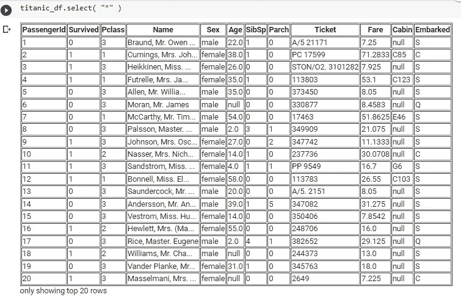

# 4 分钟内开始使用 PySpark 和 Google Colab 笔记本

> 原文：<https://blog.devgenius.io/get-started-with-pyspark-and-google-colab-notebook-in-4-minutes-94b4e2cecad7?source=collection_archive---------7----------------------->


PySpark 与 CoLab

**Apache Spark 一定是为大数据爱好者准备的。**它是一个开源的处理引擎，在单节点机器或集群上处理数据。在本文中，您将在 Spark 上运行您的第一个 Python 程序。了解更多关于 Spark SQL & DataFrame 基础知识。

> "告诉我，我会忘记；教我，我会记住；让我参与，我会学习."
> ――本杰明·富兰克林

我喜欢这句话，所以我邀请你参与进来，试着和我一起一步一步地编写你的代码。

**阿帕奇 Spark 和 PySpark 有什么区别？**

Apache Spark 是用 Scala 编程语言编写的，PySpark 是 Spark 的 python API。

PySpark SQL 是一个 PySpark 库，用于对结构化或半结构化数据进行类似 SQL 的分析。我们也可以通过 PySparkSQL 使用 SQL 查询。

在本文中，我们将学习更多关于 PySpark 和 PySpark SQL 的知识

## 先决条件:

*   从[这里](https://colab.research.google.com/)使用 google Colab 来运行你的代码。
*   从[这里](https://www.kaggle.com/competitions/titanic/data?select=train.csv)下载本教程使用的“trian.csv”数据，上传到 Colab 笔记本。

**如何加载 CSV 文件:**

使用“spark.read”函数非常简单。这个函数的输出将是一个数据帧。

*   第一个参数:文件路径
*   第二个参数:如果你的文件中有一个头文件，那么头文件的值为“True ”,而“False”。
*   如果" **inferSchema = False"** 所有数据都将以字符串数据类型加载，要知道编写" **inferSchema = True "的好处是什么。**尝试用 False 打印出数据类型，再用 True 打印一次，并比较结果。

```
titanic_df=spark.read.csv("/content/train.csv",header=True,inferSchema=True)
```

显示数据框以确保数据以正确的方式加载。

```
titanic_df #to display dataframe
```


泰坦尼克号数据框

使用 Limit 函数限制显示的记录数。

```
titanic_df.limit(5) #this will display the first 5 records
```


仅显示 5 条记录

## PySpark SQL:

SQL 函数内置于 PySpark 中，因此有另一种方法通过使用 select SQL 函数将数据显示为表格。

选择" * "意味着我们要显示所有列

```
titanic_df.select("*")
```



使用选择功能显示数据

要显示特定的列，请在 select 函数中传递列名，如下所示。

```
titanic_df.select("PassengerId","Survived").limit(5)
```


选择 PassengerId 和幸存列

**如何过滤掉一些数据:**

我们需要分析数据，并从中得出一些见解。比如有多少人的年龄大于 25，女性，在这种情况下，我们需要学会如何过滤掉。这对于分析非常重要。

我们将像在 SQL 中一样使用 where

```
titanic_df.where((titanic_df.Age > 25)& (titanic_df.Sex=="female")).limit(5)
```


如何过滤掉

**如何汇总数据:**

如果我们想通过特定的列进行聚合和分组，比如 Pclass。

这里我们得到了按等级分组的平均票价

```
titanic_df.groupBy("Pclass").agg({"Fare":"avg"})
```


使用聚集和分组依据

**如何创建新的临时视图:**

如果我们想要创建一个新的临时视图并在其上加载数据框

```
titanic_df.createOrReplaceTempView("Titanic")
```

Spark 的一个很好的特性是，我们可以通过使用 Spark.sql 来使用 SQL 语法

```
spark.sql("select * from titanic")
```


使用 spark.sql 选择语句

我希望你喜欢阅读这篇文章，并发现它内容丰富，随时添加你的评论、想法或反馈，不要忘记在 [LinkedIn](https://www.linkedin.com/in/ansam-yousry-34b32b116/) 上取得联系或关注我的媒体账户以保持更新。

**你喜欢这篇文章吗？别忘了点击“关注”按钮，你可能也会喜欢:**

[](/nano-degree-program-for-data-engineering-does-it-worth-getting-f7efd6c678f7) [## 数据工程纳米学位项目——值得获得吗？

### 我注册了数据工程的纳米学位，在这篇文章中，我将与你分享我的观点和更多…

blog.devgenius.io](/nano-degree-program-for-data-engineering-does-it-worth-getting-f7efd6c678f7) [](/airflow-from-zero-and-how-to-install-airflow-in-docker-fb5c4a0f992b) [## 气流从零开始以及如何在 Docker 中安装气流

### 气流教程以及如何在 Docker 中安装气流

blog.devgenius.io](/airflow-from-zero-and-how-to-install-airflow-in-docker-fb5c4a0f992b) 

*还不是中等会员？* [*现在注册*](https://medium.com/@ansam.yousry/membership) *只需 5 美元，就可以无限制地访问中观世界！*