# 免费在 Obsidian.md 上启用同步！

> 原文：<https://blog.devgenius.io/get-sync-enabled-on-obsidian-md-for-free-b59977e53676?source=collection_archive---------2----------------------->

# 好吧，标题不是我要给你们看的，抱歉。但是结果是*有点*一样的。

对于那些不知道的人来说，Obsidian 是一个基于 markdown 文件的笔记 app。也就是说，你可以像这样做优美的笔记:

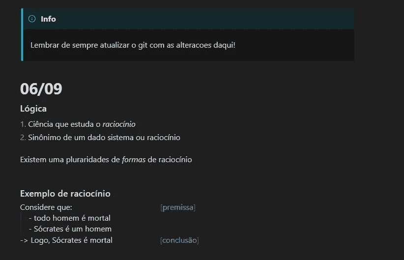

而且是免费使用！

但是如果你想让你的手机应用和电脑应用保持同步，那么你需要支付[同步](https://obsidian.md/sync) …

不要误解我的意思，**我并不是说如果你能买就不应该买，但是作为一个生活在货币贬值国家的人，用美元买东西对我的大学生钱包来说有点太贵了。**

让我们退一步，用他们自己的话来理解什么是 Sync:


黑曜石网站截图

“第二大脑”是他们的口号

好吧，所以同步是…嗯…同步。每月 10 美元或每年 96 美元。按照今天的价格(2022 年 9 月)，每月 50 多雷亚尔或每年 495 多雷亚尔，远远超过了我为方便在手机和电脑上保存笔记而支付的费用。

但是，作为一名计算机科学本科生，我一直在寻找让技术为我工作的方法，而不是相反，并寻找让我的生活更轻松的工具。因此，让我们从他们的主页开始，更深入地看看黑曜石为我们提供了什么

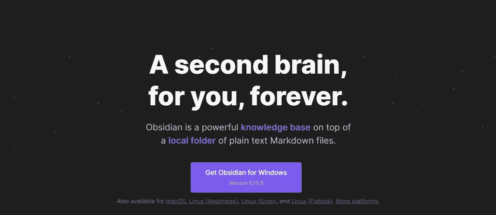

obsidian.md 主页截图

嗯……好的，它提到了*本地文件夹*，这意味着你创建的所有东西都存储在你的本地设备中，你可以直接访问它们。md(。md 是降价文件的文件扩展名)。

首先想到的是:如果我在我的电脑上创建了一个保险库，并在那里做了一些笔记，然后我将文件复制到我的手机上，每次我做出更改(在电脑上或手机上)时，我都将这个更新的文件复制到另一个设备上，会怎么样？那应该可以，*但是好像很麻烦*。

如果我有另一个工具可以让这变得更容易，会怎么样？

…

如果你学的是编程相关的东西，相信你对此已经有答案了。

# 这就是饭桶来解救我们的地方！

对于那些不熟悉的人来说，git 是一个版本控制系统，这意味着它是一个控制版本的系统(duh ),这意味着它可以帮助我们完成"*将更新的文件复制到其他设备"*这一部分，这将是一个很大的工作量。

此外，由于它是一个版本控制系统，它会跟踪更改，让您可以轻松地回到旧版本，这将检查同步的另一个框:

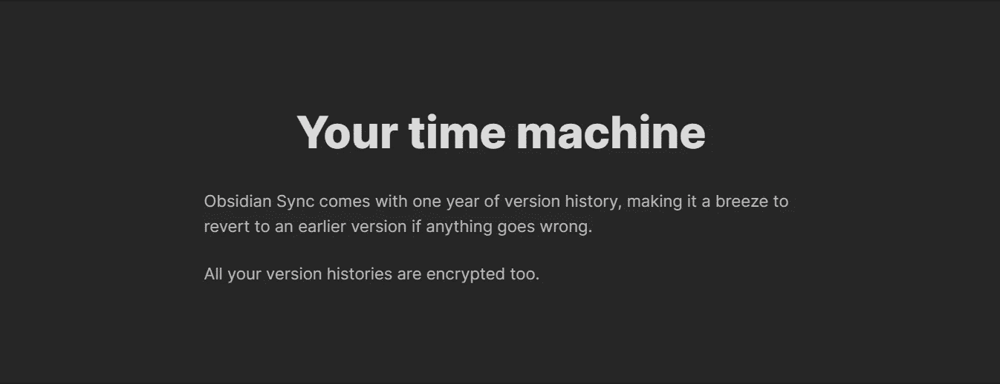

obsidian.md 网站上 Sync 页面的截图

所以，这个时候，我们手里的东西就是一个问题(“我想拥有和拥有 Sync 一样的额外津贴，但我负担不起”)也是一个解决方案假设(“如果我能在电脑和手机上使用 git，我就能让它们保持同步”)。让我们开始研究那个假设吧！

# 创建 github 帐户

Github 是一个使用 git 的托管服务和版本控制，而且是免费的！我们将使用 Github 作为黑曜石的个人“云”(也许是我们的个人同步？)

前往[https://github.com/signup](https://github.com/signup)创建您的帐户


注册页面

当你在那个帐号上设置好之后，是时候创建你的私有存储库了，它是一个私有文件夹。


*既然你已经在 github 上了，* [*跟着我去那里*](https://github.com/felipecampossantos) *怎么样？*

回到创建您的私有存储库:

1.  在主屏幕上，点击右上角的+符号，然后点击*新建存储库*，或者转到[https://github.com/new](https://github.com/new)
2.  给你的存储库起一个名字，比如*黑曜石-文件*
3.  将您的存储库设置为私有的，这样只有您可以访问它
4.  并单击页面末尾的“创建存储库”。

现在您有了自己的存储库，您应该会看到这个屏幕

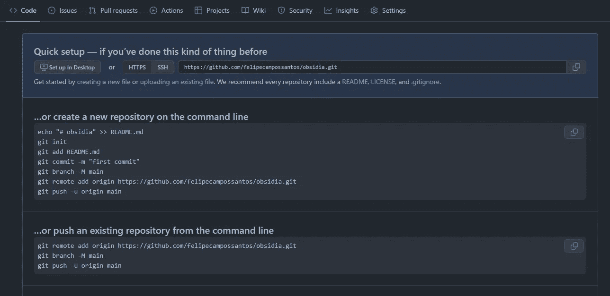

在 github 上创建新存储库后的第一页

在这里，我们已经有了一些我们将要采取的后续步骤，但是让我们耐心等待。

# 下载 git

前往[https://git-scm.com/downloads](https://git-scm.com/downloads)为你的操作系统下载 git。

遵循屏幕上的说明。

这将让我们通过命令行更新我们的*个人同步*(我们的私人存储库)上的文件。

现在，如果您从未在您的计算机上处理过命令行，请不要走开！这很容易，我向你保证！我们将在几行中讨论这个问题。

# 我们的个人同步

为了便于您理解我们的目的，假设您有一台计算机(设备 1)和一部电话(设备 2)，并且您想在同一文档中记录这两者。

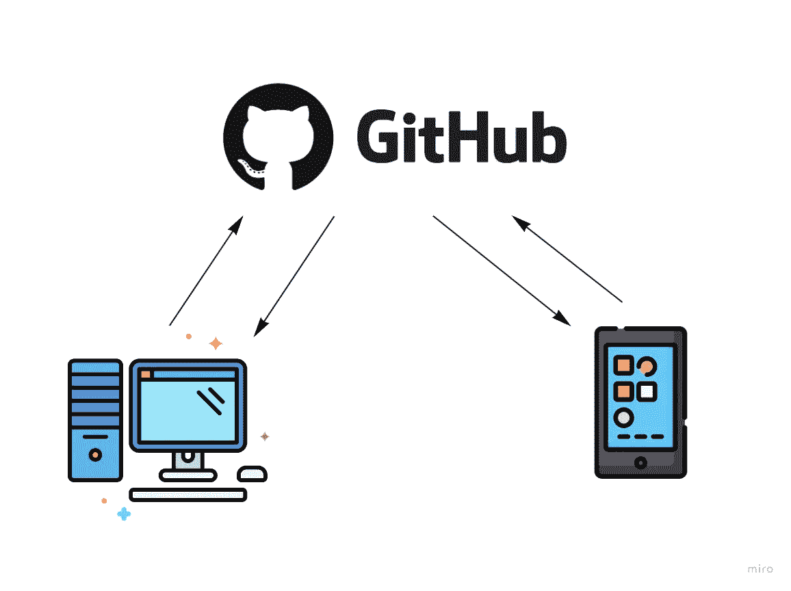

我们要做的是:

1.  对*设备 1* 上的文档进行更新
2.  把我们对那个文件的更新上传到 github
3.  在*设备 2* 上提取更新文件

*在头脑中记住* ***推*** *和* ***拉***

# *创建你当地的黑曜石金库*

*选择一个位置在你的电脑上保存你的黑曜石文件。*

*假设您选择将这些文件保存在您的用户下的文件夹 Documents 中*

*c:\用户\<your user="">\文档</your>*

*创建一个文件夹来组织这些文档，假设您将其命名为 ObsidianFiles*

*c:\ Users \ fecam \ Documents**\ ObsidianFiles***

*现在你已经为你的金库定义了一个位置，让我们指向黑曜石来观察这个文件夹。打开你的黑曜石应用程序，在初始屏幕上(如果这是你第一次打开应用程序)，你会看到一个*打开文件夹作为保险库*选项。选择那个*

*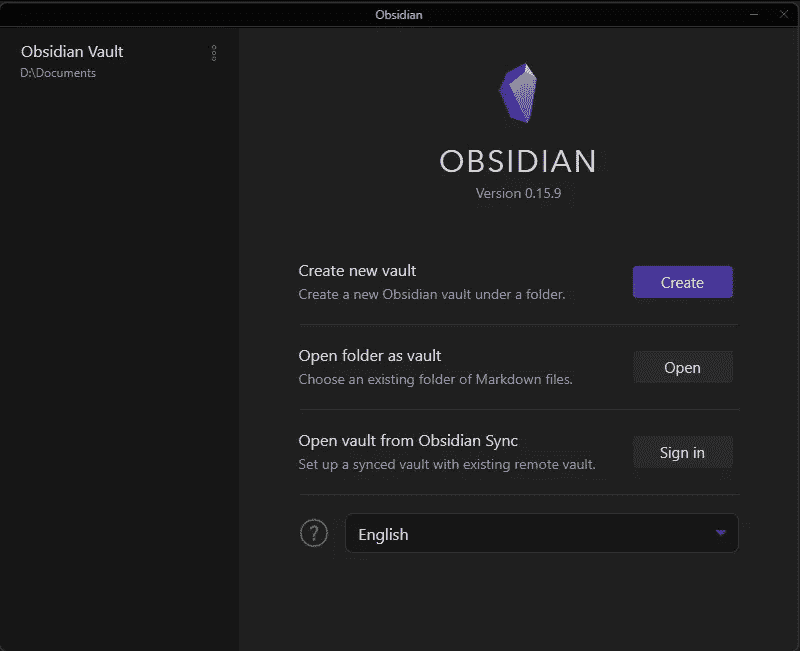*

*然后，导航到上面创建的文件夹，点击*选择文件夹。**

*完成，现在你的黑曜石应用程序正在观察文件夹，我们将使用这些推拉动作连接到我们的个人同步。为了能够执行这些操作，我们将*

# *在 te 命令行中使用 git*

*第一步是将您的本地存储库连接到我们上面创建的存储库。*

*我们需要做的是访问终端上的新文件夹。为此，您可以右键单击该文件夹上的任何空白区域，然后单击“在终端中打开”选项。*

*如果没有显示，打开你的终端应用程序，使用命令 *cd* (代表*更改目录*)导航到文件夹。*

*例如，假设您的终端在您的用户文件夹中打开，那么您已经在*

```
*C:\Users\<your user>\*
```

*你唯一需要做的就是进入*

```
*cd Documents\ObisidianFiles*
```

*在终端中，您将已经在正确的文件夹中。*

*因此，我们现在要做的是将这个文件夹连接到我们创建的私有存储库。为此，您可以遵循创建后屏幕上给出的说明。*

*基本上，在终端输入:*

```
*git init*
```

*您应该在终端上的… 消息中看到一个*初始化的空 Git 存储库**

*之后，进入*

```
*git remote add origin <link to your repository>*
```

**在您创建完存储库之后，该页面中会给出指向您的存储库的链接。**

*这将使您的本地文件夹连接到云上的存储库。*

*现在，输入这个命令序列，一个接一个。我会在之后解释它们:*

```
*git add .
git commit -m "first commit to my personal Sync!"
git branch -M main
git push -u origin main*
```

*好吧，让我们来分解一下:*

*   **git 添加。* →向您添加该文件夹中所有新的和/或更新的文件的“更新包”。末尾的点是命令的一部分，它选择所有更改的文件*
*   **git commit -m "…"* → commit 表示您正在“关闭”更新包，它现在已经准备好上传到云存储库了*
*   **git branch -M main* →这给出了你的更新树上的主分支的名称(我不会给出这个的细节，没有必要)。基本上，它命名了当前对 *main* 所做的更改*
*   **git push -u origin main →* 将更新包推送到云仓库。*

*搞定了。现在，如果你刷新你的 github 存储库页面，你至少应该看到一个*。奥比斯典*文件夹。这意味着它成功了！我们现在在 github 上设置了个人金库。*

*但是我们还没有完成，因为我们还需要在我们的手机上设置这个，对吗？*

*现在，事情可能会变得有点复杂…但是我相信你！请跟我来:*

# *在 android 手机上设置 git*

*首先，我们需要一个像手机终端一样工作的应用程序。我推荐 [termux](https://termux.dev/en/) ！*

*在你选择的浏览器上，在搜索栏上寻找 *termux* ，进入他们的网站(termux.dev)并点击*在 F-DROID* 上获得它或者点击[这个链接](https://f-droid.org/repo/com.termux_118.apk)下载安装文件*

*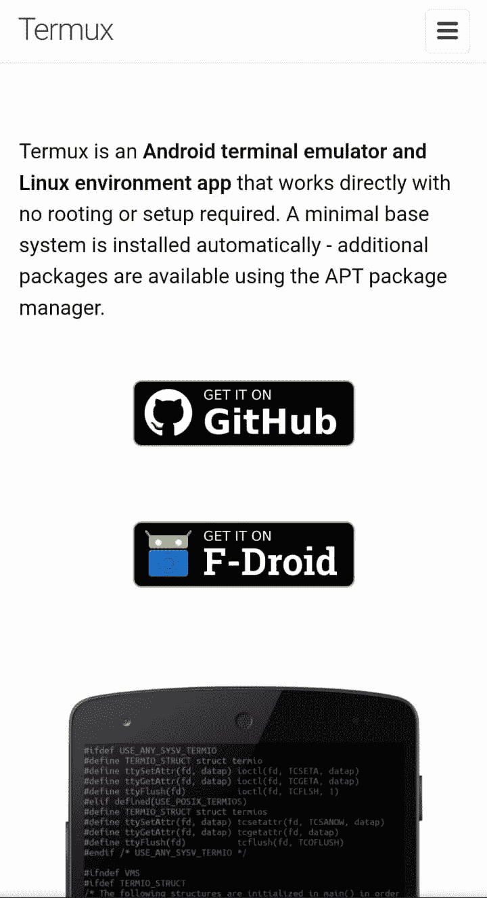*

*现在安装应用程序。它可能会要求您启用从未知来源安装，继续并启用它。*

*打开 termux 应用程序并输入*

```
*pkg install git*
```

*并等待它在您的 termux 应用程序上安装 git 客户端。*

*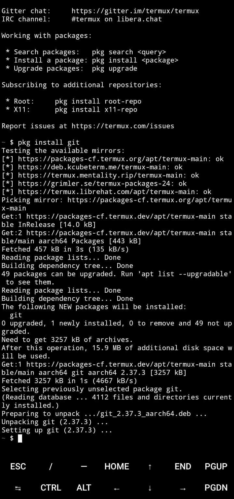*

*要测试它是否工作，请输入*

```
*git -h*
```

*这将显示大量帮助文本。这意味着它正在工作，恭喜！*

*现在，我们需要做的是通过 termux 应用程序访问我们的本地存储，这样我们就可以执行相同的过程，将 obsidian 指向与我们的存储库相连的文件夹。*

*奔跑*

```
*termux-setup-storage*
```

*在 app 上。这将提示一条消息，询问您是否允许 termux 访问您的存储器。点击*允许。**

*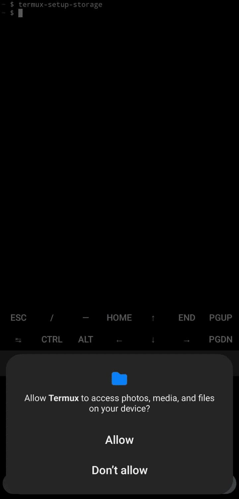*

*现在，termux 可以访问您的存储，让我们在您的手机存储创建一个黑曜石保险库文件夹。*

*仍然在 termux 上，输入以下命令:*

```
*cd storage
cd shared
cd Documents       #in here pay attentioon the the upper case D
mkdir obsidian
cd obsidian*
```

*所以，前三张 *cd* 就是你在手机中导航到你的文档文件夹。*

**mkdir* 是创建新文件夹的命令(创建目录)*

*然后，再一次，你进入那个文件夹。*

*现在，我们需要做的是将这个文件夹与私有存储库链接起来，就像我们在电脑上做的一样。*

*在此之前，我们需要在 github 帐户上创建一个个人密钥。这是因为在接下来的步骤中，github 会要求您输入密码，但是**这里要注意:当 github 说密码时，他们并不是指密码。***

*我知道，有点傻，但这是出于安全考虑！*

*我们应该这样做:*

*在你的电脑上，进入你的 github 账户，点击右上角的图片，然后选择设置*

*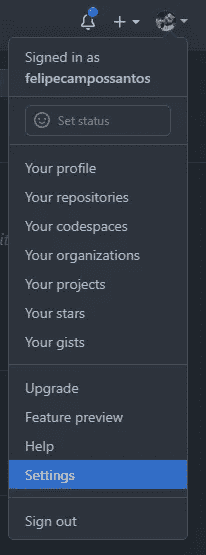*

*然后在您的设置页面上，向下滚动直到左侧菜单显示*开发者设置*选项并点击它，然后点击*个人访问令牌。**

*在此页面上，您将创建一个在 termux 上使用的个人访问令牌。点击*生成新令牌*，并在*注释*字段中，添加类似“termux 令牌”的内容或其他内容，让您知道该密钥正在 termux 中使用。*

*安全提示，不要把这把钥匙用在其他地方。这样，如果你丢失了你的手机，你可以只删除这一个令牌，是安全的。*

*到期时，选择*无到期**

*在*选择范围*选中所有复选框，并点击*生成令牌**

***再次，注意这里！***

*将生成的令牌复制到安全的地方！(以*GHP _*……)你就再也看不到了！！！保存。它。*

*现在，以某种方式把这个密钥发送到你的手机上(保存在 google keep 上，然后复制到你的手机上，诸如此类)*

# *回到特穆克斯*

*记住:我们在你为黑曜石创建的文件夹里*

*运行以下命令:*

```
*git init
git clone <link to your repository>
cd <repository name>*
```

*这里的不同之处在于，由于我们在存储库中已经有了文件，我们将把它克隆到手机上。*

*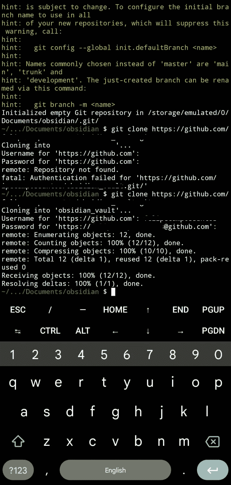*

*输入最后一个命令后，termux 会要求您输入用户名和密码。*

*在用户名中输入你在 github 上的普通用户名*

*在密码中，输入生成的个人密钥。(当您在 termux 要求输入密码后键入内容时，没有显示正在键入的内容是正常的)*

*这意味着它成功了！*

*现在，为了在每次更新文档时不需要这个令牌，请在 termux 中运行:*

```
*git config --global --add safe.directory/storage/emulated/0/Documents/<folder name>/<repository name>
git config --global credential.helper store
git pull*
```

*再次输入您的用户名和密码。现在，它不会再问了。但如果是这样，记住，你的密码不是你的密码！它就是那个令牌，所以一定要把它保存在安全的地方，这样你就不用再生成另一个令牌了。*

*现在我们在手机上也有了我们的知识库，让我们通过设置我们的黑曜石应用程序来结束。*

*在 play store 上下载黑曜石 app 并打开。*

*点击*打开文件夹作为金库**

*导航直到你进入你的存储库文件夹，点击*使用这个文件夹*，然后允许黑曜石访问这些文件*

*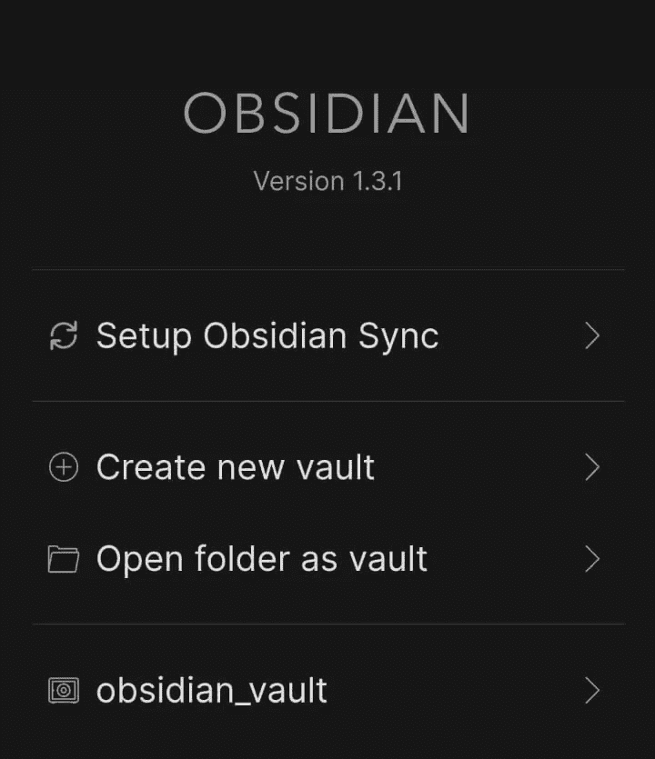*

# *测试它是否有效*

*现在你已经设置好了一切，让我们测试！*

*在你手机上的黑曜石应用程序，创建一个新的文件或编辑任何已经存在的文件。*

*现在，打开 termux 应用程序，再次导航到该文件夹。*

*一旦你到达那里，进入*

```
*git status*
```

*这将显示本地存储库中是否有任何修改过的文件或文件夹。它应该用红色显示您修改的文件的名称。*

*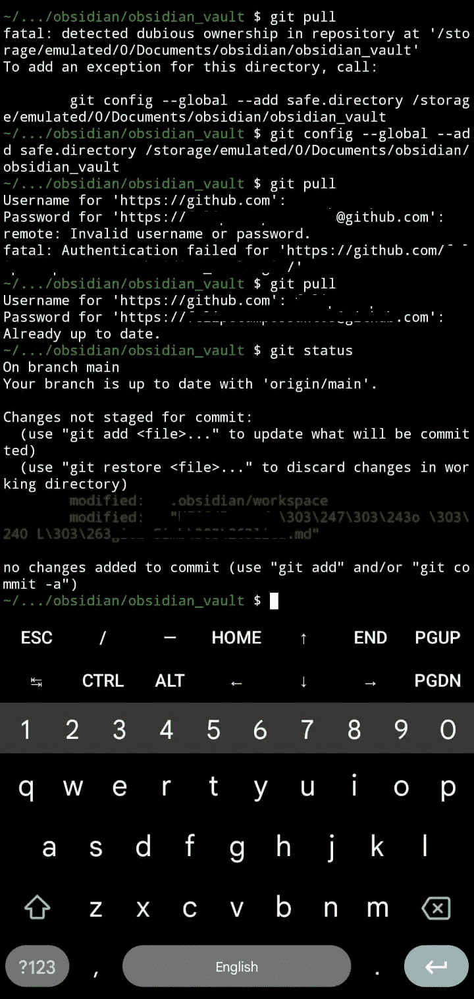*

*现在，进入*

```
*git add .
git commit -m "changes made via phone"*
```

*此时，您可能会收到一条 termux 消息，称*作者身份未知*。这是正常的，只要输入*

```
*git config --global user.email "your github email"
git config --global user.name "your name"*
```

*ps:不要去掉双引号*

*然后再次尝试 git 提交*

```
*git commit -m "changes made via phone"*
```

*如果它显示任何类似*

```
*... files changed, ...*
```

*这意味着它成功了。现在，让我们把这个更新推送到云端(我告诉过你要记住这个词)。*

*进入*

```
*git push*
```

*如果你没有收到任何错误信息，这意味着一切都是黄金！*

*现在，要在你的电脑上获得这些更新，打开我们之前使用的终端，导航到 obsidian 文件夹，输入*

```
*git pull*
```

*如果您收到一个要求您*的错误，请在合并之前提交或保存您的更改。那是正常的。有时候，即使打开一个文件，obsidian 也会更新。黑曜石文件夹。要解决这个问题，请输入**

```
*git reset --hard HEAD*
```

*还有*

```
*git pull*
```

*现在，如果你在电脑上打开你的黑曜石，你应该可以看到你的手机更新！*

*就是这样。*

***我知道设置可能有点复杂，但我相信节省这笔钱是值得的。***

> *再说一遍，如果你**能**支付得起，我鼓励你去做！这不仅会让你的生活变得更容易，而且你会奖励那些努力工作创造出这样一个**天才**工具的开发者！*

*PS:如果您将个人令牌保存在某个容易获得的地方，如您的电子邮件或 google keep，我建议您从那里删除它，并将其保存在某个更安全的地方。*

**这是我在 Medium 的第一个帖子！**

*如果你喜欢或者有一些反馈，请告诉我！*