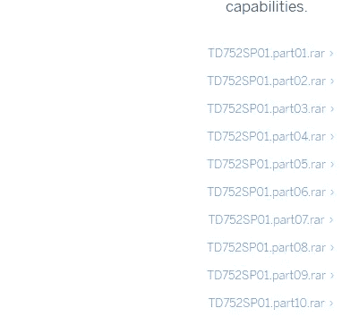

# 出于学习目的，启动并运行本地 SAP 系统。第一部分。

> 原文：<https://blog.devgenius.io/get-up-and-running-a-local-sap-system-for-learning-purposes-3a08d95a65c6?source=collection_archive---------12----------------------->

……没有在尝试中死去

S AP 系统主要不是为小型企业打造的，当然也不是为家庭使用的，但是有一个更小的版本， **SAP Business One (B1)** 版**，**专为中小型企业设计，但是你需要使用其中的任何一个。NET 或 Java 来定制或开发 SAP Business One 中的屏幕。B1 中没有 ABAP 工作台，因为它不是建立在 NetWeaver/ABAP 栈之上的。

如果你想学习 ABAP 编程，比如运行一个 SAP 本地系统，这是一个好主意。另一个选择是使用 AWS，当然，如果你有信用卡的话，我可以说，在完成练习后，让 SAP 实例在 AWS 上运行要快得多，但不是免费的。

## 硬件要求

*   基于 x86_64 处理器的硬件
*   至少 4 GB 内存和大约 8 GB 交换空间
*   大约 100 GB 的可用磁盘空间用于服务器安装
*   大约 2 GB 的可用磁盘空间用于客户端安装

## 软件要求

首先，我们需要虚拟化软件，我将使用 VirtualBox。

为你的操作系统下载虚拟盒子。

安装非常简单。

下一个，下一个，下一个

太好了！

## Linux 安装

该安装已经在 Fedora、Red Hat、Ubuntu、Debian 和 SUSE 中测试过，但理论上你可以有任何发行版，Red Hat 和 SUSE 是官方支持的发行版。

我们将下载 openssuse.org 发行版。

从 opensuse.org 下载 OpenSuse。

我准备装 Leap 版，DVD iso，大概 3.6GB 大小。一旦 SUSE 安装在你的本地机器上，我们就开始在 virtual box 上安装它，在这里你可以找到一个[视频教程](https://youtu.be/fp8mA9pR-HU)展示如何安装。

名为-sapon use 的新虚拟机。

选择安装并按回车键

## 下载 SAP 试用版 Netweaver 系统。

下载 SAP 试用系统可能会很棘手，因为 SAP 经常改变网站，尝试做这样的搜索。

[https://tools.hana.ondemand.com/#abap](https://tools.hana.ondemand.com/#abap)

所以看完博文，我们就能搞清楚 [SAP 下载页面](https://www.sap.com/developer/trials-downloads/additional-downloads/sap-netweaver-as-abap-developer-edition-sp01-7-52-15510.html)(可能链接快不行了)。不要怪我。

这 10 个压缩文件的总安装文件大小约为 13 GB。

下载这 10 个文件，目前可用的最新试用版是 SAP NetWeaver AS ABAP 开发者版 7.52 SP01。需要登录并接受条款。

一旦我们在本地系统中有了压缩文件，我们只需要解压缩第一个文件，其他的将自动解压缩。此外，我们需要通过共享文件夹访问这些文件，以便安装在 OpenSuse 虚拟箱中。

OK 文件准备好了

单击共享文件夹—新建共享文件夹

指向解压缩的 SAP 文件所在的文件夹。

到目前为止，一切顺利。现在，我们需要在安装 SAP Netweaver 之前进行一些设置，这当然取决于您的环境。

检查网络。如果尚未连接到，请连接到桥接适配器。

## 代理设置

如果你的公司使用代理**，**你必须为 **OpenSUSE** 配置代理，这有助于 **OpenSUSE** 能够连接到**互联网**。相反，如果你的公司不使用**代理**你可以跳过这一步。

## 检查磁盘空间

接下来，使用 **XTerm** 工具检查硬盘空间。

`df -h`

## /dev/sda2/

原始目录 **( / )** 至少需要 **33GB** 用于安装 **SAP 服务器**。上面的检查语句表明这个条件不满足。我没有足够的空间，所以我需要添加所需的资源。你可以在这里看到如何做[。](https://www.linuxtopia.org/online_books/opensuse_guides/opensuse11.1_reference_guide/sec_yast2_i_y2_part_expert.html)

# 安装 UUIDD 守护程序

**UUIDD** 提供了创建非重复字符串的方法，这是创建数据库密钥所必需的，以确保您的 **OpenSUSE** 虚拟机能够连接到**互联网**以便能够安装 **UUIDD** 。

完成 **UUIDD** 的安装后，重启你的 **OpenSUSE** 虚拟机。

# 安装 Nano 编辑器

在 YasT2 中搜索 nano。

GNU **nano** 是一个易于使用的命令行文本编辑器，我们将使用它来编辑一些配置文件。

最后但并非最不重要的一项家庭作业。

## 提取 SAP 安装文件

对于这一步，我们可以使用 7-zip。

7 拉链标志

**7-Zip** 是一个压缩比很高的文件归档器。是开源的，可以从 https://www.7-zip.org/下载。

## 到目前为止一切顺利。

好的。我们就快完成了，在下一篇文章中，我们将完成安装，分配权限，更改主机名，安装 GUI 客户端，并构建我们的第一个“Hello World”ABAP 程序。敬请关注。

亚历克斯

*   *SAP、SAP ABAP 和 Netweaver 是 SAP 注册的商标。*