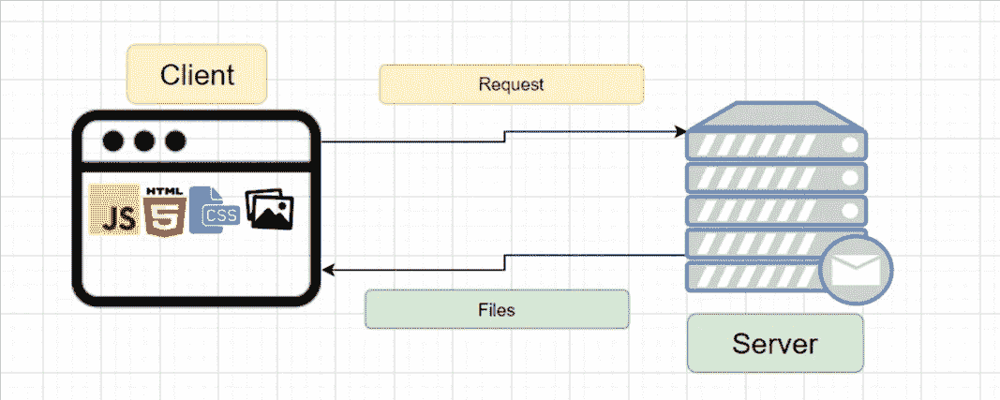

# 让你的代码最小化

> 原文：<https://blog.devgenius.io/get-your-code-minimized-b6eda365ab79?source=collection_archive---------17----------------------->

## 初学者指南

所有高级开发人员都知道的技能，初级开发人员也应该知道。


Kinng 最小化代码

作为一名 web 开发人员，网站性能始终是摆在桌面上的第一件事。如果网页加载时间超过两秒，人们会倾向于切换网页。提高网站性能的主要思想是使前端、传输和后端之间的桥梁尽可能平滑。为了解释这一点，我们来看下图。



客户端和服务器渲染

当我们输入一个 URL 链接时，大概就是这样。我们的浏览器将向服务器端发送一个请求，以获取该 URL 的文件。我们可以从三个主要部分来提高性能:前端、文件传输和后端。在前端部分，我们需要优化我们的代码，并创建一个渐进的网络应用程序。在后端，我们需要考虑 cdn、缓存、负载平衡、数据库扩展和 GZip 的使用。都是大题目，费时。

在这篇文章中，我想分享对文件传输的优化，因为它有时可以帮助你加快网站 80%以上的速度。在本文的剩余部分中，我们要做的两件事是最小化代码和最小化交付。

# 最小化代码

我们的代码基本上包含 HTML、CSS、JavaScript 和静态媒体文件。在最小化前三种类型的代码文件时，我们只是删除了空白以节省字节。机器不是人类，我们需要空间让我们分隔行和词，然而，机器不理解空白。因此，通过仅删除空白，我们可以压缩多达 50%的代码。当然，我们不打算手动删除空白。

在编码过程中，我相信你可能打开了“更漂亮”的扩展。事实上，我们有另一个叫做“丑陋”的扩展，它可以帮助我们删除所有不必要的空间。以下是一些非常适合这份工作的网站: [HTML](https://www.willpeavy.com/tools/minifier/) 、 [CSS](https://www.uglifycss.com/) 和 [JavaScript](https://skalman.github.io/UglifyJS-online/) 。


它是如何工作的一个例子

在完成所有的复制和粘贴工作后，您的代码现在必须缩小到原来的一半大小。

## 形象

与代码文件不同，我们的图像通常会占用更多不必要的空间，因为有时我们只需要一张图像来适应 100px * 100px 的盒子，但我们最终可能会下载比我们真正需要的更大的文件。这也会给渲染带来额外的重量。

在我们找到解决方案之前，首先，我们需要知道我们需要哪种图像。网络上有 SVG、JPG、PNG 和 GIF 格式。只有一个问题让你在选择图像类型时思考，当人们看到图像时，我期望什么。

```
JPG: many colors, perfect for photographs
PNG: transparency
GIF: used to replace short mp4 clip/ animation
SVG: dynamic icon or logos
```

在为你的网站选择了合适的图片后，让我们在保持我们期望的质量的同时压缩它们。这里有一些 [JPG](http://jpeg-optimizer.com/) 和[巴布亚新几内亚](https://tinypng.com/)图片的链接。它们都很容易使用，拖放，然后选择喜欢的大小，并导出或另存为。让我们看看结果。


【http://jpeg-optimizer.com/ 


[https://tinypng.com/](https://tinypng.com/)

请记住，您需要知道要将该图像转换成多大。**

额外收获:使用 CSS @ media (max-width: XXpx)更改转换后的图像将有助于不同屏幕尺寸的用户在加载时更快地获取数据。

# 最大限度减少交付

这很简单。通过简单地将客户端的所有 CSS 和 JS 文件组合在一起来捆绑你的文件。对于一个复杂的应用程序，webpack 是一个完美的工具。

信不信由你，现在你可以最小化你的代码了！！！恭喜你。！！

## 感谢您的阅读。