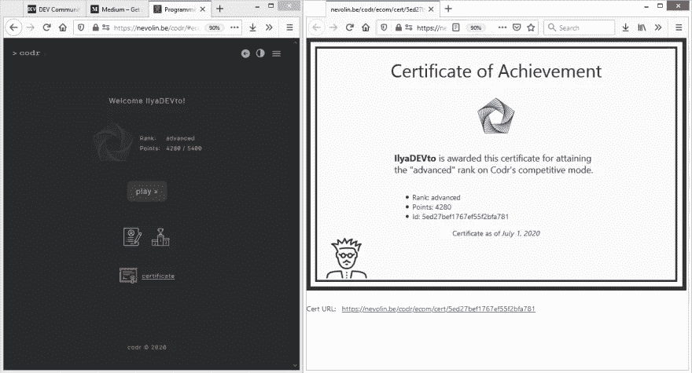

# 获得您的 Codr 认证

> 原文：<https://blog.devgenius.io/get-your-codr-certification-d05aad44a313?source=collection_archive---------27----------------------->

你现在可以从 Codr 获得成就证书。利用简历、LinkedIn 和作品集上的证书来增加你的职业可信度和权威性。

要获得证书，你需要超过 Codr 排名模式中的“初级”级别。之后，您的仪表板上会出现一个“证书”部分。然后，您可以使用证书 URL 或将其打印出来(PDF 格式)。

外部人员能够使用 URL 或 Id 验证您的证书。不要忘记为您的帐户设置一个合适的用户名，该名称会出现在您的证书上。但你可以随时在你的帐户设置中更改它。

今天从[https://nevolin.be/codr/](https://nevolin.be/codr/)开始

