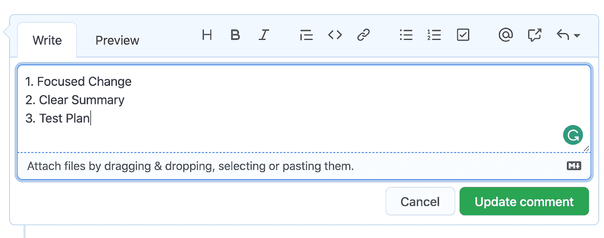
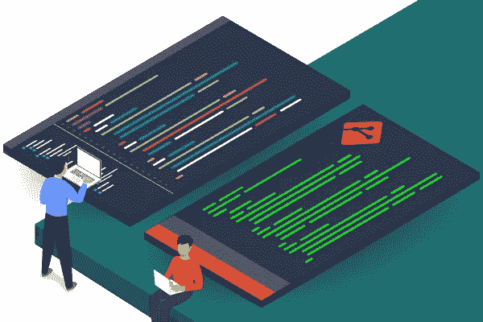

# 让您的“拉动式请求”更快获得批准

> 原文：<https://blog.devgenius.io/get-your-pull-request-approved-faster-9b123239d664?source=collection_archive---------12----------------------->

我仍然记得我的第一个拉取请求(我们在 FB 中称之为“diff ”)在最终获得批准之前被拒绝了 5 次。像大多数菜鸟一样，我基本上犯了所有我能犯的错误，这使得审查者不可能允许它被合并到主分支中。幸运的是，我得到了一群患者评论者的支持，他们在评论中列出了我需要纠正的所有地方。这些评论指导了如何写一份合适的拉式请求，为自己保持高质量，绝不偷工减料。

快进到现在，我已经审查了 1000 多个跨不同语言(从 C++到 Javascript)的拉请求。作为一名技术主管，规划工程工作和审查代码是我的首要职责。通过这些经验，我总结了一些技巧，我相信这些技巧可以帮助你的“拉动式请求”更快地获得批准。

# 聚焦变化

> “如果主题行中有单词“**和**，则需要拆分”

在一个请求中压缩太多的变化是头号错误。评论者对无法用一句话解释的拉式请求过敏。在单个拉取请求中，长而复杂的代码变更会使评审者对您想要完成的任务感到困惑，并且难以验证。

> “糊涂的头脑永远不会买”。

所以，为了让你的请求更快地被批准，第一件事就是限制你的改变范围，每个请求只做一件事。

将一个要素分解成更小的堆叠请求。一些工程师可能会争辩说它增加了评审请求的负荷，但是实际上，它通过极大地简化每个请求而减少了评审时间。

例如，任务是**在网页**上添加一个“打开对话框”按钮。而不是提交一个巨大的请求，包括整个堆栈文件的变化。考虑提交 3 个堆叠的请求，分别针对“添加后端逻辑”、“添加按钮/对话框 UI”和“将 UI 与后端连接”。

# 清除摘要

> “拉请求的目的是让你的审查者相信你的代码正在做你所计划的事情”。

在快节奏的开发周期中，我们花在编写“官方”技术文档或 wiki 上的时间越来越少，这些文档或 wiki 解释了我们为什么以这种方式实现它。当事情发生时，为了理解根本原因，工程师最有可能追溯到有问题的拉请求。

在这种情况下，每个拉取请求的描述都是事实上的文档。

为了证明每个提交都是响应性地编写的，并有助于未来的调查，应涵盖以下方面:

## 为什么

为什么我们首先要做这些改变。写一个简短的介绍，介绍这个拉取请求的背景。具体来说，

1.  如果是大项目的一部分，附上项目链接。
2.  如果是一个用户界面的变化，附上一个设计模拟。
3.  如果是 bug，描述一下损坏情况。

## 目标

解释这个拉取请求计划做什么。

1.  如果是 bug 修复，描述我们想要消除的症状。
2.  如果是一个特性，描述它的功能。

## 怎么做

确信这个拉取请求提出的代码更改是合理的。简述如何实现目标的解决方案。如果涉及到算法的话解释一下。如果我们正在修复 bug，请解释根本原因。

图片来自 [Perforce](https://www.perforce.com/blog/vcs/git-code-review-workflow)

# 测试计划

在大多数公司中，在你的代码发布到产品中后，评审者将对任何意想不到的结果负责。因此，为了说服评审人员，拉式请求的作者有义务展示一些证据，证明代码更改是安全的，并且按预期工作。

有三种基本方法来演示:

1.  证明它通过了所有**静态分析工具的**检查。在测试计划中显示代码通过了所有的 linter、编译器或者任何其他静态分析检查。确保代码至少没有基本的语法错误。
2.  增加**单元测试**。编写并执行单元测试，覆盖您更改的代码。
3.  附上一个**演示视频**。附上截图或截屏视频，说明软件在应用新的更改后工作正常。

这是拉请求的三个最基本的部分。试着在你的下一个请求中应用它们，看看效果如何。