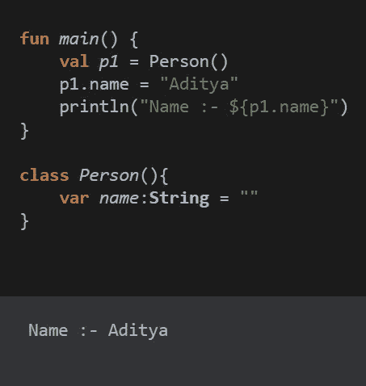
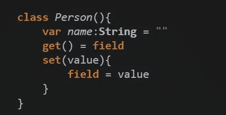
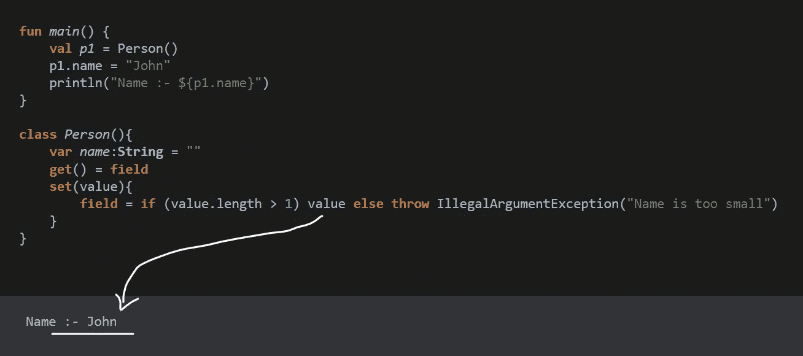
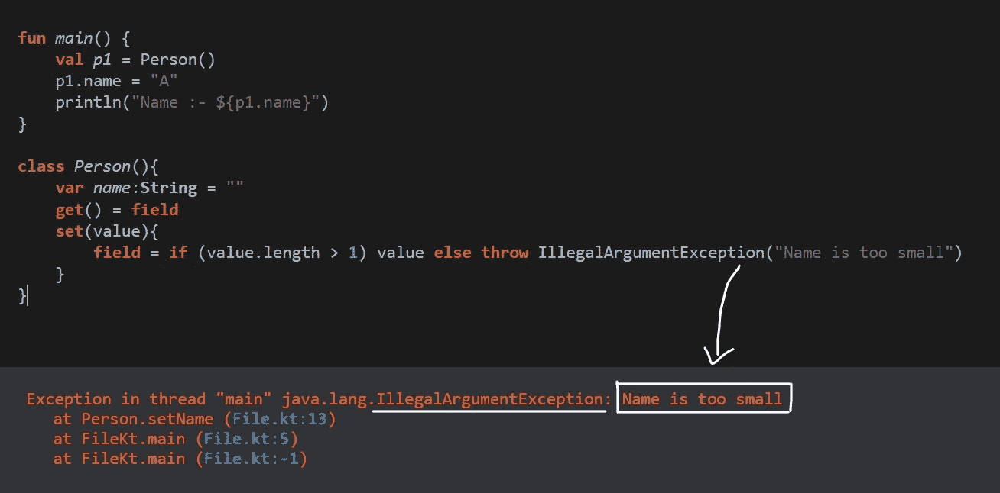
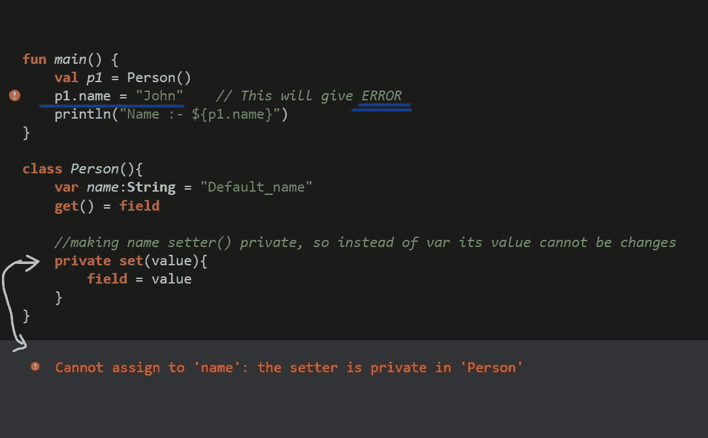
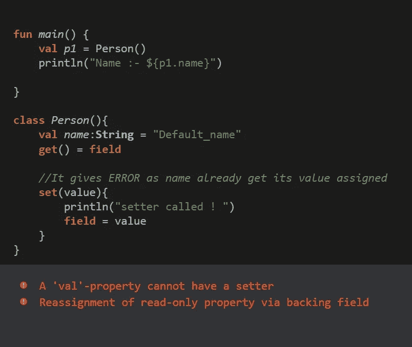

# Kotlin 中的 Getter 和 Setter

> 原文：<https://blog.devgenius.io/getter-and-setter-in-kotlin-2022-eeaff05feaf7?source=collection_archive---------8----------------------->

> *在 Kotlin 中，* ***setter*** *用于设置任意变量的值，****getter****用于获取值。Getters 和 Setters 是* ***代码中自动生成的*** *。*每个变量都有 setter()和 getter()。

这里， ***p1.name*** 正在调用 setter()，而 ***println()*** 正在调用 getter()。

对内 ***人*** 类如:—

**注** :-
1。在 ***main()*** 函数中，当我们调用 ***p1.name*** 时，实际上我们调用的是 ***set(value)*** ，它是将**【Aditya】**作为 ***value*** 并将其设置为***Field****【Field 是指我们要存储数据的存储位置
2。在 ***main()*** 函数中，当我们调用"***println(" Name:-$ { P1 . Name } "***"实际上我们是在调用***get()= P1 . Name .****

> 自定义 getter()和 setter() :-我们可以在获取和给出数据表单时进行修改。

这里，我们使用自定义 setter()，也就是说，如果 input_name 的长度大于 1，则打印该值，否则抛出自定义错误。

“John”的长度大于 1，所以它给我们“John”作为输出。

这里，“A”的长度不大于 1，所以它给出了我们的自定义误差作为输出。

> **使用 setter()将 var 变为 val:-**

val:-一旦初始化，其值就不能更改的变量。
var:-初始化后其值可以更改的变量。

**将 var 变为 val** :-即变量不是 var 类型，其值不能改变。

使 name setter()成为私有的，所以当变量 setter()成为私有的时，它的值不能改变，而不是 var。

> **注意:** - val 没有 setter()，因为它们的值不能更改。

感谢阅读…希望你的概念得到明确。