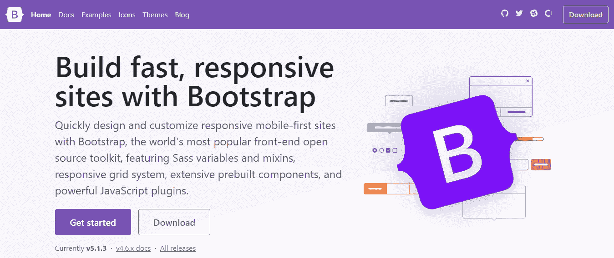
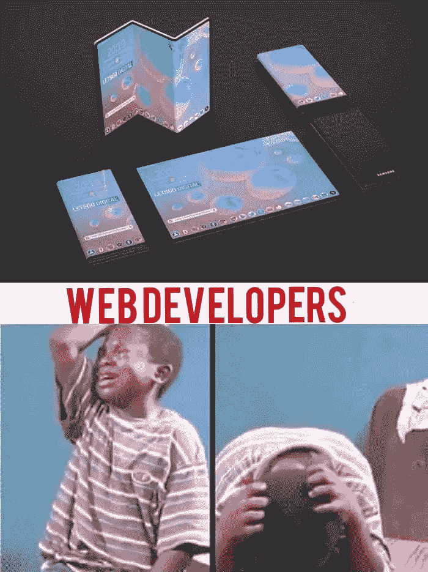
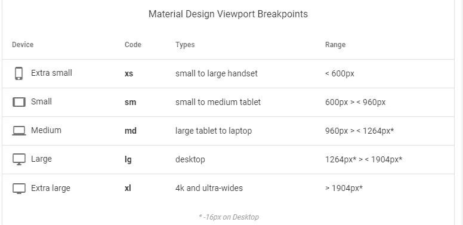
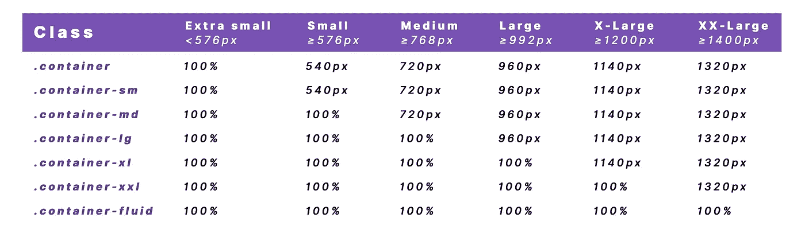

# 与 Bootstrap 相处。

> 原文：<https://blog.devgenius.io/getting-along-with-bootstrap-b243da5878ef?source=collection_archive---------10----------------------->


你好世界！

如果您曾经涉足 web 开发，我相信您一定听说过 Bootstrap。Bootstrap 是最受欢迎的开源 CSS 框架之一，它允许我们构建快速响应的网站。这篇博客文章将带你了解 Bootstrap 的介绍，让你开始创建更具响应性的站点。

**什么是自举？**

Bootstrap 是一个免费的开源 CSS，允许我们建立快速响应的网站。它包括基于 HTML 和 CSS 的设计模板，用于排版、按钮、表单、导航栏和几个 JavaScript 插件。Bootstrap 是全球最受欢迎的前端框架，用于构建响应迅速的移动优先网站和 web 应用程序。

Bootstrap V5 最新版本的一个最新变化是不再依赖 JQuery。

**为什么要使用 Bootstrap？**

在众多优点中，Bootstrap 有几个优点，我仅列举几个。

*   更容易使用。
*   它确保跨浏览器的兼容性；它兼容多种浏览器。
*   它提高了开发速度。
*   它确保了响应性，因为它具有响应功能。
*   它可以防止项目之间的重复。
*   它增加了一致性。
*   它是高度可定制的。
*   它是完全免费的。

**关于 Bootstrap5 你应该知道的事情。**

*   jQuery 已删除。
*   切换到普通的 JavaScript
*   导航条优化。
*   响应字体大小。
*   自定义 SVG 图标库
*   班级更新。

**如何获得 Bootstrap？**

1.  通过在您的计算机上本地下载 Bootstrap。
2.  通过使用 CDN 链接。

**使用 CDN 链接启动引导。**

要使用 CDN 链接，请使用此[URL](https://getbootstrap.com/)[https://www.getbootstrap.com 进入引导程序网页。](https://www.getbootstrap.com.)

然后点击页面上标有**的按钮**，如下图所示。



之后，将会打开一个页面，然后您会在页面右侧看到一个项目列表，您进入该页面并单击 **Starter template。**这样你就可以更容易地复制你将在 html 文件中使用的模板。所以你要做的是，复制模板并粘贴到你的 html 文件中。

```
<!doctype html>
<html lang="en">
  <head>
    <!-- Required meta tags -->
    <meta charset="utf-8">
    <meta name="viewport" content="width=device-width, initial-scale=1">

    <!-- Bootstrap CSS -->
    <link href="https://cdn.jsdelivr.net/npm/bootstrap@5.1.3/dist/css/bootstrap.min.css" rel="stylesheet" integrity="sha384-1BmE4kWBq78iYhFldvKuhfTAU6auU8tT94WrHftjDbrCEXSU1oBoqyl2QvZ6jIW3" crossorigin="anonymous">

    <title>Hello, world!</title>
  </head>
  <body>
    <h1>Hello, world!</h1>

    <!-- Optional JavaScript; choose one of the two! -->

    <!-- Option 1: Bootstrap Bundle with Popper -->
    <script src="https://cdn.jsdelivr.net/npm/bootstrap@5.1.3/dist/js/bootstrap.bundle.min.js" integrity="sha384-ka7Sk0Gln4gmtz2MlQnikT1wXgYsOg+OMhuP+IlRH9sENBO0LRn5q+8nbTov4+1p" crossorigin="anonymous"></script>

    <!-- Option 2: Separate Popper and Bootstrap JS -->
    <!--
    <script src="https://cdn.jsdelivr.net/npm/@popperjs/core@2.10.2/dist/umd/popper.min.js" integrity="sha384-7+zCNj/IqJ95wo16oMtfsKbZ9ccEh31eOz1HGyDuCQ6wgnyJNSYdrPa03rtR1zdB" crossorigin="anonymous"></script>
    <script src="https://cdn.jsdelivr.net/npm/bootstrap@5.1.3/dist/js/bootstrap.min.js" integrity="sha384-QJHtvGhmr9XOIpI6YVutG+2QOK9T+ZnN4kzFN1RtK3zEFEIsxhlmWl5/YESvpZ13" crossorigin="anonymous"></script>
    -->
  </body>
</html>
```

正如你在 html 文件的标签中看到的，有一个 CSS Bootstrap 的 CDN 链接，在 html fil 的页脚下面，有一个 JavaScript Bootstrap 的链接。您会注意到的另一件事是 popper 链接。使用任何可用的选项。

**注意:**您的 Bootstrap Js 中的大多数文件都依赖于 popper 来工作。因此，建议总是将您的 popper 链接与 Bootstrap Js 链接放在一起。

**引导程序中的断点**



断点是响应式设计的组成部分。您可以使用它们来控制何时布局可以适应特定的视口或设备大小。断点是可自定义的宽度，它决定了响应布局在 Bootstrap 中跨设备或视口大小的行为。

在纯 CSS 中，我们使用**媒体查询**来构建我们的 CSS 样式，以适应不同的设备和视口大小。

值得注意的是，Bootstrap 是一个移动优先框架。

Bootstrap 中可获得的各种断点如下所示。



**引导程序中的容器**

正如我们所见，Bootstrap 中有多个断点。同样，我们有多种类型的容器。

容器是 Bootstrap 中最基本的元素，在使用我们默认的网格系统时是必需的。容器用于容纳、填充和(有时)居中其中的内容。虽然容器*可以*嵌套，但是大多数布局不需要嵌套容器。

Bootstrap 有三种不同的容器:

*   `.container`，在每个响应断点设置一个`max-width`
*   `.container-fluid`，即所有断点处的`width: 100%`
*   `.container-{breakpoint}`，即`width: 100%`，直到指定断点

下表说明了每个断点上每个容器的`max-width`如何与原始的`.container`和`.container-fluid`进行比较。



**引导程序中的网格**

Bootstrap 的网格系统使用一系列容器、行和列来布局和对齐内容。它由[柔性盒](https://developer.mozilla.org/en-US/docs/Web/CSS/CSS_Flexible_Box_Layout/Basic_Concepts_of_Flexbox)制成，反应灵敏。

它是如何工作的？

*   **我们的网格支持** [**六个响应式断点**](https://getbootstrap.com/docs/5.0/layout/breakpoints/) **。**断点基于`min-width`媒体查询，这意味着它们影响该断点及其之上的所有断点(例如，`.col-sm-4`适用于`sm`、`md`、`lg`、`xl`和`xxl`)。这意味着您可以通过每个断点来控制容器和列的大小和行为。
*   **容器居中并水平填充内容。**使用`.container`表示响应像素宽度，`.container-fluid`表示跨越所有视口和设备的`width: 100%`，或使用响应容器(如`.container-md`)表示流体和像素宽度的组合。
*   **行是列的包装器。**每根柱子都有水平的`padding`(称为檐槽)，用于控制它们之间的间距。然后，这个`padding`在具有负边距的行上抵消，以确保您的列中的内容在视觉上从左侧向下对齐。行还支持修改器类[统一应用列尺寸](https://getbootstrap.com/docs/5.0/layout/grid/#row-columns)和[装订线类](https://getbootstrap.com/docs/5.0/layout/gutters/)来改变内容的间距。
*   柱子非常灵活。每行有 12 个可用的模板列，允许您创建跨越任意数量列的不同元素组合。列类指示要跨越的模板列的数量(例如，`col-4`跨越四个)。`width` s 以百分比设置，因此您始终拥有相同的相对尺寸。
*   **檐槽也是可响应和可定制的。** [装订线类](https://getbootstrap.com/docs/5.0/layout/gutters/)可用于所有断点，其大小与我们的[边距和填充间距](https://getbootstrap.com/docs/5.0/utilities/spacing/)相同。用`.gx-*`等级更换水平檐槽，用`.gy-*`等级更换垂直檐槽，或用`.g-*`等级更换所有檐槽。`.g-0`也可用于移除水槽。
*   萨斯变量、地图和混合为电网供电。如果你不想在 Bootstrap 中使用预定义的网格类，你可以使用我们的网格源 Sass 来创建你自己的带有更多语义标记的网格。

**网格选项**

Bootstrap 的网格系统可以适应所有六个默认断点，以及您自定义的任何断点。六个默认网格层如下:

*   超小型(xs)
*   小型(sm)
*   中等(md)
*   大(lg)
*   特大号(xl)
*   超大号(xxl)

如上所述，每个断点都有自己的容器、唯一的类前缀和修饰符。

通过上面的讨论，我相信你已经开始理解什么是 Bootstrap 了？

感谢您的阅读。

自举快乐！

我想让你使用 Bootstrap 和一点 CSS 查找一个简单的[**注册表**](https://codepen.io/mercysticks/full/eYeqLNB) 。