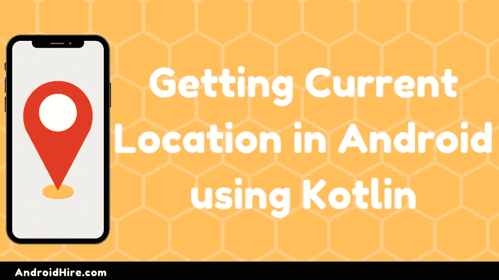

# 使用 Kotlin 在 Android 中获取当前位置

> 原文：<https://blog.devgenius.io/getting-current-location-in-android-using-kotlin-2697e512cff8?source=collection_archive---------32----------------------->



所以在本教程中，我们将学习使用 kotlin (纬度&经度)**获取用户在 Android 中的**当前位置。****

**我们将使用融合的位置提供商。**

融合位置提供者检索设备的最后已知位置。融合的位置提供者是 [Google Play 服务](https://developers.google.com/android/guides/overview)中的位置 API 之一。

它管理底层的定位技术，并提供一个简单的 API，以便您可以指定高层次的要求，如高精度或低功耗。

**第一步**

在应用程序的 build.gradle 文件中添加依赖项。

```
dependencies { implementation fileTree(dir: 'libs', include: ['*.jar']) //..... //..... implementation 'com.google.android.gms:play-services-location:17.4.3' }
```

**第二步**

向用户请求位置许可。由于位置对于 android 来说是一个危险的权限，所以我们需要请求用户授予它权限。

Android 提供两种位置权限:

您选择的权限决定了 API 返回的位置的准确性。

在您清单文件中添加这两个权限。

**第三步**

你可能知道，从 **Android 6.0(棉花糖)**你必须请求运行时重要访问的权限。因为这是一个安全问题，在安装应用程序时，用户可能不清楚他们设备的重要权限。

因为我们需要用户的位置信息，所以我们也需要在运行时实现权限请求。

**阅读更多:** [**如何在 Kotlin**](https://www.androidhire.com/retrofit-tutorial-in-kotlin/) 中使用改型教程**这些将在进一步的步骤****PART—1****check permissions()**

这个方法将告诉我们用户是否允许我们访问 ACCESS_COARSE_LOCATION 和 ACCESS_FINE_LOCATION。

```
private fun checkPermissions(): Boolean { if ( ActivityCompat.checkSelfPermission(this,Manifest.permission.ACCESS_COARSE_LOCATION) == PackageManager.PERMISSION_GRANTED && ActivityCompat.checkSelfPermission (this, Manifest.permission.ACCESS_FINE_LOCATION) == PackageManager.PERMISSION_GRANTED){ return true } return false }
```

**PART—2****onRequestPermissionsResult()**

当用户允许或拒绝我们请求的权限时，将调用此方法。因此，如果获得许可，这将有助于我们向前迈进。

```
override fun onRequestPermissionsResult(requestCode: Int, permissions: Array<String>, grantResults: IntArray) { if (requestCode == PERMISSION_ID) { if ((grantResults.isNotEmpty() && grantResults[0] == PackageManager.PERMISSION_GRANTED)) { // Granted. Start getting the location information } } }
```

**PART—3**is locationenabled()

这将检查用户是否从设置中打开了位置，因为用户可能会将应用程序授予用户位置，但如果位置设置是关闭的，那么它将没有用。

```
private fun isLocationEnabled(): Boolean { var locationManager: LocationManager = getSystemService(Context.LOCATION_SERVICE) as LocationManager return locationManager.isProviderEnabled(LocationManager.GPS_PROVIDER) || locationManager.isProviderEnabled( LocationManager.NETWORK_PROVIDER ) }
```

您可能会注意到，在请求权限时以及在获得权限结果后，我们使用了 **PERMISSION_ID** ，它是一个整数值，帮助我们识别用户对哪个权限请求的操作。您可以在此提供任何独特的值。

**第四步**

现在是时候编写 MainActivity.kt 了

```
package com.jayant.mylocation import android.Manifest import android.content.Context import android.content.pm.PackageManager import android.location.LocationManager import androidx.appcompat.app.AppCompatActivity import android.os.Bundle import androidx.core.app.ActivityCompat class MainActivity : AppCompatActivity() { val PERMISSION_ID = 42 override fun onCreate(savedInstanceState: Bundle?) { super.onCreate(savedInstanceState) setContentView(R.layout.activity_main) } private fun isLocationEnabled(): Boolean { var locationManager: LocationManager = getSystemService(Context.LOCATION_SERVICE) as LocationManager return locationManager.isProviderEnabled(LocationManager.GPS_PROVIDER) || locationManager.isProviderEnabled( LocationManager.NETWORK_PROVIDER ) } private fun checkPermissions(): Boolean { if (ActivityCompat.checkSelfPermission(this, Manifest.permission.ACCESS_COARSE_LOCATION) == PackageManager.PERMISSION_GRANTED && ActivityCompat.checkSelfPermission(this, Manifest.permission.ACCESS_FINE_LOCATION) == PackageManager.PERMISSION_GRANTED){ return true } return false } private fun requestPermissions() { ActivityCompat.requestPermissions( this, arrayOf(Manifest.permission.ACCESS_COARSE_LOCATION, Manifest.permission.ACCESS_FINE_LOCATION), PERMISSION_ID ) } override fun onRequestPermissionsResult(requestCode: Int, permissions: Array<String>, grantResults: IntArray) { if (requestCode == PERMISSION_ID) { if ((grantResults.isNotEmpty() && grantResults[0] == PackageManager.PERMISSION_GRANTED)) { // Granted. Start getting the location information } } } }
```

**第六步**

现在，我们将使用实际的融合位置提供者 API 来获取用户的当前位置。为此，您应该首先使用 mFusedLocationClient:FusedLocationClient 声明一个变量 lateint var

然后，我们将创建一个名为 getLastLocation()的方法，该方法将使用 API 并返回设备的最后一个记录器位置信息。此外，该方法将首先检查我们的许可是否被授予，以及位置设置是否打开。

```
@SuppressLint("MissingPermission") private fun getLastLocation() { if (checkPermissions()) { if (isLocationEnabled()) { mFusedLocationClient.lastLocation.addOnCompleteListener(this) { task -> var location: Location? = task.result if (location == null) { requestNewLocationData() } else { findViewById<TextView>(R.id.latTextView).text = location.latitude.toString() findViewById<TextView>(R.id.lonTextView).text = location.longitude.toString() } } } else { Toast.makeText(this, "Turn on location", Toast.LENGTH_LONG).show() val intent = Intent(Settings.ACTION_LOCATION_SOURCE_SETTINGS) startActivity(intent) } } else { requestPermissions() } }
```

如您所见，首先它将使用我们创建的方法 checkPermission()检查我们是否授予了权限，如果没有，它将请求位置权限。然后它会检查位置设置是打开还是关闭。如果关闭，将使用打开它的意图打开位置设置。

如果每个要求都是好的，那么它将寻找最后记录的位置信息，并把纬度和经度值放入我们的文本视图

```
latTextView.text = location.latitude.toString() lonTextView.text =location.longitude.toString()
```

**第七步**

最终活动 _main.xml

```
<?xml version="1.0" encoding="utf-8"?> <LinearLayout xmlns:android="http://schemas.android.com/apk/res/android" android:layout_width="match_parent" android:layout_height="match_parent" android:gravity="center" android:orientation="vertical"> <TextView android:id="@+id/latTextView" android:layout_width="wrap_content" android:layout_height="wrap_content" android:text="Latitude: "/> <TextView android:id="@+id/lonTextView" android:layout_width="wrap_content" android:layout_height="wrap_content" android:text="Longitude: "/> </LinearLayout>
```

**第 8 步(可选)**

但是有一件事你必须知道，在一些罕见的情况下，位置可以是空的，比如:

*   在某些设备中，如果您关闭位置并再次打开，以前记录的位置信息将被清除。
*   可能用户在使用您的应用程序之前从未打开过定位，这一次以前的位置信息也将为空。

为了避免在 location == null 时出现这些罕见的情况，我们调用了一个新方法 requestNewLocation()，它将在运行时记录位置信息。

```
@SuppressLint("MissingPermission") private fun requestNewLocationData() { var mLocationRequest = LocationRequest() mLocationRequest.priority = LocationRequest.PRIORITY_HIGH_ACCURACY mLocationRequest.interval = 0 mLocationRequest.fastestInterval = 0 mLocationRequest.numUpdates = 1 mFusedLocationClient = LocationServices.getFusedLocationProviderClient(this) mFusedLocationClient!!.requestLocationUpdates( mLocationRequest, mLocationCallback, Looper.myLooper() ) }
```

这种方法将以最高的精度进行新的定位请求。

当更新收到时，它将调用一个名为 **mLocationCallback** 的回调方法。

```
private val mLocationCallback = object : LocationCallback() { override fun onLocationResult(locationResult: LocationResult) { var mLastLocation: Location = locationResult.lastLocation findViewById<TextView>(R.id.latTextView).text = mLastLocation.latitude.toString() findViewById<TextView>(R.id.lonTextView).text = mLastLocation.longitude.toString() } }
```

因此，当我们获得位置更新时，我们在 TextViews 中设置纬度和经度值。

因此，最后我们将在 onCreate()方法中调用 getLastLocation()方法，并且在用户授予权限请求时调用。

**最终 MainActivity.kt**

```
package com.jayant.mylocation import android.Manifest import android.annotation.SuppressLint import android.content.Context import android.content.Intent import android.content.pm.PackageManager import android.location.Location import android.location.LocationManager import androidx.appcompat.app.AppCompatActivity import android.os.Bundle import android.os.Looper import android.provider.Settings import android.widget.TextView import android.widget.Toast import androidx.core.app.ActivityCompat import com.google.android.gms.location.* class MainActivity : AppCompatActivity() { val PERMISSION_ID = 42 lateinit var mFusedLocationClient: FusedLocationProviderClient override fun onCreate(savedInstanceState: Bundle?) { super.onCreate(savedInstanceState) setContentView(R.layout.activity_main) mFusedLocationClient = LocationServices.getFusedLocationProviderClient(this) getLastLocation() } @SuppressLint("MissingPermission") private fun getLastLocation() { if (checkPermissions()) { if (isLocationEnabled()) { mFusedLocationClient.lastLocation.addOnCompleteListener(this) { task -> var location: Location? = task.result if (location == null) { requestNewLocationData() } else { findViewById<TextView>(R.id.latTextView).text = location.latitude.toString() findViewById<TextView>(R.id.lonTextView).text = location.longitude.toString() } } } else { Toast.makeText(this, "Turn on location", Toast.LENGTH_LONG).show() val intent = Intent(Settings.ACTION_LOCATION_SOURCE_SETTINGS) startActivity(intent) } } else { requestPermissions() } } @SuppressLint("MissingPermission") private fun requestNewLocationData() { var mLocationRequest = LocationRequest() mLocationRequest.priority = LocationRequest.PRIORITY_HIGH_ACCURACY mLocationRequest.interval = 0 mLocationRequest.fastestInterval = 0 mLocationRequest.numUpdates = 1 mFusedLocationClient = LocationServices.getFusedLocationProviderClient(this) mFusedLocationClient!!.requestLocationUpdates( mLocationRequest, mLocationCallback, Looper.myLooper() ) } private val mLocationCallback = object : LocationCallback() { override fun onLocationResult(locationResult: LocationResult) { var mLastLocation: Location = locationResult.lastLocation findViewById<TextView>(R.id.latTextView).text = mLastLocation.latitude.toString() findViewById<TextView>(R.id.lonTextView).text = mLastLocation.longitude.toString() } } private fun isLocationEnabled(): Boolean { var locationManager: LocationManager = getSystemService(Context.LOCATION_SERVICE) as LocationManager return locationManager.isProviderEnabled(LocationManager.GPS_PROVIDER) || locationManager.isProviderEnabled( LocationManager.NETWORK_PROVIDER ) } private fun checkPermissions(): Boolean { if (ActivityCompat.checkSelfPermission( this, Manifest.permission.ACCESS_COARSE_LOCATION ) == PackageManager.PERMISSION_GRANTED && ActivityCompat.checkSelfPermission( this, Manifest.permission.ACCESS_FINE_LOCATION ) == PackageManager.PERMISSION_GRANTED ) { return true } return false } private fun requestPermissions() { ActivityCompat.requestPermissions( this, arrayOf(Manifest.permission.ACCESS_COARSE_LOCATION, Manifest.permission.ACCESS_FINE_LOCATION), PERMISSION_ID ) } override fun onRequestPermissionsResult(requestCode: Int, permissions: Array<String>, grantResults: IntArray) { if (requestCode == PERMISSION_ID) { if ((grantResults.isNotEmpty() && grantResults[0] == PackageManager.PERMISSION_GRANTED)) { getLastLocation() } } } }
```

这就是所有的人！

*原载于 2020 年 6 月 14 日 https://www.androidhire.com*[](https://www.androidhire.com/current-location-in-android-using-kotlin/)**。**