# 使用 InfluxDB 本机收集器从 EMQX 云获取数据

> 原文：<https://blog.devgenius.io/getting-data-from-emqx-cloud-with-influxdb-native-collector-a6d795b31acc?source=collection_archive---------12----------------------->

# 介绍

InfluxData 最近宣布了原生收集器的可用性，将原生数据收集带到了 InfluxDB 云中。这将为开发人员提供从第三方 MQTT 代理(如 EMQX Cloud)获取数据到 InfluxDB Cloud 的最快方式，而不需要额外的软件或新的代码。

虽然与私有 MQTT 代理集成总是可能的，但这是实现云到云集成的更简单的方法。

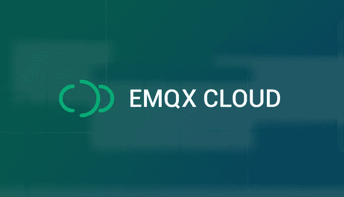

在本教程中，我将一步步向您展示如何使用这个新的本机收集器将 InfluxDB 云与领先的 MQTT 服务提供商 EMQX 云集成。

# 四步整合

集成只需要 4 个步骤:

1.  在 EMQX 云上创建 MQTT 代理— 3 分钟
2.  在 InfluxDB 云上创建一个存储桶— 3 分钟
3.  配置本机收集器— 2 分钟
4.  验证— 1 分钟

是啊！不到 10 分钟你就能把数据从 EMQX Cloud 拿到 InfluxDB Cloud！

现在，让我们来看看。

# 步骤 1:在 EMQX Cloud 上创建一个 MQTT 代理。

在 EMQX Cloud 上创建一个专门的 MQTT 代理就像点击几下鼠标一样简单。

## 获得一个帐户

如果您是 EMQX Cloud 的新用户，请转到 [EMQX Cloud](https://www.emqx.com/en) 并点击开始免费注册帐户。

## 创建一个 MQTT 集群

登录后，点击帐户菜单下的“云控制台”，您将能够看到绿色按钮来创建一个新的部署。

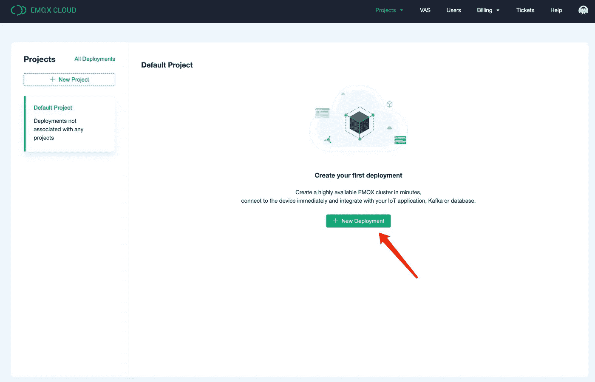

在 EMQX 云上创建一个 MQTT 实例

EMQX Cloud 提供标准和专业计划的 14 天免费试用。虽然 Pro 计划提供了更多的功能，但标准计划对于本教程来说已经足够了。

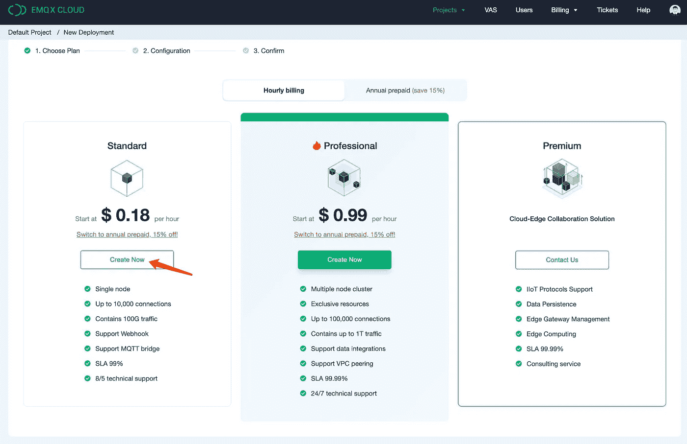

本教程使用标准计划

单击“立即创建”,并按照逐步演练完成部署。单击最后一个“部署”按钮后，您将看到实例创建如下:

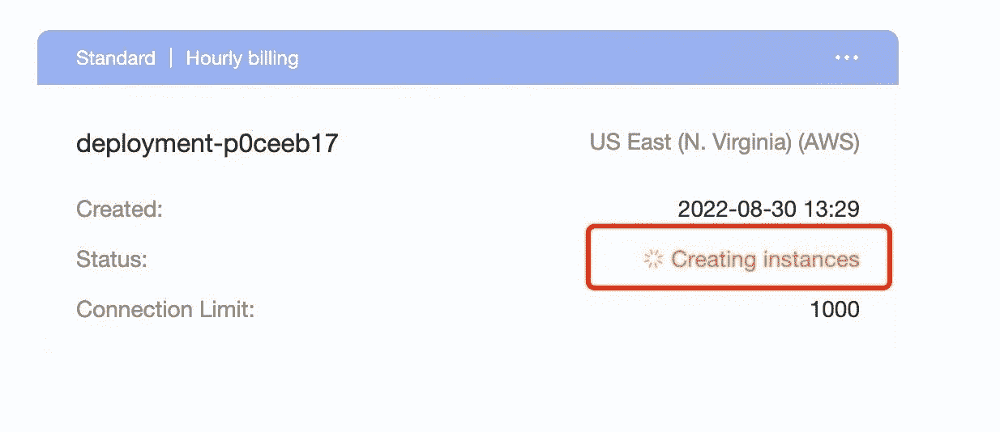

创建 MQTT 实例

获取正在运行的实例需要几分钟时间。

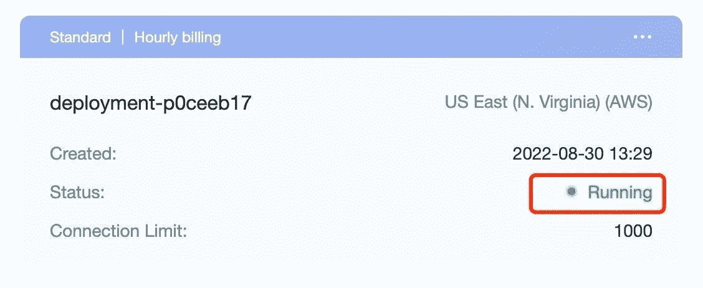

处于运行状态的实例

一旦状态变为正在运行，单击该卡即可转至群集概述。

## 获取连接地址和端口

在 overview 页面上，您将看到实例的详细信息。注意这里的连接地址和连接端口，这是我们在 InfluxDB Cloud 上配置集成时所需要的。

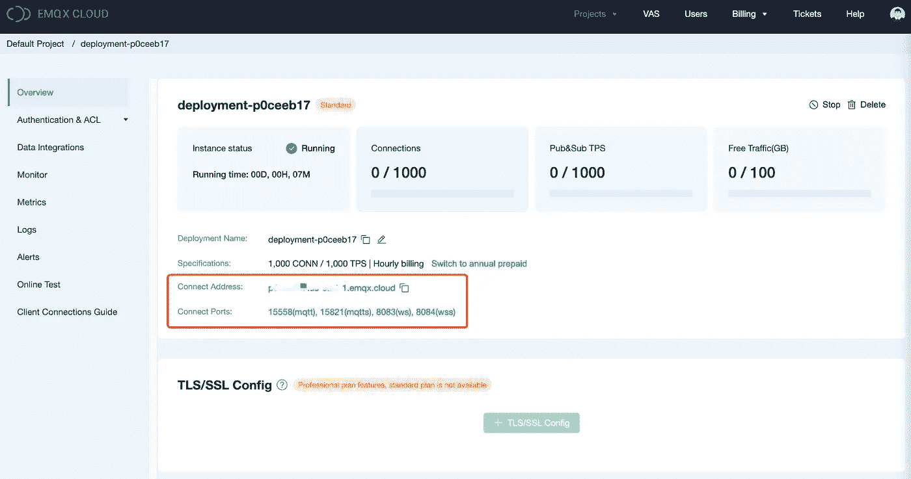

MQTT 代理连接详细信息

每个 EMQX 云实例为 MQTT 连接创建四个侦听器(MQTT、带有 TLS 的 MQTT、WebSocket 上的 MQTT 和带有 TLS 的 WebSocket 上的 MQTT)。但是 InfluxDB Cloud 目前只支持 MQTT 协议，所以你只需要记下第一个端口。

## 为 MQTT 连接添加凭据

EMQX Cloud 上的最后一件事是为 MQTT 连接创建凭证。点按左侧菜单中的“认证和 ACL”，然后点按子菜单中的“认证”。

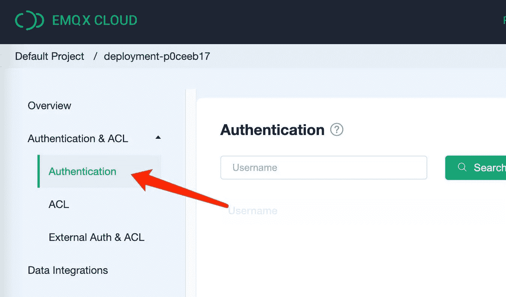

认证页面

单击右边的“Add”按钮，稍后提供 MQTT 连接的用户名和密码。这里我将使用“test”和“influxdb”作为用户名和密码。

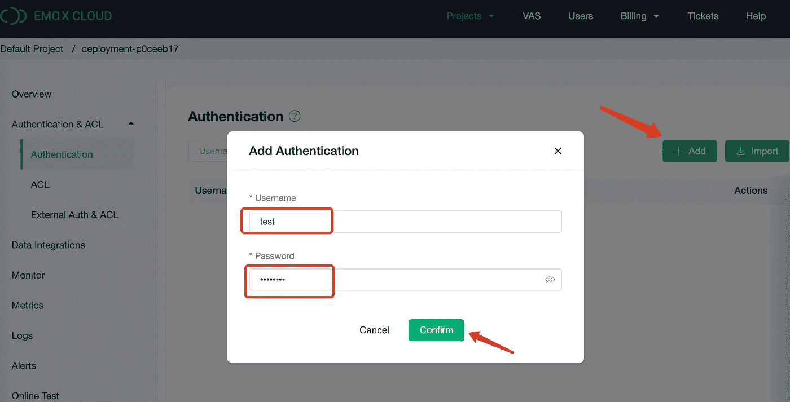

添加凭据

点击“确认”,一切都在 EMQX 云端解决了。

现在你有了一个由 EMQX Cloud 提供的正在运行的 MQTT broker。让我们进入第二步。

# 步骤 2:在 InfluxDB Cloud 上创建一个 bucket

## 创建 InfluxDB 云帐户

如果您是第一次使用 [InfluxDB Cloud](https://www.influxdata.com/products/influxdb-cloud/) ，您还需要创建一个帐户

## 为数据持久性创建一个存储桶

登录后，转到控制台页面并单击菜单中的“Buckets”按钮。

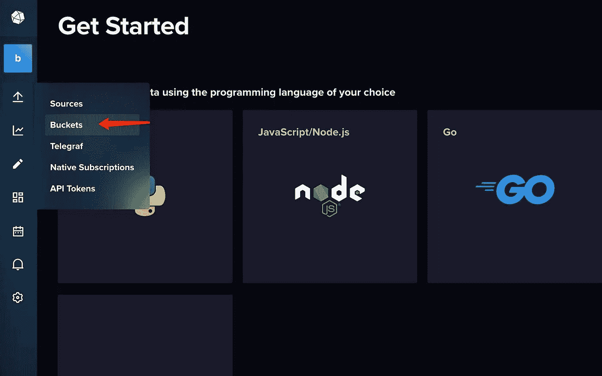

转到存储桶页面

单击右侧的“创建存储桶”并填写表格。

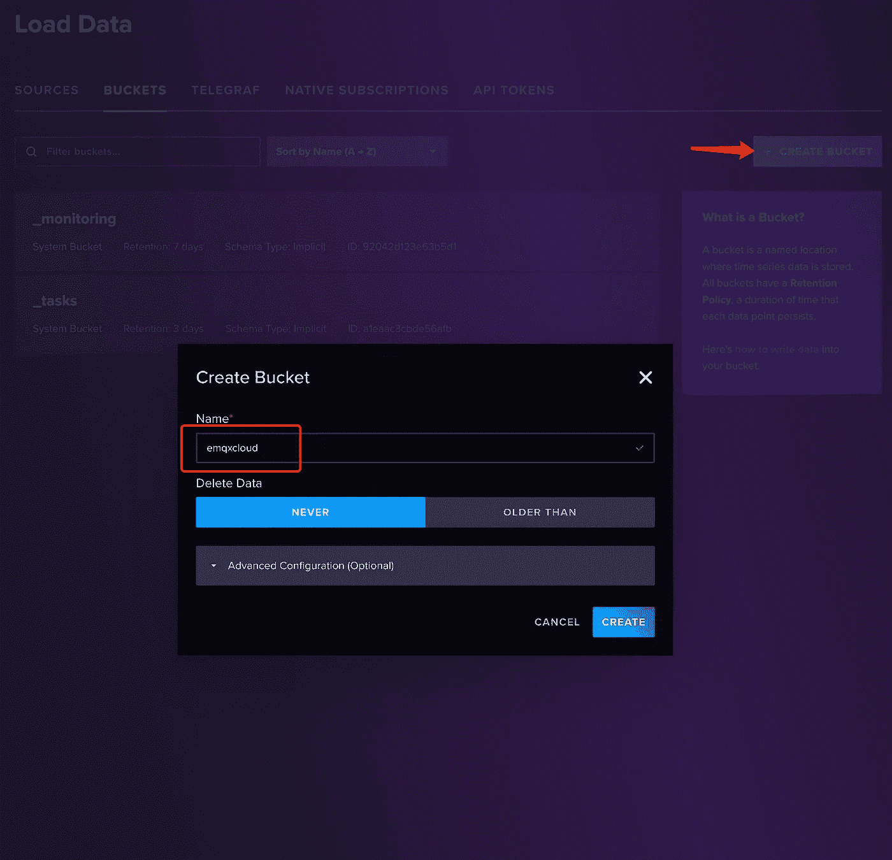

创建新的存储桶

这里我将使用“emqxcloud”作为 bucket 名称。点击“创建”。

好了，现在你已经准备好水桶了。让我们试试新的本地收集器。

# 步骤 3:配置本机收集器

## 转到本地订阅页面

单击存储桶页面上的“本地订阅”选项卡。

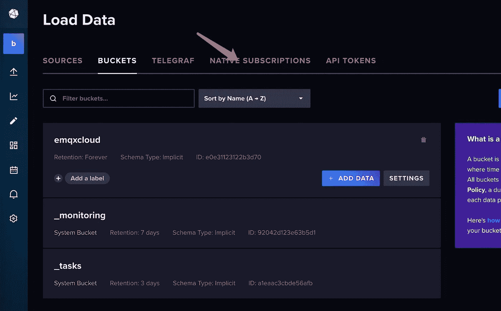

转到本地订阅页面

*请注意，此功能仅适用于基于使用的计划。所以你需要通过链接信用卡来升级你的账户。幸运的是，InfluxDB Cloud 为新用户提供 250 美元的积分。*

## 创建订阅

继续并点击创建订阅。

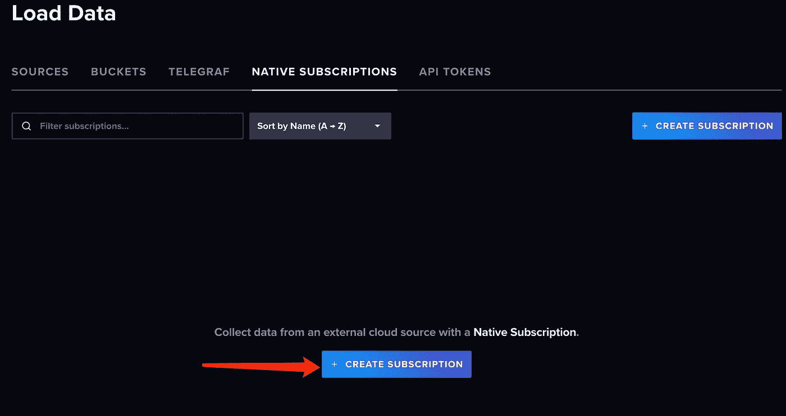

创建 MQTT 订阅

在“集成配置”页面上，有 5 个部分:

*   配置代理详细信息
*   配置安全性详细信息
*   订阅一个主题
*   设置写入目标
*   定义数据解析规则。

别急，我们一个一个来。

## 配置代理连接

要创建订阅，InfluxDB 首先需要连接到 EMQX Cloud 上的目标 MQTT 代理。

这里我们将使用我们在 EMQX Cloud 上创建的连接细节。

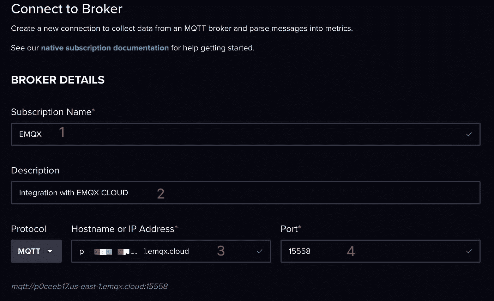

配置代理详细信息

这部分有 4 个输入:

1.  订阅名称:根据需要命名您的订阅。我在这个例子中使用“EMQX”。
2.  描述:(可选)为该订阅提供简短描述。
3.  主机名或 IP 地址:您在步骤 1 中从 EMQX Cloud 获得的连接地址。
4.  Port:您在步骤 1 中从 EMQX Cloud 获得的连接端口。

## 配置安全性详细信息

在“安全详细信息”中选择“基本”，并设置您在 EMQX Cloud 中创建的用户名和密码。

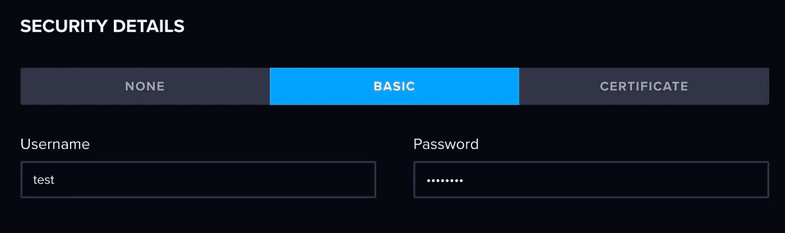

为 MQTT 连接添加凭证

***双重检查地址、端口和用户名/密码。它们对于建立到 EMQX 云的成功 MQTT 连接是必不可少的。***

## 订阅一个主题

一旦配置好连接，我们需要告诉 InfluxDB Cloud 它应该监听哪些主题。

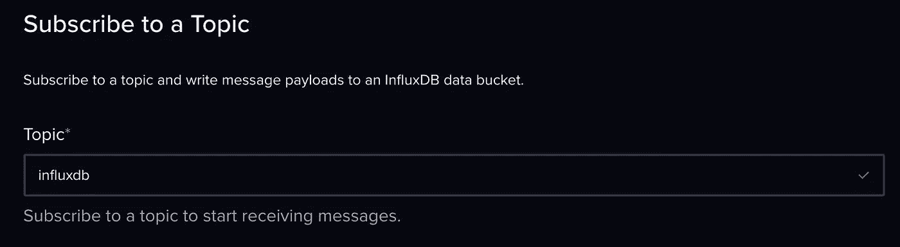

添加订阅主题

在这里给出题目名称即可。我在这个演示中使用了“influxdb”。很好理解。发送到该主题的所有数据将被转发到 InfluxDB Cloud。

虽然我们在这里使用了显式的主题名称，但 InfluxDB Cloud Native Collector 确实支持通配符，如“+”和“#”。在真实的用例中，使用通配符更实用。查看 [InfluxDB Cloud 的文档](https://docs.influxdata.com/influxdb/cloud/write-data/no-code/native-subscriptions/#subscribe-to-an-mqtt-topic)了解更多信息。

## 设置写入目标

在“写入目标”部分，保留默认值，因为只有一个存储桶。但是，如果您有多个存储桶，请确保选择正确的存储桶。

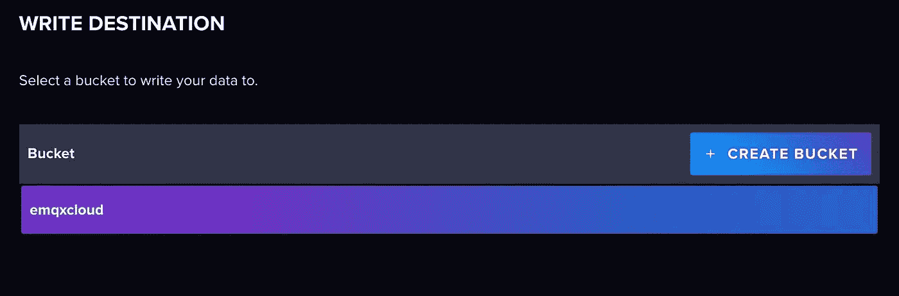

选择写入目标存储桶

## 定义数据解析规则

现在，最后一部分:定义数据解析规则。

InfluxDB 云原生收集器支持三种数据格式。在这个演示中，我们将使用 JSON 格式。在演示中更容易阅读。

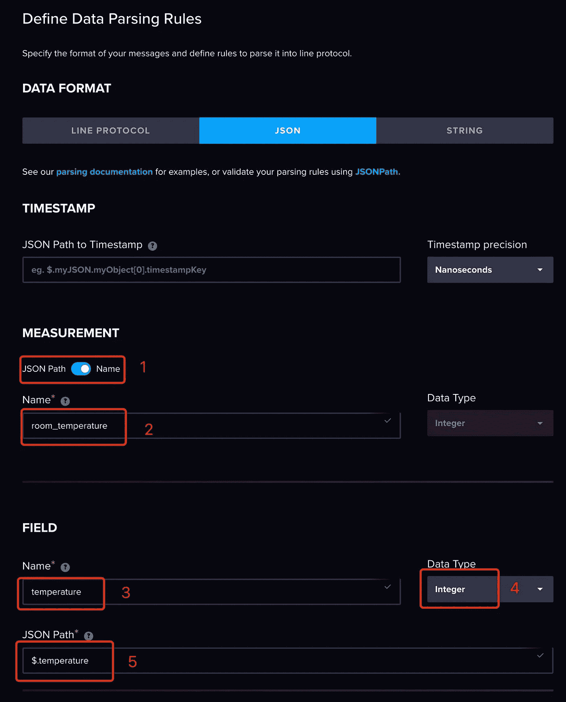

定义数据解析规则

在数据解析规则中，您需要提供关于如何将 JSON 数据转换成 InfluxDB 中的度量和字段的信息。

在演示中，我将使用只有一个温度数据的非常简单的消息。

示例 JSON 负载:

`{ "temperature":25 }`

要将此 JSON 消息转换为 InfluxDB Cloud 中的指标，我们需要执行以下映射:

## 时间戳:

时间戳是可选的。如果没有提供，它将在插入数据时使用服务器的时间戳作为默认值。

## 测量:

度量可以从 JSON 或静态名称中解析。为了使这个演示尽可能简单，我在这个演示中使用了静态名称“room_temperature”。

## 字段:

在这个演示中，我使用了一个只包含温度的 JSON 消息，所以我使用“temperature”作为名称，JSON 路径为“$”。温度”来从 JSON 体中获取数据。InfluxDB Cloud 使用 JSONPath 从 JSON 对象获取数据。检查 [JSONPath 的](https://jsonpath.com/)文档中的语法。

## 保存订阅

最后但同样重要的是，不要忘记保存订阅。

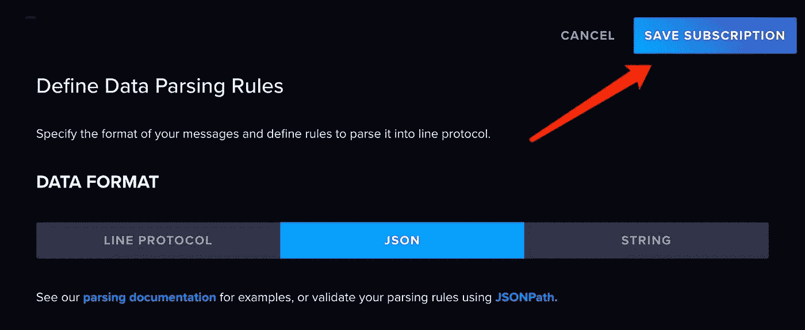

保存订阅

点击“保存订阅”即可！

## 验证订阅正在运行

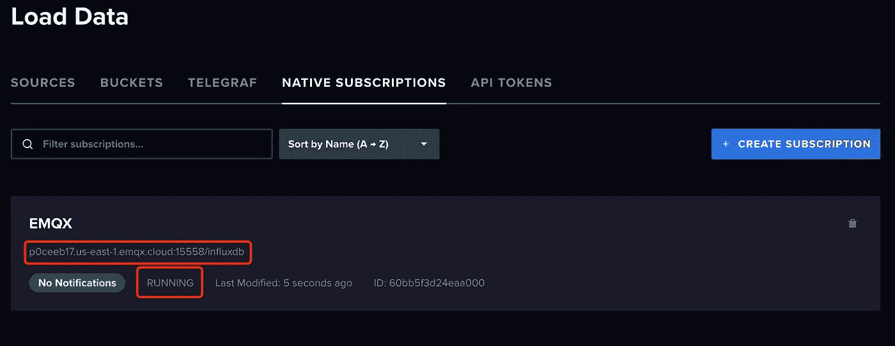

本机订阅正在运行

它应该在本地订阅列表中显示为正在运行。

## 一切都解决了

恭喜你！你应该已经成功集成了 InfluxDB 云和 EMQX 云。发送到 EMQX Cloud 的温度数据应该持续持久化到 InfluxDB Cloud 上的目标 bucket 中。

现在，让我们进入最后一步。看看它是否像预期的那样工作。

# 第四步:验证

如何知道整合是否成功？简单回答:我们给 EMQX Cloud 上的 MQTT broker 发个消息，看看它有没有出现在 InfluxDB cloud 的仪表盘上！

## 选择 MQTT 客户机

您可以随意使用任何 MQTT 客户机。在本教程中，我将使用 [MQTTX](https://mqttx.app/) ，这是一个用户友好的 MQTT 桌面应用程序，非常适合用于测试目的。

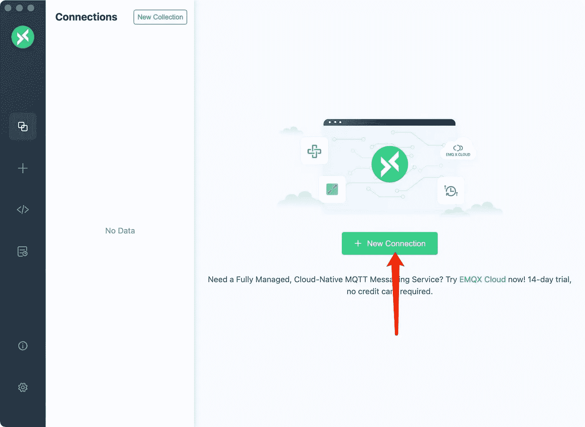

创建新连接

## 连接到 EMQX 云

单击 MQTTX 上的“新建连接”并填写连接表单:

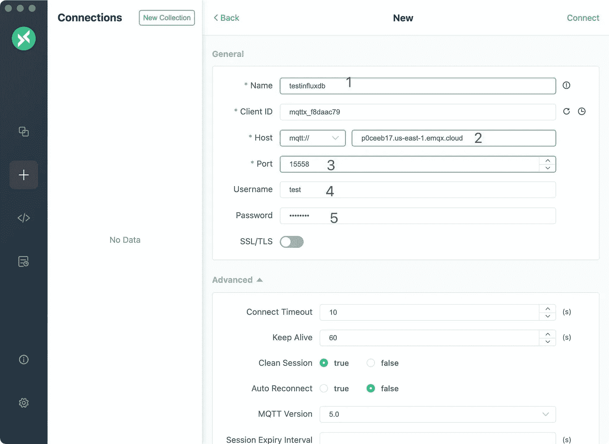

设置连接详细信息

1.  名称:连接名称。想用什么名字就用什么名字。
2.  主机:MQTT 代理连接地址。与您在 InfluxDB 云设置中使用的相同。
3.  端口:MQTT 代理连接端口。与您在 InfluxDB 云设置中使用的相同。
4.  用户名/密码:在演示中，我使用与 InfluxDB 云配置中相同的凭证。如果需要，您可以在 EMQX Cloud 中添加新凭据。

单击右上角的“Connect”按钮，连接应该已经建立。

## 向 EMQX 云发送消息

现在您可以使用这个工具向 EMQX Cloud 上的 MQTT 代理发送消息。

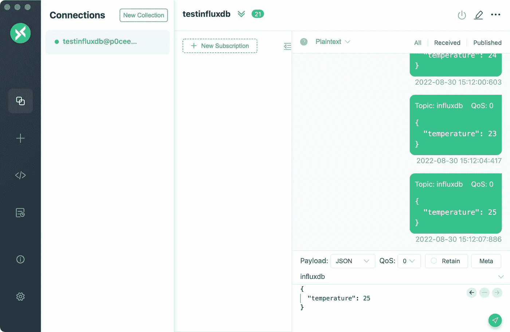

向 EMQX 云发送消息

输入:

1.  将有效负载格式设置为“JSON”。
2.  设置主题:influxdb(我们刚刚设置的 InfluxDB 订阅的主题)
3.  JSON 正文:`{ "temperature": 25 }`

单击右侧的发送图标。您可以更改温度值，并向 MQTT 代理发送更多数据。数据越多，图表在仪表板上显示的内容就越丰富。

## 查看 InfluxDB Cloud 上的数据

现在，是时候查看 InfluxDB Cloud 上的数据了。理想情况下，您使用 MQTTX 发送的数据将进入 EMQX Cloud，然后被持久化到 InfluxDB Cloud 中的目标 bucket。

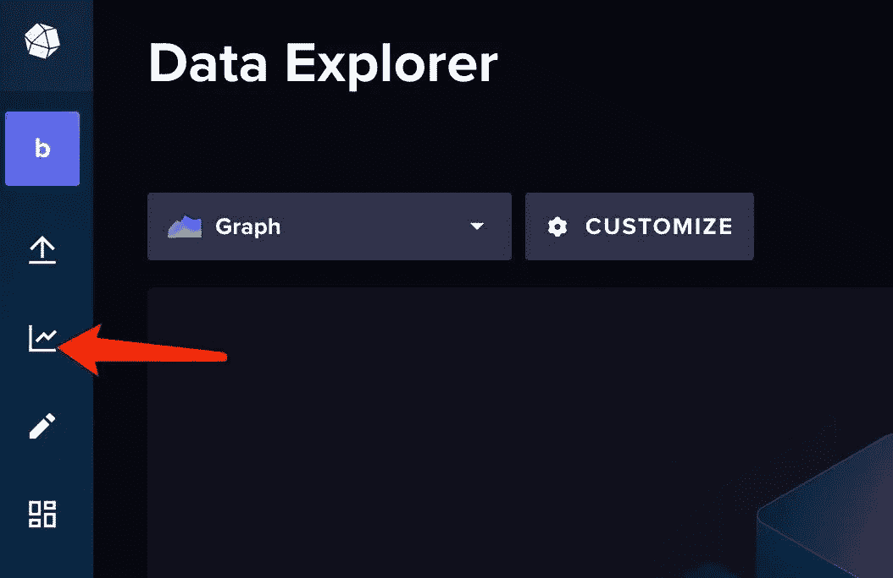

转到数据浏览器

让我们回到 InfluxDB Cloud，单击左侧菜单中的“数据浏览器”图标打开数据浏览器。

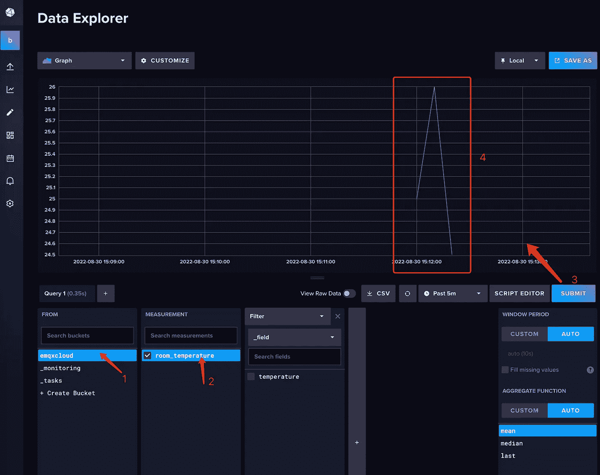

进行查询以获取数据

通过设置 FROM，MEASUREMENT 在 UI 上创建一个查询，然后单击 submit 按钮，您应该能够看到数据图表。这证明你发送到 EMQX Cloud 的数据已经成功持久化到 InfluxDB Cloud。

# 摘要

现在，无需一行代码，您就可以使用 EMQX Cloud 从任何使用标准 MQTT 协议的设备或客户端获取数据，并专注于使用 InfluxDB Cloud 中持久存储的数据编写您的物联网应用程序。

在不到 10 分钟的时间内，您可以利用来自 EMQX Cloud 和 InfluxDB Cloud 的服务以及新的本机 MQTT 收集器，获得从接收到持久化的完整数据流。