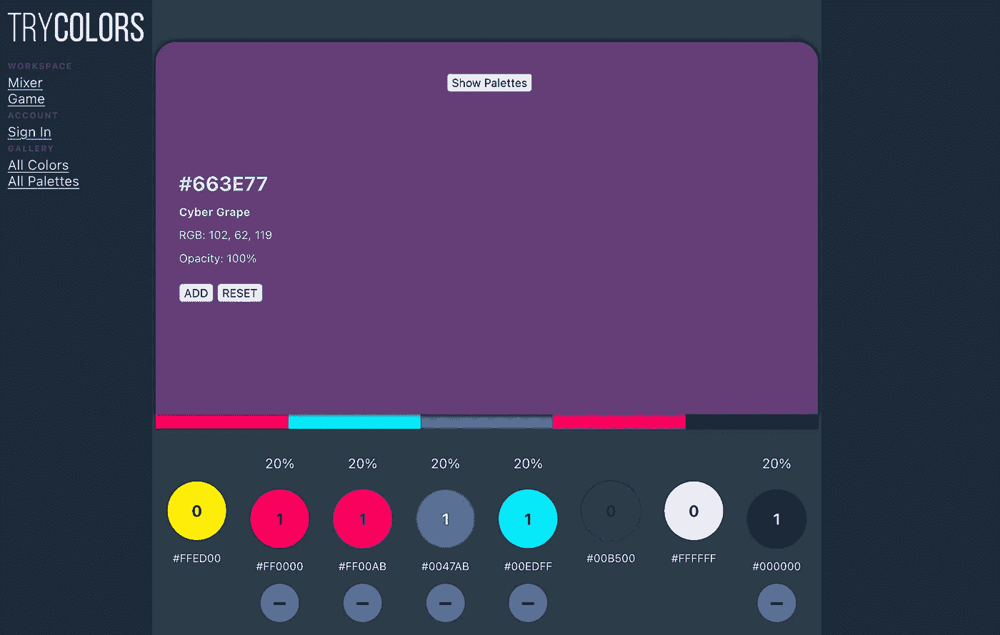
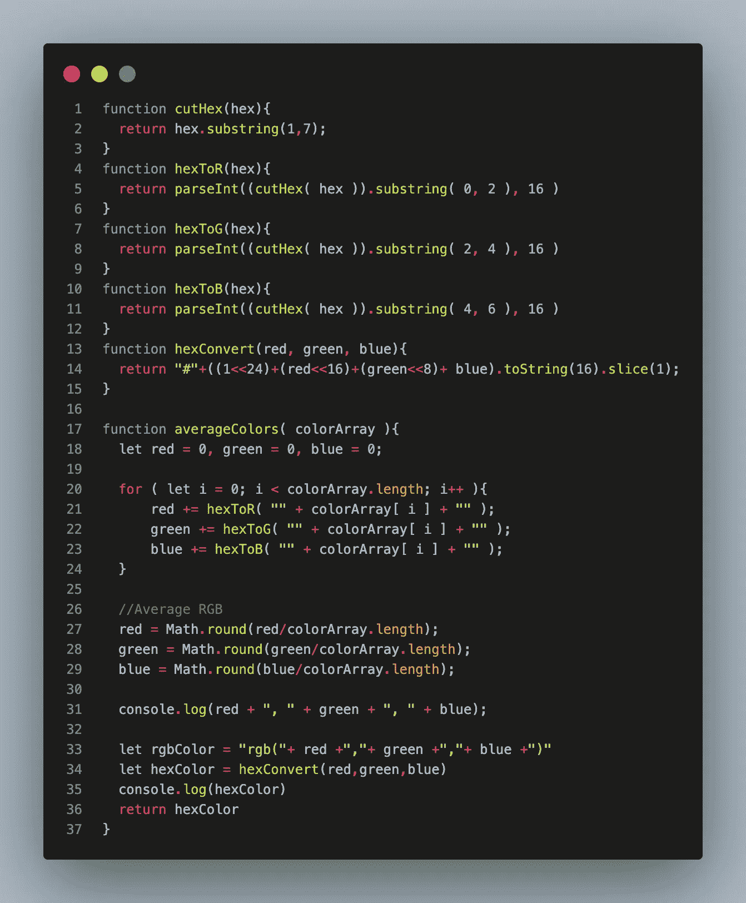
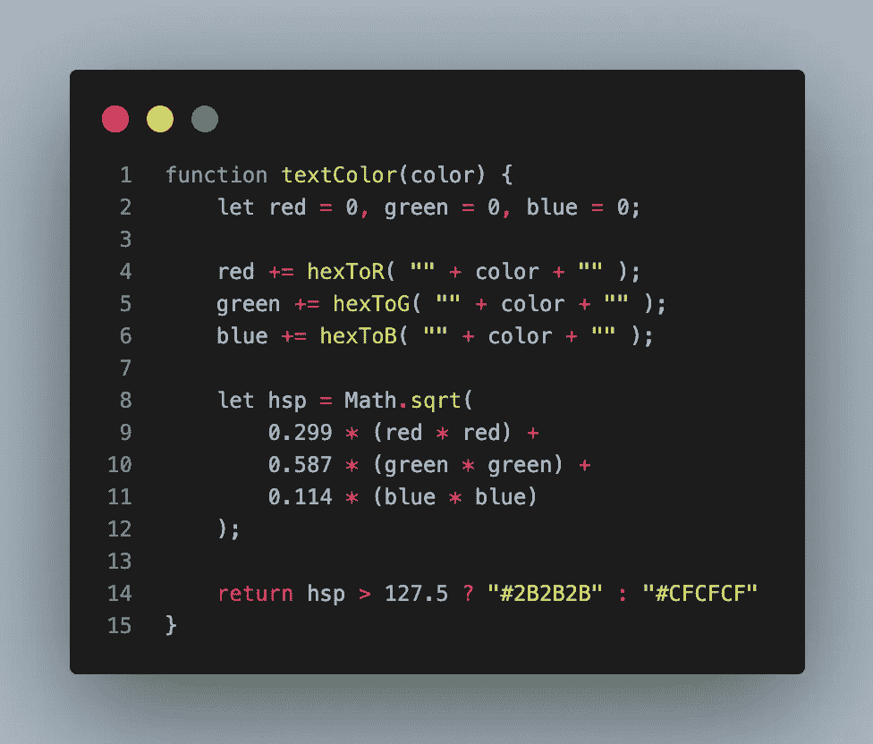
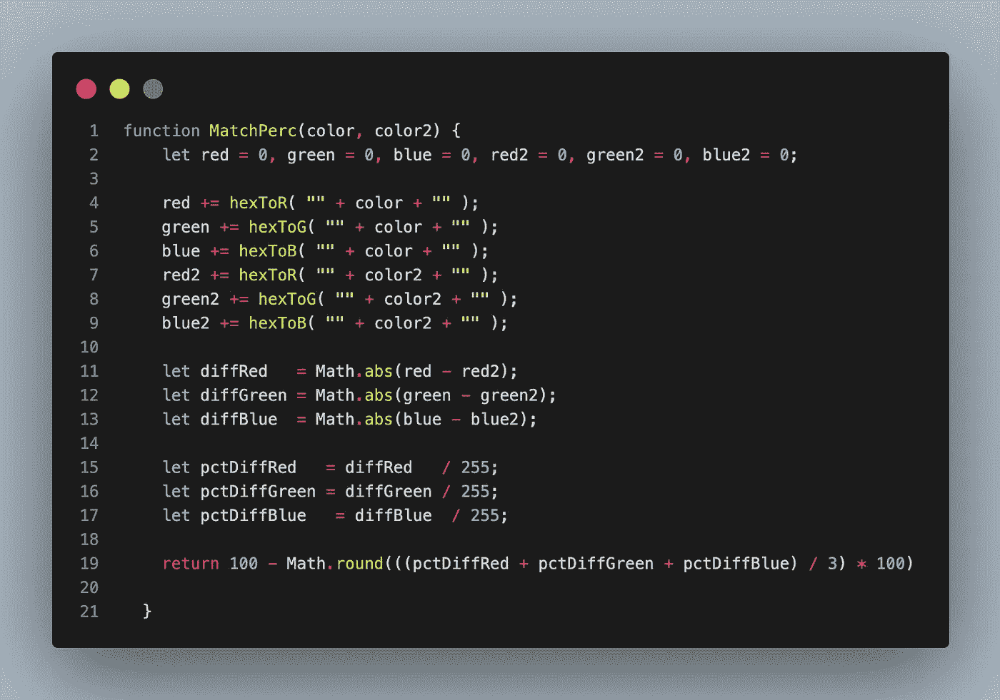

# 克服你的忧郁

> 原文：<https://blog.devgenius.io/getting-over-your-rgblues-b29eef662670?source=collection_archive---------17----------------------->

在网页开发和用户界面/UX 设计中，你会经常遇到一些没有正确答案的风格问题。你将有你想要你的网站做什么和应该如何组织的基础，但是选择一个按钮看起来像什么或者一个表单应该如何呈现给用户是一件完全不同的事情。在这篇文章中，我将深入到这个过程的颜色部分，以及一些在这个过程中帮助我的函数。

试色——混色克隆&我的顶点项目

## ***平均十六进制颜色***

无论是在《我的世界》还是在 MS Paint 中，您总是希望使用一组互补的颜色(称为调色板)来构建和创建项目。对于画画的人来说，这个调色板可以有 2 到 9 种颜色，这还不包括调色板上已经有的颜色。对于开发人员和设计师来说，三到六种颜色通常是一个详细但不令人窒息的设计的最佳选择。

这就是平均十六进制颜色的能力非常有用的地方。众所周知，每种颜色在色轮上都有相反的颜色:红色到绿色，紫色到黄色，蓝色到橙色。不太为人所知的是如何混合这两种颜色的直接对比。平均任何两个十六进制或 RGB 颜色允许您有第三个变量来玩，以及继续添加颜色值到该颜色，以便有一个直接的联系。

平均颜色功能&伴随前辈

averageColors 函数的工作原理是获取一组十六进制颜色，将它们切割成 **R** ed、 **G** reen 和 **B** lue 值，并在预处理器函数中将这些值从基数 16 转换为基数 10。然后，它获取每种颜色的 RGB 值，并将其添加到总的 ***红色*** 、 ***绿色*** 和 ***蓝色*** 变量中，这些变量除以颜色数组的长度。总之，它让您可以选择返回 RGB 值或十六进制值。

## 光度的细微差别

在弄清楚你的 web 应用程序的调色板之后，你可能不得不在作为背景的颜色上显示文本或数字。这方面的例子可以在文章开头我的 web 应用的截图中看到。您可以在底部添加的颜色都有不同的亮度和暗度，这要求内部的数字要么是米色，要么是更适合它的炭黑色。

颜色的这种属性称为亮度，是衡量颜色在色标上接近白色或黑色程度的基本标准。虽然光度本身是所有颜色的线性标度，但感知的光度是由达雷尔·芬利在 2006 年创建的一条名为 [**HSP**](https://alienryderflex.com/hsp.html) 的曲线。他基本上描述了人眼如何在二次标度上感知某些基色比其他基色更亮。绿色是最明亮的颜色，其次是红色，大约是红色的一半，蓝色大约是红色的三分之一。

光度函数

## 颜色接近度

最后一个有用的颜色函数是匹配百分比函数。该函数将采用两种十六进制颜色，并给出颜色一与目标颜色二的匹配百分比。我发现，经常在浏览其他网站时，我会找到一种我特别喜欢的颜色，并想用在我的项目中，但不确定它与我已经在使用的颜色相比如何。一旦我从 colorZilla 扩展中获得了十六进制值，我就能够看到这种颜色与调色板中的其他颜色有多接近，以及它是否值得使用。90%以上的颜色通常太接近于已经存在的颜色。虽然这个函数比其他两个简单，但是它有同样多的用途，并且是一个非常有趣的游戏。

颜色邻近函数

百分比差异实际上是每个 RGB 值的百分比差异的平均值。这意味着函数也可以返回 RGB 的单个百分比匹配，而不仅仅是整个颜色本身。

## 结论

这个项目有很多挑战，但让我不仅更加熟悉前端开发，还熟悉了与 Hex 和 RGB 有关的一切。后端开发并不是提高你批判性思维技能的唯一途径，只要你挑战自己，弄清楚如何处理看似复杂的事情。我很高兴我选择做这个项目，并希望它能启发你克隆自己的梦想网络应用程序。

请随意在 Medium 上给我发 DM，或者在我的个人资料上查看我的 LinkedIn。

## 参考资料:

**试色回购:**

 [## GitHub-JonathanLaureano/try colors

### 在 GitHub 上创建一个帐户，为 JonathanLaureano/TryColors 的开发做出贡献。

github.com](https://github.com/JonathanLaureano/TryColors) 

**平均颜色:**

 [## 在 javascript 中平均两个十六进制颜色

### 好吧，我想我会把这个问题抛给大家去思考。给定一个函数(用 javascript 编写)…

stackoverflow.com](https://stackoverflow.com/questions/6367010/average-2-hex-colors-together-in-javascript/32272691) 

**文本颜色**:

 [## 确定 RGB 颜色感知亮度的公式

### 唯一准确的答案是@jive-dadson 和@ EddingtonsMonkey 的答案，作为支持…

stackoverflow.com](https://stackoverflow.com/questions/596216/formula-to-determine-perceived-brightness-of-rgb-color) 

**ColorZilla:**

 [## Chrome 的 ColorZilla

### ColorZilla for Google Chrome 是一个扩展，可以帮助 web 开发人员和图形设计人员完成与颜色相关的任务…

www.colorzilla.com](https://www.colorzilla.com/chrome/)