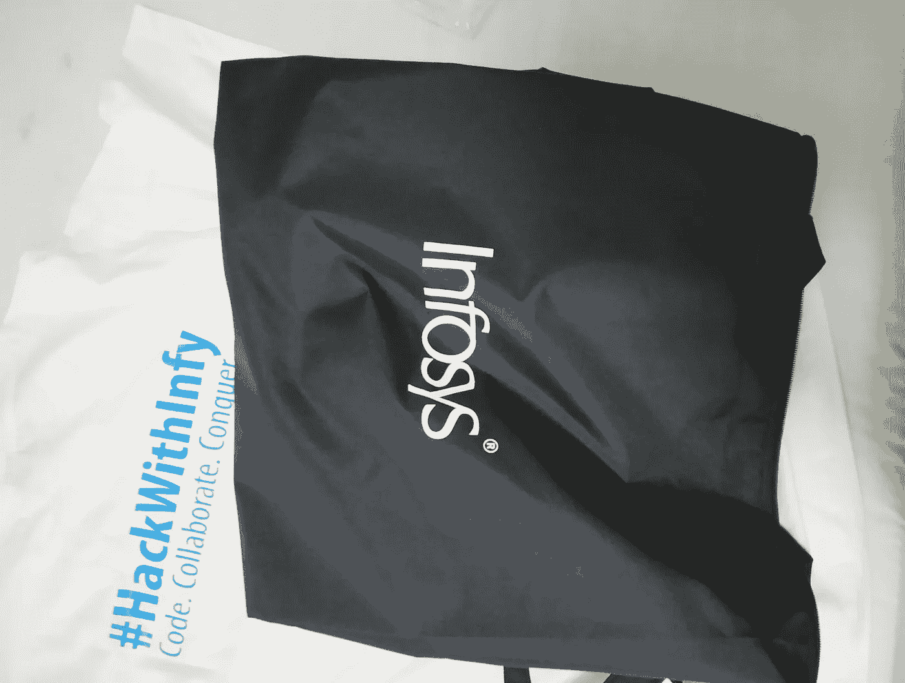
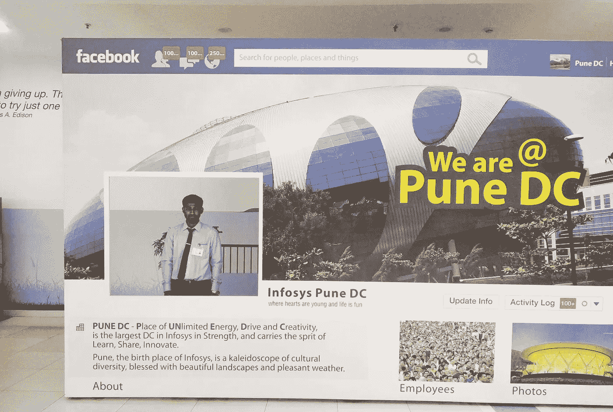
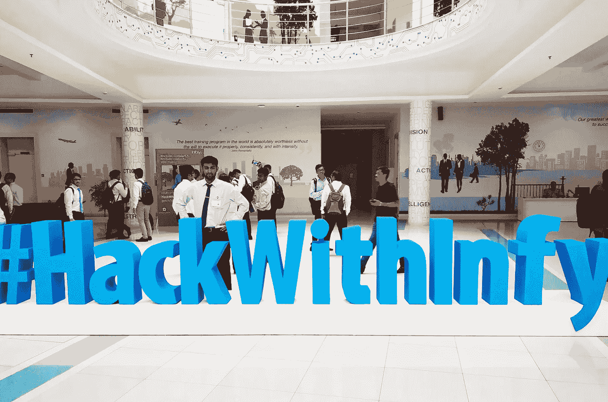

# 通过 HackWithInfy 和经验获得强大的程序员角色！

> 原文：<https://blog.devgenius.io/getting-power-programmer-role-through-hackwithinfy-and-experience-a1a34aa8b9a8?source=collection_archive---------11----------------------->

 [## Ketan Anand -软件工程师助理- Gap 公司| LinkedIn

### 查看 Ketan Anand 在全球最大的职业社区 LinkedIn 上的个人资料。科坦有两个工作列在他们的…

www.linkedin.com](https://www.linkedin.com/in/ketanand8/) 

*免责声明* : *此处提及的所有观点和观点纯属本人观点。*

嗯！现在你在这里，所以我想你一定听说过 Infosys 每年为毕业班学生举办的这个 **#HackWithInfy** 。

如果没有，你可以了解更多关于它和如何参与等..这里 [*链接*](https://www.infosys.com/careers/hackwithinfy.html) 。

印度各地的许多大学都有大量参与，2018 年约有 5 万名学生，2019 年翻了一番，达到约 10 万名。

当你进入最后一年的时候，将会有两轮**在线编码**在 HackerRank 平台上进行

**第一轮** —编码

这一轮有 3 个问题，以数学、字符串操作、图形、DP、贪婪和数据结构为基础，难度中等。

你必须解决这三个问题才能进入下一轮。他们将选择大约前 10%的参与者。

**第二轮** —编码

这和第一轮一样，有 3 个问题，但难度更大。

你需要尽快解决所有问题才能进入前 100 名。

你可能无法解决所有问题，但根据你的级别，你仍会接到电话。

你可能会被选中参加高级程序员和 SEC 职位的面试。

如果你做得足够好，在 20 天左右的时间里进入前 100 名，你将会接到 Infosys 的邀请电话，邀请你去他们的校园，然后是旅行细节沟通…

如果你通过了每一轮面试，或者被邀请去他们美丽的印孚瑟斯园区，那么**恭喜**！！！

既然你已经进了他们的校园，参加了他们的欢迎仪式。您的好东西正在等待您的入住。

对不起，2020 年的人，你是例外，你可能没有机会体验美妙的款待，你知道为什么:(，但我希望实际上将是和可怕的经验！

现在到达这里，在 24 小时黑客马拉松开始之前，您将对 **Power 程序员、**进行岗前面试。

**第三轮** —技术面试

你会得到一个编码难题，面试官会给你大约 5 分钟时间思考。对我来说，这是一个基于树的问题，可以使用 dfs 和哈希来解决。给出逻辑和解释后，你必须把它写在纸上，并被要求在一个测试案例中进行测试。

然后是堆栈、队列、BFS、红黑树、二叉树、B+树、最短路径算法等基本问题。

之后面试官会问一些关于数据库管理系统、操作系统和网络的 CS 基础问题，然后是关于你的项目和实习的问题。

这一轮大约 1 小时。

**第四轮也是最后一轮—** 小时

这一轮更多的是在行为方面。

在你介绍完之后，你会先被问到你的缺点和优点。你可能会被问到你的爱好等等。之后他们可能会问，在 Infosys Mysore 培训 6 个月后，你更喜欢哪个工作地点。

嗯！！这意味着你得到了它。

现在你可以享受他们全天组织的各种活动，然后是第二天的黑客马拉松。

以上几点都是根据我 2018 年**在 **#HackWithInfy @** 印孚瑟斯普纳 DC 的经历。**

下面是活动现场的一些图片！！

我说过的好东西！！

感谢您的阅读，希望这对您的旅程有所帮助！我很乐意帮助你解决你的问题，你可以在这里给我回复，也可以在 LinkedIn 上联系我。

干杯！！