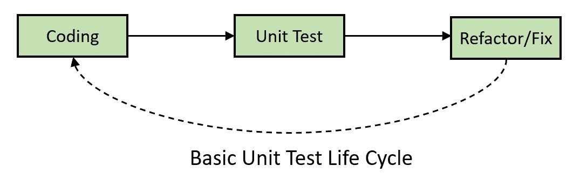
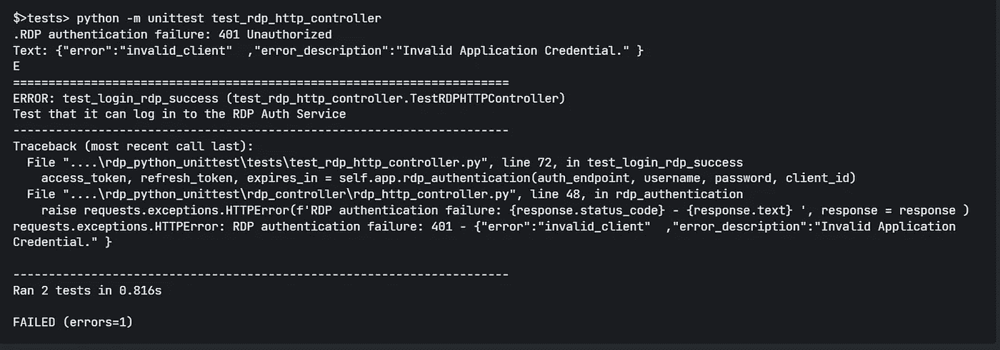
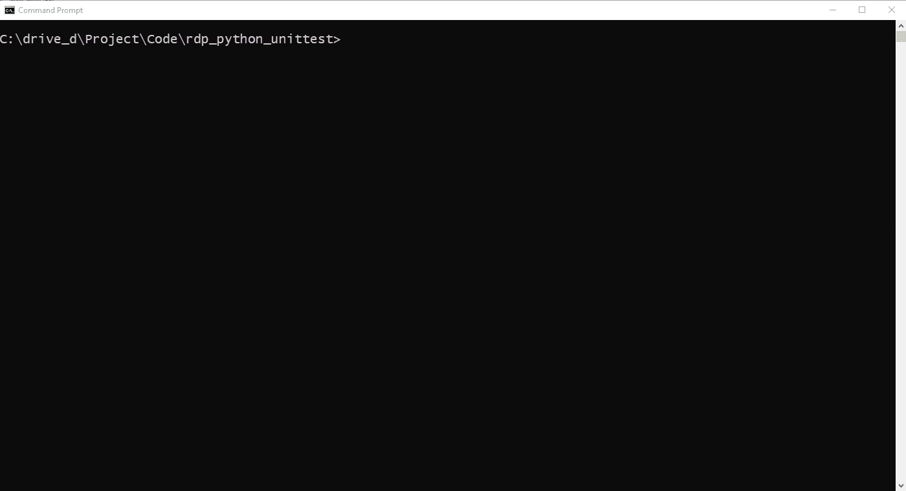
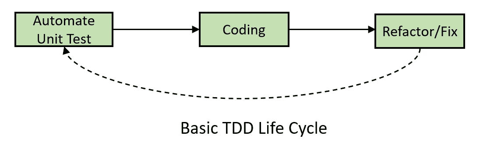

# 使用 Python 对 HTTP REST 应用程序进行单元测试

> 原文：<https://blog.devgenius.io/getting-start-unit-test-for-an-http-rest-application-with-python-c57810cc4e56?source=collection_archive---------16----------------------->

# 介绍

最近更新时间:2022 年 7 月

关于[路孚特开发者社区](https://developers.refinitiv.com/)的原文可从[这里](https://developers.refinitiv.com/en/article-catalog/article/getting-start-unit-test-for-an-http-rest-application-with-python)获得。

如今，应用程序更大、更复杂。为添加更多功能或修复错误而对源代码进行的一些更改可能会导致应用程序出现意外行为。开发人员不能再等待 QA 团队的测试结果了。他们需要定期进行单元测试，作为开发过程中不可或缺的一部分。

单元测试是一种软件测试方法，帮助开发人员验证是否有任何更改破坏了代码。单元测试显著提高了代码质量，节省了在开发生命周期的早期发现软件缺陷的时间，并提高了部署速度。单元测试目前是现代敏捷软件开发实践的主要过程，如 CI/CD(持续集成/持续交付)、TDD(测试驱动开发)等。

现代应用程序还需要连接到其他服务，如 API、数据库、数据存储等。单元测试也需要覆盖那些模块。这个示例项目展示了如何为执行 HTTP REST 操作的 [Python](https://www.python.org/) 应用程序运行单元测试用例，HTTP REST 操作是当今应用程序功能中最基本的任务。通过单元测试，开发人员可以验证他们的代码是否可以在任何代码更新中通过 HTTP REST API 连接和使用内容。

演示应用程序使用事实上的[请求](https://requests.readthedocs.io/en/latest/)库连接到[路孚特数据平台(RDP)API](https://developers.refinitiv.com/en/api-catalog/refinitiv-data-platform/refinitiv-data-platform-apis)作为示例 HTTP REST APIs，并使用 Python 内置的 [unittest](https://docs.python.org/3.9/library/unittest.html) 作为测试框架。

**注意**:本文没有涵盖 HTTP 操作和所有 RDP API 服务的所有测试用例。它旨在让读者了解如何对仅使用 Python 进行 HTTP 连接的应用程序进行单元测试。

# 单元测试概述

[单元测试](https://en.wikipedia.org/wiki/Unit_testing)是最小的测试，主要检查应用程序的单个部分是否正确运行。它将应用程序分解成最小的、隔离的、可测试的组件，称为*单元*，然后单独测试它们。该单元主要是应用程序源代码中的函数或方法调用或过程。开发人员和 QA 可以通过向单元发送任何数据来测试每个单元，并查看它是否按预期运行。

单元测试有助于开发人员隔离应用程序中的问题，这比将整个系统作为一个整体进行测试更容易、更快。这是集成测试之前开发过程中完成的第一级测试。这主要是由开发人员自动或手动完成的，以验证他们的代码。



您可以从以下资源中找到有关单元测试概念的更多详细信息:

*   [Python 指南:测试代码](https://docs.python-guide.org/writing/tests/)文章。
*   [如何以及何时正确使用单元测试](https://softwareengineering.stackexchange.com/questions/89064/how-and-when-to-use-unit-testing-properly)帖子。

# Python 单元测试框架简介

[单元测试](https://docs.python.org/3.9/library/unittest.html)是一个 Python 构建的单元测试框架。它支持**测试用例**(测试的单个单元)和**测试运行器**(为运行测试用例而设计的特殊应用程序，并提供输出结果)。

单元测试框架有以下要求:

1.  测试用例必须是该类的方法。
2.  该类必须定义为`unittest.TestCase`类的子类。
3.  在`unittest.TestCase`类中使用一系列特殊的断言方法，而不是内置的断言语句。
4.  方法名必须以字母`test`开头，作为测试运行程序的命名约定。
5.  测试用例文件名必须以`test_`开头，作为测试运行程序的命名约定。

来自 [unittest 官方页面](https://docs.python.org/3.9/library/unittest.html)的示例:

要运行测试，只需运行以下命令:

```
python -m unittest test_sample
```

结果:

```
..
----------------------------------------------------------------------
Ran 2 tests in 0.000sOK
```

您可以从以下资源中找到有关 unittest 框架的更多详细信息:

*   unittest 标准库文档。
*   [Python 测试入门](https://realpython.com/python-testing/)。

# 什么是路孚特数据平台(RDP)API？

[路孚特数据平台(RDP)API](https://developers.refinitiv.com/en/api-catalog/refinitiv-data-platform/refinitiv-data-platform-apis)通过易于使用的基于网络的 API 为开发者提供各种路孚特数据和内容。

RDP API 使开发人员能够无缝、全面地访问所有路孚特内容，如环境、社会和治理(ESG)、新闻、研究等，并通过单一界面与他们的内容混合、丰富、集成和分发数据，交付到他们需要的任何地方。RDP API 交付机制如下:

*   请求—响应:RESTful web 服务(HTTP GET、POST、PUT 或 DELETE)
*   警报:传递是一种接收订阅的异步更新(警报)的机制。
*   批量:交付大量有效负载，如整个场馆的日终定价数据。
*   流式传输:实时传递消息。

这个示例项目只关注请求-响应:RESTful web 服务交付方法。


有关路孚特数据平台的更多详细信息，请参见以下 API 资源:

*   [快速启动](https://developers.refinitiv.com/en/api-catalog/refinitiv-data-platform/refinitiv-data-platform-apis/quick-start)页面。
*   [教程](https://developers.refinitiv.com/en/api-catalog/refinitiv-data-platform/refinitiv-data-platform-apis/tutorials)页面。

# RDP API 应用工作流

路孚特数据平台授权检查基于 OAuth 2.0 规范。应用程序工作流的第一步是从 RDP 身份验证服务获取令牌，这将允许访问受保护的资源，即数据休息 API。

API 需要以下访问凭据信息:

*   用户名:用户名。
*   密码:与用户名关联的密码。
*   客户端 ID:这也称为`AppKey`，它是使用 App 密钥生成器生成的。这个唯一标识符是为用户或应用程序定义的，并且被认为是机密的(不在用户之间共享)。client_id 参数可以在请求正文中传递，也可以作为编码为 base64 的“授权”请求头传递。

一旦身份验证成功，该函数将获得 RDP 身份验证服务响应消息，并将以下 RDP 令牌信息保存在变量中。

*   **access_token** :用于调用 REST 数据 API 调用的令牌，如上所述。应用程序必须保留此凭据，以备 RDP API 进一步请求。
*   **refresh_token** :刷新令牌，用于在到期前获取更新后的接入令牌。应用程序必须保留此凭据以进行访问令牌续订。
*   **expires_in** :访问令牌有效时间，以秒为单位。

接下来，在应用程序从 RDP 身份验证服务收到访问令牌(和授权令牌)后，所有后续的 REST API 调用都将使用这个令牌来获取数据。请在以下资源中找到有关 RDP API 工作流程的更多详细信息:

*   [RDP API:请求-响应 API 简介](https://developers.refinitiv.com/en/api-catalog/refinitiv-data-platform/refinitiv-data-platform-apis/tutorials#introduction-to-the-request-response-api)页面。
*   [RDP API:授权—关于令牌的所有信息](https://developers.refinitiv.com/en/api-catalog/refinitiv-data-platform/refinitiv-data-platform-apis/tutorials#authorization-all-about-tokens)页面。

# 项目结构

这个示例项目是一个 Python 控制台应用程序，它登录到 RDP 平台，然后分别从 RDP 的环境、社会和治理(ESG)服务和 Search Explore 服务请求公司的 ESG 数据和元信息。项目结构如下:

*   app.py:主控制台应用程序。
*   RDP _ controller/RDP _ http _ controller . py:主 HTTP 操作类。这是我们单元测试的聚焦类。
*   tests/test _ rdp_http_controller.py:测试所有 RDP _ http _ controller . py 类的方法的主测试用例类。这是我们在这个项目中的焦点测试套件。
*   tests/test_app.py:测试一些 app.py 方法的测试套件类。
*   测试/夹具:测试套件夹具/资源文件。

# 单元测试 RDP API 认证

让我们从使用 RDP 服务操作 HTTP 请求-响应消息的类开始。`rdp_controller/rdp_http_controller.py`类使用请求库通过 RDP HTTP REST API 发送和接收数据。RDP 身份验证的代码如下所示。

上面的`rdp_authentication()`方法只是创建请求消息有效负载，并将其作为 HTTP Post 请求发送给 RDP 验证服务。返回值可能如下所示

*   如果身份验证成功，则向调用者返回 access_token、refresh_token 和 expires_in 信息。
*   如果 URL 或凭据参数为空或没有，则向调用方引发 TypeError 异常。
*   如果身份验证失败，向调用者发出请求的 HTTPError 异常，并提供 HTTP 状态响应信息。

让我们把`rdp_authentication()`方法留在那里，继续测试用例。基本的测试用例场景是检查`rdp_authentication()`方法是否可以处理有效的 RDP 登录和空参数场景。

测试类是`tests\test_rdp_http_controller.py`文件(请注意一个*测试*文件夹)。它从一个`.env.test`环境变量文件中加载测试配置，比如 RDP API URL。

`setUpClass()`是一个类方法，在所有测试之前，整个类只调用一次。该函数对于设置 *fixture* 很有用，fixture 可以是样本数据、前提条件状态、上下文或运行测试所需的资源。我们初始化 RDPHTTPController 对象(作为`app`类变量)和 RDP 基本 URL 字符串(作为`base_URL`类变量)作为我们在这里的夹具。

注意:`setUpClass()`方法的对应方法是`tearDownClass()`，在类中的所有测试运行后调用。

`test_login_rdp_success()`是成功的 RDP 认证登录场景的测试用例。它只是将 RDP 身份验证服务 URL 和 RDP 凭证发送给`rdp_authentication()`方法，并检查响应令牌信息。请注意，单元测试只关注 rdp_authentication()是否返回非空/零令牌信息。令牌内容验证将处于系统测试(或稍后)阶段。

请在[单元测试框架](https://docs.python.org/3.9/library/unittest.html)页面上查看关于支持的断言方法的更多详细信息。

`test_login_rdp_none_empty_params()`是一个测试用例，它检查`rdp_authentication()`方法是否像预期的那样处理空参数或无参数(抛出 TypeError 异常，不向调用者返回令牌信息)。

测试运行结果的示例如下所示。

```
$>tests> python -m unittest test_rdp_http_controller
.Authentication success
.
----------------------------------------------------------------------Ran 2 tests in 0.014sOK
```

如果您在一个`.env.test`文件中输入了无效的 RDP 凭证，一个测试运行程序会显示以下测试失败的结果(不要担心，我将在后面介绍失败的测试案例)。



然而，上面的测试套件在每次运行时都会向 RDP API 发出 HTTP 请求。当开发人员更新了代码或配置后，每次运行测试套件时，向外部服务发送大量请求并不是一个好主意。

单元测试用例应该能够独立运行，而不依赖于外部服务或 API。外部依赖给单元测试用例增加了不可控因素(如网络连接、数据可靠性等)。这些组件到组件的测试应该在集成测试阶段完成。

那么，我们如何在不向实际服务器发送任何 HTTP 请求消息的情况下对 HTTP 请求方法调用进行单元测试呢？幸运的是，开发人员可以用模拟对象来模拟 HTTP 请求和响应消息。

# 用响应模仿 Python HTTP API 调用

mock 是一个伪造的对象，它被构造成在测试环境中看起来和行为上都像真实的数据。我们可以用一个模仿对象来模拟真实数据的各种场景，然后使用一个模仿库来欺骗系统，让它认为这个模仿是真实的。

模仿的目的是隔离并关注被测试的代码，而不是外部依赖的行为或状态。通过模仿外部依赖，开发人员可以经常运行测试，而不会受到那些依赖的任何意外变化或不规则性的影响。如果开发人员必须测试获取大量数据的 HTTP 请求，模拟还可以帮助他们节省时间和计算资源。

这个示例项目使用了专门为模仿请求库而构建的 [Responses](https://github.com/getsentry/responses) 库。

# 向测试用例添加一个模拟对象

因此，我将从一个模拟对象开始，测试一个成功的 RDP 登录案例。首先，在 *tests/fixtures* 文件夹中创建一个*rdp _ test _ auth _ fixture . JSON*fixture 文件，其中包含 RDP 认证成功响应消息的虚拟内容。

接下来，将`setUpClass()`方法中的这个*RDP _ test _ auth _ fixture . JSON*文件加载到一个`mock_valid_auth_json`类变量中。其他测试用例可以将这个模拟 json 对象用于虚拟访问令牌信息。

响应库允许开发人员向请求库注册模拟响应，并用`responses.activate`装饰器覆盖测试方法。开发人员可以通过一个`responses.add()`方法指定请求的端点 URL、HTTP 方法、状态响应、响应消息等。

示例代码:

上面的代码用[*https://api.refinitiv.com/auth/oauth2/v1/token*](https://api.refinitiv.com/auth/oauth2/v1/token)URL 和 HTTP *POST* 方法设置了一个响应模拟对象。然后，请求库返回一个带有 HTTP 状态 200 和内容类型*应用程序/json* 的`mock_valid_auth_json` JSON 消息给所有 HTTP *POST* 请求消息到[](https://api.refinitiv.com/auth/oauth2/v1/token)*URL 的应用程序，而不需要机器和实际 RDP 端点之间的任何网络操作。*

# *测试无效的 RDP 身份验证请求-响应*

*这个模拟对象对于测试错误情况也很有用，比如无效登录。`test_login_rdp_invalid()`方法是 RDP 认证登录失败场景的测试用例。我们为[*https://api.refinitiv.com/auth/oauth2/v1/token*](https://api.refinitiv.com/auth/oauth2/v1/token)URL 和 HTTP *POST* 方法设置了一个响应模拟对象，带有预期的错误响应消息和状态(401 -未授权)。*

*一旦调用了`rdp_authentication()`方法，测试用例将验证该方法是否引发了带有预期错误消息和状态的`requests.exceptions.HTTPError`异常。测试用例还做出断言来检查方法是否没有向调用者返回令牌信息。*

*有了 mocking，测试用例永远不需要向 RDP API 发送实际的请求消息，所以我们也可以为其他 RDP 服务测试更多的场景。*

# *RDP API 数据请求的单元测试*

*这让我们需要 RDP 原料药的数据。所有后续的 REST API 调用都通过如下所示的*授权* HTTP 请求消息头使用访问令牌来获取数据。*

*   *表头:授权= `Bearer <RDP Access Token>`*

*请注意`Bearer`和`RDP Access Token`值之间的间隔。*

*然后，应用程序根据感兴趣的服务创建 JSON 消息格式或 URL 查询参数的请求消息，并将其作为 HTTP 请求消息发送给服务端点。开发人员可以从路孚特数据平台的 [API 游乐场页面](https://api.refinitiv.com/)获得 RDP API 服务端点、HTTP 操作和参数——这是一个交互式文档网站，开发人员一旦拥有有效的路孚特数据平台帐户就可以访问。*

*示例控制台应用程序使用来自以下 RDP 服务的内容:*

*   *ESG 服务`/data/environmental-social-governance/<version>/views/scores-full`为消费者提供路孚特专有 ESG 分数全覆盖和完整历史的端点。*
*   *Discovery Search 探索服务`/discover/search/<version>/explore`基于搜索选项探索路孚特数据的端点。*

*然而，这篇开发文章只涵盖了 ESG 服务测试用例。Discovery Search Explore 服务的测试用例与 ESG 的测试用例具有相同的测试逻辑。*

# *RDP ESG 服务的单元测试 HTTP 请求源代码*

*现在让我来测试环境、社会和治理(ESG)服务端点。用于请求 ESG 数据的`rdp_controller/rdp_http_controller.py`类中的代码如下所示。*

*上面的`rdp_request_esg()`方法只是创建请求消息有效负载，并使用请求`requests.get()`方法将其作为 HTTP GET 请求发送给 RDP ESG 服务。返回值可能如下所示*

*   *如果请求成功(HTTP 状态为 200)，则以 JSON 消息格式返回响应数据。*
*   *如果 URL 或访问令牌或 universe 值为空或无，则向调用方引发 TypeError 异常。*
*   *如果请求失败，用 HTTP 状态响应信息向调用者引发请求的 HTTPError 异常。*

# *测试有效的 RDP ESG 请求-响应*

*第一个测试用例是请求成功场景。首先，我将创建一个包含有效 ESG 虚拟响应消息的 fixture 文件。一个文件是*测试/夹具*文件夹中的*RDP _ test _ ESG _ fixture . JSON*。*

*接下来，在 test_rdp_http_controller.py 文件中创建`test_request_esg()`方法来测试最简单的测试用例，即成功的 ESG 数据请求-响应场景。这个方法用 HTTP *GET* 方法为 RDP `https://api.refinitiv.com/data/environmental-social-governance/v2/views/scores-full`端点 URL 创建一个模拟对象。*

*当请求库接收到针对该 URL 的 HTTP GET 请求时，它会向应用程序返回一个模拟 ESG 数据 JSON 对象，该对象具有 HTTP 状态 *200* 和内容类型 *application/json* 。然后，`test_request_esg()`方法验证响应数据是否在 JSON/ [字典](https://docs.python.org/3.9/tutorial/datastructures.html#dictionaries)类型中，并检查消息是否包含基本 ESG 字段。*

# *测试使用过期令牌请求 RDP ESG 数据*

*这将我们带到一个最常见的 RDP API 故障场景，应用程序使用过期的访问令牌从 RDP 请求数据。`test_request_esg_token_expire()`方法是使用 RDP ESG 服务测试这种情况的方法。*

*第一步是创建一个 JSON 文件`tests/rdp_test_token_expire_fixture.json`作为测试夹具，内容如下。*

*所有 RDP 数据服务使用相同的令牌过期错误消息，所以我们加载这个 fixture 文件作为一个名为`mock_token_expire_json`的类变量，在所有测试用例方法中使用。*

*令牌过期错误消息从 RDP 服务发送到具有 HTTP 错误状态的应用程序(401 — **截至 2022 年 7 月**),`test_request_esg_token_expire()`方法使用模拟对象模拟令牌过期错误消息和 HTTP 401 状态，如下所示。*

*接下来，这个测试用例验证`rdp_request_esg()`方法是否用预期的错误消息和状态引发了`requests.exceptions.HTTPError`异常。*

*另一个常见的 RDP API 失败场景是应用程序向 RDP 发送请求消息，而在 HTTP 请求头中没有访问令牌。然而，*访问令牌*是`rdp_request_esg()`方法所需的参数之一。如果访问令牌不存在(无或为空)，该方法将引发 TypeError 异常，并且不向 RDP 发送 HTTP 请求消息。`test_request_esg_none_empty()`方法是覆盖这个测试用例的方法。*

# *测试使用无效项目请求 RDP ESG 数据*

*现在我们来看看其他常见的测试案例，如果用户从 RDP ESG 服务请求无效的商品名称数据，该怎么办？我们也可以使用模拟对象来模拟无效的项目请求-响应消息。*

*当 ESG 服务接收到带有无效项目名称的请求消息时，它将以下错误响应消息作为 HTTP Status *200* (从 2022 年 7 月起**)返回给应用程序:***

***`test_request_esg_invalid_ric()`方法向请求库设置一个模拟无效项请求-响应消息，并检查`rdp_request_esg()`方法是否如预期的那样返回带有 HTTP status *200* 的错误消息。***

***关于用请求和响应库对 Python HTTP 代码进行单元测试，我要说的就是这些。***

# ***先决条件***

***这个演示项目需要下列依赖项。***

1.  ***RDP 访问凭据。***
2.  ***Python [Anaconda](https://www.anaconda.com/distribution/) 或 [MiniConda](https://docs.conda.io/en/latest/miniconda.html) 分发/包管理器。***
3.  ***[Docker 桌面/引擎](https://docs.docker.com/get-docker/)用 Docker 运行测试套件的应用。***
4.  ***互联网连接。***

***请联系您的路孚特代表，以帮助您访问 RDP 帐户和服务。您可以找到关于从租约设置的 RDP 访问凭据的更多详细信息，请参见[路孚特数据平台](https://developers.refinitiv.com/en/article-catalog/article/getting-start-with-refinitiv-data-platform)文章的*用户 ID* 部分。***

# ***如何运行示例测试套件***

***第一步是将示例项目文件夹解压缩或下载到您选择的目录中，然后根据您的偏好设置 Python 或 Docker 环境。***

# ***在 Docker 中运行示例测试套件***

***首先，在你的机器上启动一个 Docker 桌面或者 Docker 引擎。***

***然后打开控制台，转到*项目根目录*，运行下面的命令来构建 Docker 映像。***

```
***$> docker build . -t python_unittest***
```

***构建完成后，使用以下命令运行 Docker 容器:***

```
***$> docker run -it --name python_unittest python_unittest***
```

***要停止和删除 Docker 容器，按下 *Ctrl+C* (或运行*Docker stop python _ unittest*)然后运行以下命令:***

***$> docker rm python_unittest***

******

***这涵盖了如何运行一个示例测试套件。***

# ***结论和下一步措施***

***单元测试现在是现代和遗留应用软件开发生命周期的强制性过程。它有助于暴露应用程序一小部分的非故意行为，比试图在一个大的复杂阶段找到 bug 更快。它加速了整个反馈循环，并提高了项目团队之间的信任。单元测试还有助于提高应用程序源代码的质量，开发人员在重构源代码以获得更好的性能和更干净的代码时更有信心。作为这篇文章的作者，我也从这个项目中学到了很多。有很多错误处理程序或代码逻辑是我在开始编写单元测试用例之前从未想到过的。***

***这个示例项目演示了手动单元测试方法。然而，开发人员应该在每次对代码(或配置)进行更改时自动运行单元测试用例。最实用的技术是运行自动化单元测试，作为开发人员持续集成/持续交付(CI/CD)管道的一部分。开发人员也可以应用 TDD(测试驱动开发)方法，在为他们的项目编写新代码之前，编写并纠正失败的测试。***

******

***[unittest](https://docs.python.org/3.9/library/unittest.html) 框架和 [Responses](https://github.com/getsentry/responses) mocking 库是学习使用 [Python](https://www.python.org/) 进行单元测试和构建一个简单测试套件来测试 HTTP 操作源代码的很好的起点。如果开发人员需要更高级的功能，他们可以探索其他 Python 单元测试框架，如 [pytest](https://docs.pytest.org/en/7.1.x/) 、 [nose2](https://github.com/nose-devs/nose2) 或 [doctest](https://github.com/doctest/doctest) 。***

***同时，[路孚特数据平台(RDP)API](https://developers.refinitiv.com/en/api-catalog/refinitiv-data-platform/refinitiv-data-platform-apis)通过易于使用的基于网络的 API 为开发者提供各种路孚特数据和内容。这些 API 很容易集成到任何支持 HTTP 协议和 JSON 消息格式的应用程序和平台中。***

# ***参考***

***这就是我的单元测试示例项目的结尾。有关详细信息，请查看以下资源:***

*   ***[路孚特开发者社区](https://developers.refinitiv.com/en/api-catalog/refinitiv-data-platform/refinitiv-data-platform-apis)网站上的路孚特数据平台 API 页面。***
*   ***[路孚特数据平台 API 游乐场页面](https://api.refinitiv.com)。***
*   ***路孚特数据平台 API:请求-响应 API 介绍。***
*   ***[路孚特数据平台 API:授权—关于令牌的一切](https://developers.refinitiv.com/en/api-catalog/refinitiv-data-platform/refinitiv-data-platform-apis/tutorials#authorization-all-about-tokens)。***
*   ***RDP 认证服务的限制和准则。***
*   ***[路孚特数据平台入门](https://developers.refinitiv.com/en/article-catalog/article/getting-start-with-refinitiv-data-platform)文章。***
*   ***[Python unittest 框架官方页面](https://docs.python.org/3/library/unittest.html)。***
*   ***[回应库页面](https://github.com/getsentry/responses)。***
*   ***Python 指南:测试您的代码文章。***
*   ***[Python 测试入门](https://realpython.com/python-testing/)文章。***
*   ***[在 Python](https://realpython.com/testing-third-party-apis-with-mocks/) 文章中嘲讽外部 API。***
*   ***[如何使用 unittest 为 Python 中的一个函数编写测试用例](https://www.digitalocean.com/community/tutorials/how-to-use-unittest-to-write-a-test-case-for-a-function-in-python)文章。***
*   ***[在 Python](https://auth0.com/blog/mocking-api-calls-in-python/) 文章中嘲讽 API 调用。***
*   ***[如何以及何时正确使用单元测试](https://softwareengineering.stackexchange.com/questions/89064/how-and-when-to-use-unit-testing-properly)帖子。***
*   ***写有用的单元测试的 13 个技巧。***

***有关路孚特数据平台 API 的任何问题，请使用[开发者社区 Q & A 页面](https://community.developers.refinitiv.com/)上的[RDP API 论坛](https://community.developers.refinitiv.com/spaces/231/index.html)。***

# ***开源代码库***

***[路孚特-API-样品/物品。RDP.Python.HTTP.UnitTest](https://github.com/Refinitiv-API-Samples/Article.RDP.Python.HTTP.UnitTest)***