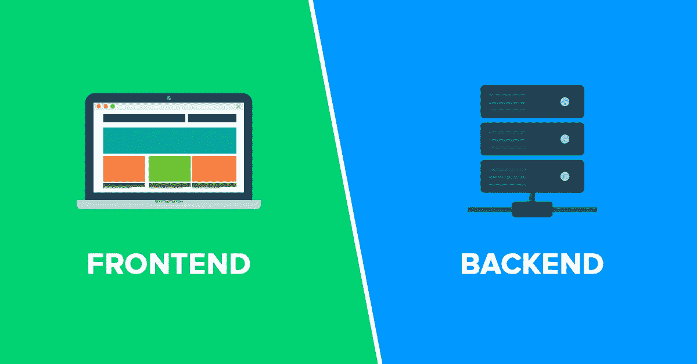
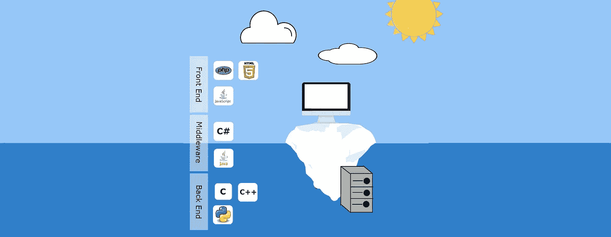
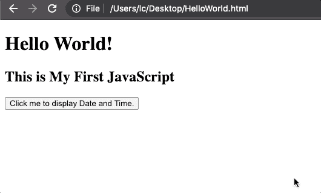

# 软件开发人员入门

> 原文：<https://blog.devgenius.io/getting-started-as-a-software-developer-35c8815f5168?source=collection_archive---------21----------------------->


[https://unsplash.com/photos/bPVM4nOy0Rg](https://unsplash.com/photos/bPVM4nOy0Rg)

我的几个朋友因为 COVID 失去了工作。他们不从事“技术”工作，但这是他们一直想了解更多的东西。

我整理了一份关于如何开始成为他们的开发人员的快速概述，我想我也应该在这里分享一下。

我知道这是老生常谈，但从字面上从来没有一个更好的时间开始。就在本周，[微软宣布了一项计划，帮助 2500 万人学习在我们的数字世界取得成功所需的技能。](https://blogs.microsoft.com/blog/2020/06/30/microsoft-launches-initiative-to-help-25-million-people-worldwide-acquire-the-digital-skills-needed-in-a-covid-19-economy/?utm_source=morning_brew)

在这种时候，保持专注和有目标是很重要的——你所需要的就是一台笔记本电脑！

## 但是我已经 32 岁了，现在真的可以开始了吗？

是的，绝对的。30 plus，35 plus，40 plus 起步的人多的是！

如果你陷进去，认为软件工程适合你，你的第一份工作可能是给 22 岁的人。但是如果你们都有相同的技能水平，这并不重要。

此外，你在团队中扮演的角色在生活经验和成熟度方面也有很大优势。

另一件要记住的事情是，没有人知道一切。专业软件工程师花大量时间自己研究和谷歌搜索。无论是作为复习还是为了找到做某事的更好的方法。

**还不信服？**

好吧，这里有一些证据:

*   [30 岁再培训成为软件开发人员](https://medium.com/@SamOrgill/how-to-retrain-to-be-a-software-developer-at-30-in-an-age-biased-industry-570eccfd276b)
*   [300 名在 30 多岁、40 多岁和 50 多岁时找到第一份工作的开发人员](https://medium.freecodecamp.org/stories-from-300-developers-who-got-their-first-tech-job-in-their-30s-40s-and-50s-64306eb6bb27)
*   [所以你想在 30 岁时成为一名优秀的开发人员](https://techbeacon.com/app-dev-testing/so-you-want-be-great-developer-30-inspiring-stories)

我之前提到过微软致力于培训员工，但也有像 [Stryve](https://westryve.com/) 这样的工具出现，在那里你可以跟踪你的学习情况，并找到一个其他人的社区。

## 好吧，你已经说服我了，现在怎么办！

在我们进一步阅读之前，我想说，很容易被淹没。但是，要知道，这些东西几乎都是谷歌可以搜索到的。

因此，如果你在本文期间或之后的任何时候遇到困难，它都在那里…你只需要知道要寻找什么。

有几个哥特人:

*   留意你用谷歌搜索的任何文章的日期。最近很重要，因为科技发展很快。
*   交叉引用你搜索到的其他共识。很多时候你会发现一个人对如何做某事有自己的看法。确保这是你前进的正确方式，并乐于尝试和犯错。

## 基础知识

一般来说，开发分为两半；“前端”和“后端”。



[https://devcode.la/blog/frontend-y-backend/](https://devcode.la/blog/frontend-y-backend/)

大多数现代网站通过在服务器上运行应用程序和数据库来工作，当你登陆一个 URL 时，服务器会返回一个网页给你。

## 哇，等一下，*服务器*，*应用*和*数据库*？

记得我说过你可以用谷歌搜索这些东西吗？

…开个玩笑！也许我们确实需要一些术语表

*   **应用**:一个软件，完成存储和检索信息的任务
*   **UI** (用户界面):网站的观感(前端)
*   **数据库**:以特定方式存储信息以便检索的软件应用程序(后端)
*   服务器:一种允许我们在其上存储数据库或应用程序的计算机(后端)
*   " **foobar** ":用来代替(或参照)你可能在一个已完成的网站中使用的其他单词的单词，如；用户、帖子、评论
*   **Hello World** :这个术语用来定义如何在一个技术栈中制造最简单的工作解决方案

以博客网站为例。有一个前端用户界面，让我们阅读博客文章和评论。

还会有某种应用程序以某种方式从后端数据库中检索数据，以便可以在 UI 上正确显示数据。

我希望这开始有意义了…

如果你想了解更多，这里有 50 个术语和首字母缩略词，你应该开始了解一下

## 后端还是前端开发？



[http://www . redrobotsystems . co . uk/前端-中间件-后端/](http://www.redrobotsystems.co.uk/front-end-middleware-back-end/)

通常，人们会在职业生涯的前端或后端结束，但有时人们两者都做。

然而，对于任何入门者，我的建议总是选择前端 web 开发。

原因是它很容易开始，有成堆的资源可用，你可以立即看到你的工作！

# 好的，我准备好了…

在下一节中，我将概述一些事情

*   前端基础知识
*   设置您的笔记本电脑
*   HelloWorld.html

**前端基础**

要构建一个基本的网页，您需要使用以下三种主要语言:

*   [HTML](https://www.w3schools.com/) 告诉你的浏览器如何显示页面本身
*   CSS 告诉浏览器如何设计页面的样式和颜色
*   JavaScript (或 JS)告诉浏览器在页面上做一些智能的事情或做一些额外的样式

快速搜索会发现 CSS 和 JavaScript 有很多变体和“风格”,但我们现在不需要担心这些。

**设置您的笔记本电脑:**

我在顶部说过，你只需要一台笔记本电脑。这是绝对正确的。

代码编辑器就像软件开发中的 GarageBand 或 iMovie。

我们那里有很多，但是 VisualStudio 代码无疑是最好的(是的，它是免费的！):[https://code.visualstudio.com/](https://code.visualstudio.com/)

下载它并按照说明进行安装。

**HelloWorld**

好了，打开 VisualStudio 代码。

*   从工具栏中选择`File -> New File`
*   选择`File -> Save As`
*   选择您的桌面作为保存文件夹
*   将新文件命名为“HelloWorld.html”

接下来，将以下文本复制并粘贴到文件中:

```
<!DOCTYPE html>
<html>
<body>

<h1>Hello World! </h1>
<h2>This is My First JavaScript</h2>

<button type="button"
onclick="document.getElementById('demo').innerHTML = Date()">
Click me to display Date and Time.</button>

<p id="demo"></p>

</body>
</html>
```

再次在 Visual Studio 代码中点击 save。

在 Finder 中打开你的桌面，右键点击“打开方式”，选择你的默认浏览器(我的是 Chrome)。

发生了什么事？一个工作网页！



是的，就这么简单！

## 好吧，但肯定不是这样？这一页看起来像垃圾！

你说得对，还有更多！这只是让你开始的一个试探:)

因此，如果你认为这很有趣，并想继续挖掘，有几件事你应该做。

选择一门语言，坚持下去，完成教程，直到你可以自己开发一些东西。练习，练习，练习。

在未来的某个阶段，你可能会想去某个地方参加课程，比如大会或其他地方，但是要想从这样的活动中获得最大收益，你需要对基础有一个很强的把握。

# 我推荐的成为真正的开发人员的途径

## 1.了解 HTML 的基础知识:

这会让你对 HTML 有更好的品味，并让你从一堆 HTML 教程开始。

## 2.了解一切的基础:

斯坦福大学的这门免费课程多年来一直被推荐给创业者——[计算机科学 101](https://online.stanford.edu/courses/soe-ycscs101-sp-computer-science-101)

它更深入地探讨了计算机的工作原理，并将为你打下更好的基础。

## 3.变得具体:

可用的最佳资源之一是 https://www.freecodecamp.org/的 T4。四处挖掘，挑选你感兴趣的东西来学习。

如果你喜欢它，度过它，并想继续前进，你也可以看看这样的东西

*   来自谷歌的网络基础知识
*   微软学习[的详细课程和认证](https://docs.microsoft.com/en-us/learn/)

问题是，他们有点偏向谷歌和微软，所以不要太纠结于此。

## 4.扩展:

如果你正在使用免费资源，也许是时候注册类似

*   [https://www.codecademy.com/](https://www.codecademy.com/)或者
*   [https://generalassemb.ly/](https://generalassemb.ly/)

这些学校提供付费课程和证书，在你找工作的时候会很有帮助。

# 就是这样！


[https://unsplash.com/photos/YVT21p6pO_g](https://unsplash.com/photos/YVT21p6pO_g)

我真的希望这篇文章能让你感受到作为软件开发人员开始新职业的力量。

我很乐意听到对内容或任何其他资源的反馈，你认为对新手来说是好的。

和平！