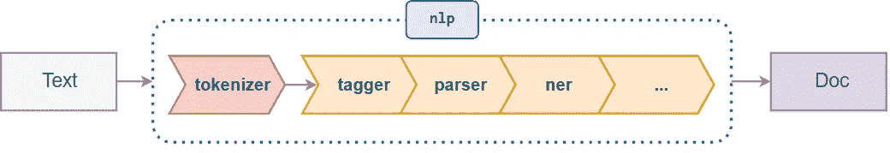

# spaCy 自然语言处理入门:第 1 部分

> 原文：<https://blog.devgenius.io/getting-started-in-natural-language-processing-with-spacy-part-1-5026748cadc2?source=collection_archive---------10----------------------->

spaCy([https://spacy.io/](https://spacy.io/))是一个开源的 Python 库，可以解析和“理解”大量文本。针对特定语言(英语、法语、德语等)提供不同的型号。).


图片来自[https://spacy.io/](https://spacy.io/)

## 安装和设置

安装过程分为两步。首先，使用 conda 或 pip 安装 spaCy。接下来，根据语言下载您想要的特定型号。
欲了解更多信息，请访问[https://spacy.io/usage/](https://spacy.io/usage/)

从命令行或终端:
`*conda install -c conda-forge spacy*`或`*pip install -U spacy*` *或者你可以创建一个虚拟环境:* `*conda create -n spacyenv python=3 spacy=2*`

2.接下来，同样从命令行(您必须以 admin 身份运行或使用 sudo):
`*python -m spacy download en*` *如果成功，您应该会看到如下消息:* `***Linking successful***``*C:\Anaconda3\envs\spacyenv\lib\site-packages\en_core_web_sm -->*``*C:\Anaconda3\envs\spacyenv\lib\site-packages\spacy\data\en*`

`*You can now load the model via spacy.load('en')*`

## 在 Python 中使用空间

这是导入和使用 spaCy 的一组典型说明。如果这需要一段时间，不要惊讶——spaCy 有一个相当大的库要加载:

```
*# Import spaCy and load the language library* **import** spacy
nlp **=** spacy.load('en_core_web_sm')
*# Create a Doc object* doc **=** nlp(u'Microsoft is looking at buying a U.S. startup for $6 million')
*# Print each token separately* **for** token **in** doc:
   print(token.text, token.pos_, token.dep_)Microsoft PROPN nsubj
is AUX aux
looking VERB ROOT
at ADP prep
buying VERB pcomp
a DET det
U.S. PROPN compound
startup NOUN dobj
for ADP prep
$ SYM quantmod
6 NUM compound
million NUM pobj
```

这看起来不太用户友好，但是我们马上看到一些有趣的事情发生:
微软被认为是一个专有名词，而不仅仅是句子开头的一个单词。
美国是作为一个实体保持在一起的(我们称之为‘代币’)

随着我们对空间的深入探究，我们将会看到这些缩写的意思以及它们是如何衍生出来的。我们还将看到 spaCy 如何将最后三个令牌组合`$6 million`解释为引用 ***金钱*** 。

## 空间对象

在上面的单元格中导入 spacy 模块后，我们加载了一个**模型**，并将其命名为`nlp`。
接下来，我们通过将模型应用到我们的文本来创建一个 **Doc** 对象，并将其命名为`doc`。
spaCy 还构建了一个配套的 **Vocab** 对象，我们将在后面的章节中介绍。
保存已处理文本的 **Doc** 对象是我们这里的重点。

## 管道

当我们运行`nlp`时，我们的文本进入*处理管道*，它首先分解文本，然后执行一系列操作来标记、解析和描述数据。



来自[空间](https://spacy.io/usage/spacy-101#pipelines)的管道图像

我们可以查看管道中当前存在哪些组件。在后面的章节中，我们将学习如何禁用组件并根据需要添加新组件。

```
In [1]:nlp.pipeline
Out[2]:
[('tagger', <spacy.pipeline.Tagger at 0x237cb1e8f98>),
 ('parser', <spacy.pipeline.DependencyParser at 0x237cb2852b0>),
 ('ner', <spacy.pipeline.EntityRecognizer at 0x237cb285360>)]
In [3]:nlp.pipe_names
Out[3]:['tagger', 'parser', 'ner']
```

## 标记化

处理文本的第一步是将所有的组成部分(单词和标点)分解成“记号”。这些标记在 Doc 对象内部进行了注释，以包含描述性信息。在接下来的故事中，我们将更详细地讨论标记化。现在，让我们看另一个例子:

```
In [4]:
doc2 **=** nlp(u"Microsoft isn't   looking into startups anymore.")
**for** token **in** doc2:
   print(token.text, token.pos_, token.dep_)Microsoft PROPN nsubj
is VERB aux
n't ADV neg
   SPACE 
looking VERB ROOT
into ADP prep
startups NOUN pobj
anymore ADV advmod
. PUNCT punct
```

注意`isn't`是如何被分成两个令牌的。spaCy 既能识别词根动词`is`也能识别它所附带的否定形式。还要注意，扩展空格和句尾的句号都被赋予了自己的记号。

值得注意的是，尽管`doc2`包含关于每个令牌的已处理信息，但它也保留了原始文本:

```
In [5]:doc2
Out[5]:Microsoft isn't   looking into startups anymore.
In [6]:doc2[0]
Out[6]:Microsoft
In [7]:type(doc2)
Out[7]:spacy.tokens.doc.Doc
```

## 词性标注

将文本分割成标记后的下一步是分配词性。在上面的例子中，`Microsoft`被识别为一个 ***专有名词*** 。这里需要一些统计建模。例如,“the”后面的单词通常是名词。

如需 POS 标签的完整列表，请访问

[https://spacy.io/api/annotation#pos-tagging](https://spacy.io/api/annotation#pos-tagging)

```
In [8]:doc2[0].pos_
Out[8]:'PROPN'
```

## 属国

我们还查看了分配给每个标记的语法依赖。`Microsoft`被确定为`nsubj`或 ***句子的名词性主语*** 。

要获得完整的语法依赖列表，请访问

[https://spacy.io/api/annotation#dependency-parsing](https://spacy.io/api/annotation#dependency-parsing)

关于类型依赖的一个很好的解释可以在[这里](https://nlp.stanford.edu/software/dependencies_manual.pdf)找到

```
In [9]:doc2[0].dep_
Out[9]:'nsubj'
```

要查看标签的全名，请使用`spacy.explain(tag)`

```
In [10]:spacy.explain('PROPN')
Out[10]:'proper noun'
In [11]:spacy.explain('nsubj')
Out[11]:'nominal subject'
```

## 其他令牌属性

我们将在接下来的故事中再次看到这些。现在，我们只想说明 spaCy 分配给令牌的一些其他信息:


```
In [12]:*# Lemmas (the base form of the word):* print(doc2[4].text)
print(doc2[4].lemma_)
Out [12]: looking
          look
In [13]:
*# Simple Parts-of-Speech & Detailed Tags:* print(doc2[4].pos_)
print(doc2[4].tag_ **+** ' / ' **+** spacy.explain(doc2[4].tag_))
VERB
VBG / verb, gerund or present participle
In [14]:
*# Word Shapes:* print(doc2[0].text**+**': '**+**doc2[0].shape_)
print(doc[5].text**+**' : '**+**doc[5].shape_)
Microsoft: Xxxxx
U.S. : X.X.
In [15]:
*# Boolean Values:* print(doc2[0].is_alpha)
print(doc2[0].is_stop)
True
False
```

## 跨度

大型 Doc 对象有时很难处理。一个 **span** 是一片`Doc[start:stop]`形式的 Doc 对象。

```
In [16]:doc3 **=** nlp(u'Although commmonly attributed to John Lennon from his song "Beautiful Boy", \
the phrase "Life is what happens to us while we are making other plans" was written by \
cartoonist Allen Saunders and published in Reader\'s Digest in 1957, when Lennon was 17.')
In [17]:
life_quote **=** doc3[16:30]
print(life_quote)
"Life is what happens to us while we are making other plans"
In [18]:type(life_quote)
Out[18]:spacy.tokens.span.Span
```

在接下来的故事中，我们将看到如何使用`Span()`创建跨度对象。这将允许我们向跨度分配附加信息。

## 句子

Doc 对象内的某些标记也可以接收“句子开始”标签。虽然这不会立即构建一个句子列表，但是这些标签可以通过`Doc.sents`生成句子片段。稍后我们将编写自己的分段规则。

```
In [19]:
doc4 **=** nlp(u'This is the first sentence. This is another sentence. This is the last sentence.')
In [20]:
**for** sent **in** doc4.sents:
   print(sent)This is the first sentence.
This is another sentence.
This is the last sentence.
In [21]:
doc4[6].is_sent_start
Out[21]:True
```

[](https://medium.com/@santanudutta85/getting-started-in-natural-language-processing-with-spacy-part-2-73ecb4eac11d) [## spaCy 自然语言处理入门:第 2 部分

### 如果您错过了第 1 部分。如果您正在寻找基本安装、基本命令、令牌化，请查看它

medium.com](https://medium.com/@santanudutta85/getting-started-in-natural-language-processing-with-spacy-part-2-73ecb4eac11d)