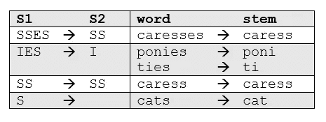
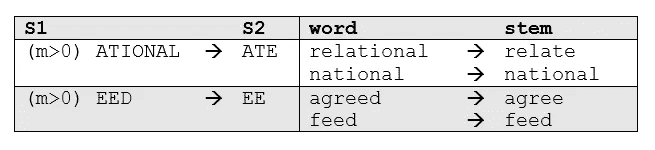

# spaCy 自然语言处理入门:第 3 部分

> 原文：<https://blog.devgenius.io/getting-started-in-natural-language-processing-with-spacy-part-3-824c1b291d22?source=collection_archive---------13----------------------->

在这个故事中，我们将重点关注词干。


图片来自 Spacy.io

## 堵塞物

通常，当搜索文本中的某个关键词时，如果搜索返回该词的变体，会有所帮助。例如，搜索“船”也可能返回“船”和“划船”。在这里，“船”将是【船，船夫，划船，船】的**词干**。

词干法是对相关单词进行编目的一种有些粗糙的方法；它基本上是从字母的末端开始，直到到达词干。这在大多数情况下工作得相当好，但不幸的是，英语有许多需要更复杂过程的例外。事实上，spaCy 没有包含词干分析器，而是选择完全依赖于词汇化。对于那些感兴趣的人来说，这里有一些关于这个决定的背景资料。我们将在后面讨论*引理化*的优点。

相反，我们将使用另一个流行的 NLP 工具，称为 **nltk** ，它代表*自然语言工具包*。有关 nltk 的更多信息，请访问[https://www.nltk.org/](https://www.nltk.org/)

## 波特·斯特梅尔

最常见也是最有效的词干工具之一是马丁·波特在 1980 年开发的 [*波特算法*](https://tartarus.org/martin/PorterStemmer/) 。该算法采用了五个阶段的单词缩减，每个阶段都有自己的一组映射规则。在第一阶段，定义简单的后缀映射规则，例如:



从一组给定的词干规则中，基于最长后缀 S1，只应用一个规则。因此，`caresses`减少到`caress`而不是`cares`。

更复杂的阶段在应用规则之前考虑单词的长度/复杂性。例如:



这里的`m>0`描述了词干的“度量”,使得规则适用于除了最基本的词干之外的所有词干。

```
*# Import the toolkit and the full Porter Stemmer library* **import** nltk
**from** nltk.stem.porter **import** ***** In [2]:p_stemmer **=** PorterStemmer()
In [3]:words **=** ['run','runner','running','ran','runs','easily','fairly']
In [4]:
**for** word **in** words:
   print(word**+**' --> '**+**p_stemmer.stem(word))
run --> run
runner --> runner
running --> run
ran --> ran
runs --> run
easily --> easili
fairly --> fairli
```

注意词干分析器如何将“runner”识别为名词，而不是动词形式或分词。此外，副词“容易地”和“相当地”源于不寻常的词根“easili”和“fairli”

## 雪球斯特梅尔

这有点用词不当，因为 Snowball 是由 Martin Porter 开发的词干语言的名字。这里使用的算法被更准确地称为“英国斯特梅尔”或“斯特梅尔”。它在逻辑和速度上都比最初的 Porter stemmer 稍有改进。由于 nltk 使用了 SnowballStemmer 这个名称，我们将在这里使用它。

```
In [5]:**from** nltk.stem.snowball **import** SnowballStemmer
*# The Snowball Stemmer requires that you pass a language parameter* s_stemmer **=** SnowballStemmer(language**=**'english')
In [6]:
words **=** ['run','runner','running','ran','runs','easily','fairly']
*# words = ['generous','generation','generously','generate']* In [7]:
**for** word **in** words:
   print(word**+**' --> '**+**s_stemmer.stem(word))run --> run
runner --> runner
running --> run
ran --> ran
runs --> run
easily --> easili
fairly --> fair
```

在这种情况下，词干分析器的表现与波特斯特梅尔相同，只是它用“fair”更恰当地处理了“fairly”的词干

词干有它的缺点。如果给定了标记`saw`，词干可能总是返回`saw`，而词汇化可能返回`see`或`saw`，这取决于标记是用作动词还是名词。例如，考虑以下情况:

```
In [4]:phrase **=** 'I am meeting him tomorrow at the meeting'
**for** word **in** phrase.split():
   print(word**+**' --> '**+**p_stemmer.stem(word))
I --> I
am --> am
meeting --> meet
him --> him
tomorrow --> tomorrow
at --> at
the --> the
meeting --> meet
```

在这里,“meeting”这个词出现了两次——一次作为动词，一次作为名词，但是词干分析器对两者一视同仁。

如果您错过了前面的部分，以下是链接:

[](https://medium.com/dev-genius/getting-started-in-natural-language-processing-with-spacy-part-1-5026748cadc2) [## spaCy 自然语言处理入门:第 1 部分

### spaCy(https://spacy.io/)是一个开源的 Python 库，可以解析和“理解”大量的文本…

medium.com](https://medium.com/dev-genius/getting-started-in-natural-language-processing-with-spacy-part-1-5026748cadc2) [](https://medium.com/@santanudutta85/getting-started-in-natural-language-processing-with-spacy-part-2-73ecb4eac11d) [## spaCy 自然语言处理入门:第 2 部分

### 如果您错过了第 1 部分。如果您正在寻找基本安装、基本命令、令牌化，请查看它

medium.com](https://medium.com/@santanudutta85/getting-started-in-natural-language-processing-with-spacy-part-2-73ecb4eac11d) [](https://medium.com/@santanudutta85/getting-started-in-natural-language-processing-with-spacy-part-4-4ab7f005464) [## spaCy 自然语言处理入门:第 4 部分

### 在这个故事中，我们将着重于词汇化和停用词

medium.com](https://medium.com/@santanudutta85/getting-started-in-natural-language-processing-with-spacy-part-4-4ab7f005464)