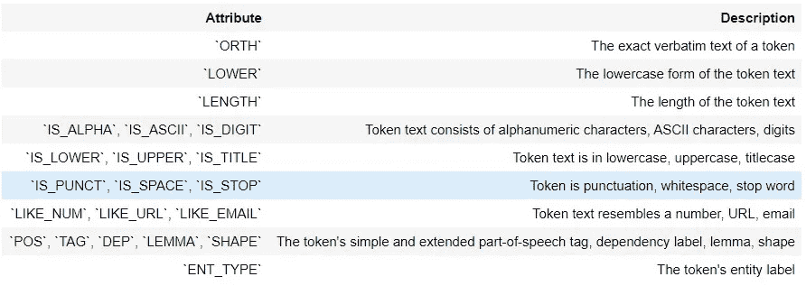

# spaCy 自然语言处理入门:第 5 部分

> 原文：<https://blog.devgenius.io/getting-started-in-natural-language-processing-with-spacy-part-4-287975381254?source=collection_archive---------32----------------------->

在这个故事中，我们将关注词汇和搭配。

到目前为止，我们已经看到了如何将一段文本划分为标记，以及如何解析各个标记并使用词性、依存关系和词条进行标记。如果你错过了我以前的故事，在这里看看。

[](https://medium.com/dev-genius/getting-started-in-natural-language-processing-with-spacy-part-4-4ab7f005464) [## spaCy 自然语言处理入门:第 4 部分

### 在这个故事中，我们将着重于词汇化和停用词

medium.com](https://medium.com/dev-genius/getting-started-in-natural-language-processing-with-spacy-part-4-4ab7f005464) 

在这一节中，我们将识别和标记与我们自己定义的模式相匹配的特定短语。


图片来自 Spacy.io

## 基于规则的匹配

spaCy 提供了一个名为`Matcher`的规则匹配工具，允许您构建一个令牌模式库，然后将这些模式与一个 Doc 对象进行匹配，以返回找到的匹配列表。您可以匹配令牌的任何部分，包括文本和注释，并且可以向同一个匹配器添加多个模式。

```
In [1]:*# Perform standard imports* **import** spacy
nlp **=** spacy.load('en_core_web_sm')
# Import the Matcher library
from spacy.matcher import Matcher
matcher = Matcher(nlp.vocab)
```

这里的`matcher`是与当前的`Vocab`对象配对的对象。我们可以根据需要在`matcher`中添加和删除特定的命名匹配器。

## 创建模式

在文学作品中，短语“太阳能”可能以一个词或两个词出现，带或不带连字符。在本节中，我们将开发一个名为“SolarPower”的匹配器，它可以找到所有三个:

```
In [3]:pattern1 **=** [{'LOWER': 'solarpower'}]
pattern2 **=** [{'LOWER': 'solar'}, {'LOWER': 'power'}]
pattern3 **=** [{'LOWER': 'solar'}, {'IS_PUNCT': **True**}, {'LOWER': 'power'}]
matcher.add('SolarPower', **None**, pattern1, pattern2, pattern3)
```

让我们来分解一下:

*   `pattern1`查找小写文本为“solarpower”的单个令牌
*   `pattern2`查找两个相邻的令牌，其顺序为“太阳能”和“电力”
*   `pattern3`查找三个相邻的标记，中间的标记可以是任何标点符号。单个空格是没有标记的，所以不能算作标点。
    一旦我们定义了我们的模式，我们就用‘solar power’的名字将它们传递给`matcher`，并将*回调*设置为`None`(稍后将详细介绍回调)。

## 将匹配器应用于 Doc 对象

```
In [4]:doc **=** nlp(u'The Solar Power industry continues to grow as demand for solarpower increases. Solar-power cars are gaining popularity.')
In [5]: found_matches **=** matcher(doc)
print(found_matches)[(8656102463236116519, 1, 3), (8656102463236116519, 10, 11), (8656102463236116519, 13, 16)]
```

`matcher`返回元组列表。每个元组包含一个匹配 ID，start & end 标记映射到 span `doc[start:end]`

```
In [6]:
**for** match_id, start, end **in** found_matches:
   string_id **=** nlp.vocab.strings[match_id]  *# get string representation* span **=** doc[start:end]                    *# get the matched span* print(match_id, string_id, start, end, span.text)8656102463236116519 SolarPower 1 3 Solar Power
8656102463236116519 SolarPower 10 11 solarpower
8656102463236116519 SolarPower 13 16 Solar-power
```

`match_id`只是`string_ID`‘太阳能’的哈希值

## 设置模式选项和量词

您可以通过传递一个`'OP':'*'`参数来使令牌规则可选。这让我们可以简化我们的模式列表:

```
In [7]:*# Redefine the patterns:* pattern1 **=** [{'LOWER': 'solarpower'}]
pattern2 **=** [{'LOWER': 'solar'}, {'IS_PUNCT': **True**, 'OP':'*'}, {'LOWER': 'power'}]
*# Remove the old patterns to avoid duplication:* matcher.remove('SolarPower')
*# Add the new set of patterns to the 'SolarPower' matcher:* matcher.add('SolarPower', **None**, pattern1, pattern2)
In [8]:
found_matches **=** matcher(doc)
print(found_matches)[(8656102463236116519, 1, 3), (8656102463236116519, 10, 11), (8656102463236116519, 13, 16)]
```

这找到了两个单词的模式，有和没有连字符！

以下量词可以传递给`'OP'`键:

OPDescription\！通过要求模式精确匹配 0 次来否定模式？通过允许模式匹配 0 次或 1 次，使模式可选\-要求模式匹配 1 次或多次\ *允许模式匹配 0 次或多次。小心旅鼠！
如果我们想同时匹配“太阳能”和“太阳能供电”，寻找“供电”的*词条*并期望它是“电力”可能很有诱惑力。情况并不总是这样！*形容词*‘powered’的引理还是‘powered’:

```
In [9]: pattern1 **=** [{'LOWER': 'solarpower'}]
pattern2 **=** [{'LOWER': 'solar'}, {'IS_PUNCT': **True**, 'OP':'*'}, {'LEMMA': 'power'}] *# CHANGE THIS PATTERN
# Remove the old patterns to avoid duplication:* matcher.remove('SolarPower')
*# Add the new set of patterns to the 'SolarPower' matcher:* matcher.add('SolarPower', **None**, pattern1, pattern2)
In [10]:
doc2 **=** nlp(u'Solar-powered energy runs solar-powered cars.')
In [11]:
found_matches **=** matcher(doc2)
print(found_matches)
[(8656102463236116519, 0, 3)]
```

matcher 找到了第一个词，因为 lemmatizer 将“Solar-powered”视为动词，而不是第二个词，因为它认为它是形容词。对于这种情况，最好设置显式令牌模式。

```
In [12]:pattern1 **=** [{'LOWER': 'solarpower'}]
pattern2 **=** [{'LOWER': 'solar'}, {'IS_PUNCT': **True**, 'OP':'*'}, {'LOWER': 'power'}]
pattern3 **=** [{'LOWER': 'solarpowered'}]
pattern4 **=** [{'LOWER': 'solar'}, {'IS_PUNCT': **True**, 'OP':'*'}, {'LOWER': 'powered'}]
*# Remove the old patterns to avoid duplication:* matcher.remove('SolarPower')
*# Add the new set of patterns to the 'SolarPower' matcher:* matcher.add('SolarPower', **None**, pattern1, pattern2, pattern3, pattern4)
In [13]: found_matches **=** matcher(doc2)
print(found_matches)[(8656102463236116519, 0, 3), (8656102463236116519, 5, 8)]
```

## 其他令牌属性

除了引理之外，我们还可以使用各种令牌属性来确定匹配规则:



## 令牌通配符

你可以传递一个空的字典`{}`作为通配符来代表**任意的令牌**。例如，您可能想在不知道什么可能跟在`#`字符后面的情况下检索标签:

[{'ORTH': '#'}，{}]

## 短语匹配器

在上一节中，我们使用了令牌模式来执行基于规则的匹配。另一种方法——通常也是更有效的方法——是在术语列表上进行匹配。在本例中，我们使用 PhraseMatcher 从短语列表中创建一个 Doc 对象，并将其传递给`matcher`。

```
In [14]:*# Perform standard imports, reset nlp* **import** spacy
nlp **=** spacy.load('en_core_web_sm')
In [15]:
*# Import the PhraseMatcher library* **from** spacy.matcher **import** PhraseMatcher
matcher **=** PhraseMatcher(nlp.vocab)
```

在这个练习中，我们将导入一篇关于*里根经济学*
的维基百科文章来源:[https://en.wikipedia.org/wiki/Reaganomics](https://en.wikipedia.org/wiki/Reaganomics)

```
In [16]:**with** open('../TextFiles/reaganomics.txt', encoding**=**'utf8') **as** f:
doc3 **=** nlp(f.read())
In [17]:
*# First, create a list of match phrases:* phrase_list **=** ['voodoo economics', 'supply-side economics', 'trickle-down economics', 'free-market economics']
*# Next, convert each phrase to a Doc object:* phrase_patterns **=** [nlp(text) **for** text **in** phrase_list]
*# Pass each Doc object into matcher (note the use of the asterisk!):* matcher.add('VoodooEconomics', **None**, *****phrase_patterns)
*# Build a list of matches:* matches **=** matcher(doc3)
In [18]:
*# (match_id, start, end)* matches
Out[18]:[(3473369816841043438, 41, 45),
 (3473369816841043438, 49, 53),
 (3473369816841043438, 54, 56),
 (3473369816841043438, 61, 65),
 (3473369816841043438, 673, 677),
 (3473369816841043438, 2985, 2989)]
```

前四个匹配项是里根经济学定义中使用这些术语的地方:

```
In [19]:doc3[:70]
Out[19]:REAGANOMICS
[https://en.wikipedia.org/wiki/Reaganomics](https://en.wikipedia.org/wiki/Reaganomics)

Reaganomics (a portmanteau of [Ronald] Reagan and economics attributed to Paul Harvey)[1] refers to the economic policies promoted by U.S. President Ronald Reagan during the 1980s. These policies are commonly associated with supply-side economics, referred to as trickle-down economics or voodoo economics by political opponents, and free-market economics by political advocates.
```

## 查看比赛

有几种方法可以获取匹配周围的文本。最简单的方法是从文档中获取一片比匹配更宽的令牌:

```
In [20]:doc3[665:685]  *# Note that the fifth match starts at doc3[673]* Out[20]:
same time he attracted a following from the supply-side economics movement, which formed in opposition to Keynesian
In [21]:doc3[2975:2995]  *# The sixth match starts at doc3[2985]* Out[21]:against institutions.[66] His policies became widely known as "trickle-down economics", due to the significant
```

另一种方法是首先将`sentencizer`应用于文档，然后遍历句子直到匹配点:

```
In [22]:*# Build a list of sentences* sents **=** [sent **for** sent **in** doc3.sents]
*# In the next section we'll see that sentences contain start and end token values:* print(sents[0].start, sents[0].end)
0 35
In [23]:*# Iterate over the sentence list until the sentence end value exceeds a match start value:* **for** sent **in** sents:
  **if** matches[4][1] **<** sent.end:  *# this is the fifth match, that starts at doc3[673]* print(sent)
**break**At the same time he attracted a following from the supply-side economics movement, which formed in opposition to Keynesian demand-stimulus economics.
```

欲了解更多信息，请访问[https://spacy . io/usage/language-features # section-rule-based-matching](https://spacy.io/usage/linguistic-features#section-rule-based-matching)

这是我的 NLP 空间系列的最后一个故事。以下是我之前的故事:

[](https://medium.com/dev-genius/getting-started-in-natural-language-processing-with-spacy-part-4-4ab7f005464) [## spaCy 自然语言处理入门:第 4 部分

### 在这个故事中，我们将着重于词汇化和停用词

medium.com](https://medium.com/dev-genius/getting-started-in-natural-language-processing-with-spacy-part-4-4ab7f005464) [](https://medium.com/dev-genius/getting-started-in-natural-language-processing-with-spacy-part-3-824c1b291d22) [## spaCy 自然语言处理入门:第 3 部分

### 在这个故事中，我们将重点关注词干。

medium.com](https://medium.com/dev-genius/getting-started-in-natural-language-processing-with-spacy-part-3-824c1b291d22) [](https://medium.com/dev-genius/getting-started-in-natural-language-processing-with-spacy-part-2-73ecb4eac11d) [## spaCy 自然语言处理入门:第 2 部分

### 如果您错过了第 1 部分。如果您正在寻找基本安装、基本命令、令牌化，请查看它

medium.com](https://medium.com/dev-genius/getting-started-in-natural-language-processing-with-spacy-part-2-73ecb4eac11d) [](https://medium.com/dev-genius/getting-started-in-natural-language-processing-with-spacy-part-1-5026748cadc2) [## spaCy 自然语言处理入门:第 1 部分

### spaCy(https://spacy.io/)是一个开源的 Python 库，可以解析和“理解”大量的文本…

medium.com](https://medium.com/dev-genius/getting-started-in-natural-language-processing-with-spacy-part-1-5026748cadc2)