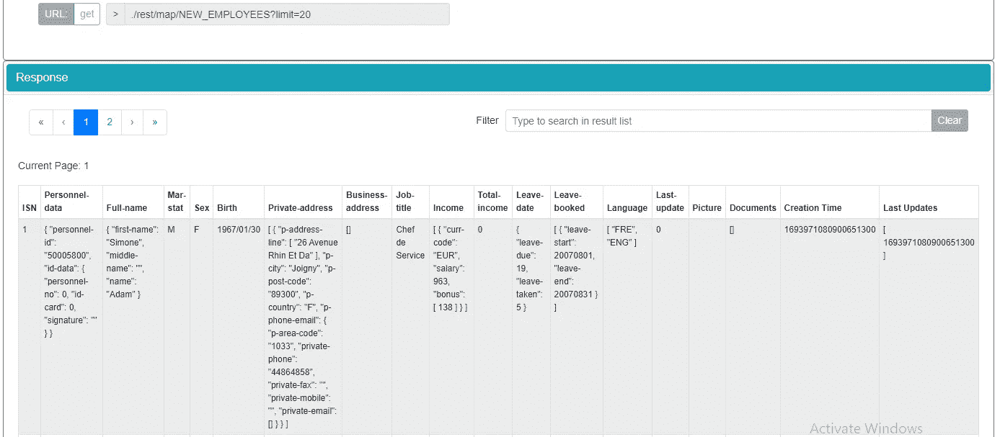

# Adabas & Natural 入门第 3 部分

> 原文：<https://blog.devgenius.io/getting-started-with-adabas-natural-part-3-a334822db12?source=collection_archive---------4----------------------->

## JSON 数据格式中的“周期组”和“多值”表示。


Adabas 数据库的独特之处在于它具有“[周期组](https://documentation.softwareag.com/natural/nat6313win/pg/pg_dbms_ada.htm#Periodic_Groups)”和“[多值](https://documentation.softwareag.com/natural/nat6313win/pg/pg_dbms_ada.htm#Multiple-Value_Fields)”的概念。简而言之，“周期组”是指一组相关的字段，而“多值”是指存储多个值的字段。下面的屏幕截图显示了示例表 Employees 的第一条记录，它的内部序列号(ISN)值为 1。记录由 JSON (JavaScript 对象表示法)数据格式表示。



JSON 数据格式的员工记录

完整的 JSON 数据记录如下:

```
{“ISN”:”1",”personnel-data”:{ “personnel-id”: “50005800”, “id-data”:{“personnel-no”:”0", “id-card”: “0”, “signature”: “”}},”full-name”:{“first-name”:”Simone”, “middle-name”: “”,”name”:”Adam”},”mar-stat”:”M”, “sex”: “F”,”birth”:”1967/01/30",”private-address”:[{“p-address-line”:[“26 Avenue Rhin Et Da”],”p-city”:”Joigny”,”p-post-code”:”89300",”p-country”:”F”,”p-phone-email”:{“p-area-code”:”1033",”private-phone”:”44864858",”private-fax”: “”,”private-mobile”:””,”private-email”:[]}}],”business-address”:[],”job-title”:”Chef de Service”,”income”:[{“curr-code”:”EUR”, “salary”:”963", “bonus”:[“138”]}],”total-income”:”0",”leave-date”:{“leave-due”:”19",”leave-taken”:”5"},”leave-booked”:[{“leave-start”:”20070801",”leave-end”:”20070831"}],”language”:[“FRE”,”ENG”],”last-update”:”0",”picture”:””,”documents”:[],”creation_time”:”1693971080900651300",”Last_Updates”:[“1693971080900651300”]}
```

使用[在线 JSON 数据查看器](https://jsoneditoronline.org/)，数据可以以树形结构显示如下。JSON 似乎是代表“周期组”和“多值”概念的理想选择。


JSON 数据格式的树形结构

JSON 保留符号是花括号即{}，方括号即[]，双引号即“，”冒号即:，逗号即。数据单位表示为一对键(或属性)和值，例如“ISN”:“1”。花括号将包含的数据分组为一个对象，而方括号将包含的数据分组为一个数组(参考上面的树视图结构)。对象和数组可以嵌套。

尽管 JSON 非常类似于 JavaScript object literal 语法，但是这种格式可以独立于 JavaScript 使用，并且许多编程环境都具有读取(解析)和生成 JSON ( [Mozilla](https://developer.mozilla.org/en-US/docs/Learn/JavaScript/Objects/JSON) )的能力。

> 将字符串转换为本机对象称为反序列化，而将本机对象转换为字符串以便可以通过网络传输称为序列化。( [Mozilla](https://developer.mozilla.org/en-US/docs/Learn/JavaScript/Objects/JSON) )

为了防止解析错误，在传输 JSON 数据之前，对一些字符进行了转义。例如，双引号字符由前面的反斜杠字符转义，如下所示:

```
{\”ISN\”:\”1\”,\”personnel-data\”:{ \”personnel-id\”: \”50005800\”, \”id-data\”:{\”personnel-no\”:\”0\”, \”id-card\”: \”0\”, \”signature\”: \”\”}},\”full-name\”:{\”first-name\”:\”Simone\”, \”middle-name\”: \”\”,\”name\”:\”Adam\”},\”mar-stat\”:\”M\”, \”sex\”: \”F\”,\”birth\”:\”1967/01/30\”,\”private-address\”:[{\”p-address-line\”:[\”26 Avenue Rhin Et Da\”],\”p-city\”:\”Joigny\”,\”p-post-code\”:\”89300\”,\”p-country\”:\”F\”,\”p-phone-email\”:{\”p-area-code\”:\”1033\”,\”private-phone\”:\”44864858\”,\”private-fax\”: \”\”,\”private-mobile\”:\”\”,\”private-email\”:[]}}],\”business-address\”:[],\”job-title\”:\”Chef de Service\”,\”income\”:[{\”curr-code\”:\”EUR\”, \”salary\”:\”963\”, \”bonus\”:[\”138\”]}],\”total-income\”:\”0\”,\”leave-date\”:{\”leave-due\”:\”19\”,\”leave-taken\”:\”5\”},\”leave-booked\”:[{\”leave-start\”:\”20070801\”,\”leave-end\”:\”20070831\”}],\”language\”:[\”FRE\”,\”ENG\”],\”last-update\”:\”0\”,\”picture\”:\”\”,\”documents\”:[],\”creation_time\”:\”1693971080900651300\”,\”Last_Updates\”:[\”1693971080900651300\”]}
```

下面是将 JSON 字符串解析成编程对象和数组的 JavaScript 和 Java 代码示例。

```
/*JavaScript code examples for parsing JSON*/
/*just plain JS*/
let strgEmployee="{\"ISN\":1,\"personnel-data\":{\"personnel-id\":\"50005800\",\"id-data\":{\"personnel-no\":0,\"id-card\":0,\"signature\":\"\"}},\"full-name\":{\"first-name\":\"Simone\",\"middle-name\":\"\",\"name\":\"Adam\"},\"mar-stat\":\"M\",\"sex\":\"F\",\"birth\":\"1967/01/30\",\"private-address\":[{\"p-address-line\":[\"26 Avenue Rhin Et Da\"],\"p-city\":\"Joigny\",\"p-post-code\":\"89300\",\"p-country\":\"F\",\"p-phone-email\":{\"p-area-code\":\"1033\",\"private-phone\":\"44864858\",\"private-fax\":\"\",\"private-mobile\":\"\",\"private-email\":[]}}],\"business-address\":[],\"job-title\":\"Chef de Service\",\"income\":[{\"curr-code\":\"EUR\",\"salary\":963,\"bonus\":[138]}],\"total-income\":0,\"leave-date\":{\"leave-due\":19,\"leave-taken\":5},\"leave-booked\":[{\"leave-start\":20070801,\"leave-end\":20070831}],\"language\":[\"FRE\",\"ENG\"],\"last-update\":0,\"picture\":\"\",\"documents\":[],\"creation_time\":1693971080900651300,\"Last_Updates\":[1693971080900651300]}";let objtEmployee=JSON.parse(strgEmployee);
/*print the response Object*/
console.log(objtEmployee);      
/*get the private-address as an array */
let arryPrivateAddress=objtEmployee["private-address"];
/*print the first item of the private-address array*/
console.log(arryPrivateAddress[0]);
/*get the language as an array*/
let arryLanguage=objtEmployee["language"];
/*print the first item of the language array*/
console.log(arryLanguage[0]);
```


[https://onecompiler.com/javascript/3ymahyggj](https://onecompiler.com/javascript/3ymahyggj)

```
/*java code examples for parsing JSON*/
/*using org.json package import*/
import java.util.*;
import org.json.*;public class Main {
    public static void main(String[] args) {
      String strgEmployee="{\"ISN\":\"1\",\"personnel-data\":{ \"personnel-id\": \"50005800\", \"id-data\":{\"personnel-no\":\"0\", \"id-card\": \"0\", \"signature\": \"\"}},\"full-name\":{\"first-name\":\"Simone\", \"middle-name\": \"\",\"name\":\"Adam\"},\"mar-stat\":\"M\", \"sex\": \"F\",\"birth\":\"1967/01/30\",\"private-address\":[{\"p-address-line\":[\"26 Avenue Rhin Et Da\"],\"p-city\":\"Joigny\",\"p-post-code\":\"89300\",\"p-country\":\"F\",\"p-phone-email\":{\"p-area-code\":\"1033\",\"private-phone\":\"44864858\",\"private-fax\": \"\",\"private-mobile\":\"\",\"private-email\":[]}}],\"business-address\":[],\"job-title\":\"Chef de Service\",\"income\":[{\"curr-code\":\"EUR\", \"salary\":\"963\", \"bonus\":[\"138\"]}],\"total-income\":\"0\",\"leave-date\":{\"leave-due\":\"19\",\"leave-taken\":\"5\"},\"leave-booked\":[{\"leave-start\":\"20070801\",\"leave-end\":\"20070831\"}],\"language\":[\"FRE\",\"ENG\"],\"last-update\":\"0\",\"picture\":\"\",\"documents\":[],\"creation_time\":\"1693971080900651300\",\"Last_Updates\":[\"1693971080900651300\"]}";JSONObject objtEmployee = new JSONObject(strgEmployee);
      /*print the employee Object*/
      System.out.println(objtEmployee);      
      /*get the private-address as an array */
      JSONArray arryPrivateAddress=(JSONArray) objtEmployee.get("private-address");
      /*print the first item of the private-address array*/
      System.out.println (arryPrivateAddress.get(0));
      /*get the language as an array*/
      JSONArray arryLanguage = (JSONArray) objtEmployee.get("language");
      /*print the first item of the language array*/
      System.out.println(arryLanguage.get(0));
  }
}
```


https://onecompiler.com/java/3ymajkm3p

上面的 java 代码是在 [OneCompiler](https://onecompiler.com/) 网站上编译的，该网站需要下面的 Gradle dependencies 设置(build.gradle 文件)信息:

```
apply plugin:'application'
mainClassName = 'Main'run { standardInput = System.in }
 sourceSets { main { java { srcDir './' } } }repositories {
 jcenter()
}dependencies {
 implementation group: 'org.json', name: 'json', version: '20180813'  
}
```

JavaScript 和 Java 都可以实现为服务器端和客户端代码。它们也可以在 Natural ONE IDE 中编码。

未完待续在下[部分](https://medium.com/@mohamad.razzi.my/getting-started-with-adabas-natural-part-4-728e6977ad4f)。

本帖是“Adabas & Natural 入门”系列的一部分，该系列包括:
(1) [设置 Adabas & Natural 社区版(Docker 版)](https://medium.com/@mohamad.razzi.my/getting-started-with-adabas-natural-part-1-6597688406ad)。
(2) [通过 Adabas REST Web app 访问 Adabas 数据库](https://medium.com/@mohamad.razzi.my/getting-started-with-adabas-natural-part-2-34621e576fa4)。
(3) [Adabas“周期组”和 JSON 数据格式的“多值”表示](/getting-started-with-adabas-natural-part-3-a334822db12)。
(4) [使用 Adabas TCP-IP 节点包访问 Adabas 数据库](https://medium.com/@mohamad.razzi.my/getting-started-with-adabas-natural-part-4-728e6977ad4f)。
(5) [使用 NaturalONE IDE 的大型机编程(Natural)介绍](https://medium.com/@mohamad.razzi.my/getting-started-with-adabas-natural-part-5-1665a0be42ab)。
(6) [使用自然编程和自然 IDE 访问 Adabas 数据库](https://medium.com/@mohamad.razzi.my/getting-started-with-adabas-natural-part-6-48b4b2fd3e6d)。
(7) [大型机数据库编程基础](https://medium.com/@mohamad.razzi.my/mainframe-database-programming-fundamentals-b34fd88acf6e)。
(8) [大型机数据库编程中级](https://medium.com/@mohamad.razzi.my/mainframe-database-programming-27803b92a3a3)。
(9) [使用自然 AJAX 框架开发 AJAX 网页](https://medium.com/@mohamad.razzi.my/developing-ajax-web-pages-e270eb59fc92)。
(10)[AJAX 实际上是如何工作的](https://medium.com/@mohamad.razzi.my/how-does-ajax-actually-work-2f57cf4ddc55)？
(11) [向 ADABAS REST Web app 发送带有 JWT 令牌的 AJAX 请求](https://medium.com/dev-genius/how-does-ajax-actually-work-2f57cf4ddc55)。
(12)通过 Java Servlets 和 Java Web Services (SOAP)向 ADABAS REST 服务发送 HTTP 请求。