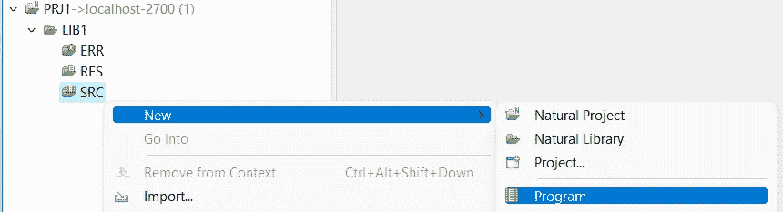
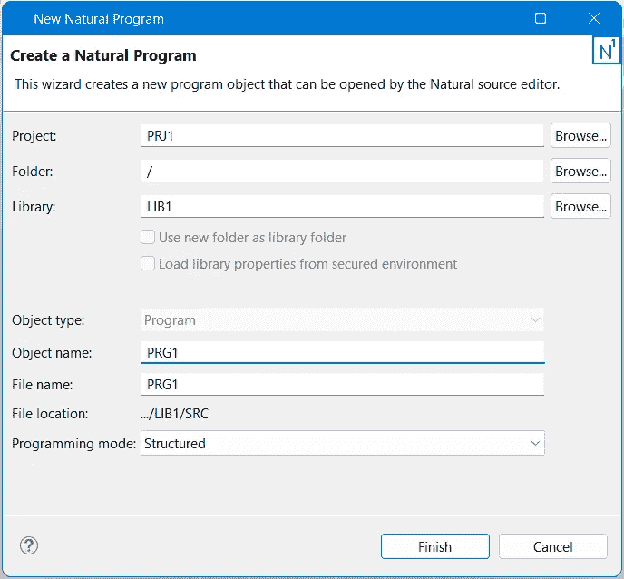

# Adabas & Natural 入门第 5 部分

> 原文：<https://blog.devgenius.io/getting-started-with-adabas-natural-part-5-1665a0be42ab?source=collection_archive---------7----------------------->

## 使用 NaturalONE IDE 进行大型机编程的介绍


随着主机行业婴儿潮一代程序员退休人数的增加，同时大学教授的主机课程越来越少，千禧一代程序员面临着获取该领域知识和技能的挑战( [InformationAge 2017](https://www.information-age.com/baby-boomers-millennials-securing-future-mainframe-123469346/) )。为了解决这个问题，这篇文章试图提供一个使用 NaturalONE IDE 的自然编程语言的介绍。

```
PRE-REQUISITE:
(1) ADABAS and NATURAL Server Community Edition (Docker Version). 
(2) NaturalONE IDE.
(refer [here](https://medium.com/@mohamad.razzi.my/getting-started-with-adabas-natural-part-1-6597688406ad) for the [setup guide](https://medium.com/@mohamad.razzi.my/getting-started-with-adabas-natural-part-1-6597688406ad)).
```

运行 Natural ONE IDE ( [版本一. 9.1.4.CE](https://medium.com/@mohamad.razzi.my/getting-started-with-adabas-natural-part-1-6597688406ad) )。


[版本一. 9.1.4.CE](https://medium.com/@mohamad.razzi.my/getting-started-with-adabas-natural-part-1-6597688406ad)

输入工作空间名称，例如“工作空间 1011nat”。点击“启动”。


欢迎页面应该出现在主窗口中。否则，进入菜单“帮助/欢迎”进入欢迎页面。选择“打开 NaturalONE 透视图”。


自然导航器面板应出现在自然 ide 窗口的左侧。


在开始编码工作之前，建议在源代码编辑器中设置可见的行号。选择菜单“窗口/首选项…”然后在首选项窗口中选择“通用/编辑器/文本编辑器”，最后勾选“显示行号”复选框。


# (1)创建一个新项目。

进入菜单，选择“新建/自然项目”。


在项目名称框中键入“PRJ1 ”,然后单击“下一步”。


输入自然服务器连接详细信息，即“主机名:本地主机”和“端口号:2700”。单击“完成”。


# (2)创建库。

右键单击自然项目，然后选择“新建/自然库”。


在“库”框中键入“LIB1”。


LIB1 库由三个启动文件夹创建。


一个自然库可能包含**特殊文件夹** : **(1) SRC** ， **(2) ERR** 和 **(3) RES.** SRC 包含自然源文件，ERR 包含特定于应用程序的消息，RES 包含非自然文件，如图像或 HTML 文件([单击此处获得进一步解释](https://documentation.softwareag.com/naturalONE/natONE914/core/using/use-local-libs.htm))。

# (3)创建程序。

右键单击 SRC，选择“新建/程序”。



在对象/文件名中，键入“PRG1”。



PRG1 现在在 SRC 下创建。


向文件中添加代码。

```
WRITE "Hello world!"
END
```

WRITE 语句用于在屏幕上写入输出。

# (4)保存并运行。

按[CTRL+S]保存。

要构建代码，右键单击 PRJ1 并选择“构建自然项目”(或按[ALT+B])。


要运行代码，右键单击 PRG1，选择“作为/自然应用程序运行”(或按[SHIFT+ALT+X]然后按[N])。


应出现一个自然的网络 I/O 输出窗口，并显示“Hello World！”文字。


假设程序需要得到一个用户名。如下编辑 PRG1。

```
DEFINE DATA LOCAL
  1 #USERNAME     (A20)
END-DEFINE
INPUT
  "Enter your name:" #USERNAME 
WRITE "Hello " #USERNAME
END
```

定义数据本地语句用于声明要在程序中使用的数据元素，例如#USERNAME。INPUT 语句从用户处获得一个输入值，并将其存储在#USERNAME 中。WRITE 语句写入屏幕上的内容，在本例中是字符串“Hello”和数据元素#USERNAME。

按[CTRL+S]保存。

右键点击 PRJ1，选择“NaturalONE/Update”(或按[ALT+T])。


右击 PRG1，选择“运行方式/自然应用”(或者按[SHIFT+ALT+X]后按[N])。


Natural Web I/O 输出窗口显示一个带有标签的输入框，标签上写着“输入您的姓名:”。在输入框中输入名称，例如“Razzi”。


然后，自然 Web I/O 输出窗口显示文本“Hello Razzi”。


有了这些基本的程序代码，就可以进行进一步的处理，如数据库操作。

未完待续在下[部分](https://medium.com/@mohamad.razzi.my/getting-started-with-adabas-natural-part-6-48b4b2fd3e6d)。

本帖是“Adabas & Natural 入门”系列的一部分，该系列包括:
(1) [设置 Adabas & Natural 社区版(Docker 版)](https://medium.com/@mohamad.razzi.my/getting-started-with-adabas-natural-part-1-6597688406ad)。
(2) [通过 Adabas REST Web app 访问 Adabas 数据库](https://medium.com/@mohamad.razzi.my/getting-started-with-adabas-natural-part-2-34621e576fa4)。
(3) [Adabas“周期组”和 JSON 数据格式的“多值”表示](/getting-started-with-adabas-natural-part-3-a334822db12)。
(4) [使用 Adabas TCP-IP 节点包访问 Adabas 数据库](https://medium.com/@mohamad.razzi.my/getting-started-with-adabas-natural-part-4-728e6977ad4f)。
(5) [使用 NaturalONE IDE 的大型机编程(Natural)介绍](https://medium.com/@mohamad.razzi.my/getting-started-with-adabas-natural-part-5-1665a0be42ab)。
(6) [使用自然编程和自然 IDE 访问 Adabas 数据库](https://medium.com/@mohamad.razzi.my/getting-started-with-adabas-natural-part-6-48b4b2fd3e6d)。
(7) [大型机数据库编程基础](https://medium.com/@mohamad.razzi.my/mainframe-database-programming-fundamentals-b34fd88acf6e)。
(8) [大型机数据库编程中级](https://medium.com/@mohamad.razzi.my/mainframe-database-programming-27803b92a3a3)。
(9) [使用自然 AJAX 框架开发 AJAX 网页](https://medium.com/@mohamad.razzi.my/developing-ajax-web-pages-e270eb59fc92)。
(10)[AJAX 实际上是如何工作的](https://medium.com/@mohamad.razzi.my/how-does-ajax-actually-work-2f57cf4ddc55)？
(11) [向 ADABAS REST Web app 发送带有 JWT 令牌的 AJAX 请求](https://medium.com/dev-genius/how-does-ajax-actually-work-2f57cf4ddc55)。
(12)通过 Java Servlets 和 Java Web Services (SOAP)向 ADABAS REST 服务发送 HTTP 请求。