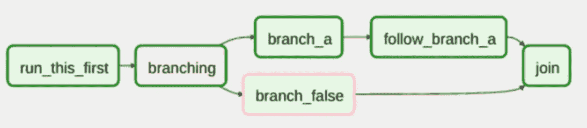
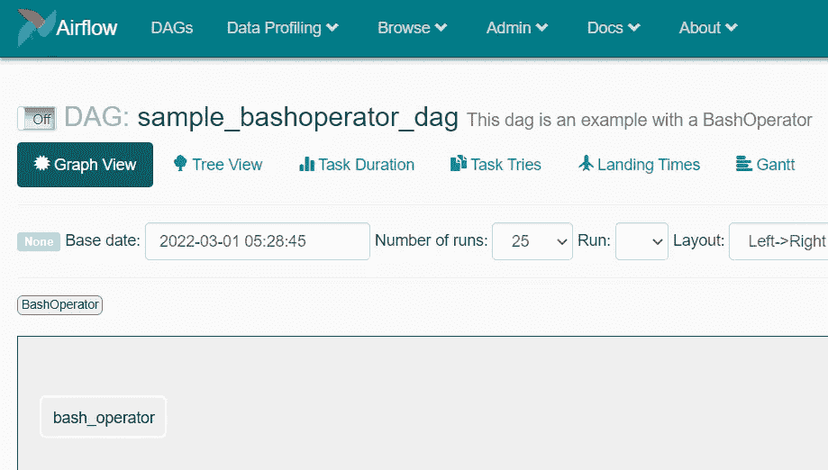
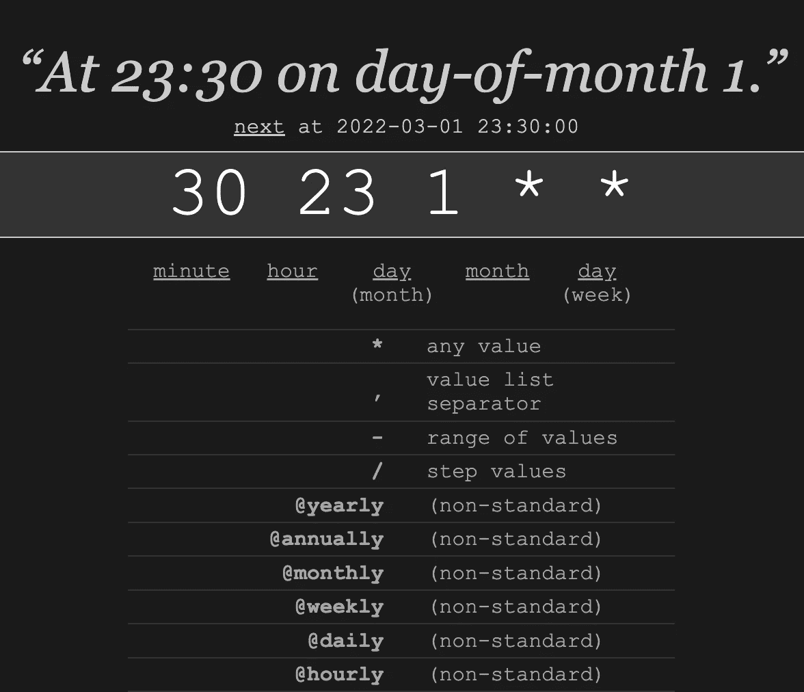
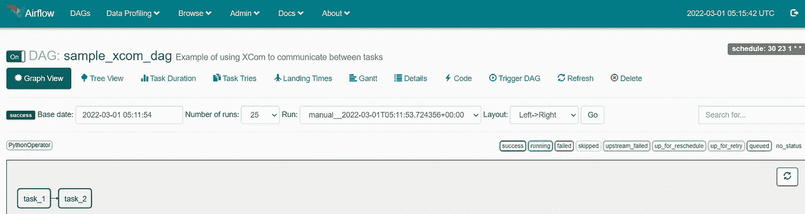
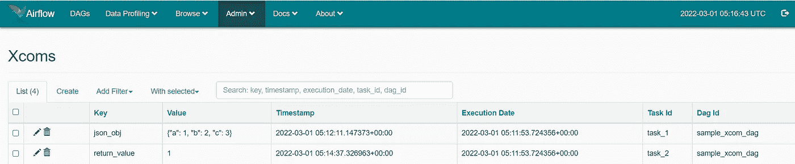
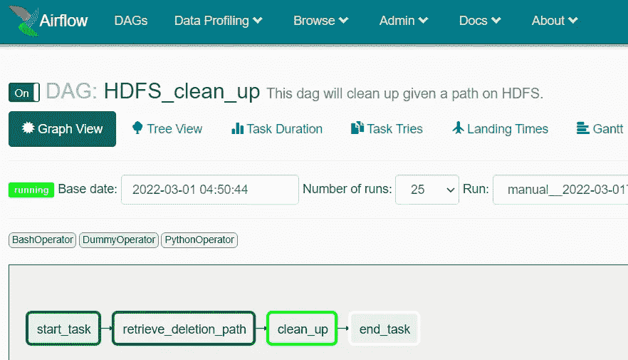
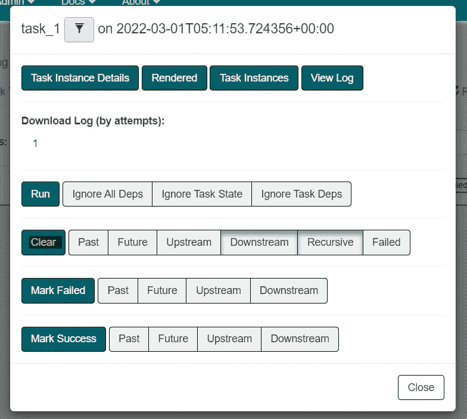
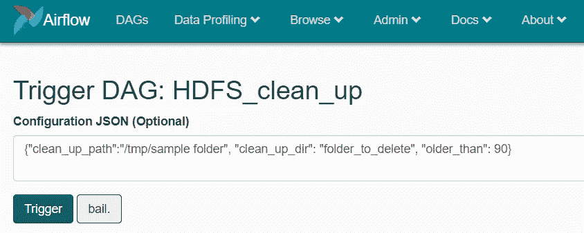

# Apache Airflow 入门指南

> 原文：<https://blog.devgenius.io/getting-started-with-apache-airflow-the-beginners-guide-62c194f6d00f?source=collection_archive---------0----------------------->

计划、自动化、监控

Apache air flow——编排工作流程的绝佳工具！

# 概观

当今世界，对自动化的需求空前高涨。它使我们能够有效地使用分配的资源，提高质量，减少人为错误。然而，许多人仍然无法理解如何自动化一些任务，最终只能一遍又一遍地手动操作。

许多技术驱动的团队有一个相对通用的管道——收集数据，预处理数据，上传到某个地方，然后生成报告。只有当有一种工具能够按照定义的顺序进行调度、触发和处理时；完全靠自己，没有任何人为干预。Apache Airflow 是在自动化您的工作流程中非常有用的工具之一！

在本文中，我们将讨论什么是 Apache Airflow，浏览它的构造块，并且我们将使用不同的 Airflow 操作符用 Python 编写一个示例工作流。

# 什么是气流——我为什么要使用它？

Apache Airflow 是编排的最佳工具之一。它在三个方面做得非常好——调度、自动化和监控。正如 Apache Airflow 主页上所定义的，*“[它]是一个由社区创建的平台，用于以编程方式创作、调度和监控工作流”。*

以下是使用气流的一些好处:

*   开放源码
*   用 Python 写的
*   可攀登的
*   行程安排
*   用户界面
*   通知/警报系统
*   插件、挂钩、传感器
*   能够与其他服务(即云服务)集成
*   可供外部使用的 RestAPI 端点
*   气流应用程序可以在 Docker / K8s 容器上运行

# 什么是 DAG？

在计算机科学和数学中，DAG(有向无环图)是一种有向(单向)且没有连接其他顶点的环的图。

在气流环境中，DAG 是所有小任务(操作符)的集合，这些小任务连接在一起执行更大的任务，其中不存在循环，并且从一个任务到下一个任务的方向总是从左到右。

示例 DAG(有向无环图)

由于 DAG 的性质是单向的，我们还可以得出结论，一个任务的开始仅发生在前一个任务已经完成的情况下。例如，在上面的例子中，'*分支*'任务仅在' *run_this_first'* 完成后开始。

以下是如何在气流中定义 DAG 的示例代码:

# 经营者

在 DAG 中，所有东西都作为操作符工作。您可以使用以下注释来定义运算符:

task_a = SomeOperator( *参数*)

让我们使用 bash 操作符(执行 Bash 脚本)作为更具体的例子:

Bash 运算符 DAG 示例

下面是一些其他类型的运算符的列表。

*   `DummyOperator` —填充任务，不执行任何操作
*   `PythonOperator` —用于调用 DAG 中任何已定义的 python 函数
*   `EmailOperator` —发送电子邮件
*   `SimpleHttpOperator` —发送 HTTP 请求
*   `MySqlOperator`、`SqliteOperator`、`PostgresOperator`、`OracleOperator`、`JdbcOperator` —执行 SQL 查询。
*   `BaseSensorOperator`
*   `BranchingOperator`

在一个给定的 DAG 中，假设我们正在运行两个不同的任务，即`task_1` 和`task_2`——按此顺序。回想一下定义，dag 是定向的，因此我们需要确保在运行`task_2.`之前执行并完成`task_1` ——因此存在依赖关系。

**设置此类依赖关系有三种方式:**

*   `task_1 >> task_2`
*   `task_1.downstream(task_2)`
*   `task_2.upstream(task_1)`

以上三个注解都是等价的——`task_2`依赖`task_1`。必须为创建的每个单个操作符*定义这组依赖关系。换句话说，每一个顶点都必须与另一个顶点相连才能完成这个图。*

# 计划 DAG

如果您希望以某个固定的频率运行您的作业，您可以通过 cron job annotation 在 Airflow 中调度您的 Dag。例如，您可以将它安排在每分钟、每天凌晨 04:30 或每年 5 月 31 日。

cron 作业的注释是:

*<分钟> <小时> <月日> <月日> <周日>*

例如:

cron 作业示例。

要计划 DAG，您可以在 DAG 定义中定义 cronjob。

# 通过 XCom 进行任务间的通信

XCom 是代表“交叉通信”的缩写，它允许在任务之间交换消息或小块数据。您可以将 XCom 视为包含以下字段的字典对象:

*   **键** —识别 XCom
*   **值** —您的 XCom 的值，与定义的密钥相关联
*   **时间戳—** 创建 XCom 的日期
*   **执行日期—** 初始化 XCom 的 DagRun 的执行日期
*   **任务 id** —创建 XCom 的任务
*   **dag id** —创建 XCom 的 dag

xcom 对象提供了两个函数——xcom _ push()和 xcom_pull()。让我们看一个例子:

两个 Python 操作符之间带有 XCom 的 DAG 示例

可以查看*管理->xcom*下所有推送的 xcom

# 完成时通知

一个自然的问题是，我的管道完成后会发生什么？例如，如果它计划在每天晚上 22 点运行，我是否需要每天晚上检查我的 DAG 是否成功完成？

幸运的是，Apache Airflow 考虑到了这种情况，并且有很好的附加特性来解决这个问题。例如，一个人可以通过电子邮件操作员发送电子邮件警告，或者向适当的人/团队发送懈怠通知。这些通知可以用于各种情况，例如，仅在 DAG 失败时发送此类通知，或者在 DAG 成功完成时发送通知。另一个常见的情况是，如果您的任务比预期时间长，该怎么办？这难道不令人担忧吗？在那种情况下，也可以建立这种基于通知的系统。

# 例子

让我们做一个实际操作的例子，它涉及到使用多个操作符、xcom 以及在 DAG 执行成功时发送电子邮件。

场景:我们需要一个 DAG，计划在每个月的第一天清理 HDFS 的空间。它应该有一个功能，能够在运行时读取 HDFS 的基本路径，你要清理的目录名，最后是以天为单位的时间段(即删除超过 14 天的文件)。

清理 DAG

# 奖金

*   重新运行任务

在您希望重新运行某项任务而不需要重新运行整个 DAG 的情况下，您可以执行以下操作:

1.  单击要重新运行的任务
2.  将出现一个弹出屏幕，如下所示
3.  点击*清除*
4.  点击“确定”

*   在运行时传递参数

回到*HDFS _ 清理* DAG 的例子，您可以在运行时传入参数，并且可以通过 kwargs 对象→ *kwargs['params']进行检索。*

*   基于特定场景运行任务

默认情况下，如果上游任务失败，将跳过所有后续任务(即不执行)。但是，有时您可能希望根据前面任何/所有任务的结果来运行某个任务。

为此，您可以在定义任务时初始化一个名为 *trigger_rule* 的参数。例如:

task = branch python operator(task _ id = ' task '，python_callable='some_func '，**trigger _ rule**= "<trigger _ rule>"，dag=dag)

以下是气流中的触发规则:

*   all_success —当所有上游任务(父任务)都成功时触发任务(默认情况下)
*   all_failed —如果任务的所有父任务都失败，则触发该任务
*   all_done —一旦所有上游任务执行完毕，无论其状态如何，都会触发任务
*   one_failed —如果至少一个上游失败，则触发任务
*   one _ success—如果至少一个上游成功，则触发任务
*   none _ failed 如果所有上游任务都已成功或被跳过，则触发任务
*   none _ failed _ min _ one _ success 如果所有上游任务都没有失败，并且至少有一个任务成功，则触发任务
*   none_skipped —如果没有跳过上游任务，则触发任务

# 资源

*   Airflow 有优秀的文档:[https://air flow . Apache . org/docs/Apache-air flow/stable/index . html](https://airflow.apache.org/docs/apache-airflow/stable/index.html)
*   气流来源代码—【https://github.com/apache/airflow 