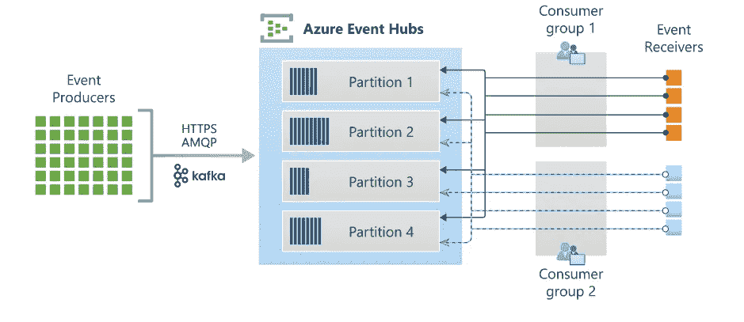
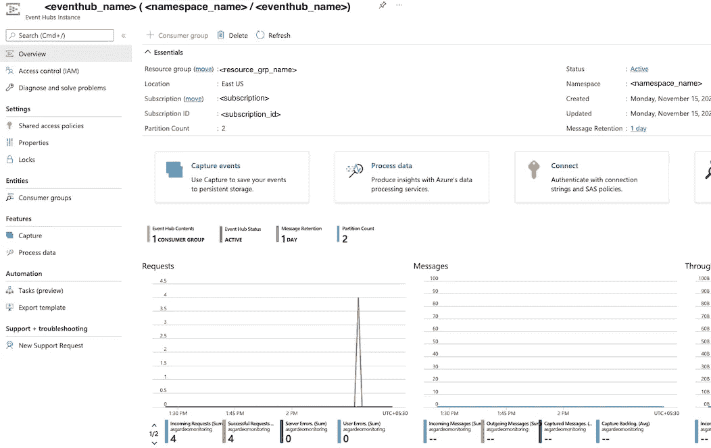
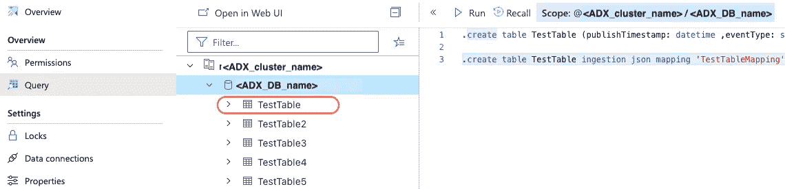
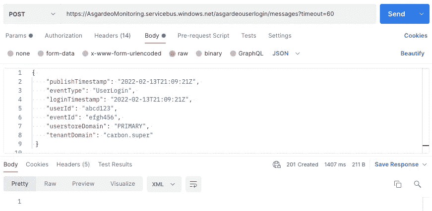
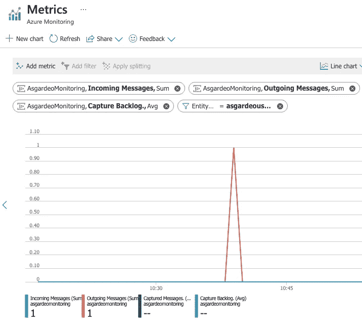

# Azure Event Hub 和 Azure Data Explorer 入门-第一部分

> 原文：<https://blog.devgenius.io/getting-started-with-azure-event-hub-and-azure-data-explorer-part-i-aab2a3edd339?source=collection_archive---------7----------------------->


## 什么是 Azure Event Hub？

> 简而言之，Azure Event Hub 是一个大数据流平台，每秒可以接收和处理数百万个事件。

它具有以下特点。

*   分区—支持高可用性数据发送和并行读取。每个分区内的数据顺序保持不变。
*   可靠—不受故障影响、零数据丢失和低延迟。
*   处理数据的分离系统——事件中心位于事件发布者和事件消费者之间，将事件流的产生与这些事件的消费分离开来。
*   实时数据处理—能够实时接收、缓冲、存储和处理数据流，以便做出时间紧迫的决策。

在活动中心有几个关键概念需要理解。



Azure 事件中心架构

**事件生产者**:向事件中心发送事件数据的任何实体。

**事件接收者**:从事件中心读取事件数据的任何实体。ADX 可以充当事件接收器，我将在这篇博客的后面详细解释。

**分区**:每个消费者只读取消息流的特定子集或分区。分区计数必须在创建事件中心时定义，并且以后不能修改。

**消费者群体**:整个活动中心的特定视图。接收者可以有自己独立的事件流视图。他们以自己的速度和偏移量独立地读取流。因此，这允许消费者独立扩展以满足需求。

如果你有兴趣阅读更多关于事件中心的内容，azure 文档无疑是一个很好的起点。

## 什么是 Azure Data Explorer (ADX)？

> Azure Data Explorer 是一个大数据分析平台，它可以处理确保*接近实时*决策所需的一切。这包括数据接收、数据查询、数据可视化和数据管理。

以下是 ADX 的一些关键功能。

*   ADX 可以非常快速地接收不同类型的数据，如结构化、半结构化和非结构化数据。
*   它使用 Kusto 查询语言(KQL)，该语言针对大数据探索进行了优化。需要注意的一个重要事实是，与 SQL 等其他查询语言不同，KQL 仅用于查询，不能使用 KQL 更新或删除数据。
*   有内置的 dashboarding 工具，如 Power BI，可用于数据可视化，它还支持 Tableau，Qlik，Kibana，Grafana 等。

你可以参考 [azure 文档](https://docs.microsoft.com/en-us/azure/data-explorer/)来获得更多关于 ADX 的信息。

我希望现在你已经对事件中心和 ADX 有了一些基本的了解。现在让我们进入有趣的部分，尝试一个使用上述 azure 资源的简单流程；)

让我们尝试一个简单的场景，将虚拟用户登录事件发布到 azure event hub，然后将事件数据接收到 ADX 数据库。这里，事件生产者/发布者只是一个 http 请求，带有来自 Postman 的登录事件数据。事件接收者/消费者是 ADX。

步骤 1:创建并配置一个 Azure 事件中心。

按照[这个分步指南](https://docs.microsoft.com/en-us/azure/event-hubs/event-hubs-create#create-an-event-hub)从 Azure 门户创建一个事件中心和一个名称空间。在创建事件中心时，我已经给出了分区计数(2)和消息保留(1)的默认值。

成功创建事件中心后，您将看到如下所示的事件中心概述页面。



**步骤 2:创建并配置 ADX 集群和数据库。**

遵循本指南从 azure 门户创建 ADX 集群和数据库。

记下 ADX 集群名称和数据库名称。

2.1 导航至创建的 ADX 数据库，并在左侧控制面板的`Overview`选项卡上选择`Query`。通过使用`Run`按钮执行下面的 Kusto 查询，在刚刚创建的 DB 中创建一个名为`TestTable`的表。

```
.create table TestTable (publishTimestamp: datetime ,eventType: string , loginTimestamp: datetime, userId: string, eventId: string, userstoreDomain: string, tenantDomain: string )
```

2.2 以同样的方式，创建一个名为`TestTableMapping`的映射，将 JSON 根路径映射到相应的列名。

```
.create table TestTable ingestion json mapping 'TestTableMapping' '[{"column":"publishTimestamp", "Properties": {"Path": "$.publishTimestamp"}}, {"column":"eventType", "Properties": {"Path":"$.eventType"}},{"column":"loginTimestamp", "Properties": {"Path": "$.loginTimestamp"}}, {"column":"userId", "Properties": {"Path": "$.userId"}} ,{"column":"eventId", "Properties": {"Path":"$.eventId"}}, {"column":"userstoreDomain", "Properties": {"Path":"$.userstoreDomain"}}, {"column":"tenantDomain", "Properties": {"Path":"$.tenantDomain"}}]'
```

成功创建表格后，您将能够看到左侧列出了您的表格，如下图所示。



**步骤 3:在 ADX DB 中创建一个数据连接，以便从事件中心接收事件数据。**

导航到创建的数据库，并转到`Settings`选项卡下的`Data connections`。点击`Add data connection`并从下拉菜单中选择`Event Hub`。

用以下信息填写表格，然后选择**创建**。

> 数据连接名称-您要在 Azure Data Explorer 中创建的连接的任何名称。例:测试连接器 1
> 
> 订阅-从下拉列表中选择订阅 ID。
> 
> 事件中心名称空间-从下拉列表中选择您在步骤 1 中创建的名称空间。
> 
> 事件中心-选择您创建的事件中心名称。
> 
> 消费者组-选择在您创建的事件中心中定义的消费者组。
> 
> 压缩-从下拉菜单中选择`None`。
> 
> 分配托管身份-选择`System-assigned`
> 
> 表名-提供创建的表的名称。在我们的场景中是`TestTable`。
> 
> 数据格式-从下拉菜单中选择`*JSON*` *。*
> 
> 映射-提供在数据库中创建的映射的名称。我把它命名为`TestTableMapping`

**步骤 4:用 HTTP 请求调用 Azure REST APIs 来复制一个虚拟用户登录事件。**

4.1 从下面的代码片段创建一个共享访问签名令牌。

对于<key_name>，给定值`RootManageSharedAccessKey`</key_name>

对于<policy_primary_key>，导航到您的事件中心名称空间→设置→共享访问策略→ RootManageSharedAccessKey 并复制`Primary key`。</policy_primary_key>

记下您获得的与此类似的`Shared_Access_Signature_token`;

`SharedAccessSignature sr=your-namespace.servicebus.windows.net&sig=your-sas-key&se=1403736877&skn=RootManageSharedAccessKey`

4.2 向 azure event hub 发送 HTTP 请求，如下例所示。

我将使用 Postman 调用 azure REST APIs 来发送一个虚拟用户登录事件。提供上一步获得的`Shared_Access_Signature_token`作为`Authorization`标题值。

```
POST https://your-namespace.servicebus.windows.net/your-event-hub/messages?timeout=60  
Authorization: <Shared_Access_Signature_token> 
Content-Type: application/json  
Host: your-namespace.servicebus.windows.net{ "publishTimestamp": "2022-02-13T21:09:21Z", "eventType": "UserLogin", "loginTimestamp": "2022-02-13T21:09:21Z", "userId": "abcd123", "eventId": "efgh456", "userstoreDomain": "PRIMARY", "tenantDomain": "carbon.super"
 }
```

如果您正确完成了上述所有步骤，您将获得一个 *201 创建的*成功状态响应代码，如下图所示。



现在让我们看看登录事件是否已经记录在我们创建的事件中心中。

导航到您创建的事件中心，然后单击 overview 选项卡。选择`Messages`图，您将观察到一个峰值，它对应于我们刚刚作为 HTTP 请求发送的事件。



因为我们已经在 ADX 中配置了一个数据连接，所以转到创建的数据库并执行`TestTable`命令，列出上面登录数据条目的表格。

您已经到达了我的 Azure 资源博客系列的第一部分的结尾。在下一篇博客中，我将详细阐述如何编写一个简单的 spring 应用程序，将一批事件流式传输到 Azure event hub 并接收到 ADX。

希望你觉得这个博客有用！感谢您的阅读。

# **参考文献**

[](https://docs.microsoft.com/en-us/azure/event-hubs/) [## Azure 事件中心文档

### 了解如何使用事件中心从连接的设备和应用程序中每秒接收数百万个事件。

docs.microsoft.com](https://docs.microsoft.com/en-us/azure/event-hubs/) [](https://docs.microsoft.com/en-us/azure/data-explorer/) [## Azure 数据浏览器文档

### Azure Data Explorer 是一个快速、完全托管的数据分析服务，用于对大量数据进行实时分析…

docs.microsoft.com](https://docs.microsoft.com/en-us/azure/data-explorer/) [](https://medium.com/analytics-vidhya/azure-data-explorer-7d44e48d39a6) [## Azure 数据浏览器

### 理解为什么和什么时候有用的基础知识

medium.com](https://medium.com/analytics-vidhya/azure-data-explorer-7d44e48d39a6)