# 面向初学者的 Azure Synapse 分析入门(第 1 部分)

> 原文：<https://blog.devgenius.io/getting-started-with-azure-synapse-analytics-for-beginners-part-1-1822a9015586?source=collection_archive---------1----------------------->

## Azure 教程

在本教程中，您将学习以下内容:

*   什么是 Azure Synapse Analytics？
*   如何创建 Synapse analytics 资源及其配置。
*   什么是专用 SQL 池，我们为什么要在 synapse studio 上创建它？
*   如何创建专用的 SQL 池

# 先决条件:

要完成本教程，您需要

*   在 azure 上拥有一个活跃帐户，您可以从[这里](https://azure.microsoft.com/en-us/free/)创建一个免费帐户
*   Azure 基础知识和云概念，你可以阅读[这个](https://medium.com/towardsdev/azure-fundamentals-and-cloud-concepts-b7010b25993a)，它会帮助你。

# **什么是 Azure Synapse Analytics？**

在市场上，我们现在有两大领域。数据仓库字段，负责提取、加载和转换数据。大数据分析，负责对不同类型的数据(结构化的如表、行和列，非结构化的如图像、视频等)进行复杂的分析。Azure Synapse Analytics 将数据仓库和大数据分析结合在一起。

它有很多特性，你可以在这里查看，但是我们可以讨论最重要的特性，如下所示

*   synapse analytics 可以与 power bi 集成，提供强大的洞察力。
*   可以和 Azure 机器学习集成
*   通过管道进行数据集成
*   Apache Spark 工作负载
*   分析流

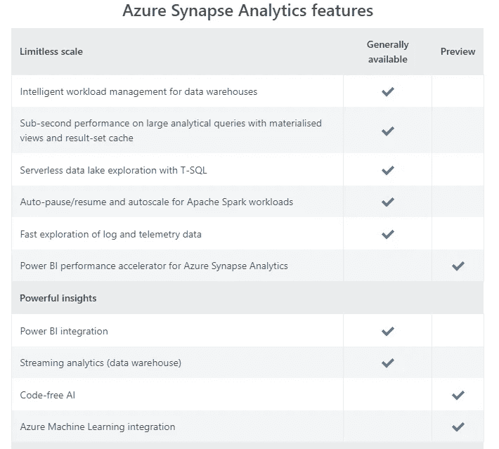

# 创建 Synapse 分析资源:

打开 Azure 门户，搜索 synapse analytics 并创建一个新的

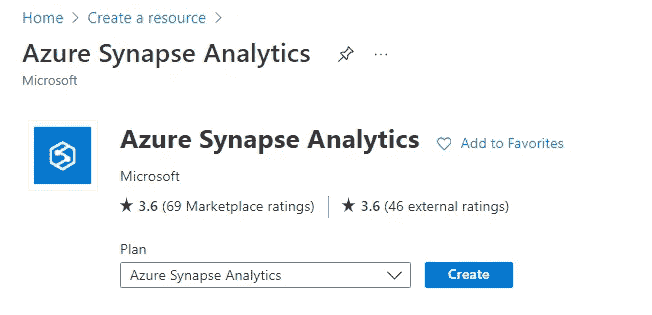

*   选择您的订阅，然后选择资源组或创建一个新的资源组。
*   给工作区一个有效的名称，选择离你最近的区域，可以通过这个[链接](https://www.azurespeed.com/Azure/Latency)测试离你最近的区域。

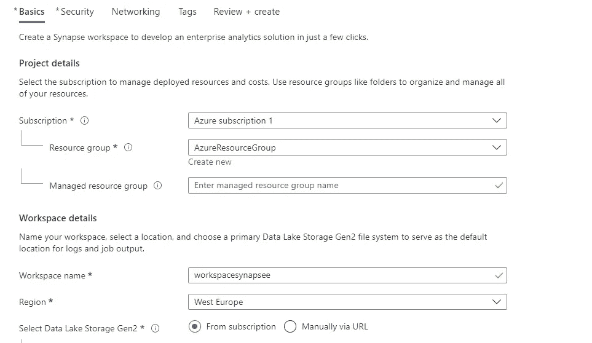

*   选择 **Data Lake Storage，**为 data lake storage Gen2 创建一个新的帐户和一个新的文件系统，如下所示。

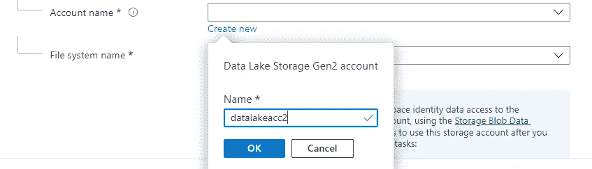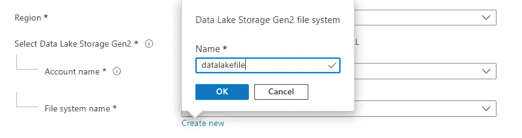

在“security”选项卡中，我们将设置 SQL 密码并确认它以进行身份验证。

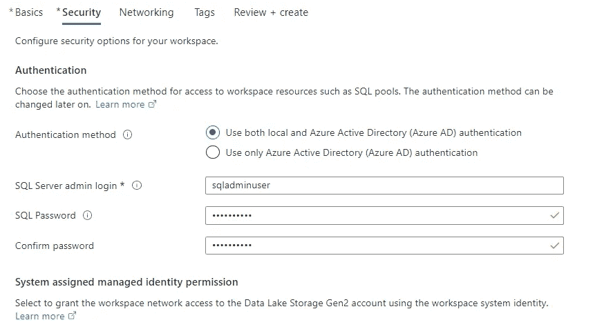

并将其余选项卡保留为默认设置。

最后一步是“审查+创建”。如您所见，synapse analytics 的成本为 5.00 美元。因此，请查看所有详细信息，然后单击“创建”按钮。

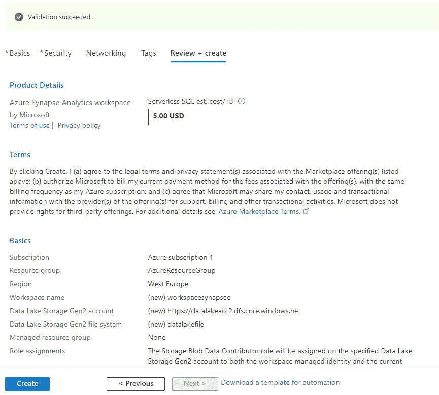

现在部署已经完成，我们可以转到资源组并打开 synapse analytics 工作区。

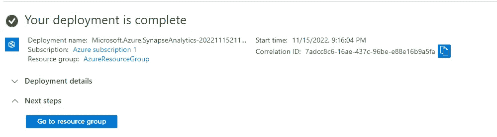

打开 synapse studio，了解它的功能。

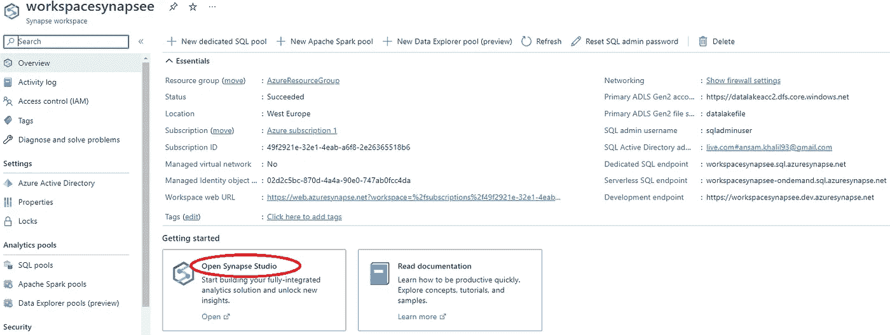

# 什么是专用 SQL 池？

专用 SQL 池的主要作用是以一种格式(列格式)存储数据，这种格式可以降低成本并提高查询效率，尤其是对于大数据和复杂分析。

# **创建专用的 SQL 池**

打开 Synapse Studio，转到 manage 选项卡，在“SQL pools”中单击 create 以创建一个新的**专用 SQL 池。**

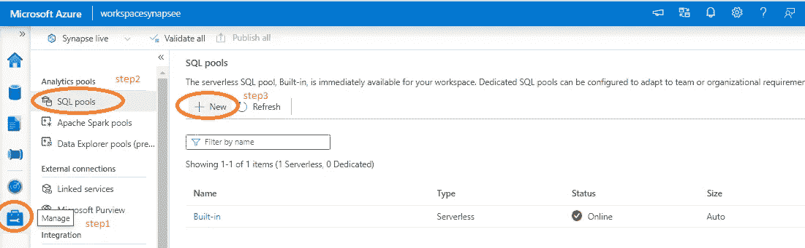

为专用 SQL 池设置一个名称。在本教程中，名称是“NewdedSQL ”,将性能级别降至最低，因为我们的项目不需要高性能。此外，在将性能级别降至最低后，按如下所示降低成本，成本为每小时 1.51 美元，因此如果您不使用该池，请务必暂停它。

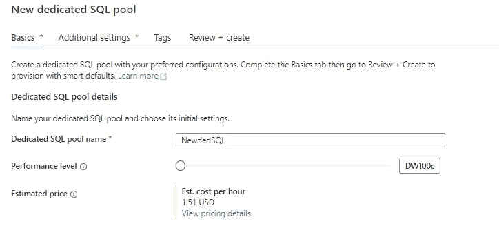

这是暂停专用 SQL 池的一种方式。转到 SQL 池中的管理选项卡。只需点击暂停按钮，如下所示。

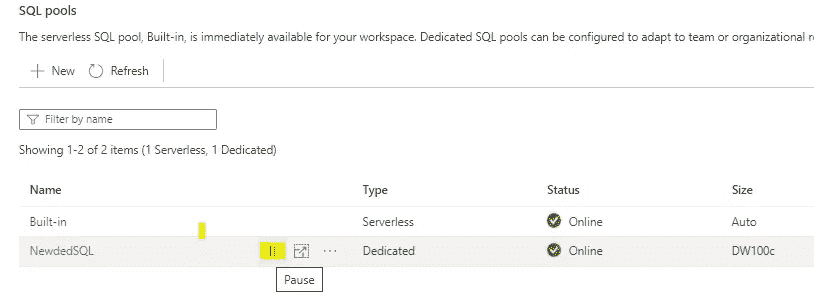

# 包扎

在本教程中，您学习了以下内容:

*   什么是 synapse analytics？
*   如何创建 synapse 分析？
*   什么是专用 SQL 池？
*   如何在 synapse analytics 中创建专用的 SQL 池。

我希望你喜欢阅读这篇文章，并发现它内容丰富。在下面的文章中，我们将讨论如何在 synapse 分析工具中摄取数据，以使用 Azure 实现云数据仓库。请随意添加您的评论、想法或反馈，并且不要忘记在 [LinkedIn](https://www.linkedin.com/in/ansam-yousry-34b32b116/) 上联系或关注我的 medium 帐户以保持更新。