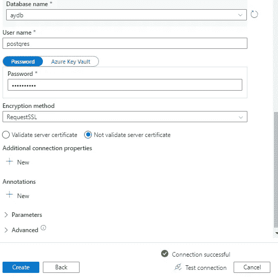

# 面向初学者的 Azure Synapse 分析入门(第 2 部分)

> 原文：<https://blog.devgenius.io/getting-started-with-azure-synapse-analytics-for-beginners-part-2-1cc188239131?source=collection_archive---------3----------------------->

## Azure 教程| PostgreSQL


正如我们之前在第 1 部分中讨论的，什么是 synapse analytics 和专用 SQL 池及其重要性以及如何创建它们，您可以在此处找到

现在，我们将了解有关 synapse 分析工具的新内容，敬请关注

在本教程中，您将学习:

*   如何创建 Postgres 数据库？
*   使用 python 脚本在 Postgres 上创建一个新的数据库。
*   在 Synapse 上为 Postgres 创建链接服务。

# 先决条件:

要完成本教程中的步骤，您需要满足下面给出的先决条件

*   你可以通过这个[链接](https://azure.microsoft.com/en-us/free/)创建一个免费账户。
*   Synapse workspace，可以找到创建 Synapse 的步骤。工作区[这里](https://medium.com/@ansam.yousry/getting-started-with-azure-synapse-analytics-for-beginners-part-1-1822a9015586)。
*   专用的 SQL 池，你可以在这里找到步骤。

# Azure PostgreSQL 数据库:

在市场中搜索 Azure Database for PostgreSQL，然后单击 create。


在本教程中，我们将使用 Azure Database for PostgreSQL 和一个灵活的服务器作为资源类型，您可以通过点击“显示详细信息”来了解更多关于 PostgreSQL 类型的信息。


创建 PostgresSQL 的第一步是选择您的订阅和资源组。


给服务器一个有效的名称，选择离你最近的地区。在本教程中，我们在**工作负载类型**中选择开发，建议用于小型数据库和个人项目，如下所示(注意成本，“开发”工作负载类型是最低价格)。


您可以从这里调整服务器配置，这会影响成本。


在身份验证部分，给出管理员用户名和密码的名称。


在“网络”选项卡中，防火墙规则只允许从 azure 中的任何 Azure 服务到此服务器的公共访问。


其余的保持默认。

创建 Postgres 数据库后，非常非常重要的是停止它以最小化成本，如下所示。


**使用 Python 脚本在 Postgres 服务器上创建数据库和表:**

我们需要在 Postgres 服务器上创建一个新的数据库，然后在我们刚刚创建的新数据库中创建表。

你可以在(Jupyter 或 Colab)中运行下面的代码，我更喜欢 [Colab](https://colab.research.google.com/) 。但是要更改主机、用户和密码。

您可以获得您的主机和用户名，如下所示。


在运行 python 脚本之前，我们需要在 azure PostgreSQL 的网络中调整一些东西，以建立连接并获得成功。


如上图所示，转到网络并添加突出显示的 IP，然后运行 Python 脚本。

```
import psycopg2
from psycopg2.extensions import ISOLATION_LEVEL_AUTOCOMMIT

########################################
# Update connection string information #
########################################
host = "postgresqlerver.postgres.database.azure.com"
user = "postgres"
password = "ansam_1993"

# Create a new DB
sslmode = "require"
dbname = "postgres"
conn_string = "host={0} user={1} dbname={2} password={3} sslmode={4}".format(host, user, dbname, password, sslmode)
conn = psycopg2.connect(conn_string)
conn.set_isolation_level(ISOLATION_LEVEL_AUTOCOMMIT);
print("Connection established")

cursor = conn.cursor()
cursor.execute('DROP DATABASE IF EXISTS ayDB')
cursor.execute("CREATE DATABASE ayDB")
# Clean up initial connection
conn.commit()
cursor.close()
conn.close()

# Reconnect to the new DB
dbname = "aydb"
conn_string = "host={0} user={1} dbname={2} password={3} sslmode={4}".format(host, user, dbname, password, sslmode)
conn = psycopg2.connect(conn_string)
print("Connection established")
cursor = conn.cursor()

# Helper functions
def drop_recreate(c, tablename, create):
    c.execute("DROP TABLE IF EXISTS {0};".format(tablename))
    c.execute(create)
    print("Finished creating table {0}".format(tablename))

def populate_table(c, filename, tablename):
    f = open(filename, 'r')
    try:
        cursor.copy_from(f, tablename, sep=",", null = "")
        conn.commit()
    except (Exception, psycopg2.DatabaseError) as error:
        print("Error: %s" % error)
        conn.rollback()
        cursor.close()
    print("Finished populating {0}".format(tablename))

# Create Rider table
table = "rider"
filename = '/content/riders.csv'
create = "CREATE TABLE rider (rider_id INTEGER PRIMARY KEY, first VARCHAR(50), last VARCHAR(50), address VARCHAR(100), birthday DATE, account_start_date DATE, account_end_date DATE, is_member BOOLEAN);"

drop_recreate(cursor, table, create)
populate_table(cursor, filename, table)

# Clean up
conn.commit()
cursor.close()
conn.close()

print("All done!")
```

# 与 Postgresql 链接的服务:

正如我们看到的，已经创建了链接服务，现在我们希望为 Postgresql 创建类似的服务，如下所示


搜索 Postgres 并选择突出显示的一个


为链接的服务命名，选择您的订阅和服务器


然后你会发现一个数据库列表，选择我们刚刚在本教程中创建的“aydb”，测试连接并点击创建按钮。



正如我们在下面看到的，PostgreSQL 的链接服务已经创建。


# 包扎

在本教程中，您学习了如何:

*   创建 Postgres 数据库。
*   使用 python 脚本在 Postgres 上创建一个新的数据库。
*   在 Synapse 上为 Postgres 创建链接服务。

我希望你喜欢阅读这篇文章，并发现它内容丰富。在接下来的文章中，我们将继续探索 synapse 分析工具，用 Azure 实现云数据仓库。请随意添加您的评论、想法或反馈，并且不要忘记在 [LinkedIn](https://www.linkedin.com/in/ansam-yousry-34b32b116/) 上联系或关注我的媒体帐户以保持更新。