# 面向初学者的 Azure Synapse 分析入门(第 3 部分)

> 原文：<https://blog.devgenius.io/getting-started-with-azure-synapse-analytics-for-beginners-part-3-6c90d5be2d1?source=collection_archive---------8----------------------->

Azure 教程


在本教程中，您将学习:

*   如何创建 blob 存储？
*   使用 python 脚本在 Postgres 上创建一个新的数据库。
*   在 Synapse 上为 Postgres 创建链接服务。

# 先决条件:

要完成本教程中的步骤，您需要满足下面给出的先决条件

*   你可以通过这个[链接](https://azure.microsoft.com/en-us/free/)创建一个免费账户。
*   synapse workspace，可以找到创建 synapse 的步骤。工作区[这里](https://medium.com/@ansam.yousry/getting-started-with-azure-synapse-analytics-for-beginners-part-1-1822a9015586)。
*   专用的 SQL 池，你可以在这里找到步骤。
*   PostgreSQL，用数据创建 DB 和表，这里可以找到步骤[。](https://medium.com/@ansam.yousry/getting-started-with-azure-synapse-analytics-for-beginners-part-2-1cc188239131)

**创建 blob 存储:**

选择您的订阅和资源组

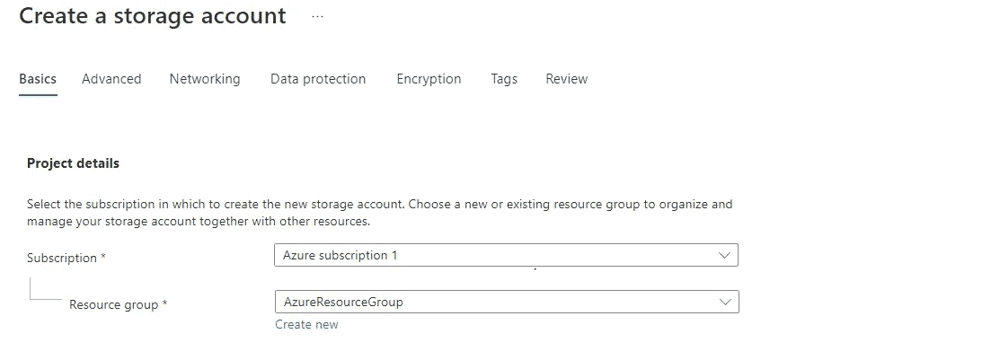

为存储帐户提供一个唯一的名称，并选择离您最近的地区。

选择本地冗余，因为它比全局冗余更便宜，并且在我们的教程中，本地冗余将满足我们的要求。

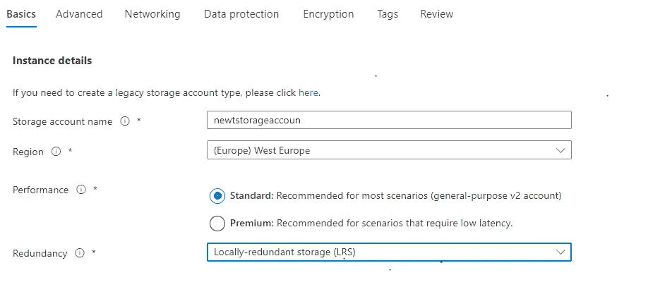

启用“分层名称空间”选项，并将其余选项保持为默认设置，如“仅创建”。

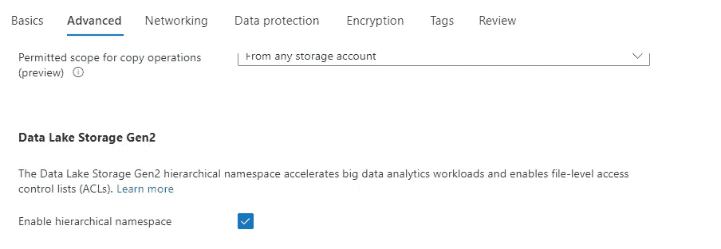

# blob 存储的链接服务:

现在，我们需要为 blob 存储创建链接服务，因此转到“管理”选项卡，并在(**外部连接**部分，**链接服务**)中，单击“新建”。

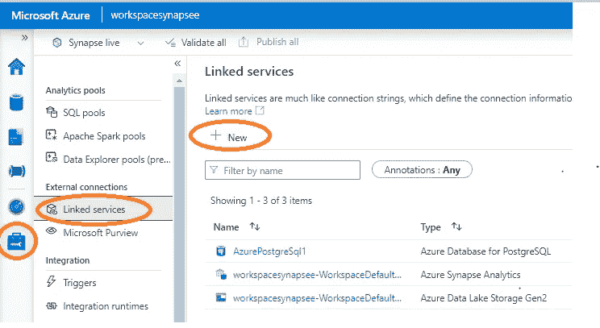

搜索 blob 存储，如图所示

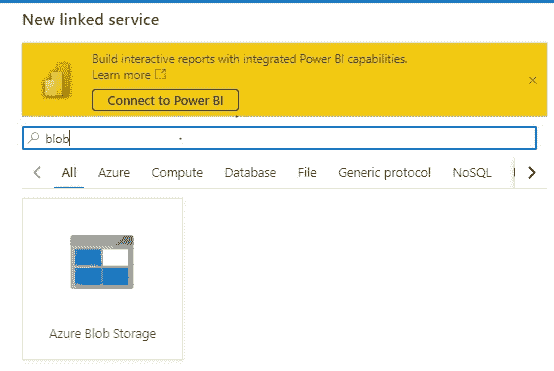

选择您的订阅和存储帐户，并测试连接。如果成功，请单击“创建”。

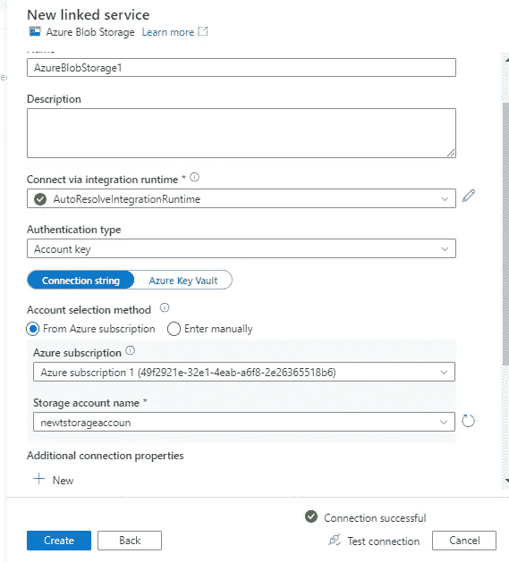

现在我们有 4 个链接的服务，如果有什么遗漏，请查看[教程第 1 部分](https://medium.com/@ansam.yousry/getting-started-with-azure-synapse-analytics-for-beginners-part-1-1822a9015586)和[教程第 2 部分](https://medium.com/@ansam.yousry/getting-started-with-azure-synapse-analytics-for-beginners-part-2-1cc188239131)。

# 使用 Azure Synapse 创建临时表:

在“管理”选项卡和“SQL 池”下，确保您的专用 SQL 池处于在线状态。

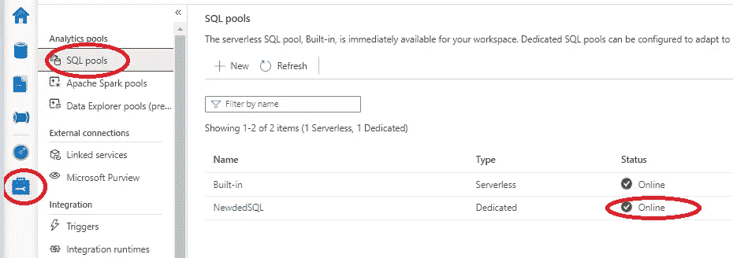

然后转到 data 选项卡，在 External tables 下，您可以上传想要加载到 Azure SQL DB 中的文件。在本教程中，我们上传了 CSV 文件。

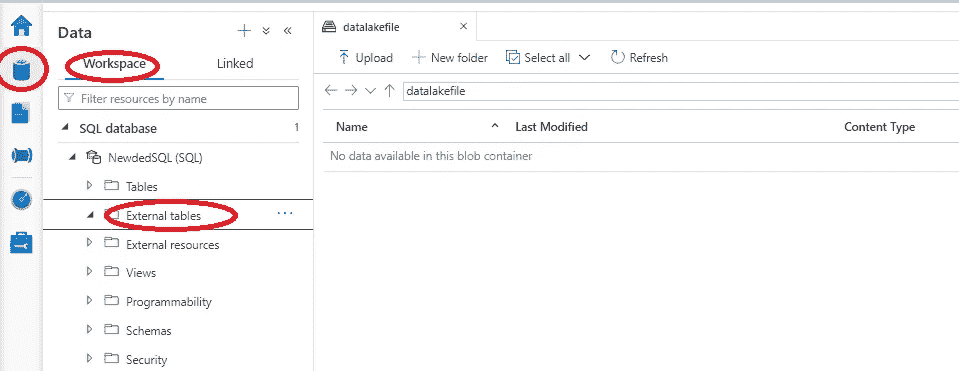

如你所见，我们上传了 riders.csv

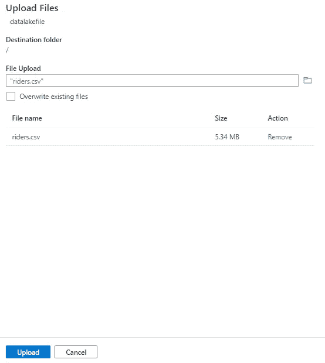

现在我们想创建一个外部表，将 CSV 文件的数据加载到其中。因此，在“数据”选项卡和“链接”部分，您可以创建一个外部表，如下所示。

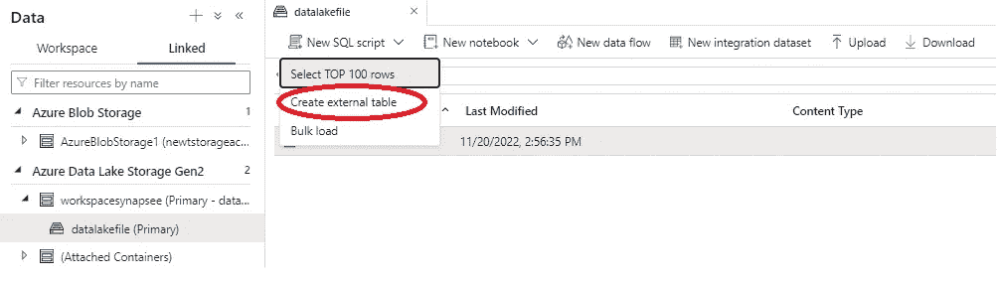

选择 SQL 池和数据库，并为外部表命名，然后点击打开脚本。

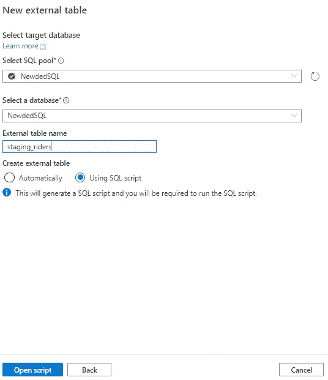

如下所示，脚本是自动创建的，您可以对其进行一些更改。在本教程中，我们将更改列名和一些列的数据类型。

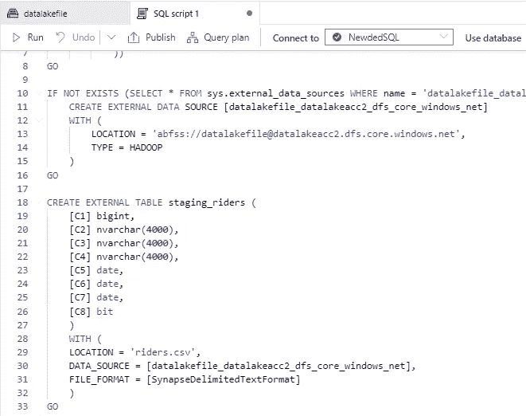

这是我们使用的 SQL 脚本，注意我们编写了**创建外部表**，并更改了列名和数据类型。

```
IF NOT EXISTS (SELECT * FROM sys.external_file_formats WHERE name = 'SynapseDelimitedTextFormat') 
 CREATE EXTERNAL FILE FORMAT [SynapseDelimitedTextFormat] 
 WITH ( FORMAT_TYPE = DELIMITEDTEXT ,
        FORMAT_OPTIONS (
    FIELD_TERMINATOR = ',',
    USE_TYPE_DEFAULT = FALSE
   ))

GO

IF NOT EXISTS (SELECT * FROM sys.external_data_sources WHERE name = 'datalakefile_datalakeacc2_dfs_core_windows_net') 
 CREATE EXTERNAL DATA SOURCE [datalakefile_datalakeacc2_dfs_core_windows_net] 
 WITH (
  LOCATION = 'abfss://datalakefile@datalakeacc2.dfs.core.windows.net', 
  TYPE = HADOOP 
 )
GO

CREATE EXTERNAL TABLE staging_riders (
 [rider_id] bigint,
 [first_name] nvarchar(4000),
 [last_name] nvarchar(4000),
 [address] nvarchar(4000),
 [birthdate] varchar(50),
 [account_start_date] varchar(50),
 [account_end_date] varchar(50),
 [is_member] varchar(50)
 )
 WITH (
 LOCATION = 'riders.csv',
 DATA_SOURCE = [datalakefile_datalakeacc2_dfs_core_windows_net],
 FILE_FORMAT = [SynapseDelimitedTextFormat]
 )
GO

SELECT TOP 100 * FROM dbo.staging_riders
GO
```

运行上述脚本后的结果看起来不错。

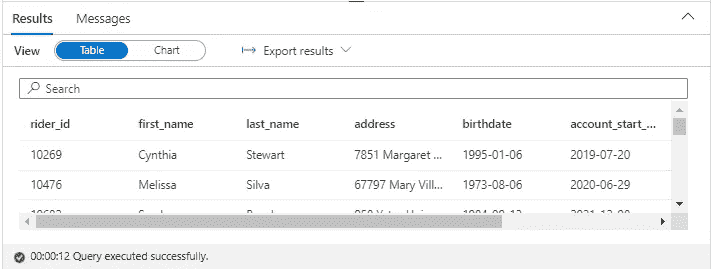

如果您转到工作区并在外部表下，您会发现表已创建。

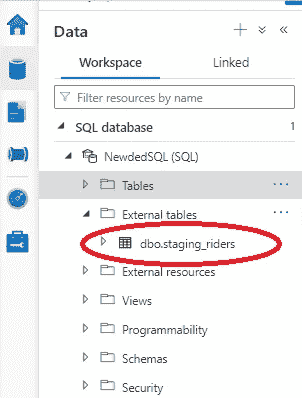

如果我们需要做一些转换并把它加载到一个新表中。我们可以转到开发选项卡并创建一个新的 SQL 脚本。并使用您想要进行的更改编写一个新脚本。

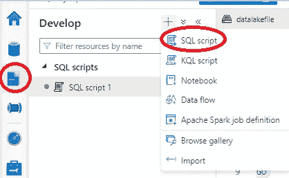

正如您在这里看到的，我们用新的数据类型创建了一个新表。将转换后的数据插入到新表中(将数据类型 birthdate、account_start_date 和 account_end_date 从 varchar 转换为 date)

```
CREATE table rider (
    account_number integer
    ,first_name varchar(50)
    ,last_name varchar(50)
    ,adress varchar(50)
    ,birthday date
 ,is_member bit 
    ,account_start_date DATE
    ,account_end_date DATE
)

GO;

insert into rider (account_number,first_name,last_name,adress,birthday,is_member,account_start_date,account_end_date)
select rider_id,first_name,last_name,address,try_convert(date,left(birthdate,10))as birthday  ,is_member,try_convert(date,left(account_start_date,10)) as account_start_date ,try_convert(date,left(account_end_date,10)) as account_end_date
from staging_riders

GO;

select top 100 * from rider

GO;
```

运行脚本后，我们将得到下面的结果，我们可以检查它，以确保一切正常。

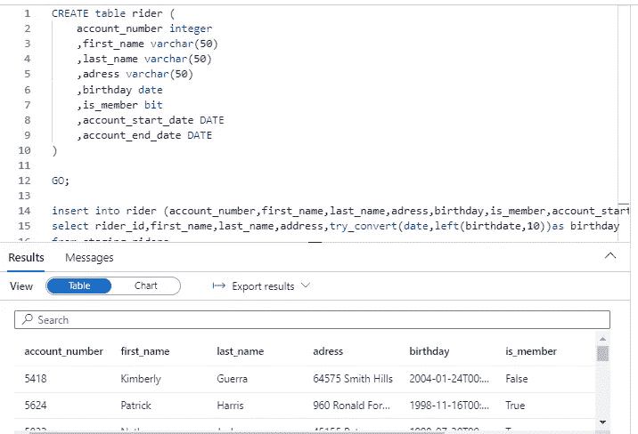

# 包扎

在本教程中，您学习了如何:

*   创建 blob 存储。
*   使用 python 脚本在 Postgres 上创建一个新的数据库。
*   在 Synapse 上为 Postgres 创建链接服务。

我希望你喜欢阅读这篇文章，并发现它内容丰富。。请随意添加您的评论、想法或反馈，不要忘记联系 [LinkedIn](https://www.linkedin.com/in/ansam-yousry-34b32b116/) 或关注我的媒体账户以保持更新。