# 云计算入门

> 原文：<https://blog.devgenius.io/getting-started-with-cloud-computing-541b0f2e608f?source=collection_archive---------18----------------------->

什么是云计算？

云计算是使用信息技术(IT)的一种方式，它具有以下五个同等重要的特征:

1.  客户可以获得自助式按需计算机资源。
2.  客户可以通过互联网从任何地方访问这些资料。
3.  资源提供者在该池中的消费者之间分发这样的资源。
4.  资源是有弹性的，这意味着它们可以被改变以适应消费者的需求。
5.  客户只为他们实际使用或预订的服务付费。

谷歌云是物理和虚拟资源的集合，包括虚拟机，它们保存在全球各地的谷歌数据中心。通过将资源放在离客户端更近的地方，这种资源分布减少了延迟，并在发生故障时提供了冗余。此外，本出版物还提供了一些合并资源的建议。

GCP 为管理谷歌云项目和资源提供了一个基于网络的图形用户界面。如果用户喜欢在命令行工作，gcloud 命令行工具可以处理大多数谷歌云活动。

**云存储:**

*   **云存储**是一项允许用户将数据存储在谷歌云上的服务。
*   一个**对象**是一段不可变的数据，它由任何格式的文件组成。对象可以存储在被称为**桶**的容器中。
*   所有存储桶都与一个项目相关，用户可以将他们的项目组织到**组织**中。
*   在开始一个项目后，用户可能会创建云存储桶，将东西上传到桶中，并获取对象。用户还可以授予权限，使数据对某些域或特定用例(如建立网站)可用。
*   **存储类**可以被定义为与对象/桶相关联的元数据，其确定对象的可用性和定价。
*   不同的类可用于不同的用例，如**存档**、**托管**网站或通过互联网公开大型对象以供下载。

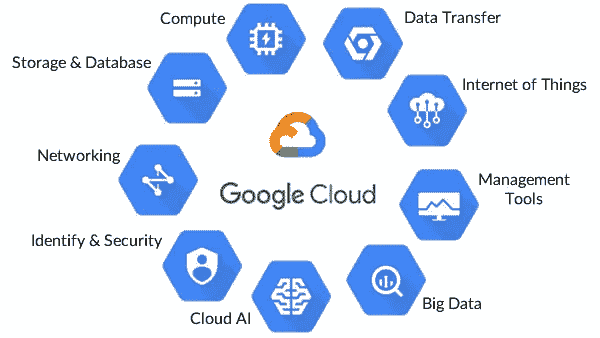

谷歌云服务

**谷歌云存储(GCS)的重要特性:**

全球存储

灾难恢复

不同使用案例的不同定价

无限的可扩展性:任何数量的数据都可以存储在桶中。

高效检索

多语言支持，可与铲斗互动

**计算引擎:**

计算引擎提供了规模、性能和价值，允许用户毫不费力地在谷歌的基础设施上部署巨大的计算集群。没有初始成本，数百个虚拟 CPU 可以在一个系统上运行，提供快速一致的性能。
计算引擎中的每个区域都包含许多区域。每个区域名称包含详细描述每个区域的两个部分。区域名称的第一部分是区域，第二部分描述区域中的区域。

**地区:**

*   区域是区域的集合。区域与同一区域中的其他区域具有高带宽、低延迟的网络连接。为了部署具有高可用性的容错应用程序，Google 建议跨多个区域和多个地区部署应用程序。这有助于防止组件意外故障，包括单个区域或地区。
*   选择对您的场景有意义的区域。例如，如果您只有美国的客户，或者如果您有特定的需求需要您的数据位于美国，那么将您的资源存储在`us-central1`区域的区域或`us-east1`区域的区域中是有意义的。

在下图中，我们可以看到每个 **AWS 区域**被设计为与其他 AWS 区域隔离。这种设计实现了最大可能的容错性和稳定性。

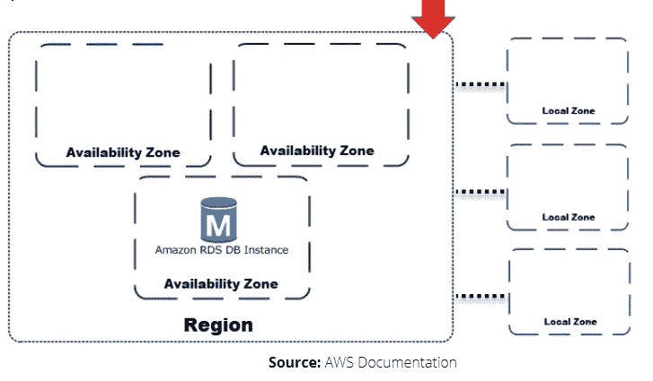

**区域:**

*   区域是一个地区内的部署区域。区域的完全限定名由`<region>-<zone>`组成。例如，区域`us-central1`中区域`a`的全限定名称是`us-central1-a`。
*   根据您希望分布资源的范围，在多个区域的多个区域中创建实例以实现冗余。

**可用性区域:**可用性区域(AZ)是 AWS 区域内一个或多个具有冗余电源、网络和连接的数据中心。它使客户能够以高度可用、容错和可扩展的方式部署应用程序和数据库。

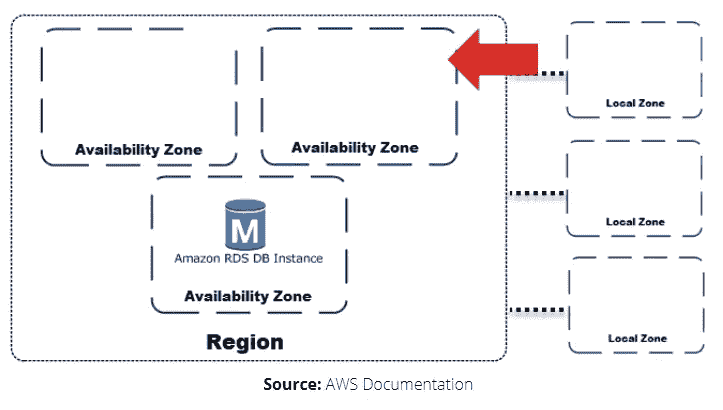

**本地区域:**

**本地区域**是上面显示的 AWS 区域的延伸，在地理上靠近您的用户。通过创建新的子网并将其分配给 AWS 本地区域，您可以将任何 VPC 从父 AWS 区域扩展到本地区域。在本地区域中创建子网时，您的 VPC 会扩展到该本地区域。本地域中的子网与 VPC 中的其他子网运行方式相同。

创建数据库实例时，可以选择本地区域中的子网。本地区域有自己的互联网连接，并支持 AWS 直接连接。在本地区域中创建的这种资源可以为本地用户提供非常低延迟的通信。

在下图中，**本地区域**由一个 AWS 区域代码表示，后跟一个指示位置的标识符，例如 us-west-2-lax-1 a。

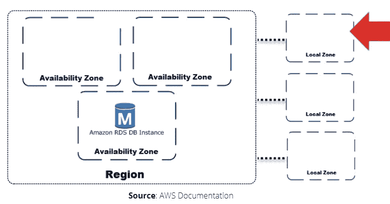

**酒吧/订阅:**

发布/订阅允许服务异步交互，并在流分析和数据集成管道中用于接收和传播数据。像 Kafka 一样，它允许用户设计事件生产者和消费者的系统，即发布者和订阅者。发布者通过传播事件与订阅者异步连接，而不是同步**远程过程调用**(RPC)。发布者将事件传输到发布/订阅服务，而不考虑这些事件将如何或何时被处理。然后，发布/订阅将事件发送给任何需要响应它们的服务。这种类型的异步集成提高了系统的整体灵活性和健壮性。

**边缘网络位置:**

AWS edge 网络服务在全球范围内安全传输面向用户的数据，并降低延迟。通过将流量移出互联网并置于世界上最安全的云提供商的防御之下，您可以通过加密数据、消除网络跳跃和控制应用程序访问来限制遭受攻击的风险。

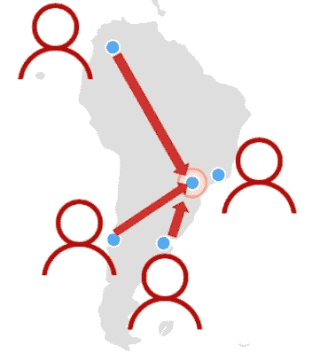

网络服务 Amazon CloudFront、AWS 全球加速器和 Amazon Route S3 位于 AWS 的全球边缘位置，通过专用的 10OGbps 冗余光纤连接，以个位数毫秒 AWS 网络延迟提供数据。

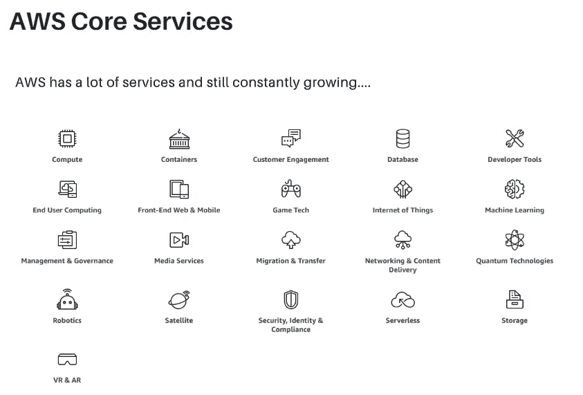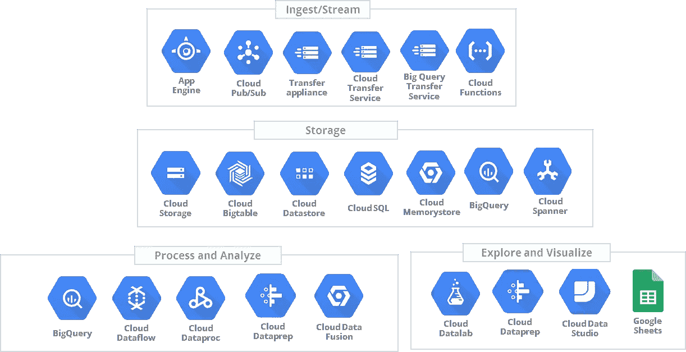

GCP 服务示例

**谷歌云入门:**

谷歌云服务有七个类别:

**计算:**支持任何类型工作负载的各种机器类型。不同的计算选项可让您决定对运营细节和基础设施的控制程度。

**存储**:结构化或非结构化、关系或非关系数据的数据存储和数据库选项。

**联网:**平衡应用流量和提供安全规则的服务。

**云操作**:一套跨云日志、监控、跟踪和其他服务可靠性工具。

**工具:**帮助开发者管理部署和应用构建管道的服务。

**大数据:**允许你处理和分析大型数据集的服务。

*   **人工智能:**在谷歌云上运行特定人工智能和机器学习任务的一套 API。

了解更多信息:

[](https://cloud.google.com/products#top_of_page) [## 产品和服务|谷歌云

### 查看来自 Google Cloud、Google Maps Platform 等产品，帮助开发人员和企业转变他们的…

cloud.google.com](https://cloud.google.com/products#top_of_page) 

**角色:**

作为一名**编辑**，你可以创建、修改和删除谷歌云资源。但是，您不能在 Google Cloud 项目中添加或删除成员。作为编辑，您可以创建、修改和删除 Google 云资源。但是，您不能在 Google Cloud 项目中添加或删除成员。

作为一名**查看者**，您拥有不影响状态的只读操作权限，比如查看(但不修改)现有资源或数据。

作为**所有者**，您拥有所有编辑权限和以下操作权限:管理项目的角色和权限以及项目中的所有资源；为项目设置开单。

**关键要点:**

谷歌云控制台简介

了解云存储的概念和类别

创建服务帐户

设置 Gcloud SDK

安装 Python 和其他依赖项

了解保留策略和保留

设置 GCP 虚拟机和 SSH 配置

了解发布/订阅架构

创建发布/订阅主题并实现消息流

使用 GCS 实现发布/订阅通知

**初始步骤:**

1.  创建一个新的 Gmail 帐户。
2.  使用这个新的 Gmail 帐户登录 console.cloud.google.com。
3.  GCP 给你 300 美元的信用，你可以用它来使用各种服务。

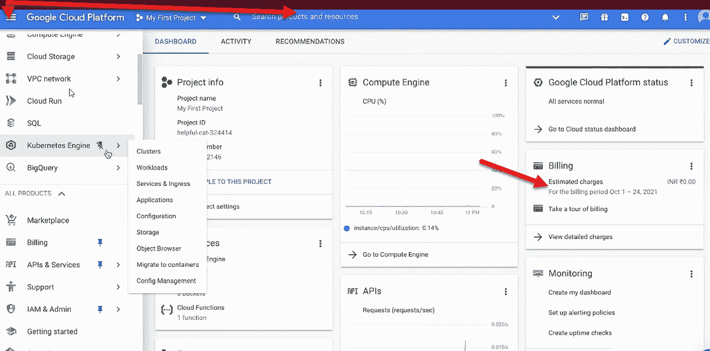

console.cloud.google.com

4.通过搜索服务帐户 API 创建服务帐户并启用 API。

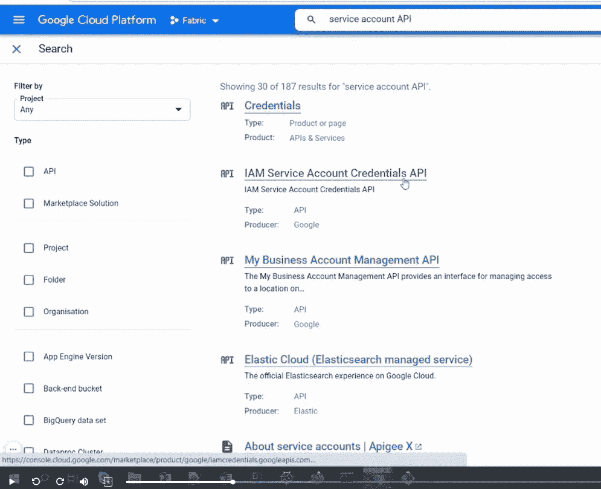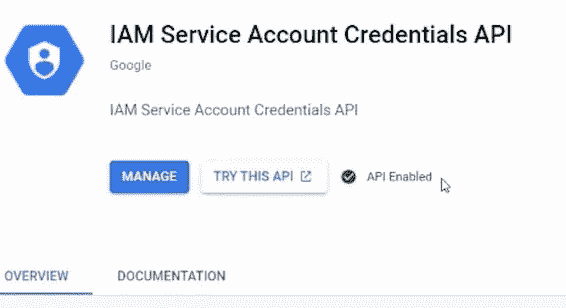

启用 API 后

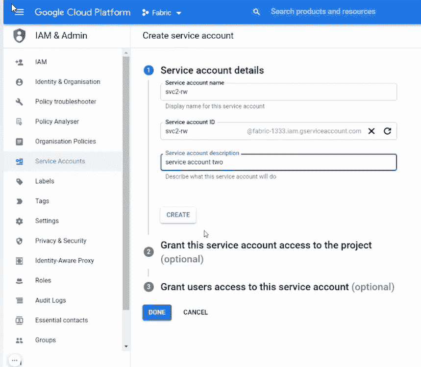

5.选择一个角色，在这里我想给读写能力，所以我分配编辑角色。

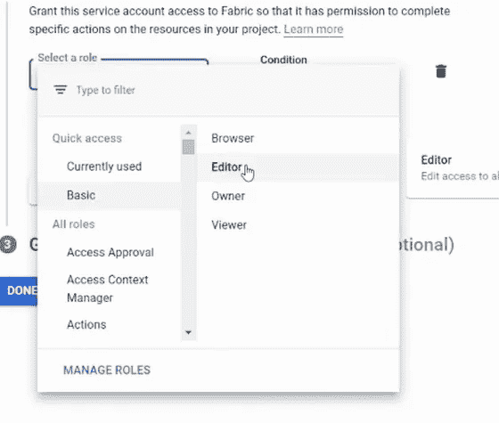

6.使用服务帐户需要密钥。如图所示，没有相关的键。


7.通过单击服务帐户并单击密钥来创建新密钥。将密钥保存在您的机器上，因为它将用于身份验证。

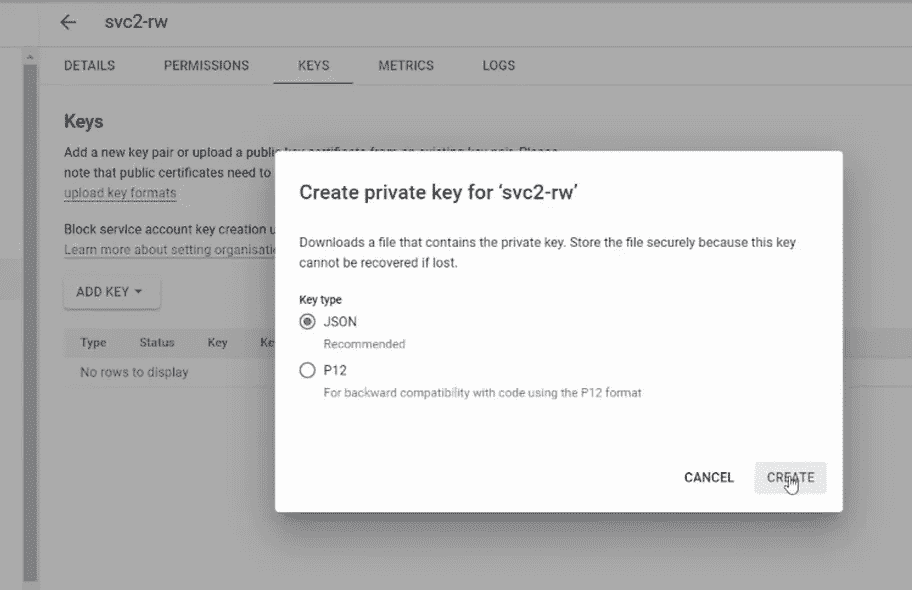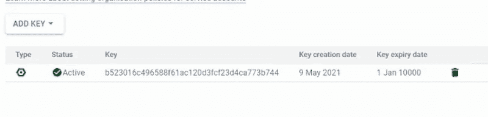

8.在将 SDK setup SSH 安装到 VM 之前，确保已经安装了 Git。

如果您必须在虚拟机中设置 SSH，请按照本视频中的步骤操作。

如果您想运行 VM 并通过 git 从本地机器完成项目，这是很重要的。

[](https://cloud.google.com/compute/docs/connect/create-ssh-keys) [## 创建 SSH 密钥|计算引擎文档|谷歌云

### 如何创建 SSH 密钥

cloud.google.com](https://cloud.google.com/compute/docs/connect/create-ssh-keys) [](https://cloud.google.com/compute/docs/connect/add-ssh-keys#gcloud) [## 向虚拟机添加 SSH 密钥|计算引擎文档|谷歌云

### 如何向虚拟机实例添加 SSH 密钥

cloud.google.com](https://cloud.google.com/compute/docs/connect/add-ssh-keys#gcloud) 

9.在 Debian/ubuntu 上安装 Cloud SDK/cli。点击以下链接:

[https://cloud.google.com/sdk/docs/install#deb](https://cloud.google.com/sdk/docs/install#deb)

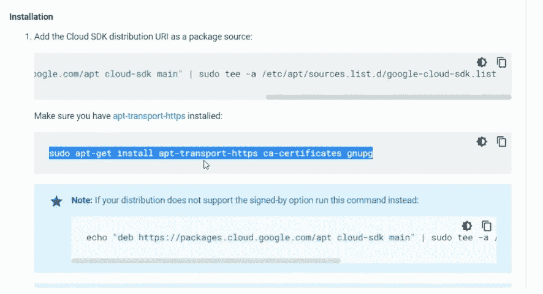

从突出显示的命令开始，执行虚拟机中的所有命令。

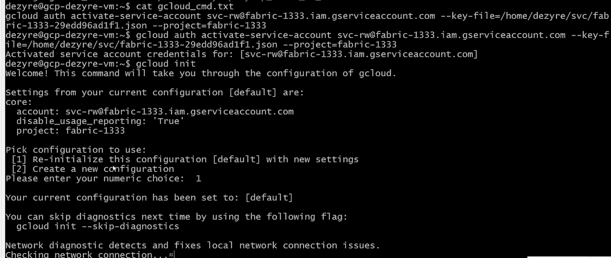

授权后，使用“gcloud init”重新初始化 gcloud。请遵循以下配置选择。

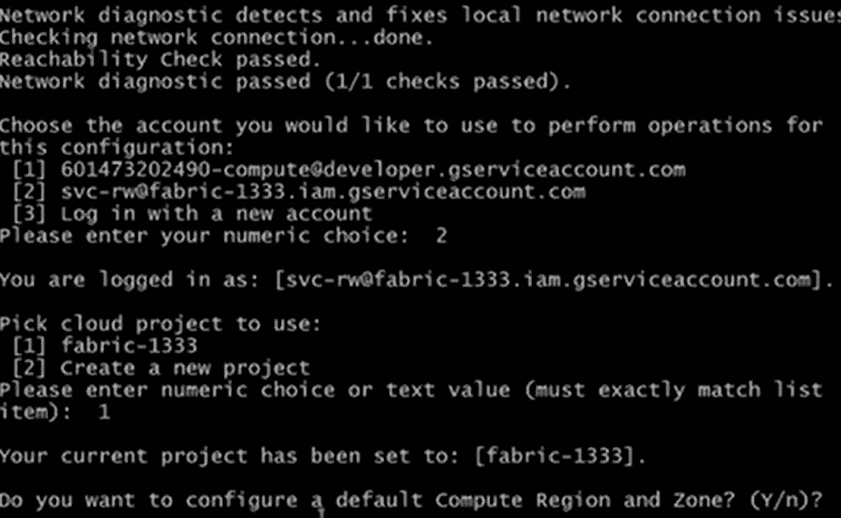

最后使用“gcloud 配置列表”列出成功配置后的账户详情。这就完成了 cloud SDK 的安装。

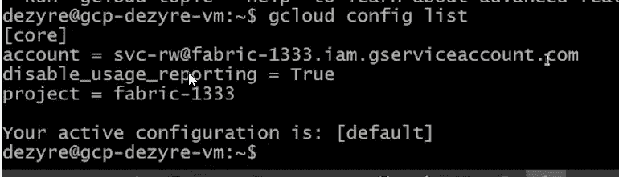

10.根据您的操作系统进行选择后，按照以下链接中的步骤安装 python:

[Python 3 安装&安装指南—真正的 Python](https://realpython.com/installing-python/)

[如何在 Ubuntu、Debian 上安装 Python 3.7&Linux mint—tec admin](https://tecadmin.net/install-python-3-7-on-ubuntu-linuxmint/)

**保留策略和锁:**

*   GCS 保留策略允许存储在存储桶中的对象在从存储桶中删除之前被保留。
*   可以使用 cloud sdk 或客户端库在存储桶级别配置保留策略。
*   如果策略未被锁定，则可以将其从存储桶中删除。
*   如果出于任何法规遵从性或监管目的需要在存储桶上永久设置策略，则可以在存储桶上应用保留锁。
*   一旦应用了锁定，就不能撤销，并且一旦所有对象都超过了设置的保留期，就可以删除存储桶。

**对象持有:**

*   对象保留是与 GCS 中的对象相关联的元数据标志。如果在任何对象上激活了保留，则除非解除保留，否则无法删除该对象。

**保持**可以通过使用 cloud sdk 或客户端库编辑对象上的元数据来设置。它也可以在存储桶级别实施。

GCS 中有两种类型的保留。

基于事件的暂挂

暂时搁置

当存储桶上未配置保留策略时，两种类型的保留行为相同。

在为存储桶激活保留策略的情况下，临时保留不会影响存储桶中对象的生命周期，但基于事件的保留会重置对象在保留期内的生命周期。

**示例** —对象 X 和 Y 配置了 6 个月的保留期。假设我们在 5 个月后对 X 应用基于事件的暂挂，对 Y 应用临时暂挂。现在，对象 Y 在超过保留期 1 个月后可以被删除，而对象 X 的生存期将被重置，其保留期将从对其应用基于事件的保留时开始，并且它必须等待完整的 6 个月才能被删除。

后续步骤:

现在让我们创建一个新的存储桶，搜索存储桶并创建一个新的存储桶，如下所示:

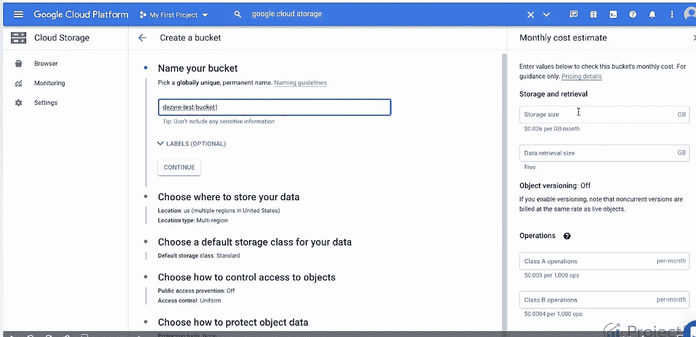

指定唯一的名称后，保留所有设置的默认值。

**按顺序执行的命令:**

**设置 GOOGLE _ APPLICATION _ CREDENTIALS**

```
Linux - export GOOGLE_APPLICATION_CREDENTIALS/home/shrutijoshi/ helpful-cat-324414-bbf5a431efb0.json"
```

```
Windows - set GOOGLE_APPLICATION_CREDENTIALS=C:\Documents\Learning\SVC\fabric-1333–29edd96ad1f1.json
```

**使用 google cloud SDK 配置服务帐户:**

**(用您的项目详细信息替换文件路径和项目名称)**

```
gcloud auth activate-service-account svc-rw@fabric-1333.iam.gserviceaccount.com - key-file=C:\Documents\Learning\SVC\fabric-1333–29edd96ad1f1.json - project=fabric-1333
```

```
gcloud auth activate-service-account svc-dezyre-editor@helpful-cat-324414.iam.gserviceaccount.com - key-file=helpful-cat-324414-bbf5a431efb0.json - project=helpful-cat-324414
```

**使用云 SDK 创建存储桶**

```
gsutil mb -c standard -l us-east1 gs://<yourbucketname>
```

**使用 SDK 将数据从本地复制到云桶**

```
gsutil cp local_file_path gs://<yourbucketname>/data/
```

```
gsutil -m cp *.json gs://<yourbucketname>/data/
```

**在存储桶上启用版本控制**

```
gsutil versioning set on gs://<yourbucketname>
```

**检查桶上是否启用了版本控制**

```
gsutil versioning get gs://<yourbucketname>
```

**检查 bucket 中文件的所有现有版本**

```
gsutil ls -a gs://<yourbucketname>
```

**删除旧版本**

```
gsutil rm gs://<yourbucketname>/nohup.out #1635081507455491
```

**检查任何对象的元数据**

```
gsutil stat gs://<yourbucketname>/nohup.out
```

**改变对象的存储类别**

```
gsutil rewrite -s nearline gs://<yourbucketname>/nohup.out
```

**启用存储桶级别的暂停**

```
gsutil retention event-default set gs://<yourbucketname>
```

**检查铲斗上的保持功能是否启用**

```
gsutil ls -L -b gs://<yourbucketname>
```

**解除铲斗水平的暂挂**

```
gsutil retention event-default release gs://<yourbucketname>
```

**释放对象上的锁定**

```
gsutil retention event release gs://<yourbucketname>/nohup.out
```

**在存储桶上禁用版本控制以设置保留策略**

```
gsutil versioning set off gs://<yourbucketname>
```

**在存储桶上设置保留策略**

```
gsutil retention set 60s gs://<yourbucketname>
```

**删除存储桶上的保留策略**

```
gsutil retention clear gs://<yourbucketname>
```

**锁定存储桶上的保留策略**

```
gsutil retention lock gs://<yourbucketname>
```

**查看保留策略和锁定状态**

```
gsutil retention get gs://<yourbucketname>
```

**用于在您的机器上生成 SSh 密钥**

```
ssh-keygen and press enter 3 times
```

```
add public key to   cat ~/.ssh/id_rsa.pub >> ~/.ssh/authorized_keys
```

**在终端**上打印 ssh 公钥

*猫~/。ssh/id_rsa.pub*