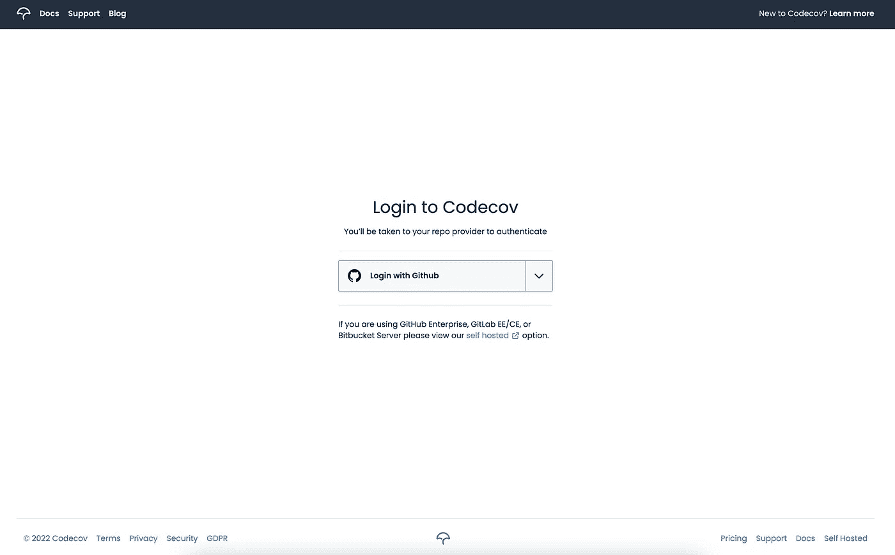
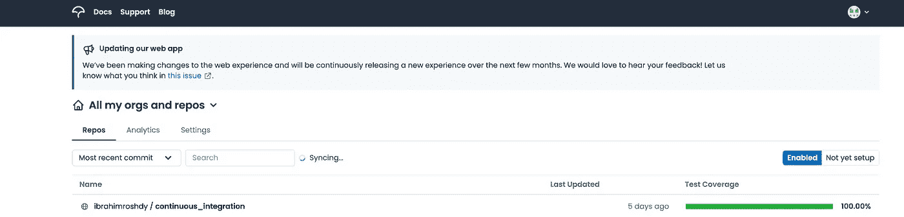
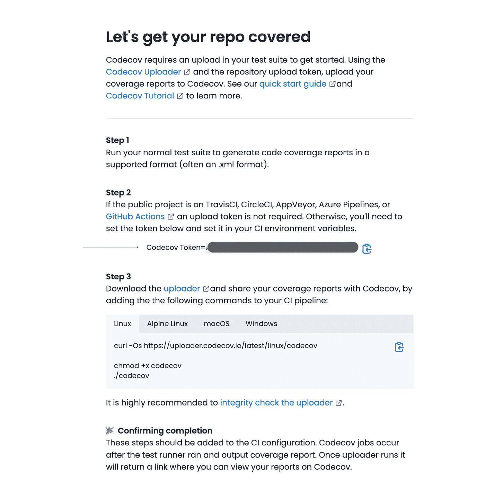
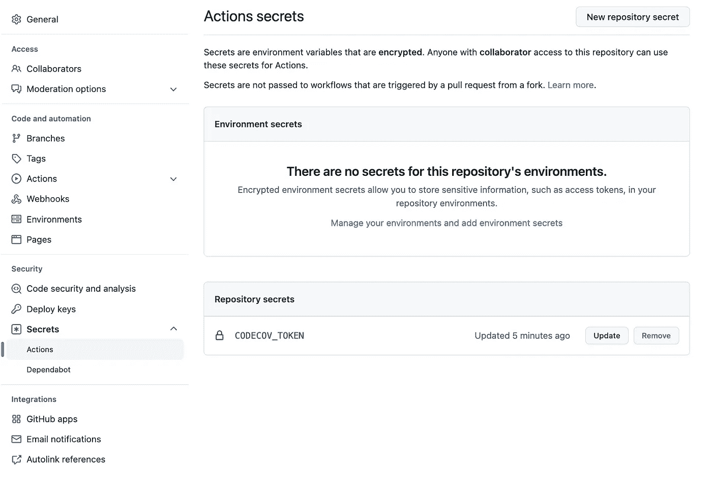
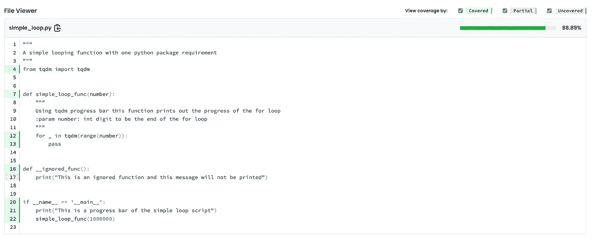

# 代码覆盖率入门:使用 CodeCov

> 原文：<https://blog.devgenius.io/getting-started-with-code-coverage-using-codecov-b40f4fe1c91c?source=collection_archive---------11----------------------->

100%的代码覆盖率是可靠性和代码质量的衡量标准吗？

好吧，我本来没打算回答这个问题，但无论如何我会的。然而，在这篇文章中，我将主要带你了解如何利用一个叫做 **CodeCov** 的工具。


[CodeCov.io](https://codecov.io/)

CodeCov 是一个覆盖解决方案平台，允许你可视化你的代码覆盖报告。CodeCov 提供了深入的覆盖率见解，并计算每个文件的命中率。它很容易与 GitHub 和 GitLab 集成。CodeCov 还同步所有的存储库(公共的和私有的)。当然，您必须在第一次手动将 CodeCov 安装到您的存储库中，我将在下面带您了解这一点。

但是首先:

> 较高的代码覆盖率是否意味着可靠且经过测试的代码库？

在我看来，一个 ***高的*** 覆盖率意味着覆盖率报告的入口点已经达到了代码行的最高命中率。通过*入口点*，我指的是您用来运行一个覆盖报告的指令集。在大多数情况下，**测试**是大多数覆盖率报告的入口点。测试是用来尝试模拟一个执行代码库的环境。因此，代码覆盖率的百分比越高，就表示您的入口点命中了大量的代码行。它衡量的是可靠性、安全性还是兼容性？不一定——这是了解代码库测试覆盖范围的一个指标。因此，让我们设置 codecov 并把事情放在正确的位置。

# 入门指南

假设您有一个正在进行的项目，其中有您想要可视化的单元测试。可视化描述了单元测试实际命中了多少代码行。在这个例子中，我将使用 **Python** 和两个主库， [**Coverage**](https://pypi.org/project/coverage/) 和 [**CodeCov**](https://pypi.org/project/codecov/) 。为了使这更容易，我也将使用这个[示例项目](https://github.com/ibrahimroshdy/continuous_integration)，我建议在此之前阅读下面的这篇文章。

[](/continuous-integration-github-1130217cc2e9) [## 使用 GitHub 快速设置持续集成

### 在 GitHub 上使用持续集成之前你需要知道的所有事情。这是你使用 GitHub 的指南…

blog.devgenius.io](/continuous-integration-github-1130217cc2e9) 

CodeCov 可视化和洞察力可以自动化到您的开发过程中。然而，您将需要持续的集成管道来自动生成您的覆盖报告并将它们上传到 CodeCov——并且还包括一个覆盖徽章。

## 要求

1.  现有的 GitHub 存储库
2.  CodeCov 帐户

使用上面的[文章](/continuous-integration-github-1130217cc2e9)中提到的[持续集成](https://github.com/ibrahimroshdy/continuous_integration)回购，我将写下将 CodeCov 集成到回购上的步骤。

## 覆盖范围演练

添加使用诗歌所需的两个主要 python 库，(当然你可以使用 pip，但是你真的应该检查一下[诗歌](https://python-poetry.org/))

```
poetry add coverage codecov
```

然后使用`coverage`我现在将运行`simple_loop.py`

```
coverage run simple_loop.py
```

*"*[*coverage . py*](https://pypi.org/project/coverage/)*测量代码覆盖率，通常在测试执行期间。它使用 Python 标准库中提供的代码分析工具和跟踪挂钩来确定哪些行是可执行的，哪些行已经被执行了。”*

这会生成一系列将由 CodeCov 使用的文件。

要创建 CodeCov 帐户，请访问 [CodeCov.io](https://about.codecov.io/) 并使用 [GitHub](https://app.codecov.io/login/gh?utm_department=marketing&utm_source=direct) 登录。



图 1:用 GitHub 登录 CodeCov.io

登录后，您需要手动设置需要 CodeCov 使用的 repo。我已经使用图 2 右上方的 ***未设置*** 按钮完成了这一步。



图二。CodeCov 上的持续集成报告

所以现在，我指示 CodeCov 设置一个令牌，并允许从我的 GitHub 帐户集成，特别是回购。只要您单击 CodeCov.io Repo 部分中的项目链接，就可以获得这些信息，您将看到类似下面图 3 中的内容。



图 3: CodeCov 设置[令牌]

回到项目，现在可以使用`codecov`库上传提交文件，并使用`codecov_token`指定项目。沿着图 3 中的红线找到您的*令牌。*

```
codecov --token={codecode_token}
```

# 带有 GitHub 工作流的 CodeCov

嗯，你不应该在本地手动运行`coverage`和`codecov`，记住这应该在你的管道或者工作流中的测试用例上运行。因此，这应该被集成到您的测试管道或者您的持续集成工作流程中的测试阶段。以 **GitHub** 工作流为例，我将创建一个定制的工作流文件，其中包含一个运行 coverage 和 codecov 的作业。

首先，您需要将该令牌作为存储库秘密存储在 GitHub 存储库设置中的“操作”下的“秘密”下。



图 4: GitHub 回购操作秘密

其次，添加一个运行 coverage 和 codecov 命令的工作流作业。

最后，现在每个推送都会触发一个名为 [**代码覆盖【Code cov】**](https://github.com/ibrahimroshdy/continuous_integration/actions/workflows/codecov.yml)**的工作流，该工作流只负责使用`coverage`运行`simple_loop.py` python 文件，并使用图 4 中的秘密令牌将覆盖数据上传到 CodeCov.io。点击查看`continuous_integration`回购[的 codecov 公开报告。](https://app.codecov.io/gh/ibrahimroshdy/continuous_integration)**

## **覆盖率作为衡量标准**

**让我们以`simple_loop.py`上的报道为例来理解到底发生了什么。**

**100%覆盖率 simple_loop.py**

**运行`coverage run simple_loop.py`将执行 python 脚本，从第 4 行的导入开始，然后是 main 函数，最后用`simple_loop_func(1000000)`函数调用最后一行。从技术上来说，代码行的覆盖率是 100%。为了了解这个*值*是如何减少的，我添加了另一个函数，目的是被忽略。**

**88.89%覆盖率 simple_loop.py**

**嗯，`simple_loop.py`包含两个功能。一个功能`simple_loop_func(number)`打印出一个进度条，另一个用于忽略功能`__ignored_func()`。不调用`__ignored_func()`的函数不会降低覆盖率的命中率，codecov 上的结果看起来会像[中的](https://app.codecov.io/gh/ibrahimroshdy/continuous_integration/blob/main/simple_loop.py):**

****

> **现在你可以试着回答这个问题:" 100%的代码覆盖率是衡量可靠性和代码质量的标准吗？”。**

**使用覆盖库调用直接脚本的唯一意图是复制一个测试单元或一系列测试指令的行为。CodeCov 为多达 5 个用户提供了一个免费的包，它还提供了一个徽章，上面有你的覆盖率和你的文件的 SVG 图。**

# **谢谢！**