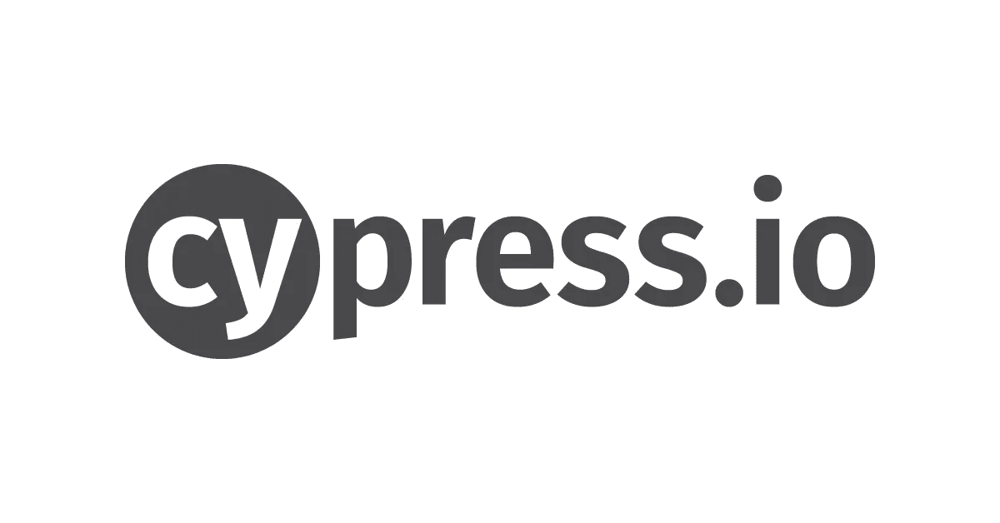

# Cypress.io 入门，测试自动化爱好者的新玩具

> 原文：<https://blog.devgenius.io/getting-started-with-cypress-io-a-new-toy-for-test-automation-enthusiasts-1abf7e8da08f?source=collection_archive---------12----------------------->

每当谈到 UI 测试自动化，首先出现的开源工具就是 selenium。它已经存在了一段时间，并且因为它所提供的所有好处而被广泛接受。尽管此后市场上出现了许多其他开源工具，但其中大多数都使用 selenium server 作为底层。在这个博客中，我们将讨论一个新的开源工具，名为 Cypress，它从根本上和架构上不同于 selenium。



# 什么是柏树

它是一个现代化的工具，可以为任何在浏览器中运行的应用程序创建端到端的测试自动化。Cypress 生态系统由两个产品组成，一个测试跑步者和一个仪表板。test runner 是开源的，这是我们开始编写测试所需要的，但是 dashboard 是一个付费服务，用于在将测试与 CI 提供者集成后记录测试。

# 为什么是柏树

它声称使设置，编写，运行和调试测试超级简单和快速。事实上，它是为了应对 selenium 的一些挑战而构建的，比如繁琐的设置、缓慢等。与 Selenium 在浏览器外运行命令不同，Cypress 命令直接在浏览器中运行，因此它不受 Selenium 的限制。在这篇博客中，我将给出使用 cypress 安装和编写测试的所有步骤，并在最后分享我对该工具的看法。

# 设置它

**前提:**node . js 8 以上工作安装。(Cypress 运行在 node.js 服务器上)

转到终端并创建一个目录来保存您的所有测试

```
mkdir cypress-tests
```

在项目的根目录中初始化 npm

```
cd cypress-tests
npm init
```

这将建立一个新的 npm 包，以便 cypress 可以安装在正确的目录中。按照安装指南，你应该准备好了。

现在，在本地安装 cypress 作为一个开发依赖项。

```
npm install cypress --save-dev
```

打开 Cypress 应用程序

```
npx cypress open
```

还有其他安装柏树的方法可以在[这里](https://docs.cypress.io/guides/getting-started/installing-cypress.html)找到。

就是这样！！Cypress 安装在本地，您可以开始编写测试。这是设置简单快速的一个标志。

# 编写简单的测试

现在您已经打开了 cypress，您可以看到它已经在下面的位置有了一些样本测试:*cypress-tests/cypress/integration/examples*


通过点击特定的规范，尝试运行一些样本测试。这将打开 cypress 测试运行器并开始执行测试。你会在窗口的左边看到所有的测试场景，在右边看到一个预览区，准确地显示了浏览器中正在发生的事情。


要编写您的第一个测试，请在 Integration 文件夹中添加一个新文件。我们把它命名为 my_first_spec.js 吧

当我们在项目中保存这个文件时，它将自动开始出现在 cypress 应用程序中。


由于这是一个空的 spec 文件，如果您从 cypress 应用程序运行这个测试，它将简单地给出一个错误消息“在您的文件中没有找到测试: <file_path>/my_first_spec.js”</file_path>

让我们开始向这个规范添加一些代码。我们将登录到 github.com，点击探索按钮，并验证一些页面元素。

## 第一步:访问网址(github.com/login)

我们将从 describe 块开始，它通过将相关的测试放在一起帮助我们保持有序。然后为一个特定的测试添加一个 it()函数，该函数包含您的测试场景的所有 cypress 命令。在您的规范文件中添加以下代码:

```
describe('Login to GitHub and explore', function(){
   it('To Login to GitHub and explore its contents', function(){
   cy.visit(['https://github.com/login](https://github.com/login)');
   })
})
```

cy.visit 在浏览器中打开指定的 URL，之后我们可以与该页面上的元素进行交互。保存文件并跳转到测试运行器来查看测试执行。

这也可以通过在 cypress.json 文件中指定一个 baseUrl 并直接访问路由来更好地完成。

Cypress.json 是这样的:

```
{
  "baseUrl":"https://github.com"
}
```

现在我们可以像这样使用 cy.visit:

```
cy.visit('/login');
```

同样，我们可以通过替换 cy.visit()中的路由名来访问同一个域的不同路由。

那很容易，不是吗？

## 第二步:使用你的用户名和密码登录。

我们将使用 get 方法找到一个元素并与它们交互。在 my_first_spec.js 文件中添加以下行:

```
*//To search username textbox and type username* cy.get('input[name="login"]').type("*<your_github_username>*");//To search password textbox by its id and type password
cy.get('#password').type("<*your_github_password*>");//To search login button by submit text and click to login
cy.get('input[type="submit"]').click();
```

保存文件并移动到测试运行器，查看代码运行情况。

**注意**:如果你是第一次在你选择的浏览器中登录 github，那么它可能会要求你提供额外的验证，在这种情况下，这个脚本将会失败。做一次验证步骤，关闭测试运行程序，然后重新打开应该就可以了。

我们可以使用任何类型的 CSS 选择器来搜索元素。点击登录后，Cypress 会自动等待下一个页面加载，然后再执行下一个操作。它的默认页面加载超时是 60000 毫秒。我们还可以通过在 cypress.json 文件中添加超时值来设置我们的自定义超时值。

> **Tip1:** Cypress 默认不支持 xpath，需要单独添加 [cypress-xpath](https://github.com/cypress-io/cypress-xpath) ，在 Cypress 测试运行器中有 xpath 命令，通过 xpath 查找元素。
> 
> **Tip2:** 因为用户名和密码是静态数据，所以最佳实践是将它们存储在一个单独的数据文件中，并用该文件来填充我们的测试用例。这可以通过使用[夹具](https://docs.cypress.io/api/commands/fixture.html)来完成。

## 步骤 3:搜索按钮并验证文本

一旦我们登录到 github.com，我们将搜索探索 GitHub 按钮，点击它，并验证一些事情。这次我们将使用 contains 方法。因此，继续在 my_first_spec.js 中添加以下行

```
//Search for an element with the text "Explore GitHub" and click it
cy.contains('Explore GitHub').click()//After the page load, verify the page title
cy.title().should('eq','Explore GitHub');//Verify that the heading with the given text is visible
cy.contains('Here\’s what we found based on your interests…').should('be.visible');
```

cy.contains 为您带来包含所提供文本的 DOM 元素，cy.title，顾名思义，给出页面标题。注意我们是如何追加的？shoud()方法。我们的断言包含()。我们还可以在同一个元素上添加多个断言。和()之后。应该()。有几种方法可以对你的页面进行验证。更多的使用方式。应该()可以从官方[文档](https://docs.cypress.io/api/commands/should.html)中找到。

现在保存这个文件，并返回到测试运行程序来查看它的运行情况。

这是我们刚刚使用 cypress 执行的一个简单的登录和验证用户的过程。你在赛普拉斯的第一次测试不是很快吗？

# 我遇到的更多高级功能:

## 网络请求

Cypress 允许我们让测试等待一个特定的 XHR 请求。可以使用响应来获取数据或简单地断言数据。我们需要做的就是在一个变量中声明期望的路由，然后在请求实际发生时使用它。这可以通过以下方式完成:

```
//Start the cy server
cy.server();//save any GET request having /search/ in it, inside the variable getSearchResults
cy.route('*/search/*').as('getSearchResults');//save any POST request ending with /advsearch inside the variable getAdvanceSearchResults
cy.route({method: 'POST', url: '*/advsearch/',})
.as(‘getAdvanceSearchResults’);//Wait for the request when required
cy.wait('@getAdvanceSearch', {timeout: 15000}); //timeout is optional. By default it waits for 5000ms for a matching request//Wait for the response and assert that it’s not null
cy.wait('@getAdvanceSearchResults', {timeout: 8000}).then((xhr)=>{
  assert.isNotNull(xhr.response.body.data,'1st result has data')
});
```

## 自定义命令

有些步骤需要重复进行，如登录应用程序等。这些步骤可以组合成一个单独的自定义命令，并且可以用 cy 命令调用。我们只需要在 support 文件夹内的 command.js 文件中添加自定义命令，它将在整个项目中可用。可以这样做:

```
Cypress.Commands.add("<customCommandName>",()=>{
  cy.visit(…
  cy.get(…
  …
})
```

## Iframe 支持

我正在进行的用户之旅也包括处理 iframes。我意识到，使用 Cypress 不能像遍历其他 DOM 元素一样遍历 iframe，因为内置的 cy 命令不能遍历 iframe 中的#document 节点。处理 iframe 中的元素需要定制代码。以下代码对我有用:

```
cy.get('iframe[id="<iframe_id>"]').then(function($iframe){
 const $body = $iframe.contents().find('body')
 cy.wrap($body).find('<iframe_element_css>').click()
 …
 …
})
```

# 利弊

## 赞成的意见

以下是我非常喜欢这个应用程序的功能:

*   它的测试运行器有一个并排的命令日志和应用程序预览部分，允许你实时查看测试命令执行时你的应用程序中发生了什么。
*   它可以自动等待页面加载，这意味着测试中不会出现问题，也不需要指定额外的等待语句。
*   等待和模仿特定的网络请求允许大量的边缘情况自动化，这在以前是不可能的。
*   为了加快调试速度，它会在每一步之前和之后拍摄快照。
*   当我们做出更改时，自动重新运行测试。
*   跨浏览器测试不需要任何额外的设置。

这些只是我在使用 cypress 的最初几天里遇到的基本特性。还有许多其他强大的功能，有望变得有用。比如，我们可以将所有静态数据放入 fixtures，使它们在整个项目中都可用，轻松实现文件上传，使用 cy.request()发出 API 请求，存根 API 响应，等等。我们还可以在这些测试之上添加一层 BDD，给它们一个给定的、何时、然后的格式，并且我们可以明确地将它与我们的 CI 工具集成，以进行连续测试。

## 骗局

像所有东西一样，Cypress 也有自己的一套权衡。根据官方文件，一些永久性的权衡是:

*   它永远不会支持在一个浏览器中有多个标签或者在多个浏览器中运行测试。
*   每个测试都绑定到相同来源的访问域。不能在一次测试中访问多个超级域。支持社区提倡使用 cy.request 从超级域获得所需的内容并正常进行。
*   它仅用于端到端测试，因此不应用于任何其他目的，如性能测试、web 索引等。

除此之外，还有其他一些可以改进的地方:

*   对 iframes 的支持是有限的。在我的场景中，我想获得一个由 iframe 中的某个动作触发的 XHR 请求，但是 Cypress 无法捕获任何这样的网络请求。我最终改变了我的场景，因为我找不到任何支持。我当然希望在这方面得到更多的支持。
*   Cypress 不支持鼠标悬停功能，而这是自动化工具提示所必需的。同样的问题也有解决方法，但是直接悬停功能肯定会很有用。

# 结论

Cypress 使端到端测试对我来说相当愉快。凭借所有的特性和易用性，Cypress 为工程师提供了坚实的能力，使他们能够通过构建一个良好的测试自动化套件来保持其应用程序的质量标准。有了主动工具支持，我想它会一直存在下去。

我希望你今天学到了新东西。感谢阅读！

# 参考

[柏树公文](https://docs.cypress.io/guides/overview/why-cypress.html#In-a-nutshell)